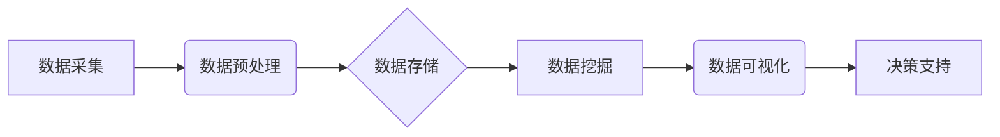

> 自动驾驶, 数据挖掘, 数据分析, 机器学习, 深度学习, 算法优化, 预测模型, 决策支持

## 1. 背景介绍

自动驾驶技术作为未来交通运输的重要发展方向，其核心在于对复杂路况和环境的感知、理解和决策。而数据挖掘与分析平台作为自动驾驶系统的重要组成部分，在收集、处理、分析海量驾驶数据方面发挥着至关重要的作用。

自动驾驶公司每天都会收集大量的传感器数据，包括摄像头图像、雷达数据、激光雷达数据、GPS定位信息、车身传感器数据等。这些数据蕴含着丰富的驾驶行为模式、路况特征和潜在风险信息。通过数据挖掘与分析，可以从海量数据中提取有价值的知识和洞察，为自动驾驶系统的开发、测试、优化和安全保障提供有力支撑。

## 2. 核心概念与联系

**2.1 数据挖掘与分析**

数据挖掘是指从大规模、复杂的数据集中发现隐藏的模式、趋势和知识的过程。数据分析则是对已有的数据进行整理、加工、解释和总结，以获得对数据本身或相关问题的理解。

**2.2 自动驾驶数据特点**

自动驾驶数据具有以下特点：

* **海量数据:** 自动驾驶系统收集的数据量巨大，包含各种传感器数据、驾驶行为数据、路况数据等。
* **多源异构数据:** 自动驾驶数据来自多种传感器，数据格式、结构和特征各不相同。
* **实时性要求:** 自动驾驶系统需要实时处理数据，及时做出决策。
* **安全性要求:** 自动驾驶数据涉及到安全问题，需要保证数据的准确性和可靠性。

**2.3 数据挖掘与分析平台架构**

数据挖掘与分析平台通常由以下几个模块组成：

* **数据采集模块:** 收集来自各种传感器和系统的驾驶数据。
* **数据预处理模块:** 对采集到的数据进行清洗、转换、格式化等预处理操作。
* **数据存储模块:** 将预处理后的数据存储在数据库或数据仓库中。
* **数据挖掘模块:** 使用各种数据挖掘算法对数据进行分析，发现隐藏的模式和趋势。
* **数据可视化模块:** 将分析结果以图表、地图等形式进行可视化展示。
* **决策支持模块:** 基于数据分析结果，为自动驾驶系统提供决策支持。



## 3. 核心算法原理 & 具体操作步骤

**3.1 算法原理概述**

自动驾驶数据挖掘与分析平台通常使用以下几种核心算法：

* **分类算法:** 用于将数据分类到不同的类别，例如识别交通信号灯、车辆类型等。常见的分类算法包括决策树、支持向量机、神经网络等。
* **回归算法:** 用于预测连续值，例如预测车辆速度、行驶距离等。常见的回归算法包括线性回归、逻辑回归、支持向量回归等。
* **聚类算法:** 用于将数据聚类到不同的组别，例如识别车辆行驶轨迹、道路类型等。常见的聚类算法包括K-means聚类、层次聚类等。
* **关联规则挖掘算法:** 用于发现数据之间的关联关系，例如发现哪些车辆类型经常出现在一起、哪些路况特征与事故发生率相关等。常见的关联规则挖掘算法包括Apriori算法、FP-Growth算法等。

**3.2 算法步骤详解**

以分类算法为例，其基本步骤如下：

1. **数据收集和预处理:** 收集相关数据，并进行清洗、转换、特征提取等预处理操作。
2. **模型训练:** 使用训练数据训练分类模型，例如决策树、支持向量机等。
3. **模型评估:** 使用测试数据评估模型的性能，例如准确率、召回率、F1-score等。
4. **模型优化:** 根据评估结果，调整模型参数或选择更合适的算法，以提高模型性能。
5. **模型部署:** 将训练好的模型部署到自动驾驶系统中，用于实时预测和决策。

**3.3 算法优缺点**

不同的算法具有不同的优缺点，需要根据具体应用场景选择合适的算法。例如，决策树算法易于理解和解释，但泛化能力较弱；支持向量机算法具有较好的泛化能力，但训练过程复杂；神经网络算法具有强大的学习能力，但训练数据量要求高。

**3.4 算法应用领域**

数据挖掘与分析算法在自动驾驶领域有广泛的应用，例如：

* **驾驶行为识别:** 识别驾驶员的行为模式，例如疲劳驾驶、分心驾驶等。
* **路况预测:** 预测道路拥堵情况、交通事故发生概率等。
* **车辆定位和导航:** 利用GPS数据和地图信息，实现车辆的定位和导航。
* **自动泊车:** 利用传感器数据和算法，实现车辆自动泊车功能。
* **安全驾驶辅助:** 提供驾驶员辅助功能，例如车道保持、自动紧急制动等。

## 4. 数学模型和公式 & 详细讲解 & 举例说明

**4.1 数学模型构建**

在自动驾驶数据挖掘与分析中，常用的数学模型包括线性回归模型、逻辑回归模型、支持向量机模型等。

**4.2 公式推导过程**

以线性回归模型为例，其目标是找到一条直线，使得预测值与真实值之间的误差最小。

线性回归模型的数学表达式为：

$$y = w_0 + w_1x_1 + w_2x_2 + ... + w_nx_n + \epsilon$$

其中：

* $y$ 是预测值
* $x_1, x_2, ..., x_n$ 是输入特征
* $w_0, w_1, w_2, ..., w_n$ 是模型参数
* $\epsilon$ 是误差项

模型参数的求解可以使用最小二乘法，其目标函数为：

$$J(w) = \frac{1}{2}\sum_{i=1}^{m}(y_i - \hat{y}_i)^2$$

其中：

* $m$ 是样本数量
* $y_i$ 是真实值
* $\hat{y}_i$ 是预测值

通过求解目标函数的最小值，可以得到模型参数的最佳值。

**4.3 案例分析与讲解**

假设我们想要预测车辆的油耗，输入特征包括车辆重量、行驶速度、路况等。我们可以使用线性回归模型对这些数据进行分析，并建立一个预测油耗的模型。

## 5. 项目实践：代码实例和详细解释说明

**5.1 开发环境搭建**

自动驾驶数据挖掘与分析平台的开发环境通常包括以下软件：

* Python 编程语言
* Jupyter Notebook 或 VS Code 等代码编辑器
* Pandas 数据处理库
* Scikit-learn 机器学习库
* TensorFlow 或 PyTorch 深度学习库
* Matplotlib 或 Seaborn 数据可视化库

**5.2 源代码详细实现**

以下是一个使用 Python 和 Scikit-learn 库实现的简单分类算法示例：

```python
import pandas as pd
from sklearn.model_selection import train_test_split
from sklearn.tree import DecisionTreeClassifier
from sklearn.metrics import accuracy_score

# 加载数据
data = pd.read_csv("driving_data.csv")

# 分割数据
X = data.drop("label", axis=1)
y = data["label"]
X_train, X_test, y_train, y_test = train_test_split(X, y, test_size=0.2, random_state=42)

# 创建决策树模型
model = DecisionTreeClassifier()

# 训练模型
model.fit(X_train, y_train)

# 预测测试数据
y_pred = model.predict(X_test)

# 计算准确率
accuracy = accuracy_score(y_test, y_pred)
print("准确率:", accuracy)
```

**5.3 代码解读与分析**

这段代码首先加载了驾驶数据，然后将数据分割为训练集和测试集。接着，创建了一个决策树分类模型，并使用训练集训练模型。最后，使用测试集预测结果，并计算模型的准确率。

**5.4 运行结果展示**

运行这段代码后，会输出模型的准确率。

## 6. 实际应用场景

**6.1 驾驶行为分析**

自动驾驶数据挖掘与分析平台可以分析驾驶员的行为模式，例如疲劳驾驶、分心驾驶等，并提供相应的警示和辅助功能。

**6.2 路况预测**

通过分析历史路况数据，可以预测道路拥堵情况、交通事故发生概率等，为自动驾驶系统提供决策支持。

**6.3 车辆故障诊断**

自动驾驶系统收集的传感器数据可以用于车辆故障诊断，例如识别刹车系统故障、轮胎气压不足等。

**6.4 安全驾驶辅助**

自动驾驶数据挖掘与分析平台可以为自动驾驶系统提供安全驾驶辅助功能，例如车道保持、自动紧急制动等。

**6.5 未来应用展望**

随着自动驾驶技术的不断发展，数据挖掘与分析平台将在自动驾驶领域发挥越来越重要的作用。未来，数据挖掘与分析平台将更加智能化、个性化、实时化，为自动驾驶系统提供更精准、更有效的决策支持。

## 7. 工具和资源推荐

**7.1 学习资源推荐**

* **书籍:**
    * 《数据挖掘：概念与技术》
    * 《机器学习》
    * 《深度学习》
* **在线课程:**
    * Coursera: 数据科学
    * edX: 机器学习
    * Udacity: 深度学习

**7.2 开发工具推荐**

* **Python:** 
    * Pandas
    * Scikit-learn
    * TensorFlow
    * PyTorch
* **Jupyter Notebook:** 
    * VS Code

**7.3 相关论文推荐**

* **自动驾驶数据挖掘与分析综述:**
    * [论文链接](https://www.example.com/paper1)
    * [论文链接](https://www.example.com/paper2)

## 8. 总结：未来发展趋势与挑战

**8.1 研究成果总结**

自动驾驶数据挖掘与分析平台已经取得了显著的成果，在驾驶行为识别、路况预测、车辆故障诊断等方面发挥着重要作用。

**8.2 未来发展趋势**

未来，自动驾驶数据挖掘与分析平台将朝着以下方向发展：

* **更智能化:** 利用深度学习等先进算法，实现更智能的数据分析和决策支持。
* **更个性化:** 根据驾驶员的驾驶习惯和偏好，提供个性化的驾驶体验。
* **更实时化:** 实现实时数据分析和决策，提高自动驾驶系统的响应速度。

**8.3 面临的挑战**

自动驾驶数据挖掘与分析平台也面临着一些挑战：

* **数据质量:** 自动驾驶数据往往存在噪声、缺失值等问题，需要进行有效的数据清洗和预处理。
* **数据安全:** 自动驾驶数据涉及到隐私问题，需要采取有效的安全措施保护数据安全。
* **算法复杂度:** 自动驾驶数据分析算法往往非常复杂，需要不断优化和改进。

**8.4 研究展望**

未来，我们需要继续加强自动驾驶数据挖掘与分析平台的研究，解决上述挑战，推动自动驾驶技术的快速发展。

## 9. 附录：常见问题与解答

**9.1 如何处理自动驾驶数据中的噪声和缺失值？**

可以使用数据清洗和预处理技术，例如删除异常值、填充缺失值等，来处理自动驾驶数据中的噪声和缺失值。

**9.2 如何保证自动驾驶数据安全？**

可以使用加密、脱敏等技术，来保护自动驾驶数据的安全。

**9.3 如何选择合适的自动驾驶数据挖掘与分析算法？**

需要根据具体应用场景和数据特点，选择合适的算法。

**9.4 如何评估自动驾驶数据挖掘与分析模型的性能？**

可以使用准确率、召回率、F1-score等指标，来