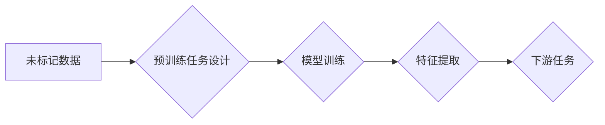

> 自监督学习，无监督学习，深度学习，预训练模型，迁移学习，图像分类，自然语言处理

## 1. 背景介绍

深度学习的蓬勃发展离不开海量数据的支持。然而，获取高质量标注数据的成本高昂且耗时，这成为了深度学习发展的一大瓶颈。为了解决这个问题，自监督学习 (Self-Supervised Learning，SSL)应运而生。

自监督学习是一种特殊的无监督学习方法，它通过设计巧妙的预训练任务，在未标记数据上学习到有用的特征表示，从而为下游任务提供强大的基础。与传统的监督学习相比，自监督学习不需要人工标注数据，大大降低了训练成本，同时也能有效提升模型的泛化能力。

近年来，自监督学习取得了令人瞩目的成果，在图像识别、自然语言处理等领域取得了突破性的进展。例如，BERT、GPT-3等预训练语言模型都是基于自监督学习训练的，它们在各种自然语言理解任务上都表现出优异的性能。

## 2. 核心概念与联系

自监督学习的核心思想是：在未标记数据上设计一些可以被模型“自我监督”的任务，通过完成这些任务，模型可以学习到数据的内在结构和规律。

**自监督学习的流程:**



**核心概念:**

* **未标记数据:**  自监督学习的核心数据来源，不需要人工标注。
* **预训练任务:**  设计一些可以被模型“自我监督”的任务，例如图像补全、文本预测等。
* **模型训练:**  利用预训练任务，在未标记数据上训练模型，学习到有用的特征表示。
* **特征提取:**  训练好的模型可以提取数据的特征表示，用于下游任务。
* **下游任务:**  利用提取到的特征表示，进行具体的任务，例如图像分类、文本分类等。

## 3. 核心算法原理 & 具体操作步骤

### 3.1  算法原理概述

自监督学习算法的核心是设计一个能够在未标记数据上进行训练的预训练任务。常见的预训练任务包括：

* **图像补全:**  遮盖图像的一部分，让模型预测缺失的部分。
* **文本预测:**  给定一段文本，让模型预测下一个词。
* **对比学习:**  将数据点进行分组，让模型学习到同一组数据点之间的相似性。

这些预训练任务能够帮助模型学习到数据的内在结构和规律，从而提取到有用的特征表示。

### 3.2  算法步骤详解

1. **数据预处理:**  将原始数据进行预处理，例如图像裁剪、文本分词等。
2. **预训练任务设计:**  根据任务需求，设计一个合适的预训练任务。
3. **模型训练:**  利用预训练任务，在未标记数据上训练模型。
4. **特征提取:**  训练好的模型可以提取数据的特征表示。
5. **下游任务训练:**  利用提取到的特征表示，进行具体的任务训练。

### 3.3  算法优缺点

**优点:**

* 不需要人工标注数据，降低了训练成本。
* 可以有效提升模型的泛化能力。
* 可以应用于各种类型的数据，例如图像、文本、音频等。

**缺点:**

* 预训练任务的设计需要一定的技巧，难以保证所有任务都能有效学习到有用的特征。
* 训练时间较长，需要大量的计算资源。

### 3.4  算法应用领域

自监督学习在各个领域都有广泛的应用，例如：

* **图像识别:**  图像分类、目标检测、图像分割等。
* **自然语言处理:**  文本分类、情感分析、机器翻译等。
* **语音识别:**  语音转文本、语音合成等。
* **推荐系统:**  商品推荐、用户画像等。

## 4. 数学模型和公式 & 详细讲解 & 举例说明

### 4.1  数学模型构建

自监督学习的数学模型通常基于深度神经网络，例如卷积神经网络 (CNN) 和循环神经网络 (RNN)。

**举例说明:**

在图像补全任务中，可以使用 CNN 模型来构建数学模型。输入图像的一部分作为模型的输入，模型输出缺失的部分。

### 4.2  公式推导过程

自监督学习的训练目标通常是最大化模型预测的准确性。例如，在图像补全任务中，训练目标是最大化预测的缺失部分与真实部分的相似度。

**举例说明:**

可以使用均方误差 (MSE) 作为损失函数，来衡量预测的缺失部分与真实部分之间的差异。

$$
Loss = MSE(Prediction, Ground Truth)
$$

### 4.3  案例分析与讲解

**案例分析:**

BERT 模型是基于 Transformer 架构的预训练语言模型，它使用掩码语言模型 (Masked Language Modeling，MLM) 作为预训练任务。

**讲解:**

在 MLM 任务中，BERT 会随机遮盖输入文本的一部分词，然后让模型预测遮盖的词。通过训练 MLM 任务，BERT 可以学习到语言的语法和语义信息。

## 5. 项目实践：代码实例和详细解释说明

### 5.1  开发环境搭建

* Python 3.6+
* PyTorch 1.0+
* CUDA 10.0+

### 5.2  源代码详细实现

```python
import torch
import torch.nn as nn

class ImageCompletionModel(nn.Module):
    def __init__(self):
        super(ImageCompletionModel, self).__init__()
        # 定义模型结构
        self.encoder = nn.Sequential(
            # ...
        )
        self.decoder = nn.Sequential(
            # ...
        )

    def forward(self, x):
        # 前向传播过程
        # ...
        return output

# 实例化模型
model = ImageCompletionModel()

# 定义损失函数和优化器
criterion = nn.MSELoss()
optimizer = torch.optim.Adam(model.parameters(), lr=0.001)

# 训练模型
for epoch in range(num_epochs):
    for images in dataloader:
        # 前向传播
        outputs = model(images)
        # 计算损失
        loss = criterion(outputs, targets)
        # 反向传播
        optimizer.zero_grad()
        loss.backward()
        # 更新参数
        optimizer.step()

```

### 5.3  代码解读与分析

* **模型结构:**  代码中定义了一个 ImageCompletionModel 类，它包含一个编码器和一个解码器。编码器负责提取图像特征，解码器负责生成缺失的部分。
* **前向传播:**  forward() 方法定义了模型的前向传播过程，输入图像经过编码器和解码器，输出预测的缺失部分。
* **损失函数:**  使用均方误差 (MSE) 作为损失函数，来衡量预测的缺失部分与真实部分之间的差异。
* **优化器:**  使用 Adam 优化器来更新模型参数。

### 5.4  运行结果展示

训练完成后，可以将模型应用于新的图像补全任务，并展示运行结果。

## 6. 实际应用场景

### 6.1  图像修复

利用自监督学习可以修复图像中的损坏部分，例如去除噪声、修复缺失的区域等。

### 6.2  图像超分辨率

自监督学习可以用于图像超分辨率，将低分辨率图像提升到高分辨率。

### 6.3  文本生成

自监督学习可以用于文本生成，例如生成小说、诗歌、对话等。

### 6.4  未来应用展望

自监督学习在未来将有更广泛的应用，例如：

* **医疗领域:**  用于医学图像分析、疾病诊断等。
* **金融领域:**  用于欺诈检测、风险评估等。
* **自动驾驶领域:**  用于场景理解、目标检测等。

## 7. 工具和资源推荐

### 7.1  学习资源推荐

* **书籍:**
    * 《深度学习》
    * 《自监督学习》
* **博客:**
    * https://blog.openai.com/
    * https://towardsdatascience.com/

### 7.2  开发工具推荐

* **PyTorch:**  https://pytorch.org/
* **TensorFlow:**  https://www.tensorflow.org/

### 7.3  相关论文推荐

* **BERT: Pre-training of Deep Bidirectional Transformers for Language Understanding**
* **SimCLR: A Simple Framework for Contrastive Learning of Visual Representations**

## 8. 总结：未来发展趋势与挑战

### 8.1  研究成果总结

自监督学习取得了显著的成果，在图像识别、自然语言处理等领域取得了突破性的进展。

### 8.2  未来发展趋势

* **更有效的预训练任务设计:**  设计更有效的预训练任务，能够更好地学习数据的内在结构和规律。
* **跨模态自监督学习:**  将不同模态的数据进行融合，例如图像和文本的融合，学习更丰富的特征表示。
* **可解释性增强:**  提高自监督学习模型的可解释性，让模型的决策过程更加透明。

### 8.3  面临的挑战

* **数据效率:**  自监督学习仍然需要大量的未标记数据，如何提高数据效率是一个重要的挑战。
* **模型规模:**  自监督学习模型通常需要很大的规模，训练成本较高。
* **泛化能力:**  自监督学习模型在某些情况下可能存在过拟合问题，需要进一步提高其泛化能力。

### 8.4  研究展望

未来，自监督学习将继续是一个重要的研究方向，有望在更多领域取得突破性的进展。


## 9. 附录：常见问题与解答

**常见问题:**

* **自监督学习和监督学习有什么区别？**

**解答:**

监督学习需要人工标注数据，而自监督学习不需要。

* **自监督学习的预训练任务有哪些？**

**解答:**

常见的预训练任务包括图像补全、文本预测、对比学习等。

* **自监督学习的应用场景有哪些？**

**解答:**

自监督学习的应用场景包括图像修复、图像超分辨率、文本生成等。


作者：禅与计算机程序设计艺术 / Zen and the Art of Computer Programming 
<end_of_turn>