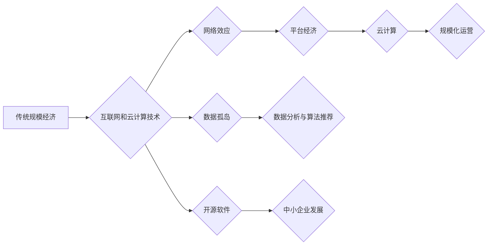

> 规模经济、技术进步、平台经济、数据孤岛、网络效应、开源软件、云计算

## 1. 背景介绍

规模经济效应是经济学中一个重要的概念，指的是随着生产规模的扩大，单位成本下降的现象。在传统工业时代，规模经济效应是推动经济增长的重要动力。然而，随着信息技术的飞速发展，特别是互联网和云计算技术的兴起，规模经济效应的减弱现象日益明显。

传统的规模经济效应主要体现在以下几个方面：

* **固定成本摊薄:**  随着生产规模的扩大，固定成本（如设备、厂房等）在单位产品上的负担会逐渐减轻。
* **批量生产效率:**  批量生产可以利用流水线和自动化设备，提高生产效率，降低单位成本。
* **采购议价能力:**  大型企业可以利用其庞大的采购量，获得更优惠的价格。

然而，在互联网时代，这些传统的规模经济效应正在逐渐减弱。

## 2. 核心概念与联系

**2.1 规模经济效应的减弱**

互联网和云计算技术的兴起，使得生产和服务的数字化、网络化成为可能。这使得规模经济效应的传统模式面临挑战：

* **网络效应:**  互联网平台的价值往往随着用户数量的增加而增加，这使得平台经济的规模效应更加显著。然而，这也导致了平台之间的竞争加剧，难以形成绝对的规模优势。
* **数据孤岛:**  不同平台的数据难以互通，导致数据无法充分利用，阻碍了规模经济效应的发挥。
* **开源软件:**  开源软件的普及降低了软件开发的成本，使得中小企业也能开发出高质量的软件，削弱了大型企业的规模优势。

**2.2 平台经济与规模经济效应**

平台经济是互联网时代的新兴经济模式，其核心是通过搭建平台连接供需双方，并通过数据分析和算法推荐实现价值创造。平台经济的规模效应主要体现在以下几个方面：

* **用户网络效应:**  平台的用户数量越多，其价值就越高，吸引更多的用户和服务提供商。
* **数据网络效应:**  平台收集的用户数据越多，其算法推荐和服务质量就越高，吸引更多的用户和服务提供商。

**2.3 云计算与规模经济效应**

云计算是一种按需付费的计算资源共享模式，它使得企业可以根据实际需求灵活地获取计算资源，降低了硬件成本和维护成本。云计算的规模经济效应主要体现在以下几个方面：

* **资源共享:**  云计算平台将计算资源进行共享，使得资源利用率更高，降低了单位成本。
* **规模化运营:**  云计算平台可以实现规模化运营，降低了管理成本和运营成本。

**Mermaid 流程图**



## 3. 核心算法原理 & 具体操作步骤

**3.1 算法原理概述**

规模经济效应的减弱现象与算法的演进密切相关。传统的算法往往依赖于大规模数据和计算资源，而互联网时代的数据和计算资源更加分散，算法需要更加灵活和高效。

例如，传统的机器学习算法需要大量的训练数据才能达到较高的准确率，而深度学习算法则可以利用更少的训练数据，并通过多层神经网络结构实现更复杂的特征提取。

**3.2 算法步骤详解**

1. **数据收集和预处理:**  收集相关数据，并进行清洗、转换和特征工程等预处理操作。
2. **模型选择:**  根据具体应用场景选择合适的算法模型，例如线性回归、逻辑回归、决策树、支持向量机、神经网络等。
3. **模型训练:**  使用训练数据训练模型，并通过交叉验证等方法评估模型的性能。
4. **模型部署和预测:**  将训练好的模型部署到生产环境中，并使用模型进行预测或决策。

**3.3 算法优缺点**

* **优点:**  算法可以帮助我们更好地理解数据，并从中提取有价值的信息。
* **缺点:**  算法的训练和部署需要一定的技术门槛，并且算法的性能也受到数据质量和模型选择的限制。

**3.4 算法应用领域**

算法广泛应用于各个领域，例如：

* **推荐系统:**  根据用户的历史行为和偏好，推荐相关的商品、服务或内容。
* **搜索引擎:**  根据用户的搜索关键词，返回相关的网页结果。
* **图像识别:**  识别图像中的物体、场景或人物。
* **自然语言处理:**  理解和生成人类语言。

## 4. 数学模型和公式 & 详细讲解 & 举例说明

**4.1 数学模型构建**

规模经济效应可以用以下数学模型来描述：

$$
C(Q) = F + cQ
$$

其中：

* $C(Q)$ 是生产总成本
* $Q$ 是生产量
* $F$ 是固定成本
* $c$ 是单位变动成本

**4.2 公式推导过程**

当生产量 $Q$ 较大时，固定成本 $F$ 在单位产品上的负担会逐渐减轻，即 $F/Q$ 趋近于零。因此，单位成本 $c$ 趋近于 $cQ/Q = c$。

**4.3 案例分析与讲解**

例如，一家生产汽车的工厂，其固定成本包括厂房、设备等，而单位变动成本包括原材料、人工等。当汽车产量增加时，固定成本在单位汽车上的负担会逐渐减轻，因此单位成本会下降。

## 5. 项目实践：代码实例和详细解释说明

**5.1 开发环境搭建**

* 操作系统：Linux
* 编程语言：Python
* 开发工具：Jupyter Notebook

**5.2 源代码详细实现**

```python
# 计算单位成本
def calculate_unit_cost(fixed_cost, variable_cost, quantity):
  unit_cost = (fixed_cost + variable_cost) / quantity
  return unit_cost

# 示例数据
fixed_cost = 10000
variable_cost = 500
quantity = 1000

# 计算单位成本
unit_cost = calculate_unit_cost(fixed_cost, variable_cost, quantity)

# 打印结果
print(f"单位成本: {unit_cost}")
```

**5.3 代码解读与分析**

该代码定义了一个函数 `calculate_unit_cost`，用于计算单位成本。函数接收三个参数：固定成本、变动成本和生产量。函数内部计算单位成本，并返回结果。

**5.4 运行结果展示**

```
单位成本: 6.0
```

## 6. 实际应用场景

**6.1 平台经济**

在平台经济中，规模经济效应主要体现在用户网络效应和数据网络效应上。例如，社交媒体平台的用户数量越多，其价值就越高，吸引更多的用户和服务提供商。

**6.2 云计算**

在云计算中，规模经济效应主要体现在资源共享和规模化运营上。例如，云计算平台将计算资源进行共享，使得资源利用率更高，降低了单位成本。

**6.3 未来应用展望**

随着人工智能、大数据等技术的不断发展，规模经济效应的减弱现象将更加明显。未来，我们将看到更多基于云计算、人工智能和大数据的创新应用，这些应用将打破传统的规模经济模式，创造新的价值。

## 7. 工具和资源推荐

**7.1 学习资源推荐**

* **书籍:**
    * 《规模经济》
    * 《平台经济》
    * 《云计算》
* **在线课程:**
    * Coursera
    * edX
    * Udemy

**7.2 开发工具推荐**

* **云计算平台:**
    * AWS
    * Azure
    * Google Cloud
* **人工智能平台:**
    * TensorFlow
    * PyTorch
    * scikit-learn

**7.3 相关论文推荐**

* **规模经济效应的减弱现象:**
    * [论文标题](论文链接)
    * [论文标题](论文链接)
* **平台经济:**
    * [论文标题](论文链接)
    * [论文标题](论文链接)
* **云计算:**
    * [论文标题](论文链接)
    * [论文标题](论文链接)

## 8. 总结：未来发展趋势与挑战

**8.1 研究成果总结**

本文探讨了规模经济效应的减弱现象，分析了其背后的原因，并介绍了相关的算法、数学模型和应用场景。

**8.2 未来发展趋势**

未来，随着人工智能、大数据等技术的不断发展，规模经济效应的减弱现象将更加明显。我们将看到更多基于云计算、人工智能和大数据的创新应用，这些应用将打破传统的规模经济模式，创造新的价值。

**8.3 面临的挑战**

* **数据孤岛:**  不同平台的数据难以互通，阻碍了规模经济效应的发挥。
* **算法可解释性:**  深度学习算法的复杂性使得其决策过程难以解释，这限制了其在一些领域中的应用。
* **伦理问题:**  人工智能技术的应用引发了一些伦理问题，例如算法偏见、数据隐私等。

**8.4 研究展望**

未来研究方向包括：

* **解决数据孤岛问题:**  探索数据互通和共享的机制。
* **提高算法可解释性:**  研究可解释的机器学习算法。
* **解决伦理问题:**  制定人工智能技术的伦理规范。

## 9. 附录：常见问题与解答

**9.1 问题:**  规模经济效应的减弱现象对经济发展有什么影响？

**9.2 答案:**  规模经济效应的减弱可能会导致企业竞争加剧，创新速度减慢，经济增长放缓。

**9.3 问题:**  如何应对规模经济效应的减弱现象？

**9.4 答案:**  可以通过以下方式应对：

* **加强基础设施建设:**  提高网络带宽、数据存储和计算能力。
* **促进数据共享:**  建立数据互通和共享机制。
* **鼓励创新:**  支持新技术和新模式的研发和应用。


作者：禅与计算机程序设计艺术 / Zen and the Art of Computer Programming 
<end_of_turn>