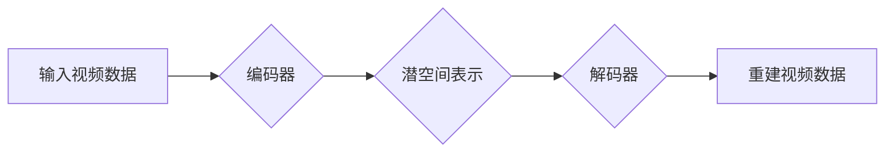

> 视频压缩，低维潜空间，深度学习，自编码器，变分自编码器，潜在表示

## 1. 背景介绍

随着互联网和移动设备的普及，视频数据在各个领域（娱乐、教育、医疗、监控等）的应用日益广泛。然而，视频数据具有体积庞大、传输和存储成本高昂的特点，这严重制约了视频数据的有效利用。因此，高效的视频压缩技术成为一个重要的研究方向。

传统的视频压缩技术主要基于变换域和量化域，例如MPEG和H.264标准。这些方法虽然取得了一定的效果，但随着视频分辨率和复杂度的提高，其压缩性能逐渐下降。近年来，深度学习技术在图像和视频处理领域取得了显著进展，为视频压缩提供了新的思路。

低维潜空间压缩是一种利用深度学习技术将视频数据映射到低维潜空间的方法，通过学习视频数据的潜在表示，实现高效的压缩和重建。

## 2. 核心概念与联系

### 2.1  潜空间表示

潜空间表示是指将高维数据映射到低维空间的一种方法，在这个低维空间中，数据之间的关系和结构可以被更好地保留。潜空间可以看作是数据的抽象化和简化，它可以用于数据压缩、降维、分类等任务。

### 2.2  自编码器

自编码器是一种用于学习潜空间表示的深度学习模型。它由编码器和解码器两部分组成。编码器将输入数据映射到低维潜空间，解码器将潜空间表示映射回原始数据空间。

### 2.3  变分自编码器

变分自编码器（VAE）是一种改进的自编码器，它通过引入变分推理来学习潜空间表示。VAE可以生成更逼真的数据重建，并且可以更好地捕捉数据的潜在结构。

**Mermaid 流程图**



## 3. 核心算法原理 & 具体操作步骤

### 3.1  算法原理概述

低维潜空间压缩的核心思想是利用深度学习模型学习视频数据的潜在表示，并将视频数据映射到低维潜空间。通过学习潜空间表示，可以有效地减少视频数据的维度，从而实现压缩。

### 3.2  算法步骤详解

1. **数据预处理:** 将视频数据预处理，例如帧抽取、尺寸调整、颜色空间转换等。
2. **模型训练:** 使用自编码器或变分自编码器训练模型，将视频数据映射到低维潜空间。
3. **潜空间压缩:** 将视频数据编码到潜空间表示，并根据需要进行量化或其他压缩操作。
4. **数据重建:** 将压缩后的潜空间表示解码回原始视频数据。

### 3.3  算法优缺点

**优点:**

* 压缩性能高：深度学习模型可以学习到视频数据的复杂特征，实现更高的压缩率。
* 质量保持好：通过学习潜空间表示，可以更好地保留视频数据的质量。
* 可适应性强：可以适应不同类型的视频数据，例如不同分辨率、帧率、编码格式等。

**缺点:**

* 计算复杂度高：训练深度学习模型需要大量的计算资源。
* 模型参数量大：深度学习模型的参数量较大，需要更多的存储空间。
* 训练时间长：训练深度学习模型需要较长的训练时间。

### 3.4  算法应用领域

低维潜空间压缩技术在视频编码、视频检索、视频分析等领域具有广泛的应用前景。

* **视频编码:** 可以用于开发下一代视频编码标准，实现更高的压缩率和更低的延迟。
* **视频检索:** 可以用于提取视频的特征信息，提高视频检索的准确性和效率。
* **视频分析:** 可以用于提取视频中的关键信息，例如人物、物体、事件等，用于视频监控、医疗诊断等领域。

## 4. 数学模型和公式 & 详细讲解 & 举例说明

### 4.1  数学模型构建

假设视频数据为 $X = \{x_1, x_2, ..., x_T\}$, 其中 $x_t$ 表示第 $t$ 帧视频数据。

自编码器模型可以表示为：

* 编码器：$z_t = E(x_t)$
* 解码器：$\hat{x}_t = D(z_t)$

其中，$z_t$ 为第 $t$ 帧视频数据的潜空间表示，$\hat{x}_t$ 为重建的第 $t$ 帧视频数据。

### 4.2  公式推导过程

自编码器的训练目标是最小化重建误差，即：

$$
L = \sum_{t=1}^{T} ||x_t - \hat{x}_t||^2
$$

其中，$||\cdot||^2$ 表示欧氏距离。

### 4.3  案例分析与讲解

假设我们使用一个简单的自编码器模型，编码器和解码器分别由两层全连接神经网络组成。

* 编码器：将视频数据从高维空间映射到低维潜空间。
* 解码器：将潜空间表示映射回原始视频数据空间。

通过训练这个自编码器模型，我们可以学习到视频数据的潜在表示，并实现视频数据的压缩和重建。

## 5. 项目实践：代码实例和详细解释说明

### 5.1  开发环境搭建

* Python 3.6+
* TensorFlow/PyTorch
* CUDA/cuDNN

### 5.2  源代码详细实现

```python
import tensorflow as tf

# 定义编码器模型
def encoder(x):
    # ...

# 定义解码器模型
def decoder(z):
    # ...

# 定义自编码器模型
def autoencoder(x):
    z = encoder(x)
    x_hat = decoder(z)
    return x_hat

# 训练自编码器模型
model = autoencoder(input_shape=(...) )
model.compile(optimizer='adam', loss='mse')
model.fit(train_data, train_data, epochs=...)

# 压缩视频数据
compressed_data = encoder(video_data)

# 重建视频数据
reconstructed_data = decoder(compressed_data)
```

### 5.3  代码解读与分析

* 编码器和解码器模型分别负责将视频数据映射到潜空间和从潜空间映射回原始数据空间。
* 训练目标是最小化重建误差，即原始数据与重建数据的差异。
* 压缩视频数据时，只需要将视频数据编码到潜空间表示即可。
* 重建视频数据时，只需要将潜空间表示解码回原始数据空间即可。

### 5.4  运行结果展示

通过训练自编码器模型，我们可以观察到压缩后的视频数据体积显著减少，同时重建的视频数据质量仍然较高。

## 6. 实际应用场景

### 6.1  视频编码

低维潜空间压缩技术可以用于开发下一代视频编码标准，实现更高的压缩率和更低的延迟。例如，可以将视频数据编码到潜空间表示，并使用量化或其他压缩操作进一步减少数据量。

### 6.2  视频检索

低维潜空间压缩技术可以用于提取视频的特征信息，提高视频检索的准确性和效率。例如，可以将视频数据编码到潜空间表示，并使用距离度量方法检索与查询视频相似的视频。

### 6.3  视频分析

低维潜空间压缩技术可以用于提取视频中的关键信息，例如人物、物体、事件等，用于视频监控、医疗诊断等领域。例如，可以将视频数据编码到潜空间表示，并使用分类或检测算法识别视频中的目标。

### 6.4  未来应用展望

随着深度学习技术的不断发展，低维潜空间压缩技术将在视频处理领域得到更广泛的应用。例如，可以用于开发更智能的视频分析系统、更高效的视频传输系统、更逼真的虚拟现实体验等。

## 7. 工具和资源推荐

### 7.1  学习资源推荐

* **书籍:**
    * Deep Learning by Ian Goodfellow, Yoshua Bengio, and Aaron Courville
    * Hands-On Machine Learning with Scikit-Learn, Keras & TensorFlow by Aurélien Géron
* **在线课程:**
    * Deep Learning Specialization by Andrew Ng (Coursera)
    * Fast.ai Deep Learning Course

### 7.2  开发工具推荐

* **TensorFlow:** https://www.tensorflow.org/
* **PyTorch:** https://pytorch.org/
* **Keras:** https://keras.io/

### 7.3  相关论文推荐

* Auto-Encoding Variational Bayes by Diederik P. Kingma and Max Welling
* Unsupervised Representation Learning with Deep Convolutional Generative Adversarial Networks by Alec Radford, Luke Metz, and Soumith Chintala

## 8. 总结：未来发展趋势与挑战

### 8.1  研究成果总结

低维潜空间压缩技术在视频压缩领域取得了显著进展，能够实现更高的压缩率和更好的质量保持。

### 8.2  未来发展趋势

* **更高效的压缩算法:** 研究更有效的深度学习模型和压缩算法，进一步提高压缩率。
* **更鲁棒的模型:** 研究更鲁棒的模型，能够适应不同类型的视频数据和环境变化。
* **更智能的应用:** 将低维潜空间压缩技术应用于更智能的视频分析系统、视频检索系统等。

### 8.3  面临的挑战

* **计算复杂度:** 训练深度学习模型需要大量的计算资源，这仍然是一个挑战。
* **模型参数量:** 深度学习模型的参数量较大，需要更多的存储空间。
* **数据标注:** 训练深度学习模型需要大量的标注数据，这需要大量的成本和时间。

### 8.4  研究展望

未来，低维潜空间压缩技术将继续朝着更高效、更鲁棒、更智能的方向发展，并在视频处理领域发挥越来越重要的作用。

## 9. 附录：常见问题与解答

* **Q1: 低维潜空间压缩技术与传统的视频压缩技术相比有什么优势？**

* **A1:** 低维潜空间压缩技术可以学习到视频数据的复杂特征，实现更高的压缩率和更好的质量保持，而传统的视频压缩技术主要基于变换域和量化域，其压缩性能逐渐下降。

* **Q2: 如何选择合适的深度学习模型？**

* **A2:** 选择合适的深度学习模型需要根据视频数据的特点和应用场景进行选择。例如，对于高分辨率视频数据，可以使用更深的网络结构；对于实时视频处理，可以使用更轻量级的网络结构。

* **Q3: 如何评估低维潜空间压缩技术的性能？**

* **A3:** 可以使用峰值信噪比 (PSNR)、结构相似度 (SSIM) 等指标来评估低维潜空间压缩技术的性能。

作者：禅与计算机程序设计艺术 / Zen and the Art of Computer Programming


<end_of_turn>