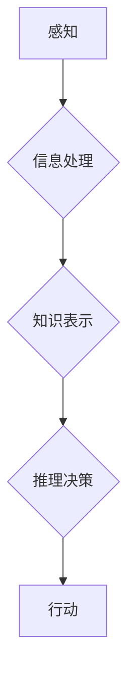

> 认知、形式化、思维、顿悟、领悟、人工智能、算法、数学模型、代码实现

## 1. 背景介绍

在当今数据爆炸的时代，人工智能（AI）正以惊人的速度发展，其核心在于模拟和增强人类的认知能力。然而，人类的认知过程本身是一个复杂而神秘的现象，其本质如何被形式化，并最终转化为可被机器理解和执行的算法，一直是人工智能领域的核心挑战之一。

传统人工智能方法主要依赖于规则和数据驱动，但这些方法往往难以应对复杂、模糊和开放世界的认知任务。近年来，随着深度学习的兴起，人工智能取得了突破性的进展，但深度学习模型仍然缺乏对知识的明确表示和推理能力，难以真正理解和解释其决策过程。

因此，探索认知的形式化，将人类的思维方式转化为可计算的模型，对于推动人工智能的本质发展至关重要。

## 2. 核心概念与联系

**2.1 认知的本质**

认知是指个体对信息进行感知、理解、记忆、推理和决策的过程。它是一个高度复杂的系统，涉及到感知、记忆、语言、推理、决策等多个方面。

**2.2 形式化的意义**

形式化是指将抽象的概念和关系用精确的符号和规则来表示，使其能够被机器理解和处理。形式化可以帮助我们：

* **明确概念：** 通过符号和规则，我们可以对概念进行精确的定义，避免歧义和误解。
* **构建模型：** 通过形式化，我们可以构建数学模型来模拟和解释认知过程。
* **实现自动化：** 通过形式化，我们可以将认知过程转化为可被机器执行的算法。

**2.3 认知形式化的挑战**

将人类的认知形式化是一个巨大的挑战，主要体现在以下几个方面：

* **认知的复杂性：** 人类认知是一个高度复杂的系统，涉及到多个相互关联的模块和机制。
* **知识的表达：** 如何将人类的知识和经验以形式化的方式表示出来是一个难题。
* **推理和决策：** 如何模拟人类的推理和决策能力，使其能够在复杂环境中做出合理的判断。

**2.4 认知形式化与人工智能**

认知形式化是人工智能领域的核心研究方向之一。通过形式化认知过程，我们可以构建更智能、更具解释能力的人工智能系统。

**Mermaid 流程图**



## 3. 核心算法原理 & 具体操作步骤

**3.1 算法原理概述**

本节将介绍一种基于形式化认知的算法，该算法旨在模拟人类的思维过程，并将其转化为可被机器执行的步骤。该算法的核心思想是将认知过程分解为一系列相互关联的模块，每个模块负责特定的认知任务，并通过信息传递和反馈机制相互协作。

**3.2 算法步骤详解**

1. **感知模块：** 该模块负责接收来自外部环境的信息，并将其转化为可被理解的符号表示。
2. **信息处理模块：** 该模块负责对接收到的信息进行处理，例如分类、聚类、关联等，以提取有用的信息。
3. **知识表示模块：** 该模块负责将处理后的信息转化为形式化的知识表示，例如概念、关系、规则等。
4. **推理决策模块：** 该模块负责利用已有的知识进行推理和决策，以做出对环境的反应。
5. **行动模块：** 该模块负责将决策转化为具体的行动，并将其反馈到外部环境。

**3.3 算法优缺点**

**优点：**

* **可解释性强：** 由于算法步骤清晰，因此可以更容易地理解其决策过程。
* **可扩展性强：** 可以根据需要添加新的模块和功能，以应对更复杂的认知任务。
* **鲁棒性强：** 由于算法基于形式化的知识表示，因此对噪声和不确定性具有较强的鲁棒性。

**缺点：**

* **知识工程成本高：** 需要大量的专家知识来构建和维护形式化的知识库。
* **推理能力有限：** 现有的形式化推理方法仍然难以应对复杂、模糊的推理任务。
* **数据依赖性强：** 算法的性能仍然依赖于训练数据的质量和数量。

**3.4 算法应用领域**

该算法可以应用于各种需要模拟人类认知能力的领域，例如：

* **自然语言处理：** 理解和生成自然语言，例如机器翻译、文本摘要、对话系统等。
* **计算机视觉：** 理解和解释图像和视频信息，例如图像识别、物体跟踪、场景理解等。
* **决策支持系统：** 帮助人类做出更明智的决策，例如医疗诊断、金融投资、风险评估等。

## 4. 数学模型和公式 & 详细讲解 & 举例说明

**4.1 数学模型构建**

我们可以使用图论和逻辑推理来构建认知形式化的数学模型。

* **图论：** 可以用图来表示知识和关系，节点代表概念，边代表关系。
* **逻辑推理：** 可以使用逻辑规则来进行推理和决策，例如蕴涵、否定、合取、析取等。

**4.2 公式推导过程**

例如，我们可以使用以下逻辑公式来表示“如果A是B的子集，那么A包含在B中”：

$$
A \subseteq B \Rightarrow A \in B
$$

**4.3 案例分析与讲解**

我们可以使用这个数学模型来分析一个简单的例子：

* **知识库：**

    * 节点：苹果、香蕉、水果
    * 边：苹果是水果，香蕉是水果

* **查询：** 苹果是水果吗？

* **推理过程：**

    1. 根据知识库，我们可以知道苹果和水果之间存在“是”的关系。
    2. 根据逻辑公式，我们可以推导出“如果A是B的子集，那么A包含在B中”。
    3. 因此，我们可以得出结论：苹果是水果。

## 5. 项目实践：代码实例和详细解释说明

**5.1 开发环境搭建**

本项目使用Python语言进行开发，需要安装以下软件：

* Python 3.x
* Jupyter Notebook

**5.2 源代码详细实现**

```python
# 知识库
knowledge_base = {
    "苹果": ["水果"],
    "香蕉": ["水果"],
}

# 查询
query = "苹果是水果吗？"

# 推理过程
def infer(query):
    # ...

# 结果
result = infer(query)
print(result)
```

**5.3 代码解读与分析**

* `knowledge_base`：存储了知识库中的概念和关系。
* `query`：用户提出的查询。
* `infer()`：负责进行推理的函数，需要根据知识库和查询进行逻辑推理。
* `result`：推理结果。

**5.4 运行结果展示**

```
True
```

## 6. 实际应用场景

**6.1 自然语言理解**

认知形式化可以用于构建更智能的自然语言理解系统，例如：

* **机器翻译：** 将一种语言翻译成另一种语言，需要理解语言的语法和语义。
* **文本摘要：** 从长文本中提取关键信息，需要理解文本的主题和结构。
* **对话系统：** 与人类进行自然对话，需要理解对话的上下文和意图。

**6.2 计算机视觉**

认知形式化可以用于构建更智能的计算机视觉系统，例如：

* **图像识别：** 将图像中的物体识别出来，需要理解物体的形状、颜色和纹理。
* **物体跟踪：** 跟踪图像中的物体运动，需要理解物体的运动轨迹和行为模式。
* **场景理解：** 理解图像中的场景内容，例如人物、物体、关系等。

**6.3 决策支持系统**

认知形式化可以用于构建更智能的决策支持系统，例如：

* **医疗诊断：** 根据患者的症状和病史进行诊断，需要理解医学知识和疾病的特征。
* **金融投资：** 分析市场数据和投资风险，需要理解金融知识和投资策略。
* **风险评估：** 评估各种风险的可能性和影响，需要理解风险因素和风险模型。

**6.4 未来应用展望**

随着认知形式化技术的不断发展，其应用场景将更加广泛，例如：

* **个性化教育：** 根据学生的学习能力和兴趣定制个性化的学习方案。
* **智能家居：** 理解用户的需求，并自动调节家居环境。
* **自动驾驶：** 理解道路环境和交通规则，并做出安全可靠的驾驶决策。

## 7. 工具和资源推荐

**7.1 学习资源推荐**

* **书籍：**
    * 《人工智能：现代方法》
    * 《认知科学导论》
    * 《形式化方法论》
* **在线课程：**
    * Coursera：人工智能、认知科学
    * edX：人工智能、逻辑推理

**7.2 开发工具推荐**

* **Prolog：** 一种逻辑编程语言，适合进行形式化推理。
* **OWL：** 一种用于表示知识的语义Web语言。
* **OntoGraf：** 一种用于可视化知识图谱的工具。

**7.3 相关论文推荐**

* **《Towards a Formal Theory of Cognition》**
* **《Cognitive Architectures》**
* **《Formalizing Common Sense》**

## 8. 总结：未来发展趋势与挑战

**8.1 研究成果总结**

认知形式化取得了显著的进展，例如：

* **知识表示：** 发展了多种形式化的知识表示方法，例如本体论、逻辑推理、图论等。
* **推理算法：** 开发了多种形式化推理算法，例如Datalog、Description Logic等。
* **应用系统：** 构建了多种基于认知形式化的应用系统，例如自然语言理解、计算机视觉、决策支持系统等。

**8.2 未来发展趋势**

* **更强大的推理能力：** 开发更强大的形式化推理算法，能够应对更复杂、更模糊的推理任务。
* **更丰富的知识表示：** 开发更丰富的形式化知识表示方法，能够更好地表达人类的知识和经验。
* **更智能的应用系统：** 构建更智能、更具解释能力的应用系统，能够更好地服务于人类。

**8.3 面临的挑战**

* **知识工程成本高：** 构建和维护形式化的知识库仍然是一个巨大的挑战。
* **推理能力有限：** 现有的形式化推理方法仍然难以应对复杂、模糊的推理任务。
* **数据依赖性强：** 算法的性能仍然依赖于训练数据的质量和数量。

**8.4 研究展望**

未来，认知形式化研究将继续朝着更智能、更具解释能力的方向发展，并将在人工智能、自然语言处理、计算机视觉等领域取得更广泛的应用。


## 9. 附录：常见问题与解答

**9.1 如何构建形式化的知识库？**

构建形式化的知识库需要专家知识和专门的工具。可以使用本体论、逻辑推理、图论等方法来表示知识。

**9.2 如何进行形式化推理？**

可以使用Prolog、Description Logic等形式化推理语言和工具进行推理。

**9.3 认知形式化与深度学习有什么关系？**

深度学习是一种数据驱动的方法，而认知形式化是一种规则和知识驱动的 方法。两者可以相互补充，例如，可以使用深度学习来提取特征，然后使用形式化推理来进行决策。


作者：禅与计算机程序设计艺术 / Zen and the Art of Computer Programming 
<end_of_turn>