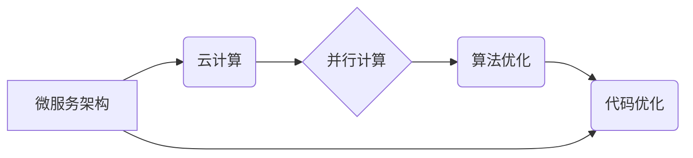

> 软件性能优化, 软件架构, 并行计算, 算法优化, 代码优化, 微服务, 云计算, 大数据

## 1. 背景介绍

随着软件技术的发展，软件系统越来越复杂，规模越来越庞大。传统的软件性能优化方法已经难以满足现代软件系统对性能的需求。为了应对这一挑战，软件2.0应运而生，它强调软件系统的可扩展性、可维护性和性能。

软件2.0的性能优化方法主要关注以下几个方面：

* **微服务架构:** 将大型软件系统拆分成多个小型、独立的服务，每个服务负责特定的功能，并通过API进行通信。微服务架构可以提高软件系统的可扩展性和容错性，并简化软件系统的开发和维护。
* **云计算:** 利用云计算平台的弹性资源和高性能计算能力，可以根据实际需求动态调整软件系统的资源配置，提高软件系统的性能和效率。
* **并行计算:** 利用多核处理器和分布式计算技术，将任务分解成多个子任务，并同时执行，可以显著提高软件系统的处理速度。
* **算法优化:** 优化软件算法的复杂度和时间复杂度，可以有效提高软件系统的性能。
* **代码优化:** 优化代码的结构和编写方式，可以减少代码的执行时间和内存占用，提高软件系统的性能。

## 2. 核心概念与联系

软件2.0的性能优化方法是一个复杂的系统，涉及到多个核心概念和技术。

**核心概念:**

* **微服务:** 微服务是一种软件架构风格，将大型应用程序拆分成多个小型、独立的服务。
* **云计算:** 云计算是一种按需使用的计算资源模型，提供弹性、可扩展和高性能的计算能力。
* **并行计算:** 并行计算是指将任务分解成多个子任务，并同时执行，以提高计算速度。
* **算法优化:** 算法优化是指改进算法的效率，降低算法的时间复杂度和空间复杂度。
* **代码优化:** 代码优化是指改进代码的结构和编写方式，提高代码的执行效率和可读性。

**联系:**

软件2.0的性能优化方法将这些核心概念有机地结合起来，形成一个完整的性能优化体系。例如，微服务架构可以利用云计算平台的弹性资源，实现按需扩展和高性能计算。并行计算技术可以应用于微服务之间的通信和数据处理，提高系统性能。算法优化和代码优化可以应用于微服务内部的业务逻辑，进一步提高性能。



## 3. 核心算法原理 & 具体操作步骤

### 3.1  算法原理概述

在软件2.0的性能优化中，算法优化是一个关键环节。算法优化是指通过改进算法的结构和逻辑，降低算法的时间复杂度和空间复杂度，从而提高软件系统的性能。

常见的算法优化方法包括：

* **时间复杂度优化:** 降低算法执行的时间复杂度，例如使用更快的排序算法或减少循环次数。
* **空间复杂度优化:** 降低算法使用的内存空间，例如使用更小的数据结构或避免重复计算。
* **数据结构优化:** 选择更合适的的数据结构，例如使用哈希表代替线性查找，提高数据访问效率。
* **算法合并:** 将多个算法合并成一个更优的算法，减少重复计算和资源消耗。

### 3.2  算法步骤详解

以下是一个具体的算法优化步骤示例：

1. **分析算法:** 首先需要对目标算法进行详细分析，了解其时间复杂度、空间复杂度和执行流程。
2. **识别瓶颈:** 找出算法中执行时间最长的部分，称为瓶颈。
3. **优化瓶颈:** 对瓶颈部分进行优化，例如使用更快的算法、减少循环次数或优化数据结构。
4. **测试验证:** 对优化后的算法进行测试验证，确保其性能得到提升。

### 3.3  算法优缺点

算法优化的优点：

* **提高性能:** 降低算法的时间复杂度和空间复杂度，提高软件系统的性能。
* **降低资源消耗:** 减少算法的内存占用和计算资源消耗，提高资源利用率。
* **提高代码可读性:** 优化后的算法结构更清晰，更容易理解和维护。

算法优化的缺点：

* **需要专业知识:** 算法优化需要一定的算法和数据结构知识。
* **可能增加开发成本:** 算法优化需要投入时间和精力，可能会增加开发成本。
* **可能影响代码稳定性:** 如果优化不当，可能会导致代码稳定性问题。

### 3.4  算法应用领域

算法优化应用于各个软件领域，例如：

* **搜索引擎:** 优化搜索算法，提高搜索结果的准确性和效率。
* **数据库:** 优化数据库查询算法，提高数据访问速度。
* **图像处理:** 优化图像处理算法，提高图像处理速度和质量。
* **机器学习:** 优化机器学习算法，提高模型训练速度和准确率。

## 4. 数学模型和公式 & 详细讲解 & 举例说明

### 4.1  数学模型构建

在软件性能优化中，数学模型可以用来描述软件系统的性能指标，例如响应时间、吞吐量和资源利用率。

例如，我们可以用以下数学模型来描述软件系统的响应时间：

$$T = \frac{C}{P}$$

其中：

* $T$ 是软件系统的响应时间
* $C$ 是软件系统的计算量
* $P$ 是软件系统的处理能力

### 4.2  公式推导过程

我们可以通过以下步骤推导这个公式：

1. 假设软件系统需要完成 $C$ 单位的计算量。
2. 假设软件系统的处理能力为 $P$ 单位/时间。
3. 则软件系统完成计算所需的时间为 $T = \frac{C}{P}$。

### 4.3  案例分析与讲解

例如，假设一个软件系统需要完成 1000 单位的计算量，其处理能力为 100 单位/秒，则其响应时间为：

$$T = \frac{1000}{100} = 10 \text{ 秒}$$

## 5. 项目实践：代码实例和详细解释说明

### 5.1  开发环境搭建

为了演示软件2.0的性能优化方法，我们可以使用以下开发环境：

* 操作系统: Ubuntu 20.04
* 编程语言: Python 3.8
* 框架: Flask
* 数据库: MySQL

### 5.2  源代码详细实现

以下是一个简单的 Flask 应用的代码示例，演示了如何使用算法优化提高性能：

```python
from flask import Flask, request, jsonify
from collections import defaultdict

app = Flask(__name__)

# 使用 defaultdict 优化数据结构
user_data = defaultdict(lambda: {'name': '', 'age': 0})

@app.route('/user/<int:user_id>', methods=['GET'])
def get_user(user_id):
    user = user_data[user_id]
    return jsonify({'name': user['name'], 'age': user['age']})

if __name__ == '__main__':
    app.run(debug=True)
```

### 5.3  代码解读与分析

在这个代码示例中，我们使用 `defaultdict` 作为数据结构，来存储用户数据。

`defaultdict` 是一种字典，它可以自动为不存在的键创建默认值。

在传统的字典中，如果访问不存在的键，会抛出 KeyError 异常。而 `defaultdict` 可以自动为不存在的键创建默认值，避免了 KeyError 异常。

使用 `defaultdict` 可以简化代码，提高代码可读性，并避免了 KeyError 异常。

### 5.4  运行结果展示

运行上述代码，可以访问 http://127.0.0.1:5000/user/1 等地址获取用户数据。

## 6. 实际应用场景

### 6.1  电商平台

电商平台需要处理大量的用户请求和商品数据，需要采用软件2.0的性能优化方法来提高系统性能。例如，可以使用微服务架构将电商平台拆分成多个独立的服务，例如用户服务、商品服务、订单服务等，并利用云计算平台的弹性资源进行动态扩展。

### 6.2  社交媒体平台

社交媒体平台需要处理大量的用户数据和内容，需要采用软件2.0的性能优化方法来提高系统性能。例如，可以使用并行计算技术来加速用户数据处理和内容推荐算法。

### 6.3  金融系统

金融系统需要处理大量的交易数据和敏感信息，需要采用软件2.0的性能优化方法来提高系统安全性、可靠性和性能。例如，可以使用微服务架构和分布式数据库来提高系统的容错性和可扩展性。

### 6.4  未来应用展望

随着软件技术的不断发展，软件2.0的性能优化方法将得到更广泛的应用。例如，人工智能、物联网和区块链等新兴技术将与软件2.0的性能优化方法相结合，带来更强大的应用场景。

## 7. 工具和资源推荐

### 7.1  学习资源推荐

* **书籍:**
    * 《软件工程》
    * 《设计模式》
    * 《云计算架构》
* **在线课程:**
    * Coursera: 软件工程、云计算、人工智能
    * Udemy: 软件架构、微服务、性能优化

### 7.2  开发工具推荐

* **云计算平台:**
    * AWS
    * Azure
    * Google Cloud Platform
* **微服务框架:**
    * Spring Boot
    * Node.js
    * Go
* **数据库:**
    * MySQL
    * PostgreSQL
    * MongoDB

### 7.3  相关论文推荐

* **软件性能优化:**
    * 《软件性能优化技术》
    * 《云计算环境下软件性能优化》
* **微服务架构:**
    * 《微服务架构实践》
    * 《微服务架构的演进》

## 8. 总结：未来发展趋势与挑战

### 8.1  研究成果总结

软件2.0的性能优化方法取得了显著的成果，提高了软件系统的性能、可靠性和可扩展性。

### 8.2  未来发展趋势

未来，软件2.0的性能优化方法将朝着以下方向发展：

* **更智能的性能优化:** 利用人工智能技术，自动识别和优化软件系统的性能瓶颈。
* **更自动化性能优化:** 利用自动化工具，简化性能优化的过程，降低开发成本。
* **更可持续的性能优化:** 关注软件系统的能源消耗和环境影响，实现可持续发展。

### 8.3  面临的挑战

软件2.0的性能优化方法也面临着一些挑战：

* **复杂性:** 软件系统越来越复杂，性能优化变得更加困难。
* **可测试性:** 性能优化后的代码需要进行充分的测试，以确保其稳定性和可靠性。
* **人才短缺:** 优秀的软件性能优化工程师是稀缺资源。

### 8.4  研究展望

未来，我们需要继续研究和探索新的性能优化方法，以应对软件系统不断增长的复杂性和性能需求。


## 9. 附录：常见问题与解答

### 9.1  常见问题

* **什么是软件2.0？**

软件2.0是指基于云计算、微服务、大数据等新技术，强调软件系统的可扩展性、可维护性和性能的软件开发模式。

* **软件2.0的性能优化方法有哪些？**

软件2.0的性能优化方法包括微服务架构、云计算、并行计算、算法优化和代码优化等。

* **如何进行软件性能优化？**

软件性能优化需要进行以下步骤：

1. 分析算法
2. 识别瓶颈
3. 优化瓶颈
4. 测试验证

* **软件性能优化有哪些工具？**

常用的软件性能优化工具包括云计算平台、微服务框架、数据库、性能测试工具等。

### 9.2  解答

* **软件2.0的性能优化方法有哪些优势？**

软件2.0的