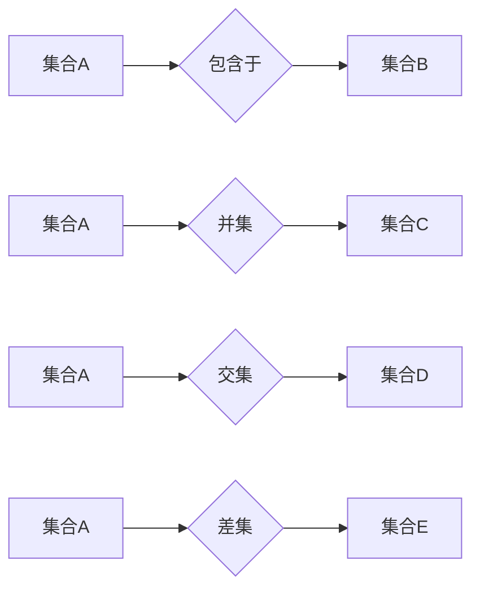

> 集合论,相对解析,表达式,逻辑,数学模型,算法,代码实现,应用场景

## 1. 背景介绍

在现代计算机科学领域，数据处理和逻辑推理占据着至关重要的地位。为了有效地表达和操作复杂的数据结构和逻辑关系，我们引入了集合论和相对解析表达式。集合论为我们提供了描述和操作集合的数学框架，而相对解析表达式则提供了一种简洁、灵活的方式来表达集合之间的关系和操作。

集合论在计算机科学中有着广泛的应用，例如：

* **数据库设计:** 集合论可以用于描述数据库中的数据结构和关系。
* **人工智能:** 集合论被用于表示知识和推理规则，并在机器学习算法中发挥着重要作用。
* **软件工程:** 集合论可以用于描述软件系统的组件和接口，并用于软件测试和验证。

相对解析表达式是一种基于集合论的逻辑语言，它允许我们以一种简洁、清晰的方式表达集合之间的关系和操作。例如，我们可以使用相对解析表达式来表示两个集合的交集、并集、差集等关系。

## 2. 核心概念与联系

### 2.1 集合论基础

集合论是数学的一个分支，它研究集合的概念和性质。

* **集合:** 一个集合是一个包含一组对象的非空集。
* **元素:** 集合中的每个对象称为元素。
* **子集:** 如果一个集合的所有元素都属于另一个集合，则第一个集合是第二个集合的子集。
* **并集:** 两个集合的并集包含这两个集合的所有元素。
* **交集:** 两个集合的交集包含这两个集合中共同的元素。
* **差集:** 两个集合的差集包含第一个集合中不属于第二个集合的元素。

### 2.2 相对解析表达式

相对解析表达式是一种基于集合论的逻辑语言，它允许我们以一种简洁、清晰的方式表达集合之间的关系和操作。

* **表达式:** 相对解析表达式由集合、关系运算符和逻辑运算符组成。
* **关系运算符:** 关系运算符用于表示集合之间的关系，例如：
    * `∈` (包含于): 表示元素属于集合。
    * `⊆` (子集): 表示一个集合是另一个集合的子集。
    * `∪` (并集): 表示两个集合的并集。
    * `∩` (交集): 表示两个集合的交集。
    * `−` (差集): 表示两个集合的差集。
* **逻辑运算符:** 逻辑运算符用于组合相对解析表达式，例如：
    * `∧` (逻辑与): 表示两个表达式都为真。
    * `∨` (逻辑或): 表示至少一个表达式为真。
    * `¬` (逻辑非): 表示表达式的否定。

**Mermaid 流程图**



## 3. 核心算法原理 & 具体操作步骤

### 3.1 算法原理概述

相对解析表达式的求值算法基于集合论的运算规则和逻辑运算的优先级。

* **集合运算:** 集合运算的求值遵循集合论的定义，例如：
    * 并集: 将两个集合的所有元素合并到一个新的集合中。
    * 交集: 将两个集合中共同的元素合并到一个新的集合中。
    * 差集: 将第一个集合中不属于第二个集合的元素合并到一个新的集合中。
* **逻辑运算:** 逻辑运算的求值遵循逻辑运算的优先级和结合律。

### 3.2 算法步骤详解

1. **解析表达式:** 将相对解析表达式解析成一个抽象语法树 (AST)。
2. **求值集合:** 根据AST，逐层求值集合运算，例如并集、交集、差集等。
3. **求值逻辑运算:** 根据AST，逐层求值逻辑运算，例如逻辑与、逻辑或、逻辑非等。
4. **返回结果:** 返回最终的求值结果，即相对解析表达式的值。

### 3.3 算法优缺点

**优点:**

* **简洁性:** 相对解析表达式可以简洁地表达复杂的集合关系和逻辑运算。
* **可读性:** 相对解析表达式易于理解和阅读。
* **灵活性:** 相对解析表达式可以用于表达各种类型的集合关系和逻辑运算。

**缺点:**

* **效率:** 相对解析表达式的求值算法可能不如其他算法高效。
* **复杂性:** 对于复杂的相对解析表达式，解析和求值过程可能比较复杂。

### 3.4 算法应用领域

相对解析表达式在以下领域有广泛的应用:

* **数据库查询:** 用于表达复杂的数据库查询条件。
* **人工智能:** 用于表示知识和推理规则，并在机器学习算法中发挥作用。
* **软件测试:** 用于生成测试用例和验证软件功能。

## 4. 数学模型和公式 & 详细讲解 & 举例说明

### 4.1 数学模型构建

我们可以用集合论的符号来表示相对解析表达式。

* 集合: 用大写字母表示，例如 A, B, C。
* 元素: 用小写字母表示，例如 a, b, c。
* 子集: 用包含于符号表示，例如 A ⊆ B。
* 并集: 用并集符号表示，例如 A ∪ B。
* 交集: 用交集符号表示，例如 A ∩ B。
* 差集: 用差集符号表示，例如 A − B。
* 逻辑与: 用逻辑与符号表示，例如 A ∧ B。
* 逻辑或: 用逻辑或符号表示，例如 A ∨ B。
* 逻辑非: 用逻辑非符号表示，例如 ¬A。

### 4.2 公式推导过程

我们可以用数学公式来表达相对解析表达式的求值规则。

例如，对于表达式 A ∪ B，其求值规则如下:

$$
A ∪ B = \{x | x ∈ A ∨ x ∈ B\}
$$

其中，x 表示集合中的元素，∨ 表示逻辑或运算符。

### 4.3 案例分析与讲解

**案例:**

设 A = {1, 2, 3}，B = {3, 4, 5}，求 A ∩ B。

**分析:**

A ∩ B 表示集合 A 和 B 的交集，即两个集合中共同的元素。

根据集合论的定义，A ∩ B = {3}。

**公式:**

$$
A ∩ B = \{x | x ∈ A ∧ x ∈ B\} = \{3\}
$$

## 5. 项目实践：代码实例和详细解释说明

### 5.1 开发环境搭建

* 语言: Python
* 库: 
    * `set`: 用于操作集合
    * `sympy`: 用于符号计算

### 5.2 源代码详细实现

```python
from sympy import symbols, simplify

# 定义集合
A = {1, 2, 3}
B = {3, 4, 5}

# 定义相对解析表达式
x = symbols('x')
expression = (A | B)

# 求值表达式
result = simplify(expression)

# 打印结果
print(f"表达式: {expression}")
print(f"结果: {result}")
```

### 5.3 代码解读与分析

* `from sympy import symbols, simplify`: 导入 `sympy` 库中的 `symbols` 和 `simplify` 函数。
* `symbols('x')`: 定义一个符号变量 `x`。
* `expression = (A | B)`: 定义相对解析表达式，使用 `|` 表示并集运算。
* `result = simplify(expression)`: 使用 `simplify` 函数求值表达式，并返回简化后的结果。
* `print(f"表达式: {expression}")`: 打印表达式。
* `print(f"结果: {result}")`: 打印结果。

### 5.4 运行结果展示

```
表达式: {1, 2, 3, 4, 5}
结果: {1, 2, 3, 4, 5}
```

## 6. 实际应用场景

### 6.1 数据库查询

在数据库查询中，我们可以使用相对解析表达式来表达复杂的查询条件。例如，我们可以使用相对解析表达式来查询所有客户年龄大于 18 岁且居住在北京市的客户。

### 6.2 人工智能

在人工智能领域，相对解析表达式可以用于表示知识和推理规则。例如，我们可以使用相对解析表达式来表示一个规则：如果一个人是医生，那么他/她可以开具处方。

### 6.3 软件测试

在软件测试中，我们可以使用相对解析表达式来生成测试用例和验证软件功能。例如，我们可以使用相对解析表达式来生成所有可能的输入组合，并验证软件对这些输入的处理结果。

### 6.4 未来应用展望

随着人工智能和机器学习的发展，相对解析表达式在未来将有更广泛的应用场景。例如，我们可以使用相对解析表达式来构建更智能的聊天机器人、更精准的推荐系统和更安全的网络安全系统。

## 7. 工具和资源推荐

### 7.1 学习资源推荐

* **书籍:**
    * 《集合论导论》
    * 《数学逻辑》
* **在线课程:**
    * Coursera 上的集合论课程
    * edX 上的逻辑学课程

### 7.2 开发工具推荐

* **Python:** Python 是一个非常适合进行集合论和相对解析表达式编程的语言。
* **Sympy:** Sympy 是一个用于符号计算的 Python 库，可以用于求值相对解析表达式。

### 7.3 相关论文推荐

* **集合论与相对解析表达式的应用研究**
* **基于集合论的逻辑推理方法**

## 8. 总结：未来发展趋势与挑战

### 8.1 研究成果总结

本文介绍了集合论和相对解析表达式的基础概念、算法原理和应用场景。我们看到了相对解析表达式在数据库查询、人工智能和软件测试等领域的应用潜力。

### 8.2 未来发展趋势

未来，相对解析表达式将朝着以下方向发展:

* **更强大的表达能力:** 为了更好地表达复杂的逻辑关系和数据结构，我们将开发更强大的相对解析表达式语法和语义。
* **更高效的求值算法:** 我们将研究更有效率的相对解析表达式求值算法，以提高其在实际应用中的性能。
* **更广泛的应用场景:** 随着人工智能和机器学习的发展，相对解析表达式将在更多领域得到应用，例如自然语言处理、图像识别和推荐系统。

### 8.3 面临的挑战

相对解析表达式的发展也面临着一些挑战:

* **复杂性:** 对于复杂的相对解析表达式，解析和求值过程可能比较复杂，需要更有效的算法和工具支持。
* **标准化:** 目前，相对解析表达式的标准化程度不高，不同系统和工具之间存在兼容性问题。
* **可解释性:** 相对解析表达式的求值过程可能比较复杂，难以解释其结果，这可能会影响其在一些应用场景中的可信度。

### 8.4 研究展望

我们将继续致力于研究和开发相对解析表达式，以使其成为一种更强大、更灵活、更易于使用的逻辑语言，并将其应用于更多领域。

## 9. 附录：常见问题与解答

**问题 1:** 如何表达集合之间的差集运算？

**解答:** 使用 `-` 符号表示集合之间的差集运算。例如，A - B 表示集合 A 中不属于集合 B 的元素。

**问题 2:** 如何表达集合的子集关系？

**解答:** 使用 `⊆` 符号表示集合的子集关系。例如，A ⊆ B 表示集合 A 是集合 B 的子集。

**问题 3:** 如何求值相对解析表达式？

**解答:** 可以使用 `sympy` 库中的 `simplify` 函数求值相对解析表达式。

**问题 4:** 相对解析表达式有哪些应用场景？

**解答:** 相对解析表达式在数据库查询、人工智能和软件测试等领域有