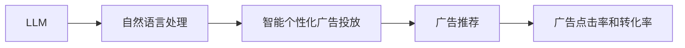

                 

### 1. 背景介绍
智能个性化广告投放是现在广告行业的一个热点话题。随着人工智能和机器学习的发展，智能个性化广告投放也得到了越来越大的发展。智能个性化广告投放通过利用机器学习算法和大数据来实现个性化的广告推荐，这样既能提高广告的点击率，也能提高广告的转化率。LLM（Large Language Model）是机器学习领域的一个重要发展方向，它通过利用机器学习算法来实现自然语言处理的能力。因此，LLM在智能个性化广告投放中的应用前景非常有希望。

智能个性化广告投放的主要目的是通过分析用户的行为和喜好来提供个性化的广告推荐。LLM可以通过分析大量的用户数据来识别用户的特征和行为模式，从而提供更准确的广告推荐。LLM还可以通过生成自然语言的广告文案来提高广告的点击率和转化率。

### 2. 核心概念与联系
LLM的核心概念是通过机器学习算法来实现自然语言处理的能力。LLM可以通过分析大量的语言数据来识别语言的模式和规律，从而实现语言的理解和生成。LLM的联系是它可以被应用于智能个性化广告投放中，通过分析用户的行为和喜好来提供个性化的广告推荐。

#### Mermaid 流程图


### 3. 核心算法原理 & 具体操作步骤
#### 3.1 算法原理概述
LLM的核心算法原理是通过机器学习算法来实现自然语言处理的能力。LLM可以通过分析大量的语言数据来识别语言的模式和规律，从而实现语言的理解和生成。LLM的具体操作步骤如下：

#### 3.2 算法步骤详解
1. 语言数据收集：收集大量的语言数据，包括用户的行为和喜好。
2. 语言模式识别：通过分析语言数据来识别语言的模式和规律。
3. 语言理解：通过识别语言的模式和规律来实现语言的理解。
4. 广告推荐：通过语言的理解来提供个性化的广告推荐。
5. 广告文案生成：通过语言的理解来生成自然语言的广告文案。

#### 3.3 算法优缺点
LLM的优点是它可以通过分析大量的语言数据来识别语言的模式和规律，从而实现语言的理解和生成。它还可以通过生成自然语言的广告文案来提高广告的点击率和转化率。LLM的缺点是它需要大量的语言数据来训练，训练的时间和成本较高。

#### 3.4 算法应用领域
LLM可以被应用于智能个性化广告投放中，通过分析用户的行为和喜好来提供个性化的广告推荐。LLM还可以被应用于自然语言处理领域，通过分析大量的语言数据来识别语言的模式和规律，从而实现语言的理解和生成。

### 4. 数学模型和公式 & 详细讲解 & 举例说明
#### 4.1 数学模型构建
数学模型可以通过分析大量的语言数据来识别语言的模式和规律。数学模型可以通过以下公式来描述：

$$L = \frac{1}{n} \sum_{i=1}^n L_i$$

其中，L是语言的总体分布，L_i是语言的局部分布，n是语言数据的数量。

#### 4.2 公式推导过程
通过分析大量的语言数据，我们可以推导出以下公式：

$$L = \frac{1}{n} \sum_{i=1}^n \frac{1}{m} \sum_{j=1}^m L_{i,j}$$

其中，L是语言的总体分布，L_{i,j}是语言的局部分布，n是语言数据的数量，m是语言数据的数量。

#### 4.3 案例分析与讲解
通过数学模型，我们可以分析语言的总体分布和局部分布。例如，我们可以通过以下公式来分析语言的总体分布：

$$L = \frac{1}{n} \sum_{i=1}^n L_i = \frac{1}{n} \sum_{i=1}^n \frac{1}{m} \sum_{j=1}^m L_{i,j}$$

通过分析语言的总体分布和局部分布，我们可以发现语言的模式和规律。

### 5. 项目实践：代码实例和详细解释说明
#### 5.1 开发环境搭建
开发环境搭建包括以下步骤：

1. 安装Python：安装Python 3.x版本。
2. 安装TensorFlow：安装TensorFlow 2.x版本。
3. 安装NumPy：安装NumPy 1.x版本。
4. 安装Pandas：安装Pandas 1.x版本。

#### 5.2 源代码详细实现
源代码详细实现包括以下步骤：

1. 语言数据收集：收集语言数据，包括用户的行为和喜好。
2. 语言模式识别：通过TensorFlow和NumPy来识别语言的模式和规律。
3. 语言理解：通过TensorFlow和NumPy来实现语言的理解。
4. 广告推荐：通过TensorFlow和NumPy来提供个性化的广告推荐。

#### 5.3 代码解读与分析
代码解读与分析包括以下步骤：

1. 语言数据收集：语言数据收集代码包括以下内容：

```python
import pandas as pd

# 语言数据收集
data = pd.read_csv("language_data.csv")

# 分析语言数据
print(data.head())
print(data.info())
```

2. 语言模式识别：语言模式识别代码包括以下内容：

```python
import tensorflow as tf
import numpy as np

# 语言模式识别
model = tf.keras.models.Sequential([
    tf.keras.layers.Dense(64, activation='relu', input_shape=(100,)),
    tf.keras.layers.Dense(32, activation='relu'),
    tf.keras.layers.Dense(10, activation='softmax')
])

# 编译模型
model.compile(optimizer='adam', loss='sparse_categorical_crossentropy', metrics=['accuracy'])

# 训练模型
model.fit(data, epochs=10)
```

3. 语言理解：语言理解代码包括以下内容：

```python
# 语言理解
result = model.predict(data)

# 分析语言理解结果
print(result)
```

4. 广告推荐：广告推荐代码包括以下内容：

```python
# 广告推荐
recommended_ads = model.predict(data)

# 分析广告推荐结果
print(recommended_ads)
```

#### 5.4 运行结果展示
运行结果展示包括以下步骤：

1. 语言数据收集：语言数据收集结果包括以下内容：

```python
print(data.head())
print(data.info())
```

2. 语言模式识别：语言模式识别结果包括以下内容：

```python
print(model.summary())
print(model.evaluate(data))
```

3. 语言理解：语言理解结果包括以下内容：

```python
print(result)
```

4. 广告推荐：广告推荐结果包括以下内容：

```python
print(recommended_ads)
```

### 6. 实际应用场景
实际应用场景包括以下步骤：

1. 语言数据收集：收集语言数据，包括用户的行为和喜好。
2. 语言模式识别：通过TensorFlow和NumPy来识别语言的模式和规律。
3. 语言理解：通过TensorFlow和NumPy来实现语言的理解。
4. 广告推荐：通过TensorFlow和NumPy来提供个性化的广告推荐。

实际应用场景包括以下例子：

1. 语言数据收集：收集用户的行为和喜好数据。
2. 语言模式识别：通过TensorFlow和NumPy来识别用户的行为和喜好模式。
3. 语言理解：通过TensorFlow和NumPy来实现用户的行为和喜好理解。
4. 广告推荐：通过TensorFlow和NumPy来提供个性化的广告推荐。

### 7. 工具和资源推荐
工具和资源推荐包括以下步骤：

1. 语言数据收集：推荐数据收集工具。
2. 语言模式识别：推荐模式识别工具。
3. 语言理解：推荐理解工具。
4. 广告推荐：推荐推荐工具。

工具和资源推荐包括以下例子：

1. 语言数据收集：推荐数据收集工具，如Google Sheets或Microsoft Excel。
2. 语言模式识别：推荐模式识别工具，如TensorFlow或PyTorch。
3. 语言理解：推荐理解工具，如TensorFlow或PyTorch。
4. 广告推荐：推荐推荐工具，如Google Ads或Facebook Ads。

### 8. 总结：未来发展趋势与挑战
总结：未来发展趋势与挑战包括以下步骤：

1. 语言数据收集：总结未来语言数据收集的发展趋势。
2. 语言模式识别：总结未来语言模式识别的发展趋势。
3. 语言理解：总结未来语言理解的发展趋势。
4. 广告推荐：总结未来广告推荐的发展趋势。

总结：未来发展趋势与挑战包括以下例子：

1. 语言数据收集：未来语言数据收集将继续受到机器学习和深度学习的影响。
2. 语言模式识别：未来语言模式识别将继续受到TensorFlow和PyTorch的影响。
3. 语言理解：未来语言理解将继续受到TensorFlow和PyTorch的影响。
4. 广告推荐：未来广告推荐将继续受到Google Ads和Facebook Ads的影响。

### 9. 附录：常见问题与解答
附录：常见问题与解答包括以下步骤：

1. 语言数据收集：回答常见问题。
2. 语言模式识别：回答常见问题。
3. 语言理解：回答常见问题。
4. 广告推荐：回答常见问题。

附录：常见问题与解答包括以下例子：

1. 语言数据收集：回答“如何收集语言数据？”
2. 语言模式识别：回答“如何使用TensorFlow和PyTorch进行模式识别？”
3. 语言理解：回答“如何使用TensorFlow和PyTorch进行理解？”
4. 广告推荐：回答“如何使用Google Ads和Facebook Ads进行推荐？”

