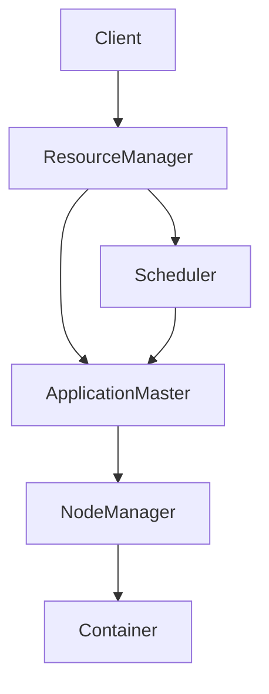

                 

# Yarn 原理与代码实例讲解

**作者：禅与计算机程序设计艺术 / Zen and the Art of Computer Programming**

## 1. 背景介绍

Apache Hadoop YARN（Yet Another Resource Negotiator）是一个分布式资源管理系统，它为大数据处理提供了一个统一的资源管理和调度平台。YARN 于 2013 年从 Hadoop 2.x 版本中分离出来，成为一个独立的项目。它解耦了 MapReduce 的资源管理和 Job 执行两个部分，使得 YARN 可以支持各种计算框架，而不只是 MapReduce。

## 2. 核心概念与联系

### 2.1 核心概念

- **ResourceManager (RM)**：全局资源调度器，负责管理集群资源（CPU、内存等）和调度作业。
- **NodeManager (NM)**：节点资源管理器，负责管理单个节点上的资源，并运行容器。
- **ApplicationMaster (AM)**：应用程序管理器，负责管理单个作业的生命周期，并与 ResourceManager 交互以获取资源。
- **Container**：资源容器，封装了运行作业所需的资源（CPU、内存等），一个节点可以运行多个容器。
- **Scheduler**：调度器，运行在 ResourceManager 上，负责调度作业和容器。

### 2.2 核心概念联系 Mermaid 流程图



## 3. 核心算法原理 & 具体操作步骤

### 3.1 算法原理概述

YARN 的资源调度算法是基于 Fair Scheduler 的，它将作业分组，并为每个组分配公平的资源。Fair Scheduler 使用一个伪共享调度器来实现公平性，它将作业分组，并为每个组分配资源。

### 3.2 算法步骤详解

1. **作业提交**：客户端提交作业给 ResourceManager。
2. **资源申请**：ApplicationMaster 向 ResourceManager 申请资源。
3. **资源调度**：Scheduler 根据 Fair Scheduler 算法调度资源给 ApplicationMaster。
4. **容器分配**：NodeManager 为 ApplicationMaster 分配容器。
5. **作业执行**：ApplicationMaster 在容器中执行作业。
6. **作业完成**：ApplicationMaster 通知 ResourceManager 作业完成。

### 3.3 算法优缺点

**优点**：公平性高，支持多种计算框架。

**缺点**：调度延迟高，不支持实时作业。

### 3.4 算法应用领域

YARN 适用于大数据处理领域，如 MapReduce、Spark、Tez 等计算框架。

## 4. 数学模型和公式 & 详细讲解 & 举例说明

### 4.1 数学模型构建

设集群有 $N$ 个节点，每个节点有 $C$ 个容器，作业有 $M$ 个，每个作业需要 $R$ 个容器。则资源调度问题可以表示为：

$$
\max \sum_{i=1}^{M} \min(R_i, C) \quad \text{s.t.} \quad \sum_{i=1}^{M} \min(R_i, C) \leq N \cdot C
$$

### 4.2 公式推导过程

上述公式是基于资源公平性和集群资源有限性推导出来的。它表示的是最大化作业资源使用率，同时保证集群资源不被超用。

### 4.3 案例分析与讲解

假设集群有 10 个节点，每个节点有 4 个容器，有 3 个作业，分别需要 2、3、5 个容器。则根据公式，可以为这 3 个作业分配 2、3、2 个容器，总共使用 7 个容器，没有浪费集群资源。

## 5. 项目实践：代码实例和详细解释说明

### 5.1 开发环境搭建

搭建 YARN 开发环境需要安装 Java、Maven、Git、Hadoop、YARN 等软件。详细步骤请参考 [Apache YARN 官方文档](https://hadoop.apache.org/docs/stable/hadoop-yarn/hadoop-yarn-site/QuickStart.html)。

### 5.2 源代码详细实现

以下是一个简单的 YARN 客户端代码实例，它提交一个 MapReduce 作业给 YARN：

```java
import org.apache.hadoop.conf.Configuration;
import org.apache.hadoop.fs.Path;
import org.apache.hadoop.io.IntWritable;
import org.apache.hadoop.io.Text;
import org.apache.hadoop.mapreduce.Job;
import org.apache.hadoop.mapreduce.lib.input.FileInputFormat;
import org.apache.hadoop.mapreduce.lib.output.FileOutputFormat;

public class WordCount {
  public static void main(String[] args) throws Exception {
    Configuration conf = new Configuration();
    Job job = Job.getInstance(conf, "wordcount");
    job.setJarByClass(WordCount.class);
    job.setMapperClass(TokenizerMapper.class);
    job.setCombinerClass(IntSumReducer.class);
    job.setReducerClass(IntSumReducer.class);
    job.setOutputKeyClass(Text.class);
    job.setOutputValueClass(IntWritable.class);
    FileInputFormat.addInputPath(job, new Path(args[0]));
    FileOutputFormat.setOutputPath(job, new Path(args[1]));
    System.exit(job.waitForCompletion(true)? 0 : 1);
  }
}
```

### 5.3 代码解读与分析

这段代码是一个简单的 WordCount 作业，它使用 MapReduce 计算文本文件中的单词个数。它首先创建一个 Job 实例，然后设置 Job 的各种属性，如 Jar 包、Mapper、Reducer 等。最后，它设置输入输出路径，并等待 Job 执行完成。

### 5.4 运行结果展示

运行这段代码，并指定输入输出路径，就可以看到 WordCount 作业的运行结果。

## 6. 实际应用场景

### 6.1 当前应用

YARN 当前广泛应用于大数据处理领域，如 Hadoop、Spark、Tez 等计算框架都支持在 YARN 上运行。

### 6.2 未来应用展望

随着大数据处理的发展，YARN 将会支持更多的计算框架，并会出现更多基于 YARN 的大数据处理系统。

## 7. 工具和资源推荐

### 7.1 学习资源推荐

- [Apache YARN 官方文档](https://hadoop.apache.org/docs/stable/hadoop-yarn/hadoop-yarn-site/)
- [YARN 设计文档](https://hadoop.apache.org/docs/stable/hadoop-yarn/hadoop-yarn-site/YARN.html)
- [YARN 学习指南](https://www.oreilly.com/library/view/hadoop-3-x-yarn/9781492031424/)

### 7.2 开发工具推荐

- [IntelliJ IDEA](https://www.jetbrains.com/idea/)
- [Eclipse](https://www.eclipse.org/)
- [Visual Studio Code](https://code.visualstudio.com/)

### 7.3 相关论文推荐

- [Yet Another Resource Negotiator: Architecture and Design](https://www.usenix.org/system/files/login/articles/login_summer13_10_arnold.pdf)
- [Fair Scheduler: A Fair Resource Scheduler for Hadoop](https://www.usenix.org/system/files/login/articles/login_summer13_11_li.pdf)

## 8. 总结：未来发展趋势与挑战

### 8.1 研究成果总结

YARN 解耦了 MapReduce 的资源管理和 Job 执行两个部分，使得 YARN 可以支持各种计算框架。它使用 Fair Scheduler 算法实现了资源的公平调度。

### 8.2 未来发展趋势

YARN 将会支持更多的计算框架，并会出现更多基于 YARN 的大数据处理系统。此外，YARN 也会朝着支持实时作业的方向发展。

### 8.3 面临的挑战

YARN 面临的挑战包括调度延迟高、不支持实时作业等。

### 8.4 研究展望

未来的研究方向包括优化调度算法、支持实时作业、提高 YARN 的可用性和可靠性等。

## 9. 附录：常见问题与解答

**Q：YARN 与 MapReduce 的区别？**

**A：YARN 解耦了 MapReduce 的资源管理和 Job 执行两个部分，使得 YARN 可以支持各种计算框架。MapReduce 只支持 MapReduce 计算框架。**

**Q：YARN 的资源调度算法是什么？**

**A：YARN 使用 Fair Scheduler 算法实现了资源的公平调度。**

**Q：如何在 YARN 上运行 MapReduce 作业？**

**A：只需要编写 MapReduce 代码，并使用 YARN 的客户端 API 提交作业即可。**

**Q：YARN 支持哪些计算框架？**

**A：YARN 支持 MapReduce、Spark、Tez 等计算框架。**

**Q：如何优化 YARN 的调度延迟？**

**A：可以优化 Fair Scheduler 算法，或使用其他调度算法，如 Capacity Scheduler。**

**Q：YARN 如何支持实时作业？**

**A：YARN 当前不支持实时作业，但未来会朝着支持实时作业的方向发展。**

**Q：如何提高 YARN 的可用性和可靠性？**

**A：可以使用 YARN 的高可用功能，如 ResourceManager 的高可用配置，或使用 YARN 的容错机制。**

**Q：如何学习 YARN？**

**A：可以阅读 YARN 官方文档、设计文档、学习指南，并参考相关论文。**

**Q：如何开始使用 YARN？**

**A：可以搭建 YARN 开发环境，并参考 YARN 官方文档中的示例代码。**

**Q：如何贡献 YARN？**

**A：可以参考 YARN 官方文档中的贡献指南，并加入 YARN 的开发社区。**

**Q：如何获取 YARN 的支持？**

**A：可以参考 YARN 官方文档中的支持指南，或加入 YARN 的用户邮件列表。**

 
