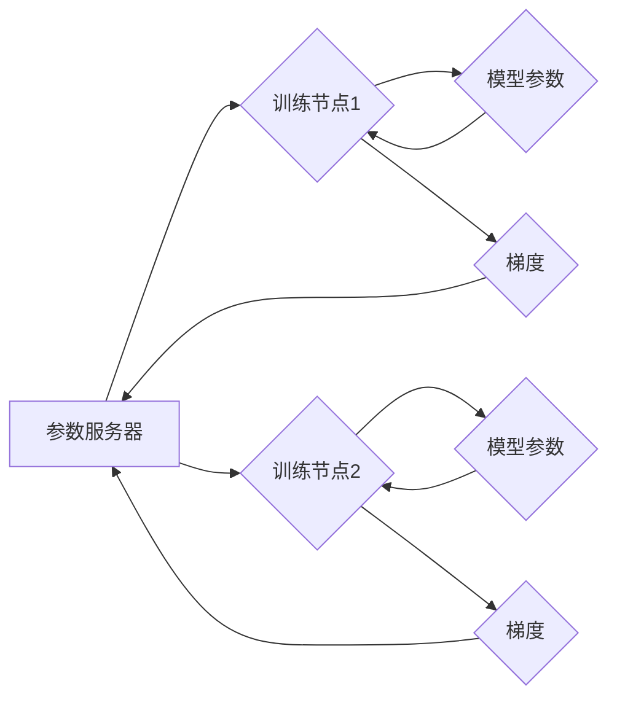

> ZeRO, 分布式训练, 大规模模型, 优化算法, 梯度累积, 模型并行, 参数服务器

## 1. 背景介绍

深度学习模型的规模不断增长，以追求更高的准确率和性能。然而，随着模型规模的扩大，训练这些模型所需的计算资源和内存也呈指数级增长。传统的单机训练已经难以满足需求，分布式训练成为训练大规模模型的必要手段。

分布式训练通过将模型参数和数据分布到多个机器上进行并行训练，从而有效地提高训练速度和效率。然而，分布式训练也面临着诸多挑战，例如通信开销、参数同步、模型并行策略选择等。

## 2. 核心概念与联系

ZeRO（Zero Redundancy Optimizer）是一种针对大规模分布式训练提出的优化算法，旨在通过减少模型参数和梯度在各个节点上的冗余存储，从而有效地降低内存占用和通信开销。

**ZeRO 的核心思想:**

* 将模型参数和梯度存储在参数服务器上，每个训练节点只存储其负责的部分模型参数和梯度。
* 使用梯度累积技术，在每个训练步骤中，每个节点累积多个 mini-batch 的梯度，然后将累积的梯度发送到参数服务器进行更新。

**ZeRO 架构:**



**ZeRO 与其他分布式训练方法的比较:**

| 方法 | 模型参数存储 | 梯度存储 | 通信开销 | 内存占用 |
|---|---|---|---|---|
| 数据并行 | 各节点存储完整模型参数 | 各节点存储梯度 | 低 | 高 |
| 模型并行 | 各节点存储部分模型参数 | 各节点存储梯度 | 高 | 中 |
| ZeRO | 参数服务器存储完整模型参数 | 参数服务器存储梯度 | 中 | 低 |

## 3. 核心算法原理 & 具体操作步骤

### 3.1  算法原理概述

ZeRO 算法的核心思想是将模型参数和梯度存储在参数服务器上，每个训练节点只存储其负责的部分模型参数和梯度。通过梯度累积技术，每个节点在每个训练步骤中累积多个 mini-batch 的梯度，然后将累积的梯度发送到参数服务器进行更新。

### 3.2  算法步骤详解

1. **参数初始化:** 将模型参数初始化，并将其存储在参数服务器上。
2. **数据分配:** 将训练数据分配到各个训练节点上。
3. **梯度累积:** 每个训练节点对其负责的部分数据进行前向传播和反向传播，计算出梯度。每个节点将计算出的梯度累积到本地梯度缓冲区中。
4. **梯度同步:** 在每个训练步骤的结束时，每个节点将累积的梯度发送到参数服务器。
5. **参数更新:** 参数服务器将所有节点发送的梯度进行聚合，并根据聚合后的梯度更新模型参数。
6. **参数广播:** 参数服务器将更新后的模型参数广播到所有训练节点。
7. **重复步骤3-6:** 重复上述步骤，直到训练完成。

### 3.3  算法优缺点

**优点:**

* **降低内存占用:** 每个节点只存储其负责的部分模型参数和梯度，从而有效地降低内存占用。
* **降低通信开销:** 每个节点只在每个训练步骤的结束时发送一次梯度，从而降低通信开销。
* **支持大规模模型训练:** ZeRO 算法能够支持训练非常大的模型，因为其能够有效地管理模型参数和梯度的存储和更新。

**缺点:**

* **增加参数服务器的压力:** 参数服务器需要存储所有模型参数和梯度，因此需要具备较高的计算能力和存储容量。
* **梯度累积的延迟:** 梯度累积会增加梯度更新的延迟，因为需要等待多个 mini-batch 的梯度累积完成。

### 3.4  算法应用领域

ZeRO 算法广泛应用于大规模分布式训练场景，例如：

* 自然语言处理 (NLP)
* computer vision
* 图像生成
* 机器翻译

## 4. 数学模型和公式 & 详细讲解 & 举例说明

### 4.1  数学模型构建

假设模型参数为 $\theta$, 训练数据为 $\{x_i, y_i\}_{i=1}^{N}$, 损失函数为 $L(\theta, x_i, y_i)$, 优化算法为梯度下降法。

ZeRO 算法的目标是找到最优参数 $\theta^*$, 使得损失函数最小化:

$$
\theta^* = \arg \min_{\theta} \frac{1}{N} \sum_{i=1}^{N} L(\theta, x_i, y_i)
$$

### 4.2  公式推导过程

在 ZeRO 算法中，每个训练节点只存储其负责的部分模型参数和梯度。参数服务器存储所有模型参数和梯度。

每个节点在每个训练步骤中，对其负责的部分数据进行前向传播和反向传播，计算出梯度:

$$
\nabla_{\theta} L(\theta, x_i, y_i)
$$

每个节点将计算出的梯度累积到本地梯度缓冲区中:

$$
g_t = \sum_{j=1}^{k} \nabla_{\theta} L(\theta, x_{i+j}, y_{i+j})
$$

其中，$g_t$ 是节点 $t$ 在第 $k$ 个 mini-batch 结束时的梯度累积值。

在每个训练步骤的结束时，每个节点将累积的梯度发送到参数服务器:

$$
g_t \rightarrow \text{Parameter Server}
$$

参数服务器将所有节点发送的梯度进行聚合:

$$
G = \sum_{t=1}^{T} g_t
$$

其中，$G$ 是所有节点梯度聚合后的值。

参数服务器根据聚合后的梯度更新模型参数:

$$
\theta = \theta - \eta G
$$

其中，$\eta$ 是学习率。

参数服务器将更新后的模型参数广播到所有训练节点:

$$
\theta \rightarrow \text{All Nodes}
$$

### 4.3  案例分析与讲解

假设我们有一个包含 1000 个参数的模型，并将其分布到 10 个训练节点上。每个节点负责训练模型参数的 100 个。

在 ZeRO 算法中，每个节点只存储其负责的 100 个参数和梯度。参数服务器存储所有 1000 个参数和梯度。

当每个节点训练 10 个 mini-batch 的数据后，每个节点将累积的梯度发送到参数服务器。参数服务器将所有节点的梯度进行聚合，并根据聚合后的梯度更新所有模型参数。

更新后的模型参数将被广播到所有训练节点。

## 5. 项目实践：代码实例和详细解释说明

### 5.1  开发环境搭建

* 操作系统: Ubuntu 20.04
* Python 版本: 3.8
* 深度学习框架: PyTorch 1.8

### 5.2  源代码详细实现

```python
import torch
import torch.nn as nn
from torch.utils.data import DataLoader

# 定义模型
class MyModel(nn.Module):
    def __init__(self):
        super(MyModel, self).__init__()
        # 模型结构定义

    def forward(self, x):
        # 前向传播过程

# 定义训练数据
train_dataset = ...

# 定义数据加载器
train_loader = DataLoader(train_dataset, batch_size=32, shuffle=True)

# 实例化模型
model = MyModel()

# 定义优化器
optimizer = torch.optim.SGD(model.parameters(), lr=0.01)

# 定义损失函数
criterion = nn.CrossEntropyLoss()

# 训练模型
for epoch in range(10):
    for batch_idx, (data, target) in enumerate(train_loader):
        # 前向传播
        output = model(data)
        loss = criterion(output, target)

        # 反向传播
        optimizer.zero_grad()
        loss.backward()

        # 参数更新
        optimizer.step()

        # 打印训练进度
        print('Epoch: {} [{}/{} ({:.0f}%)]\tLoss: {:.6f}'.format(
            epoch, batch_idx * len(data), len(train_loader.dataset),
            100. * batch_idx / len(train_loader), loss.item()))
```

### 5.3  代码解读与分析

* 代码首先定义了模型、训练数据、数据加载器、优化器和损失函数。
* 然后，代码使用循环迭代训练数据，进行前向传播、反向传播和参数更新。
* 在每个训练步骤中，模型会对数据进行前向传播，计算出输出结果。然后，使用损失函数计算出模型预测结果与真实标签之间的误差。
* 误差会反向传播到模型参数，更新模型参数。
* 最后，代码打印训练进度。

### 5.4  运行结果展示

训练完成后，可以将模型保存下来，并使用它进行预测。

## 6. 实际应用场景

ZeRO 算法在实际应用场景中取得了显著的成果，例如：

* **GPT-3:** OpenAI 的 GPT-3 模型使用了 ZeRO 算法进行训练，使其能够训练出包含 1750 亿个参数的巨大模型。
* **Megatron-LM:** NVIDIA 的 Megatron-LM 模型也使用了 ZeRO 算法进行训练，使其能够训练出包含 530 亿个参数的巨大模型。

### 6.4  未来应用展望

随着深度学习模型规模的不断增长，ZeRO 算法将在未来得到更广泛的应用。

* **更大型模型训练:** ZeRO 算法能够支持训练更大的模型，从而进一步提高模型性能。
* **新兴应用场景:** ZeRO 算法可以应用于更多新兴的应用场景，例如药物研发、材料科学等。

## 7. 工具和资源推荐

### 7.1  学习资源推荐

* **ZeRO 官方文档:** https://arxiv.org/abs/2006.09619
* **PyTorch 官方文档:** https://pytorch.org/docs/stable/index.html

### 7.2  开发工具推荐

* **PyTorch:** https://pytorch.org/
* **TensorFlow:** https://www.tensorflow.org/

### 7.3  相关论文推荐

* **ZeRO: Optimizing Large-Scale Language Models with Zero Redundancy**
* **Megatron-LM: Training Multi-Billion Parameter Language Models Using Model Parallelism**
* **DeepSpeed: Scaling Distributed Data Parallel Training for Deep Learning**

## 8. 总结：未来发展趋势与挑战

### 8.1  研究成果总结

ZeRO 算法为大规模分布式训练提供了新的思路和方法，有效地降低了内存占用和通信开销，使得训练更大的模型成为可能。

### 8.2  未来发展趋势

* **模型并行策略优化:** 研究更有效的模型并行策略，例如混合精度训练、模型剪枝等，进一步提高训练效率。
* **分布式训练框架改进:** 开发更完善的分布式训练框架，支持更复杂的模型并行策略和硬件加速。
* **新兴硬件平台利用:** 利用新兴的硬件平台，例如 TPU、GPU 等，进一步提高训练速度和效率。

### 8.3  面临的挑战

* **参数服务器压力:** 随着模型规模的不断增长，参数服务器的压力也会不断增加，需要开发更有效的参数服务器架构和管理策略。
* **梯度累积延迟:** 梯度累