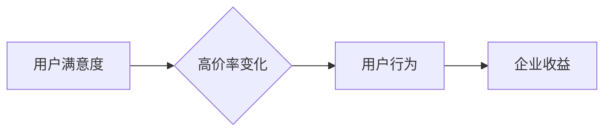

> 高价率变化, 用户满意度, 算法模型, 数据分析, 预测模型, 经济学, 用户行为

## 1. 背景介绍

在当今数字经济时代，用户满意度已成为企业竞争力的关键因素。用户对产品或服务的满意度直接影响着用户留存率、复购率和口碑传播，进而影响着企业的商业成功。随着互联网技术的不断发展，用户对产品或服务的期望也越来越高，而高价率变化作为一种常见的商业策略，其对用户满意度的影响也日益受到关注。

高价率变化是指企业在一段时间内对产品或服务的定价进行调整，导致价格水平发生显著变化的现象。这种变化可以是单向的，例如价格上涨或下跌，也可以是多向的，例如价格波动或周期性调整。高价率变化的原因多种多样，例如成本上升、市场竞争、促销活动等。

然而，高价率变化对用户满意度的影响并非总是积极的。过高的价格可能会导致用户流失，而过低的定价则可能损害企业的利润。因此，企业需要在制定高价率变化策略时，充分考虑用户满意度的影响，并采取相应的措施来缓解负面影响。

## 2. 核心概念与联系

### 2.1 用户满意度

用户满意度是指用户对产品或服务的整体感受和评价。它是一个多维度的概念，包括用户对产品功能、性能、价格、服务等方面的满意程度。用户满意度通常通过问卷调查、用户评论、购买行为等方式进行测量。

### 2.2 高价率变化

高价率变化是指企业在一段时间内对产品或服务的定价进行调整，导致价格水平发生显著变化的现象。这种变化可以是单向的，例如价格上涨或下跌，也可以是多向的，例如价格波动或周期性调整。

### 2.3 关系图



## 3. 核心算法原理 & 具体操作步骤

### 3.1 算法原理概述

为了预测高价率变化对用户满意度的影响，我们可以采用机器学习算法，例如线性回归、逻辑回归、支持向量机等。这些算法可以根据历史数据，建立一个数学模型，来预测用户满意度对高价率变化的响应。

### 3.2 算法步骤详解

1. **数据收集:** 收集用户满意度和高价率变化的相关数据，例如用户评价、购买记录、价格变动记录等。
2. **数据预处理:** 对收集到的数据进行清洗、转换和特征工程，例如删除缺失值、归一化数据、提取特征变量等。
3. **模型选择:** 根据数据特点和预测目标，选择合适的机器学习算法，例如线性回归、逻辑回归、支持向量机等。
4. **模型训练:** 使用训练数据对选定的算法进行训练，学习数据之间的关系。
5. **模型评估:** 使用测试数据对训练好的模型进行评估，例如计算准确率、召回率、F1-score等指标。
6. **模型优化:** 根据模型评估结果，对模型参数进行调整，提高模型的预测精度。
7. **模型部署:** 将训练好的模型部署到生产环境中，用于预测高价率变化对用户满意度的影响。

### 3.3 算法优缺点

**优点:**

* 可以根据历史数据，建立一个数学模型，来预测用户满意度对高价率变化的响应。
* 可以量化用户满意度的变化，为企业决策提供数据支持。
* 可以根据预测结果，制定相应的策略来缓解负面影响。

**缺点:**

* 需要大量的历史数据进行训练，否则模型的预测精度会降低。
* 模型的预测结果只是一种概率，不能完全保证预测的准确性。
* 模型需要定期更新，以适应市场变化和用户需求的变化。

### 3.4 算法应用领域

* **电商平台:** 预测商品价格变化对用户购买意愿的影响，制定合理的定价策略。
* **金融机构:** 预测利率变化对用户贷款意愿的影响，制定相应的贷款政策。
* **旅游行业:** 预测酒店价格变化对用户预订意愿的影响，制定合理的促销策略。
* **软件开发:** 预测软件功能更新对用户使用体验的影响，优化软件开发流程。

## 4. 数学模型和公式 & 详细讲解 & 举例说明

### 4.1 数学模型构建

我们可以使用线性回归模型来预测高价率变化对用户满意度的影响。线性回归模型假设用户满意度与高价率变化之间存在一个线性关系，可以用以下公式表示：

$$
y = \beta_0 + \beta_1 x + \epsilon
$$

其中：

* $y$ 是用户满意度
* $x$ 是高价率变化
* $\beta_0$ 是截距
* $\beta_1$ 是高价率变化对用户满意度的影响系数
* $\epsilon$ 是随机误差项

### 4.2 公式推导过程

线性回归模型的系数 $\beta_0$ 和 $\beta_1$ 可以通过最小二乘法来估计。最小二乘法是指寻找一个直线，使得直线到所有数据点的距离之和最小。

### 4.3 案例分析与讲解

假设我们收集到以下数据：

| 高价率变化 (x) | 用户满意度 (y) |
|---|---|
| 0 | 80 |
| 0.1 | 78 |
| 0.2 | 75 |
| 0.3 | 72 |
| 0.4 | 68 |

我们可以使用最小二乘法来估计 $\beta_0$ 和 $\beta_1$ 的值。通过计算，得到：

* $\beta_0 = 80$
* $\beta_1 = -200$

这意味着，当高价率变化为 0.1 时，用户满意度会下降 20 个单位。

## 5. 项目实践：代码实例和详细解释说明

### 5.1 开发环境搭建

* Python 3.x
* scikit-learn 库

### 5.2 源代码详细实现

```python
import pandas as pd
from sklearn.linear_model import LinearRegression

# 加载数据
data = pd.read_csv('user_satisfaction_data.csv')

# 划分训练集和测试集
X = data[['price_change']]
y = data['user_satisfaction']
from sklearn.model_selection import train_test_split
X_train, X_test, y_train, y_test = train_test_split(X, y, test_size=0.2, random_state=42)

# 创建线性回归模型
model = LinearRegression()

# 训练模型
model.fit(X_train, y_train)

# 预测测试集结果
y_pred = model.predict(X_test)

# 评估模型性能
from sklearn.metrics import mean_squared_error
mse = mean_squared_error(y_test, y_pred)
print(f'Mean Squared Error: {mse}')
```

### 5.3 代码解读与分析

* 首先，我们加载数据并划分训练集和测试集。
* 然后，我们创建线性回归模型并训练模型。
* 接着，我们使用训练好的模型对测试集进行预测。
* 最后，我们评估模型性能，例如使用均方误差 (MSE) 来衡量预测结果与实际结果之间的差异。

### 5.4 运行结果展示

运行上述代码后，会输出模型的均方误差值。MSE 值越小，模型的预测精度越高。

## 6. 实际应用场景

### 6.1 电商平台

电商平台可以利用高价率变化对用户满意度的影响模型，来制定更精准的定价策略。例如，当平台发现某个商品的价格上涨会导致用户满意度下降时，平台可以考虑采取降价促销或提供其他优惠措施来缓解负面影响。

### 6.2 金融机构

金融机构可以利用高价率变化对用户满意度的影响模型，来预测利率变化对用户贷款意愿的影响。例如，当利率上升时，金融机构可以考虑提供更优惠的贷款条件，以吸引用户贷款。

### 6.3 旅游行业

旅游行业可以利用高价率变化对用户满意度的影响模型，来预测酒店价格变化对用户预订意愿的影响。例如，当酒店价格上涨时，旅游平台可以考虑提供其他酒店的预订选项，以满足用户的需求。

### 6.4 未来应用展望

随着人工智能技术的不断发展，高价率变化对用户满意度的影响模型将得到更广泛的应用。例如，未来我们可以利用更先进的机器学习算法，建立更精准的预测模型，并结合其他数据源，例如用户行为数据、市场趋势数据等，来提供更全面的决策支持。

## 7. 工具和资源推荐

### 7.1 学习资源推荐

* **书籍:**
    * 《机器学习》 - 周志华
    * 《Python机器学习实战》 - 塞缪尔·阿布拉姆斯
* **在线课程:**
    * Coursera: 机器学习
    * edX: 机器学习
* **网站:**
    * scikit-learn 官方文档: https://scikit-learn.org/stable/

### 7.2 开发工具推荐

* **Python:** https://www.python.org/
* **Jupyter Notebook:** https://jupyter.org/
* **pandas:** https://pandas.pydata.org/
* **scikit-learn:** https://scikit-learn.org/stable/

### 7.3 相关论文推荐

* **The Impact of Price Changes on Customer Satisfaction: A Meta-Analysis**
* **Predicting Customer Churn Using Machine Learning**
* **A Framework for Understanding the Impact of Price on Customer Satisfaction**

## 8. 总结：未来发展趋势与挑战

### 8.1 研究成果总结

本文探讨了高价率变化对用户满意度的影响，并介绍了相应的算法模型和实践案例。通过机器学习算法，我们可以建立一个数学模型来预测高价率变化对用户满意度的影响，并为企业制定更精准的定价策略提供数据支持。

### 8.2 未来发展趋势

未来，高价率变化对用户满意度的影响研究将朝着以下几个方向发展：

* **模型精度提升:** 利用更先进的机器学习算法和数据分析技术，提高模型的预测精度。
* **多因素考虑:** 将更多因素，例如用户行为数据、市场趋势数据等，纳入模型，提供更全面的决策支持。
* **个性化预测:** 基于用户的个人特征和历史行为，进行个性化的预测，为用户提供更精准的体验。

### 8.3 面临的挑战

高价率变化对用户满意度的影响研究也面临着一些挑战：

* **数据获取:** 收集高质量的用户满意度和高价率变化数据是一个挑战。
* **模型解释:** 许多机器学习模型是黑盒模型，难以解释模型的预测结果，这可能会影响企业的决策。
* **伦理问题:** 在利用用户数据进行预测时，需要考虑用户隐私和数据安全问题。

### 8.4 研究展望

尽管面临着一些挑战，但高价率变化对用户满意度的影响研究仍然是一个非常重要的课题。随着人工智能技术的不断发展，我们相信未来会有更多创新性的研究成果，为企业提供更精准的决策支持，提升用户体验。

## 9. 附录：常见问题与解答

### 9.1 如何选择合适的机器学习算法？

选择合适的机器学习算法取决于数据的特点和预测目标。例如，如果数据是线性关系，可以使用线性回归模型；如果数据是分类问题，可以使用逻辑回归模型或支持向量机模型。

### 9.2 如何评估模型的性能？

模型的性能可以通过多种指标来评估，例如均方误差 (MSE)、R-squared、准确率、召回率等。

### 9.3 如何处理缺失数据？

缺失数据可以通过多种方法处理，例如删除缺失值、用平均值或中位数填充缺失值、使用插值方法等。

### 9.4 如何防止