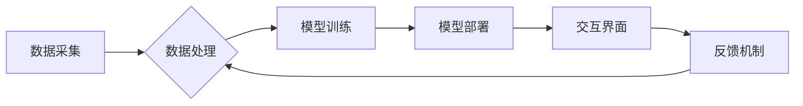

> 人工智能，协作，人类，未来，技术，发展趋势，挑战

## 1. 背景介绍

人工智能（AI）正以惊人的速度发展，从自动驾驶到医疗诊断，从个性化教育到金融风险管理，AI正在深刻地改变着我们的生活。然而，AI的发展并非一帆风顺，它也面临着诸多挑战，例如数据安全、算法偏见、伦理道德等。

在这个背景下，探讨AI与人类的协作模式，共同构建更加美好的未来，显得尤为重要。人类拥有创造力、想象力和批判性思维，而AI拥有强大的计算能力、数据处理能力和学习能力。两者相结合，可以发挥各自优势，实现协同共赢。

## 2. 核心概念与联系

**2.1 人工智能与人类协作**

AI与人类协作是指人类和AI系统共同完成任务的过程，其中AI系统提供数据分析、决策支持等功能，而人类负责制定目标、提供创意和进行最终决策。这种协作模式强调的是人机之间的互补和融合，而不是简单的替代关系。

**2.2 协作模式**

AI与人类的协作模式可以多种多样，例如：

* **监督式协作:** 人类提供明确的指令和反馈，指导AI系统完成任务。
* **自主式协作:** AI系统能够自主学习和决策，人类则在必要时进行干预和调整。
* **伙伴式协作:** 人类和AI系统作为平等的伙伴，共同参与决策和任务执行。

**2.3 协作架构**

AI与人类协作的架构通常包括以下几个关键组件：

* **数据采集和处理:** 收集和处理人类和AI系统所需的数据。
* **模型训练和部署:** 训练AI模型，并将其部署到实际应用场景中。
* **交互界面:** 提供人类与AI系统交互的界面，例如语音、文本、图形等。
* **反馈机制:** 收集人类反馈，用于改进AI模型和协作流程。

**Mermaid 流程图**



## 3. 核心算法原理 & 具体操作步骤

**3.1 算法原理概述**

深度学习是AI领域的重要分支，其核心算法是多层神经网络。深度学习算法能够从海量数据中自动学习特征，并进行复杂的模式识别和预测。

**3.2 算法步骤详解**

1. **数据预处理:** 将原始数据进行清洗、转换和特征工程，使其适合深度学习模型的训练。
2. **网络结构设计:** 根据任务需求设计多层神经网络的结构，包括神经元数量、层数、激活函数等。
3. **模型训练:** 使用训练数据训练深度学习模型，通过调整模型参数，使模型的预测结果与真实值尽可能接近。
4. **模型评估:** 使用测试数据评估模型的性能，例如准确率、召回率、F1-score等。
5. **模型调优:** 根据评估结果，调整模型参数和网络结构，进一步提高模型性能。
6. **模型部署:** 将训练好的模型部署到实际应用场景中，用于进行预测和决策。

**3.3 算法优缺点**

**优点:**

* 能够自动学习特征，无需人工特征工程。
* 能够处理海量数据，并进行复杂的模式识别。
* 在图像识别、自然语言处理等领域取得了突破性进展。

**缺点:**

* 训练数据量要求高，需要大量的标注数据。
* 计算资源消耗大，训练时间长。
* 模型解释性差，难以理解模型的决策过程。

**3.4 算法应用领域**

深度学习算法广泛应用于各个领域，例如：

* **计算机视觉:** 图像识别、目标检测、图像分割等。
* **自然语言处理:** 文本分类、机器翻译、情感分析等。
* **语音识别:** 语音转文本、语音合成等。
* **推荐系统:** 商品推荐、内容推荐等。
* **医疗诊断:** 疾病诊断、影像分析等。

## 4. 数学模型和公式 & 详细讲解 & 举例说明

**4.1 数学模型构建**

深度学习模型的核心是多层神经网络，其数学模型可以表示为：

$$
y = f(W_L \cdot \sigma(W_{L-1} \cdot \sigma( \dots \sigma(W_1 \cdot x) \dots)))
$$

其中：

* $x$ 是输入数据。
* $W_i$ 是第 $i$ 层神经网络的权重矩阵。
* $\sigma$ 是激活函数，例如ReLU、Sigmoid等。
* $f$ 是输出层激活函数。
* $y$ 是模型的输出结果。

**4.2 公式推导过程**

深度学习模型的训练过程是通过反向传播算法来进行的。反向传播算法的核心思想是：

1. 计算模型输出与真实值的误差。
2. 根据误差反向传播，更新各层神经网络的权重参数。

**4.3 案例分析与讲解**

例如，在图像识别任务中，深度学习模型可以学习图像特征，并将其映射到不同的类别。训练过程中，模型会不断调整权重参数，使得模型的预测结果与真实类别尽可能一致。

## 5. 项目实践：代码实例和详细解释说明

**5.1 开发环境搭建**

深度学习开发环境通常需要安装Python语言、深度学习框架（例如TensorFlow、PyTorch）以及必要的库和工具。

**5.2 源代码详细实现**

```python
import tensorflow as tf

# 定义模型结构
model = tf.keras.models.Sequential([
    tf.keras.layers.Conv2D(32, (3, 3), activation='relu', input_shape=(28, 28, 1)),
    tf.keras.layers.MaxPooling2D((2, 2)),
    tf.keras.layers.Conv2D(64, (3, 3), activation='relu'),
    tf.keras.layers.MaxPooling2D((2, 2)),
    tf.keras.layers.Flatten(),
    tf.keras.layers.Dense(10, activation='softmax')
])

# 编译模型
model.compile(optimizer='adam',
              loss='sparse_categorical_crossentropy',
              metrics=['accuracy'])

# 训练模型
model.fit(x_train, y_train, epochs=5)

# 评估模型
loss, accuracy = model.evaluate(x_test, y_test)
print('Test loss:', loss)
print('Test accuracy:', accuracy)
```

**5.3 代码解读与分析**

这段代码定义了一个简单的卷积神经网络模型，用于手写数字识别任务。模型包含两层卷积层、两层池化层、一层全连接层和一层输出层。

**5.4 运行结果展示**

训练完成后，模型可以用于预测新的手写数字图像。

## 6. 实际应用场景

**6.1 医疗诊断**

AI可以辅助医生进行疾病诊断，例如分析医学影像、预测患者风险等。

**6.2 金融风险管理**

AI可以帮助金融机构识别欺诈行为、评估信用风险等。

**6.3 自动驾驶**

AI是自动驾驶的核心技术，可以帮助车辆感知周围环境、做出决策等。

**6.4 未来应用展望**

AI与人类的协作将更加深入，例如：

* **个性化教育:** AI可以根据学生的学习情况提供个性化的学习方案。
* **智能客服:** AI可以提供更加智能和高效的客户服务。
* **协同设计:** 人类和AI可以共同参与产品设计和开发。

## 7. 工具和资源推荐

**7.1 学习资源推荐**

* **在线课程:** Coursera、edX、Udacity等平台提供丰富的AI课程。
* **书籍:** 《深度学习》、《人工智能：一个现代方法》等书籍。
* **开源项目:** TensorFlow、PyTorch等开源深度学习框架。

**7.2 开发工具推荐**

* **Python:** 深度学习开发的主要编程语言。
* **TensorFlow:** Google开发的开源深度学习框架。
* **PyTorch:** Facebook开发的开源深度学习框架。

**7.3 相关论文推荐**

* **《ImageNet Classification with Deep Convolutional Neural Networks》**
* **《Attention Is All You Need》**
* **《BERT: Pre-training of Deep Bidirectional Transformers for Language Understanding》**

## 8. 总结：未来发展趋势与挑战

**8.1 研究成果总结**

近年来，AI领域取得了显著进展，例如图像识别、自然语言处理等领域取得了突破性进展。

**8.2 未来发展趋势**

* **模型规模和能力的提升:** 未来AI模型将更加强大，能够处理更加复杂的任务。
* **算法的创新:** 新的AI算法将不断涌现，例如强化学习、迁移学习等。
* **边缘计算和部署:** AI模型将更加广泛地部署到边缘设备上，实现更实时和高效的应用。

**8.3 面临的挑战**

* **数据安全和隐私保护:** AI模型的训练和应用需要大量数据，如何保证数据安全和隐私保护是一个重要挑战。
* **算法偏见和公平性:** AI模型可能存在算法偏见，导致不公平的结果，需要解决算法公平性问题。
* **伦理道德问题:** AI的应用可能引发伦理道德问题，例如自动驾驶中的责任归属等，需要进行深入探讨和规范。

**8.4 研究展望**

未来AI研究将更加注重可解释性、鲁棒性和安全性，以及与人类的协作和融合。


## 9. 附录：常见问题与解答

**9.1 如何选择合适的深度学习框架？**

选择深度学习框架需要根据具体任务需求、开发经验和团队偏好等因素进行考虑。TensorFlow和PyTorch是目前最流行的深度学习框架，各有优缺点。

**9.2 如何解决深度学习模型的过拟合问题？**

过拟合是指模型在训练数据上表现良好，但在测试数据上表现较差。解决过拟合问题的方法包括：

* 增加训练数据量。
* 使用正则化技术，例如L1正则化、L2正则化。
* 使用Dropout技术，随机丢弃部分神经元。
* 使用早停策略，在模型性能不再提升时停止训练。

**9.3 如何评估深度学习模型的性能？**

深度学习模型的性能可以通过多种指标进行评估，例如准确率、召回率、F1-score、AUC等。选择合适的评估指标需要根据具体任务需求进行考虑。


作者：禅与计算机程序设计艺术 / Zen and the Art of Computer Programming 
<end_of_turn>