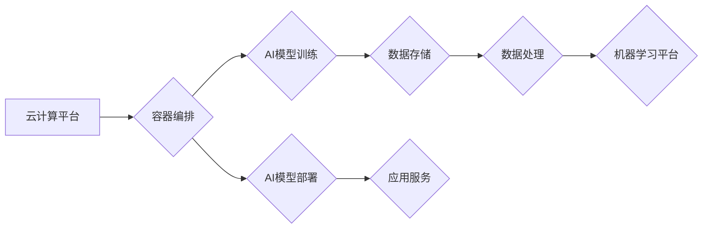

> AI基础设施、智能服务、云计算、容器化、自动化运维、机器学习、数据管理

## 1. 背景介绍

人工智能（AI）技术近年来发展迅速，已渗透到各个领域，从自动驾驶到医疗诊断，从个性化推荐到金融风险控制，AI正在改变着我们的生活和工作方式。然而，随着AI应用的普及，对AI基础设施的需求也日益增长。AI基础设施是指支撑AI应用运行和发展的基础设施，包括硬件、软件、网络、数据等多个方面。

传统的IT基础设施难以满足AI应用的特殊需求。AI应用通常需要海量的数据、强大的计算能力和灵活的部署方式。传统的IT基础设施往往存在资源浪费、部署效率低、运维成本高等问题。因此，需要构建专门针对AI应用的全新基础设施。

## 2. 核心概念与联系

AI基础设施运营的核心概念包括：

* **云计算:**  AI基础设施通常基于云计算平台，利用云计算的弹性、可扩展性和按需付费的特点，满足AI应用的动态需求。
* **容器化:**  容器技术可以将AI应用及其依赖的软件包打包成独立的单元，方便部署和管理。
* **自动化运维:**  自动化运维可以提高AI基础设施的效率和可靠性，减少人工干预，降低运维成本。
* **机器学习:**  机器学习可以用于优化AI基础设施的性能和资源利用率，例如预测资源需求、自动调整配置等。
* **数据管理:**  AI应用依赖海量数据，数据管理是AI基础设施的重要组成部分，包括数据采集、存储、处理、安全等。

**AI基础设施运营架构**



## 3. 核心算法原理 & 具体操作步骤

### 3.1  算法原理概述

AI基础设施运营中，许多算法用于优化资源利用、预测需求、自动调整配置等。例如，机器学习算法可以用于预测资源需求，根据历史数据和当前趋势，预测未来一段时间内的CPU、内存、存储等资源需求，从而提前预留资源，避免资源不足导致的应用中断。

### 3.2  算法步骤详解

以预测资源需求为例，机器学习算法的具体步骤如下：

1. **数据收集:** 收集历史资源使用数据，包括CPU使用率、内存使用率、存储使用量等指标。
2. **数据预处理:** 对收集到的数据进行清洗、转换和特征工程，例如将时间序列数据转换为固定长度的窗口，提取特征等。
3. **模型选择:** 选择合适的机器学习模型，例如线性回归、支持向量机、神经网络等。
4. **模型训练:** 使用训练数据训练模型，调整模型参数，使模型能够准确预测资源需求。
5. **模型评估:** 使用测试数据评估模型的预测精度，选择性能最好的模型。
6. **模型部署:** 将训练好的模型部署到生产环境，用于实时预测资源需求。

### 3.3  算法优缺点

机器学习算法在预测资源需求方面具有以下优点：

* **高精度:**  机器学习算法可以学习数据中的复杂模式，预测资源需求的精度较高。
* **自适应性:**  机器学习模型可以根据数据变化自动调整，适应不断变化的资源需求。
* **可扩展性:**  机器学习模型可以轻松扩展到更大的数据集和更复杂的场景。

但也存在一些缺点：

* **数据依赖:**  机器学习算法的性能依赖于训练数据的质量和数量。
* **模型解释性:**  一些机器学习模型的内部机制难以解释，难以理解模型的预测结果。
* **维护成本:**  机器学习模型需要定期更新和维护，以保持其准确性和有效性。

### 3.4  算法应用领域

预测资源需求的机器学习算法在AI基础设施运营中具有广泛的应用领域，例如：

* **云计算平台:**  预测虚拟机、容器、存储等资源需求，优化资源分配和调度。
* **AI训练平台:**  预测模型训练所需的计算资源和存储资源，提高训练效率。
* **AI应用部署平台:**  预测AI应用的资源需求，确保应用能够正常运行。

## 4. 数学模型和公式 & 详细讲解 & 举例说明

### 4.1  数学模型构建

预测资源需求的机器学习模型通常基于时间序列分析，可以使用ARIMA模型、SARIMA模型等。

ARIMA模型是一种经典的时间序列预测模型，其核心思想是利用过去的时间序列数据预测未来的值。ARIMA模型包含三个参数：p、d、q。

* p:  自回归（Autoregressive）阶数，表示模型中使用过去p个时间点的预测值作为当前预测值的输入。
* d:  差分（Differencing）阶数，表示对时间序列数据进行d次差分，使数据成为平稳序列。
* q:  滑动平均（Moving Average）阶数，表示模型中使用过去q个时间点的误差项作为当前预测值的输入。

### 4.2  公式推导过程

ARIMA模型的预测公式如下：

$$
y_t = c + \phi_1 y_{t-1} + \phi_2 y_{t-2} + ... + \phi_p y_{t-p} + \theta_1 \epsilon_{t-1} + \theta_2 \epsilon_{t-2} + ... + \theta_q \epsilon_{t-q} + \epsilon_t
$$

其中：

* $y_t$:  当前时间点的预测值。
* $c$:  截距项。
* $\phi_i$:  自回归系数。
* $y_{t-i}$:  过去i个时间点的预测值。
* $\theta_i$:  滑动平均系数。
* $\epsilon_{t-i}$:  过去i个时间点的误差项。
* $\epsilon_t$:  当前时间点的误差项。

### 4.3  案例分析与讲解

假设我们想要预测未来一周的CPU使用率，可以使用ARIMA模型进行预测。

1. 收集过去一周的CPU使用率数据。
2. 对数据进行差分处理，使数据成为平稳序列。
3. 选择合适的ARIMA模型参数p、d、q。
4. 使用训练数据训练ARIMA模型。
5. 使用测试数据评估模型的预测精度。
6. 将训练好的模型部署到生产环境，用于实时预测CPU使用率。

## 5. 项目实践：代码实例和详细解释说明

### 5.1  开发环境搭建

* 操作系统：Ubuntu 20.04
* Python 版本：3.8
* 库依赖：pandas、numpy、scikit-learn、matplotlib

### 5.2  源代码详细实现

```python
import pandas as pd
from sklearn.model_selection import train_test_split
from sklearn.linear_model import LinearRegression
from sklearn.metrics import mean_squared_error

# 加载数据
data = pd.read_csv('cpu_usage.csv')

# 提取特征和目标变量
features = data[['timestamp']]
target = data['cpu_usage']

# 将数据分割为训练集和测试集
X_train, X_test, y_train, y_test = train_test_split(features, target, test_size=0.2, random_state=42)

# 创建线性回归模型
model = LinearRegression()

# 训练模型
model.fit(X_train, y_train)

# 预测测试集数据
y_pred = model.predict(X_test)

# 计算模型精度
mse = mean_squared_error(y_test, y_pred)
print(f'Mean Squared Error: {mse}')

# 可视化预测结果
import matplotlib.pyplot as plt
plt.plot(y_test, label='Actual')
plt.plot(y_pred, label='Predicted')
plt.legend()
plt.show()
```

### 5.3  代码解读与分析

这段代码演示了如何使用线性回归模型预测CPU使用率。

1. 首先，加载CPU使用率数据，提取特征和目标变量。
2. 将数据分割为训练集和测试集。
3. 创建线性回归模型，并使用训练集训练模型。
4. 使用训练好的模型预测测试集数据。
5. 计算模型精度，并可视化预测结果。

### 5.4  运行结果展示

运行代码后，会输出模型的均方误差值，以及实际值和预测值的图表。

## 6. 实际应用场景

AI基础设施运营的实践应用场景非常广泛，例如：

* **云计算平台:**  优化资源分配、调度和配置，提高资源利用率和服务质量。
* **AI训练平台:**  自动调整训练资源，加速模型训练速度，降低训练成本。
* **AI应用部署平台:**  自动部署和管理AI应用，确保应用的稳定性和可用性。

### 6.4  未来应用展望

随着AI技术的不断发展，AI基础设施运营将面临更多挑战和机遇。未来，AI基础设施运营将更加智能化、自动化和可扩展化。例如：

* **基于机器学习的智能资源管理:**  利用机器学习算法，更加智能地预测和分配资源，提高资源利用率和服务质量。
* **自动化运维:**  利用自动化工具和技术，减少人工干预，提高运维效率和可靠性。
* **容器化和微服务化:**  采用容器化和微服务化技术，构建更加灵活、可扩展和可维护的AI基础设施。

## 7. 工具和资源推荐

### 7.1  学习资源推荐

* **书籍:**
    * 《云计算架构设计》
    * 《容器化技术》
    * 《机器学习实战》
* **在线课程:**
    * Coursera: 云计算、容器化、机器学习
    * Udemy: 云计算、容器化、机器学习
* **博客和论坛:**
    * Kubernetes 官方博客
    * Docker 官方博客
    * TensorFlow 官方博客

### 7.2  开发工具推荐

* **云计算平台:**
    * AWS
    * Azure
    * Google Cloud Platform
* **容器编排工具:**
    * Kubernetes
    * Docker Swarm
* **机器学习框架:**
    * TensorFlow
    * PyTorch
    * scikit-learn

### 7.3  相关论文推荐

* **云计算资源管理:**
    * "Resource Management in Cloud Computing"
* **容器化技术:**
    * "Docker: Lightweight and Portable Containers"
* **机器学习算法:**
    * "A Tutorial on Principal Component Analysis"

## 8. 总结：未来发展趋势与挑战

### 8.1  研究成果总结

AI基础设施运营是一个快速发展的领域，近年来取得了显著的成果。例如，云计算平台、容器编排工具、机器学习框架等技术的发展，为AI基础设施运营提供了强大的支撑。

### 8.2  未来发展趋势

未来，AI基础设施运营将朝着以下方向发展：

* **更加智能化:**  利用机器学习算法，实现更加智能的资源管理、故障诊断和安全防护。
* **更加自动化:**  利用自动化工具和技术，减少人工干预，提高运维效率和可靠性。
* **更加可扩展:**  采用容器化和微服务化技术，构建更加灵活、可扩展和可维护的AI基础设施。

### 8.3  面临的挑战

AI基础设施运营也面临着一些挑战，例如：

* **数据安全:**  AI基础设施需要处理大量敏感数据，数据安全是一个重要的挑战。
* **模型可解释性:**  一些机器学习模型的内部机制难以解释，难以理解模型的预测结果，这可能会导致模型的信任度降低。
* **人才短缺:**  AI基础设施运营需要具备丰富的技术和经验的人才，但目前人才短缺是一个普遍问题。

### 8.4  研究展望

未来，需要进一步研究以下