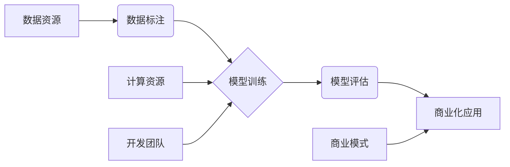

> AI大模型，创业，资源优势，模型训练，数据标注，开源社区，云计算，商业化

## 1. 背景介绍

近年来，人工智能（AI）技术取得了飞速发展，特别是大模型的涌现，为各行各业带来了前所未有的机遇。大模型是指参数规模庞大、训练数据海量的人工智能模型，具备强大的泛化能力和学习能力，能够在自然语言处理、计算机视觉、语音识别等领域取得突破性进展。

然而，大模型的开发和应用也面临着诸多挑战，其中资源优势尤为关键。训练一个大型的AI模型需要大量的计算资源、数据标注资源和开发人员，这些资源对于创业公司来说往往是难以负担的。

## 2. 核心概念与联系

### 2.1  AI大模型

AI大模型是指参数规模庞大、训练数据海量的人工智能模型，其核心特点是：

* **参数规模庞大:** 大模型通常拥有数十亿甚至数千亿个参数，这使得它们能够学习到更复杂的模式和关系。
* **训练数据海量:** 大模型的训练需要海量的数据，才能保证其学习到的知识和能力足够丰富。
* **泛化能力强:** 由于参数规模庞大，训练数据海量，大模型能够更好地泛化到新的数据和任务上。

### 2.2  资源优势

资源优势是指创业公司在开发和应用AI大模型过程中拥有的独特资源，这些资源可以帮助创业公司克服资源不足的挑战，并获得竞争优势。常见的资源优势包括：

* **数据资源:** 拥有海量、高质量的数据是训练大模型的基础。
* **计算资源:** 训练大模型需要大量的计算资源，云计算平台可以提供灵活、可扩展的计算资源。
* **开发团队:** 拥有经验丰富的AI开发团队是开发和应用大模型的关键。
* **商业模式:** 拥有独特的商业模式可以帮助创业公司将AI大模型转化为商业价值。

### 2.3  资源整合与协同

创业公司需要将自身拥有的资源优势进行整合和协同，才能有效地开发和应用AI大模型。



## 3. 核心算法原理 & 具体操作步骤

### 3.1  算法原理概述

大模型的训练主要基于深度学习算法，其中Transformer模型是目前最流行的架构之一。Transformer模型利用注意力机制，能够捕捉文本序列中长距离依赖关系，从而实现更准确的理解和生成。

### 3.2  算法步骤详解

1. **数据预处理:** 将原始数据进行清洗、格式化和编码，使其能够被模型理解。
2. **模型构建:** 根据Transformer模型架构，搭建模型结构，并设置模型参数。
3. **模型训练:** 使用训练数据，通过反向传播算法，调整模型参数，使模型的预测结果与真实值尽可能接近。
4. **模型评估:** 使用测试数据，评估模型的性能，例如准确率、召回率等。
5. **模型调优:** 根据评估结果，调整模型参数和训练策略，进一步提高模型性能。

### 3.3  算法优缺点

**优点:**

* 强大的泛化能力
* 能够捕捉长距离依赖关系
* 在自然语言处理等领域取得突破性进展

**缺点:**

* 训练成本高
* 训练时间长
* 参数量大，需要大量的存储空间

### 3.4  算法应用领域

* 自然语言处理：文本分类、情感分析、机器翻译、对话系统等
* 计算机视觉：图像识别、目标检测、图像分割等
* 语音识别：语音转文本、语音助手等
* 其他领域：药物研发、金融分析、推荐系统等

## 4. 数学模型和公式 & 详细讲解 & 举例说明

### 4.1  数学模型构建

Transformer模型的核心是注意力机制，其数学模型可以表示为：

$$
Attention(Q, K, V) = softmax(\frac{QK^T}{\sqrt{d_k}})V
$$

其中：

* $Q$：查询矩阵
* $K$：键矩阵
* $V$：值矩阵
* $d_k$：键向量的维度
* $softmax$：softmax函数

### 4.2  公式推导过程

注意力机制的目的是计算查询向量与键向量的相关性，并根据相关性对值向量进行加权求和。

* $QK^T$：计算查询向量与键向量的点积，得到一个得分矩阵。
* $\frac{QK^T}{\sqrt{d_k}}$：对得分矩阵进行归一化，使得每个元素的范围在0到1之间。
* $softmax$：对归一化后的得分矩阵进行softmax操作，得到每个键向量的权重。
* $V$：使用权重对值向量进行加权求和，得到最终的输出。

### 4.3  案例分析与讲解

例如，在机器翻译任务中，查询向量可以表示源语言的词语，键向量可以表示目标语言的词语，值向量可以表示目标语言的词语嵌入。通过注意力机制，模型可以学习到源语言词语与目标语言词语之间的关系，从而实现更准确的翻译。

## 5. 项目实践：代码实例和详细解释说明

### 5.1  开发环境搭建

* Python 3.7+
* PyTorch 1.7+
* CUDA 10.2+
* GPU

### 5.2  源代码详细实现

```python
import torch
import torch.nn as nn

class Transformer(nn.Module):
    def __init__(self, vocab_size, embedding_dim, num_heads, num_layers):
        super(Transformer, self).__init__()
        self.embedding = nn.Embedding(vocab_size, embedding_dim)
        self.transformer_layers = nn.ModuleList([
            nn.TransformerEncoderLayer(embedding_dim, num_heads)
            for _ in range(num_layers)
        ])
        self.linear = nn.Linear(embedding_dim, vocab_size)

    def forward(self, x):
        x = self.embedding(x)
        for layer in self.transformer_layers:
            x = layer(x)
        x = self.linear(x)
        return x
```

### 5.3  代码解读与分析

* `__init__` 方法：初始化模型参数，包括词嵌入层、Transformer编码器层和线性输出层。
* `forward` 方法：定义模型的正向传播过程，将输入序列经过词嵌入层、Transformer编码器层和线性输出层，最终得到输出序列。

### 5.4  运行结果展示

训练完成后，可以使用测试数据评估模型的性能，例如计算准确率、困惑度等指标。

## 6. 实际应用场景

### 6.1  自然语言处理

* **机器翻译:** 将一种语言的文本翻译成另一种语言。
* **文本摘要:** 从长文本中提取关键信息，生成简短的摘要。
* **情感分析:** 分析文本中的情感倾向，判断文本是正面、负面还是中性。
* **对话系统:** 开发能够与人类进行自然对话的聊天机器人。

### 6.2  计算机视觉

* **图像识别:** 将图像分类到不同的类别。
* **目标检测:** 在图像中识别和定位目标物体。
* **图像分割:** 将图像分割成不同的区域。

### 6.3  语音识别

* **语音转文本:** 将语音信号转换为文本。
* **语音助手:** 开发能够理解和响应语音指令的语音助手。

### 6.4  未来应用展望

* **个性化推荐:** 根据用户的兴趣和行为，推荐个性化的商品、服务和内容。
* **医疗诊断:** 利用大模型分析医学影像和病历，辅助医生进行诊断。
* **自动驾驶:** 利用大模型处理传感器数据，帮助车辆进行自动驾驶。

## 7. 工具和资源推荐

### 7.1  学习资源推荐

* **书籍:**
    * 《深度学习》
    * 《自然语言处理》
    * 《Transformer模型》
* **在线课程:**
    * Coursera
    * edX
    * Udacity

### 7.2  开发工具推荐

* **框架:**
    * PyTorch
    * TensorFlow
* **库:**
    * HuggingFace Transformers
    * OpenAI GPT-3 API

### 7.3  相关论文推荐

* 《Attention Is All You Need》
* 《BERT: Pre-training of Deep Bidirectional Transformers for Language Understanding》
* 《GPT-3: Language Models are Few-Shot Learners》

## 8. 总结：未来发展趋势与挑战

### 8.1  研究成果总结

近年来，AI大模型取得了显著进展，在多个领域展现出强大的应用潜力。

### 8.2  未来发展趋势

* **模型规模继续扩大:** 随着计算资源的不断发展，模型规模将继续扩大，模型能力将进一步提升。
* **多模态学习:** 将文本、图像、音频等多种模态数据融合在一起，训练更强大的多模态模型。
* **可解释性增强:** 研究如何提高AI模型的可解释性，使其决策过程更加透明和可理解。

### 8.3  面临的挑战

* **训练成本高:** 训练大型AI模型需要大量的计算资源和时间，成本很高。
* **数据安全和隐私:** AI模型的训练需要海量数据，如何保证数据安全和隐私是一个重要挑战。
* **伦理问题:** AI模型的应用可能带来一些伦理问题，例如算法偏见、就业影响等，需要引起重视和解决。

### 8.4  研究展望

未来，AI大模型的研究将继续深入，在更多领域发挥重要作用。需要加强基础理论研究，探索更有效的训练方法和算法，并关注AI模型的伦理和社会影响。

## 9. 附录：常见问题与解答

### 9.1  Q: 如何选择合适的AI大模型？

**A:** 选择合适的AI大模型需要根据具体的应用场景和需求进行考虑，例如模型规模、参数量、训练数据、性能指标等。

### 9.2  Q: 如何降低AI大模型的训练成本？

**A:** 可以采用一些方法降低AI大模型的训练成本，例如使用云计算平台、模型压缩、知识蒸馏等。

### 9.3  Q: 如何保证AI大模型的公平性和公正性？

**A:** 需要关注AI模型的训练数据是否具有偏见，并采取措施消除偏见，确保模型的公平性和公正性。


作者：禅与计算机程序设计艺术 / Zen and the Art of Computer Programming 
<end_of_turn>