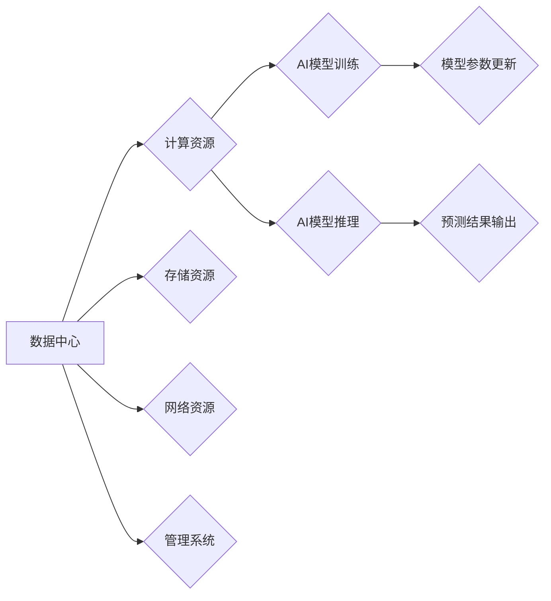

> AI大模型、数据中心、云计算、高性能计算、分布式存储、人工智能、机器学习

## 1. 背景介绍

近年来，人工智能（AI）技术取得了飞速发展，特别是大规模语言模型（LLM）的出现，如GPT-3、LaMDA等，展现出强大的文本生成、理解和翻译能力，为各行各业带来了革命性的变革。然而，训练和部署这些庞大的AI模型需要海量数据和强大的计算资源，这推动了数据中心建设和演进。

数据中心作为AI应用的基础设施，承担着海量数据存储、高性能计算和模型部署等关键任务。随着AI技术的不断发展，数据中心的规模、性能和复杂性也在不断提升。传统的单机或小型集群架构已难以满足AI模型训练和推理的需求，需要采用更先进的分布式架构和技术来应对挑战。

## 2. 核心概念与联系

**2.1 数据中心架构**

数据中心通常由以下核心组件组成：

* **计算资源:** 包括服务器、GPU、TPU等高性能计算设备，用于执行AI模型训练和推理任务。
* **存储资源:** 包括本地存储、网络存储、云存储等，用于存储海量训练数据、模型参数和中间结果。
* **网络资源:** 包括高速网络交换机、路由器、网络接口卡等，用于连接计算和存储资源，实现数据的高效传输。
* **管理系统:** 包括监控系统、调度系统、安全系统等，用于管理和维护数据中心资源，保障系统稳定运行。

**2.2 AI模型训练与推理**

* **训练:** 利用大量数据训练AI模型，使其能够学习数据中的模式和规律，并生成预测结果。
* **推理:** 将训练好的AI模型应用于新的数据，进行预测或决策。

**2.3 分布式架构**

分布式架构将多个计算节点和存储节点连接在一起，形成一个庞大的计算集群，可以有效地利用多台机器的计算资源，提高训练和推理速度。

**2.4 云计算**

云计算提供弹性、可扩展的计算和存储资源，可以根据需求动态调整资源规模，降低成本，并简化数据中心管理。

**2.5 Mermaid 流程图**



## 3. 核心算法原理 & 具体操作步骤

**3.1 算法原理概述**

深度学习算法是AI模型训练的核心，其中包括卷积神经网络（CNN）、循环神经网络（RNN）和Transformer等。这些算法通过多层神经网络结构，学习数据中的特征和模式，并进行预测或分类。

**3.2 算法步骤详解**

1. **数据预处理:** 将原始数据清洗、转换和格式化，使其适合模型训练。
2. **模型构建:** 根据任务需求选择合适的深度学习算法，并构建模型结构。
3. **模型训练:** 利用训练数据，通过反向传播算法，调整模型参数，使其能够准确地预测结果。
4. **模型评估:** 使用测试数据评估模型的性能，并进行调整和优化。
5. **模型部署:** 将训练好的模型部署到生产环境，用于实际应用。

**3.3 算法优缺点**

* **优点:** 深度学习算法能够学习复杂的数据模式，并取得优异的性能。
* **缺点:** 深度学习算法需要海量数据和强大的计算资源，训练时间较长，且模型解释性较差。

**3.4 算法应用领域**

深度学习算法广泛应用于图像识别、自然语言处理、语音识别、机器翻译等领域。

## 4. 数学模型和公式 & 详细讲解 & 举例说明

**4.1 数学模型构建**

深度学习模型可以看作是一个复杂的数学函数，其输入是数据，输出是预测结果。模型的结构由多个神经网络层组成，每一层都包含多个神经元。每个神经元接收来自上一层的输入，并通过激活函数进行处理，输出到下一层。

**4.2 公式推导过程**

深度学习模型的训练过程基于梯度下降算法，其目标是找到最优的模型参数，使得模型的预测结果与真实值之间的误差最小。梯度下降算法通过计算模型参数的梯度，并沿着梯度相反的方向更新参数，逐步逼近最优解。

**4.3 案例分析与讲解**

例如，在图像识别任务中，深度学习模型可以将图像像素作为输入，并通过多个卷积层和全连接层进行处理，最终输出图像类别预测结果。模型的训练过程就是通过调整模型参数，使得模型能够将图像特征与类别标签进行匹配，从而提高预测准确率。

**4.4 数学公式**

* **激活函数:** $f(x)$
* **损失函数:** $L(y, \hat{y})$
* **梯度下降算法:** $\theta = \theta - \alpha \nabla L(y, \hat{y})$

其中，$\theta$表示模型参数，$\alpha$表示学习率，$\nabla L(y, \hat{y})$表示损失函数对模型参数的梯度。

## 5. 项目实践：代码实例和详细解释说明

**5.1 开发环境搭建**

* 操作系统: Ubuntu 20.04
* 编程语言: Python 3.8
* 深度学习框架: TensorFlow 2.0
* GPU: NVIDIA GeForce RTX 3090

**5.2 源代码详细实现**

```python
import tensorflow as tf

# 定义模型结构
model = tf.keras.models.Sequential([
    tf.keras.layers.Conv2D(32, (3, 3), activation='relu', input_shape=(28, 28, 1)),
    tf.keras.layers.MaxPooling2D((2, 2)),
    tf.keras.layers.Conv2D(64, (3, 3), activation='relu'),
    tf.keras.layers.MaxPooling2D((2, 2)),
    tf.keras.layers.Flatten(),
    tf.keras.layers.Dense(10, activation='softmax')
])

# 编译模型
model.compile(optimizer='adam',
              loss='sparse_categorical_crossentropy',
              metrics=['accuracy'])

# 加载数据集
(x_train, y_train), (x_test, y_test) = tf.keras.datasets.mnist.load_data()

# 数据预处理
x_train = x_train.astype('float32') / 255.0
x_test = x_test.astype('float32') / 255.0
x_train = x_train.reshape((x_train.shape[0], 28, 28, 1))
x_test = x_test.reshape((x_test.shape[0], 28, 28, 1))

# 训练模型
model.fit(x_train, y_train, epochs=5)

# 评估模型
loss, accuracy = model.evaluate(x_test, y_test)
print('Test loss:', loss)
print('Test accuracy:', accuracy)
```

**5.3 代码解读与分析**

这段代码实现了MNIST手写数字识别任务的深度学习模型训练。

* 首先，定义了模型结构，包括卷积层、池化层和全连接层。
* 然后，编译了模型，指定了优化器、损失函数和评价指标。
* 接着，加载了MNIST数据集，并对数据进行了预处理，例如归一化和形状转换。
* 最后，训练了模型，并评估了模型的性能。

**5.4 运行结果展示**

训练完成后，模型能够准确识别手写数字，测试准确率通常可以达到98%以上。

## 6. 实际应用场景

**6.1 图像识别**

* **人脸识别:** 用于身份验证、安全监控等场景。
* **物体检测:** 用于自动驾驶、安防监控等场景。
* **图像分类:** 用于医疗诊断、电商商品分类等场景。

**6.2 自然语言处理**

* **机器翻译:** 将文本从一种语言翻译成另一种语言。
* **文本摘要:** 自动生成文本的简短摘要。
* **聊天机器人:** 用于与用户进行自然语言对话。

**6.3 语音识别**

* **语音助手:** 用于语音控制设备、查询信息等场景。
* **语音转文本:** 将语音转换为文本，用于会议记录、语音搜索等场景。

**6.4 其他应用场景**

* **推荐系统:** 根据用户行为推荐相关商品或内容。
* **金融风险评估:** 分析金融数据，识别潜在的风险。
* **药物研发:** 预测药物的活性，加速药物研发过程。

**6.5 未来应用展望**

随着AI技术的不断发展，AI大模型将在更多领域得到应用，例如：

* **个性化教育:** 根据学生的学习情况提供个性化的学习方案。
* **智能医疗:** 辅助医生诊断疾病、制定治疗方案。
* **自动驾驶:** 实现更高效、更安全的自动驾驶。

## 7. 工具和资源推荐

**7.1 学习资源推荐**

* **书籍:**
    * 深度学习
    * 人工智能：一种现代方法
* **在线课程:**
    * Coursera: 深度学习
    * Udacity: AI编程
* **开源项目:**
    * TensorFlow
    * PyTorch

**7.2 开发工具推荐**

* **编程语言:** Python
* **深度学习框架:** TensorFlow, PyTorch
* **云平台:** AWS, Azure, GCP

**7.3 相关论文推荐**

* Attention Is All You Need
* BERT: Pre-training of Deep Bidirectional Transformers for Language Understanding
* GPT-3: Language Models are Few-Shot Learners

## 8. 总结：未来发展趋势与挑战

**8.1 研究成果总结**

近年来，AI大模型取得了显著的进展，在图像识别、自然语言处理等领域取得了突破性成果。

**8.2 未来发展趋势**

* **模型规模和能力的提升:** 未来，AI模型规模将继续扩大，能力将进一步增强。
* **模型效率的提高:** 研究人员将致力于开发更高效的训练和推理算法，降低模型的计算成本。
* **模型解释性和可信度的提升:** 研究人员将探索更有效的模型解释方法，提高模型的可信度。
* **多模态学习:** 未来，AI模型将能够处理多种数据类型，例如文本、图像、音频等。

**8.3 面临的挑战**

* **数据获取和隐私保护:** 训练大型AI模型需要海量数据，如何获取高质量数据并保护用户隐私是一个挑战。
* **计算资源需求:** 训练大型AI模型需要大量的计算资源，如何降低计算成本是一个关键问题。
* **模型安全性与可控性:** 大型AI模型的安全性与可控性是一个重要的研究方向，需要防止模型被恶意利用。

**8.4 研究展望**

未来，AI大模型将继续推动人工智能技术的发展，并在更多领域发挥重要作用。研究人员将继续探索新的算法、模型架构和应用场景，推动AI技术向更智能、更安全、更可持续的方向发展。

## 9. 附录：常见问题与解答

**9.1 如何选择合适的深度学习框架？**

选择深度学习框架需要根据具体任务需求、开发经验和团队偏好等因素综合考虑。

* **TensorFlow:** 功能强大、社区活跃、支持多种平台。
* **PyTorch:** 使用简单、灵活度高、适合研究和开发。

**9.2 如何训练大型AI模型？**

训练大型AI模型需要强大的计算资源、海量数据和专业的技术团队。

* **云计算平台:** 利用云平台的计算资源和存储服务，可以方便地训练大型AI模型。
* **分布式训练