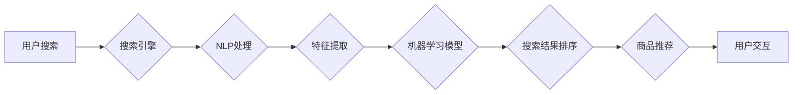

> AI,电商搜索,导购,推荐系统,自然语言处理,深度学习,机器学习,用户体验

## 1. 背景介绍

电子商务的蓬勃发展为消费者提供了便捷的购物体验，但也带来了信息爆炸和选择困难。传统的电商搜索引擎往往依赖于关键词匹配，难以理解用户真实需求，导致搜索结果不精准，用户体验下降。近年来，人工智能（AI）技术快速发展，为电商搜索导购带来了新的机遇。

AI技术能够通过学习用户行为、商品信息和市场趋势，提供更精准、个性化的搜索和推荐服务，提升用户购物体验，促进电商平台的商业发展。

## 2. 核心概念与联系

**2.1  电商搜索导购体系**

电商搜索导购体系是一个复杂的系统，包含多个环节，包括：

* **用户搜索:** 用户输入关键词或语音进行商品搜索。
* **搜索结果排序:** 根据用户搜索意图和商品信息，对搜索结果进行排序，展示最相关的商品。
* **商品推荐:** 基于用户历史行为、浏览记录和偏好，推荐相关商品。
* **用户交互:** 用户浏览商品详情页、添加购物车、下单等操作。

**2.2  AI技术在电商搜索导购中的应用**

AI技术在电商搜索导购体系中扮演着关键角色，主要应用于以下几个方面：

* **自然语言处理（NLP）:** 理解用户搜索意图，识别关键词、实体、关系等信息。
* **机器学习（ML）:** 建立商品分类、推荐模型，预测用户行为，优化搜索结果排序。
* **深度学习（DL）:** 利用深度神经网络，实现更精准的商品理解、推荐和个性化服务。

**2.3  AI技术架构**



## 3. 核心算法原理 & 具体操作步骤

**3.1  算法原理概述**

电商搜索导购的核心算法主要包括：

* **关键词匹配算法:** 基于关键词的精确匹配、模糊匹配、扩展匹配等方式，找到与用户搜索词相关的商品。
* **商品分类算法:** 利用机器学习算法，对商品进行分类，构建商品知识图谱，提高搜索结果的准确性。
* **推荐算法:** 基于用户行为、商品特征、市场趋势等因素，预测用户潜在需求，推荐相关商品。

**3.2  算法步骤详解**

**3.2.1  关键词匹配算法**

1. **预处理:** 对用户搜索词进行预处理，去除停用词、标点符号等，转化为标准形式。
2. **关键词提取:** 利用NLP算法，提取用户搜索词中的关键词。
3. **匹配:** 将关键词与商品标题、描述等信息进行匹配，找到相关商品。

**3.2.2  商品分类算法**

1. **数据采集:** 收集商品信息，包括商品标题、描述、类别、属性等。
2. **特征提取:** 从商品信息中提取特征，例如商品名称、描述中的关键词、商品类别等。
3. **模型训练:** 利用机器学习算法，训练商品分类模型。
4. **分类预测:** 将新商品信息输入模型，预测其类别。

**3.2.3  推荐算法**

1. **数据收集:** 收集用户行为数据，例如浏览记录、购买记录、评价记录等。
2. **特征工程:** 从用户行为数据中提取特征，例如用户偏好、购买频率、购买金额等。
3. **模型训练:** 利用机器学习算法，训练推荐模型。
4. **推荐预测:** 根据用户的特征和商品信息，预测用户可能感兴趣的商品。

**3.3  算法优缺点**

**3.3.1  关键词匹配算法**

* **优点:** 简单易实现，效率高。
* **缺点:** 难以理解用户复杂搜索意图，结果可能不精准。

**3.3.2  商品分类算法**

* **优点:** 可以提高搜索结果的准确性，帮助用户快速找到所需商品。
* **缺点:** 需要大量的训练数据，模型训练复杂。

**3.3.3  推荐算法**

* **优点:** 可以提供个性化推荐，提升用户购物体验。
* **缺点:** 需要大量的用户行为数据，模型训练复杂，容易出现推荐偏差。

**3.4  算法应用领域**

* **电商搜索:** 提供更精准、个性化的商品搜索结果。
* **商品推荐:** 推荐相关商品，提升用户购物体验。
* **用户画像:** 建立用户画像，了解用户需求和偏好。
* **市场分析:** 分析市场趋势，预测商品需求。

## 4. 数学模型和公式 & 详细讲解 & 举例说明

**4.1  数学模型构建**

电商搜索导购的推荐系统通常采用基于协同过滤的推荐算法，其核心思想是：

* 如果用户A喜欢商品X，那么用户B也可能喜欢商品X，因为用户A和用户B可能具有相似的兴趣。

**4.2  公式推导过程**

协同过滤算法的推荐评分公式如下：

$$
r_{ui} = \mu + b_u + b_i + \sigma \cdot \frac{ \sum_{j \in N(u)} \frac{r_{uj} - \mu - b_u - b_j}{\sigma_j} }{\sum_{j \in N(u)} \frac{1}{\sigma_j^2}}
$$

其中：

* $r_{ui}$: 用户u对商品i的评分
* $\mu$: 全局平均评分
* $b_u$: 用户u的偏置
* $b_i$: 商品i的偏置
* $\sigma$: 评分标准差
* $N(u)$: 用户u评分过的商品集合
* $r_{uj}$: 用户u对商品j的评分
* $\sigma_j$: 商品j的评分标准差

**4.3  案例分析与讲解**

假设用户A和用户B都购买了商品X和商品Y，并且对商品X的评分都较高。根据协同过滤算法，我们可以推断出：

* 用户A和用户B可能具有相似的兴趣。
* 用户A和用户B都可能喜欢商品Z，因为商品Z与商品X和商品Y具有相似特征。

## 5. 项目实践：代码实例和详细解释说明

**5.1  开发环境搭建**

* 操作系统: Ubuntu 20.04
* Python 版本: 3.8
* 必要的库: numpy, pandas, scikit-learn, tensorflow

**5.2  源代码详细实现**

```python
# 导入必要的库
import numpy as np
from sklearn.metrics.pairwise import cosine_similarity

# 定义用户-商品评分矩阵
ratings = np.array([
    [5, 4, 3, 2, 1],
    [4, 5, 2, 1, 3],
    [3, 2, 5, 4, 1],
    [2, 1, 4, 5, 3],
    [1, 3, 1, 3, 5]
])

# 计算用户-用户相似度矩阵
user_similarity = cosine_similarity(ratings)

# 获取用户1的相似用户
similar_users = np.argsort(user_similarity[0])[::-1][1:]

# 获取用户1相似用户对商品2的评分
similar_users_ratings = ratings[similar_users, 1]

# 计算用户1对商品2的预测评分
predicted_rating = np.mean(similar_users_ratings)

# 打印预测评分
print(f"用户1对商品2的预测评分: {predicted_rating}")
```

**5.3  代码解读与分析**

* 代码首先定义了一个用户-商品评分矩阵，其中每个元素代表用户对商品的评分。
* 然后，使用cosine_similarity函数计算用户之间的相似度矩阵。
* 通过获取用户1的相似用户，并计算其对商品2的评分，可以预测用户1对商品2的评分。

**5.4  运行结果展示**

运行代码后，会输出用户1对商品2的预测评分。

## 6. 实际应用场景

**6.1  电商搜索推荐**

* 基于用户搜索历史、浏览记录和购买行为，推荐相关商品。
* 根据用户偏好和商品特征，个性化推荐商品。

**6.2  商品分类和标签化**

* 利用机器学习算法，对商品进行分类和标签化，提高搜索结果的准确性。
* 自动生成商品描述和关键词，提升商品曝光率。

**6.3  用户画像和行为分析**

* 建立用户画像，了解用户需求和偏好。
* 分析用户行为数据，预测用户未来行为。

**6.4  未来应用展望**

* **多模态搜索:** 结合文本、图像、语音等多模态信息，实现更精准的商品搜索。
* **个性化推荐:** 基于用户行为、兴趣、偏好等多方面因素，提供更个性化的商品推荐。
* **智能客服:** 利用AI技术，构建智能客服系统，为用户提供更便捷的购物体验。

## 7. 工具和资源推荐

**7.1  学习资源推荐**

* **书籍:**
    * 《深度学习》
    * 《机器学习实战》
    * 《自然语言处理入门》
* **在线课程:**
    * Coursera: 深度学习、机器学习
    * edX: 自然语言处理、数据科学
* **博客和网站:**
    * Towards Data Science
    * Machine Learning Mastery
    * Analytics Vidhya

**7.2  开发工具推荐**

* **Python:** 广泛应用于机器学习和深度学习领域。
* **TensorFlow:** 开源深度学习框架。
* **PyTorch:** 开源深度学习框架。
* **Scikit-learn:** 机器学习库。

**7.3  相关论文推荐**

* **BERT: Pre-training of Deep Bidirectional Transformers for Language Understanding**
* **Attention Is All You Need**
* **Recurrent Neural Networks for Sequence Learning**

## 8. 总结：未来发展趋势与挑战

**8.1  研究成果总结**

近年来，AI技术在电商搜索导购领域取得了显著进展，例如：

* 搜索结果的准确性大幅提升。
* 推荐系统的个性化程度不断提高。
* 用户购物体验得到显著提升。

**8.2  未来发展趋势**

* **多模态搜索:** 结合文本、图像、语音等多模态信息，实现更精准的商品搜索。
* **个性化推荐:** 基于用户行为、兴趣、偏好等多方面因素，提供更个性化的商品推荐。
* **智能客服:** 利用AI技术，构建智能客服系统，为用户提供更便捷的购物体验。

**8.3  面临的挑战**

* **数据质量:** AI算法依赖于高质量的数据，数据质量问题会影响算法性能。
* **算法解释性:** 许多AI算法是黑箱模型，难以解释其决策过程，这可能会导致用户信任问题。
* **伦理问题:** AI技术在电商搜索导购中的应用可能引发一些伦理问题，例如数据隐私、算法偏见等。

**8.4  研究展望**

未来，需要进一步研究以下问题：

* 如何提高AI算法的解释性，增强用户信任。
* 如何解决AI算法中的偏见问题，确保公平公正的推荐结果。
* 如何更好地利用多模态信息，实现更精准的商品搜索和推荐。


## 9. 附录：常见问题与解答

**9.1  问题:** 如何提高AI算法的准确性？

**9.2  解答:** 提高AI算法的准确性需要从以下几个方面入手：

* 提高数据质量：使用高质量、丰富的数据进行训练。
* 优化算法模型：选择合适的算法模型，并进行参数调优。
* 结合多种算法：将