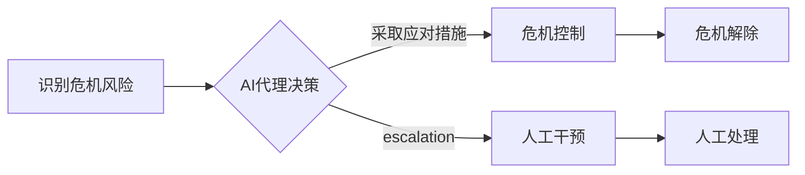

> AI代理，工作流，公关危机，人工智能，机器学习，自然语言处理，风险管理

## 1. 背景介绍

在当今信息爆炸的时代，企业面临着前所未有的公关危机风险。传统公关危机管理模式往往反应迟钝，难以有效应对突发事件，甚至可能导致危机扩大化。而人工智能（AI）技术的快速发展为公关危机管理提供了新的思路和解决方案。

AI代理工作流（AI Agent WorkFlow）是一种基于人工智能的自动化工作流程管理系统，它能够通过学习和分析海量数据，识别潜在的危机风险，并自动执行预设的应对措施，从而有效降低企业面临的危机风险。

## 2. 核心概念与联系

### 2.1 AI代理

AI代理是一种能够自主执行任务的智能软件实体。它具备以下特征：

* **自主性:** AI代理能够根据预设的目标和规则，独立完成任务，无需人工干预。
* **智能性:** AI代理能够通过机器学习和自然语言处理等技术，理解和分析环境信息，并做出合理的决策。
* **交互性:** AI代理能够与用户和系统进行交互，接收指令并反馈结果。

### 2.2 工作流

工作流是一种描述业务流程的自动化模型，它将一系列任务和活动连接起来，形成一个完整的流程。工作流能够提高工作效率，降低错误率，并增强流程的可视性和可控性。

### 2.3 AI代理工作流

AI代理工作流将AI代理与工作流技术相结合，构建了一种智能化的工作流程管理系统。它能够通过AI代理的智能决策和执行能力，自动完成工作流程中的各种任务，并根据实际情况动态调整流程，从而实现更灵活、更高效的流程管理。

**Mermaid 流程图**



## 3. 核心算法原理 & 具体操作步骤

### 3.1 算法原理概述

AI代理工作流的核心算法原理是基于机器学习和自然语言处理技术的智能决策和执行。

* **机器学习:** AI代理通过学习历史数据，识别危机风险的特征和模式，并预测未来的危机事件。
* **自然语言处理:** AI代理能够理解和分析文本信息，例如新闻报道、社交媒体评论等，从中提取关键信息，判断事件的严重程度和潜在影响。

### 3.2 算法步骤详解

1. **数据收集:** 收集各种类型的数据，例如新闻报道、社交媒体评论、企业内部信息等，构建危机风险的知识库。
2. **数据预处理:** 对收集到的数据进行清洗、格式化和转换，使其能够被AI模型理解和处理。
3. **模型训练:** 使用机器学习算法训练AI模型，使其能够识别危机风险的特征和模式。
4. **风险评估:** 将实时数据输入到训练好的AI模型中，评估事件的风险等级和潜在影响。
5. **决策执行:** 根据风险评估结果，AI代理自动执行预设的应对措施，例如发布声明、进行危机公关、调整业务策略等。
6. **结果监控:** 持续监控事件的发展趋势，并根据实际情况调整应对措施。

### 3.3 算法优缺点

**优点:**

* **自动化:** AI代理能够自动识别和应对危机风险，提高效率和响应速度。
* **智能化:** AI代理能够根据实际情况动态调整应对措施，实现更精准的危机管理。
* **数据驱动:** AI代理的工作流程基于数据分析，能够提供更客观和科学的决策依据。

**缺点:**

* **数据依赖:** AI代理的决策能力依赖于数据的质量和数量，如果数据不足或不准确，可能会导致错误决策。
* **算法局限性:** 当前的AI算法仍然存在局限性，无法完全替代人工判断和决策。
* **伦理风险:** AI代理的决策可能会引发伦理争议，例如算法偏见、数据隐私等问题。

### 3.4 算法应用领域

AI代理工作流在公关危机管理之外，还可应用于其他领域，例如：

* **风险管理:** 识别和应对各种风险事件，例如金融风险、安全风险、合规风险等。
* **客户服务:** 自动处理客户咨询和投诉，提高客户满意度。
* **业务流程优化:** 自动化业务流程，提高效率和降低成本。

## 4. 数学模型和公式 & 详细讲解 & 举例说明

### 4.1 数学模型构建

AI代理工作流的数学模型可以基于概率论和统计学原理构建，例如贝叶斯网络、马尔可夫决策过程等。

**贝叶斯网络:**

贝叶斯网络是一种概率图模型，用于表示随机变量之间的依赖关系。在危机管理场景中，可以构建一个贝叶斯网络，其中节点代表不同的事件或变量，例如“新闻报道”、“社交媒体评论”、“危机等级”等，边代表变量之间的依赖关系。通过学习历史数据，可以估计每个节点的概率分布和边上的条件概率，从而预测未来事件发生的概率。

**马尔可夫决策过程:**

马尔可夫决策过程是一种强化学习模型，用于描述一个智能体在环境中采取行动并获得奖励的过程。在危机管理场景中，可以将AI代理视为智能体，环境视为危机事件，行动视为应对措施，奖励视为危机控制效果。通过训练马尔可夫决策过程模型，可以学习到最佳的应对策略，以最大化危机控制效果。

### 4.2 公式推导过程

**贝叶斯公式:**

$$P(A|B) = \frac{P(B|A)P(A)}{P(B)}$$

其中：

* $P(A|B)$ 是事件A在事件B发生条件下的概率。
* $P(B|A)$ 是事件B在事件A发生条件下的概率。
* $P(A)$ 是事件A发生的概率。
* $P(B)$ 是事件B发生的概率。

**马尔可夫决策过程的Bellman方程:**

$$V(s) = \max_a \left[ R(s,a) + \gamma \sum_{s'} P(s'|s,a) V(s') \right]$$

其中：

* $V(s)$ 是状态s的价值函数。
* $R(s,a)$ 是在状态s采取行动a获得的奖励。
* $\gamma$ 是折扣因子，表示未来奖励的权重。
* $P(s'|s,a)$ 是从状态s采取行动a转移到状态$s'$的概率。

### 4.3 案例分析与讲解

**案例:** 假设一家公司面临网络攻击危机，AI代理工作流可以根据以下步骤进行处理：

1. **识别危机风险:** AI代理通过监控网络流量、安全日志等数据，识别网络攻击事件。
2. **风险评估:** AI代理根据攻击的类型、规模和目标，评估危机等级和潜在影响。
3. **决策执行:** AI代理自动执行预设的应对措施，例如隔离受影响系统、封堵漏洞、联系安全专家等。
4. **结果监控:** AI代理持续监控网络安全状况，并根据实际情况调整应对措施。

## 5. 项目实践：代码实例和详细解释说明

### 5.1 开发环境搭建

* 操作系统: Ubuntu 20.04
* Python 版本: 3.8
* 必要的库: TensorFlow, PyTorch, NLTK, scikit-learn

### 5.2 源代码详细实现

```python
# 识别危机风险的函数
def identify_crisis(text):
    # 使用自然语言处理技术分析文本，识别危机风险关键词
    # ...

# 评估危机风险的函数
def assess_crisis_risk(crisis_keywords):
    # 根据危机关键词的频率和重要性，评估危机风险等级
    # ...

# 执行应对措施的函数
def execute_response(crisis_level):
    # 根据危机等级，执行预设的应对措施
    # ...

# 主程序
if __name__ == "__main__":
    # 获取文本数据
    text = get_text_data()

    # 识别危机风险
    crisis_keywords = identify_crisis(text)

    # 评估危机风险
    crisis_level = assess_crisis_risk(crisis_keywords)

    # 执行应对措施
    execute_response(crisis_level)
```

### 5.3 代码解读与分析

* `identify_crisis()` 函数使用自然语言处理技术分析文本，识别危机风险关键词。
* `assess_crisis_risk()` 函数根据危机关键词的频率和重要性，评估危机风险等级。
* `execute_response()` 函数根据危机等级，执行预设的应对措施。

### 5.4 运行结果展示

运行代码后，AI代理工作流将自动识别危机风险、评估危机等级和执行应对措施，并输出相应的日志和报告。

## 6. 实际应用场景

AI代理工作流在公关危机管理中的应用场景非常广泛，例如：

* **网络安全危机:** AI代理可以监控网络流量和安全日志，识别网络攻击事件，并自动执行防御措施。
* **产品安全危机:** AI代理可以监控产品使用反馈和社交媒体评论，识别产品安全问题，并及时发布召回公告。
* **品牌危机:** AI代理可以监控品牌相关信息，识别负面舆情，并自动执行危机公关措施。

### 6.4 未来应用展望

随着人工智能技术的不断发展，AI代理工作流在公关危机管理中的应用将更加广泛和深入。未来，AI代理工作流可能具备以下能力：

* **更精准的风险预测:** 通过学习更丰富的数据和更复杂的模型，AI代理能够更精准地预测危机风险。
* **更智能的应对策略:** AI代理能够根据实际情况动态调整应对策略，实现更有效的危机控制。
* **更全面的危机管理:** AI代理可以整合各种数据和工具，实现更全面的危机管理，例如危机预警、危机沟通、危机恢复等。

## 7. 工具和资源推荐

### 7.1 学习资源推荐

* **书籍:**
    * 《深度学习》
    * 《机器学习》
    * 《自然语言处理》
* **在线课程:**
    * Coursera
    * edX
    * Udacity

### 7.2 开发工具推荐

* **Python:** 
    * TensorFlow
    * PyTorch
    * scikit-learn
* **自然语言处理工具:**
    * NLTK
    * spaCy
    * Gensim

### 7.3 相关论文推荐

* **AI代理:**
    * Multi-Agent Reinforcement Learning for Crisis Management
    * A Survey of AI Agents for Disaster Response
* **工作流管理:**
    * Workflow Management Systems: Concepts, Architectures, and Trends
    * A Survey of Workflow Management Systems

## 8. 总结：未来发展趋势与挑战

### 8.1 研究成果总结

AI代理工作流在公关危机管理领域取得了显著的成果，能够有效提高危机应对效率和准确性。

### 8.2 未来发展趋势

未来，AI代理工作流将朝着以下方向发展：

* **更智能化:** AI代理将更加智能化，能够自主学习和决策，实现更精准的危机预测和应对。
* **更协同化:** AI代理将与人类专家更加协同工作，发挥各自优势，实现更有效的危机管理。
* **更个性化:** AI代理将根据不同企业的特点和需求，提供个性化的危机管理解决方案。

### 8.3 面临的挑战

AI代理工作流的发展也面临着一些挑战：

* **数据质量:** AI代理的决策能力依赖于数据的质量和数量，如何获取高质量的数据是关键问题。
* **算法偏见:** AI算法可能存在偏见，导致决策不公平或不准确。
* **伦理风险:** AI代理的决策可能会引发