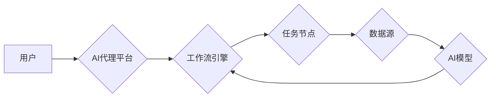

> 智能代理，航空领域，工作流，AI，机器学习，自然语言处理，流程自动化

## 1. 背景介绍

航空业是一个高度复杂、效率至关重要的行业。从航班调度和旅客服务到货物运输和空中交通管理，航空公司和相关机构面临着各种挑战，例如：

* **日益增长的旅客流量和货物运输需求:**  航空公司需要高效地管理航班、资源和人员，以满足不断增长的需求。
* **复杂的运营流程:** 航空运营涉及多个环节和参与方，流程复杂且相互关联，容易出现问题。
* **不断变化的市场环境:**  航空公司需要快速响应市场变化，调整运营策略和服务模式。
* **数据爆炸:** 航空公司收集了大量的数据，例如航班信息、旅客数据、天气预报等，如何有效利用这些数据提高运营效率是一个关键问题。

传统的人工方式难以有效应对这些挑战。人工智能（AI）技术，特别是智能代理技术，为航空业的数字化转型提供了新的机遇。

## 2. 核心概念与联系

**2.1 智能代理 (AI Agent)**

智能代理是一种能够感知环境、做出决策并执行行动的软件系统。它可以自主学习、适应环境变化，并实现预设的目标。

**2.2 工作流 (Workflow)**

工作流是指一系列相互关联的活动或任务，按照特定的顺序执行，以实现某个目标。

**2.3 AI 代理工作流 (AI Agent Workflow)**

AI 代理工作流是指利用智能代理技术自动执行工作流中的任务。AI 代理可以根据预设规则或机器学习模型，自动识别任务、获取所需信息、执行操作并反馈结果，从而实现工作流程的自动化和智能化。

**2.4  航空领域应用场景**

在航空领域，AI 代理工作流可以应用于以下场景：

* **航班调度:**  AI 代理可以根据实时航班信息、天气预报、机场容量等因素，自动优化航班调度方案，提高航班准点率和资源利用率。
* **旅客服务:**  AI 代理可以提供个性化的旅客服务，例如预订机票、查询航班信息、办理值机手续等，提高旅客体验。
* **货物运输:**  AI 代理可以自动管理货物运输流程，例如货物装卸、运输路线规划、货物跟踪等，提高运输效率和安全性。
* **空中交通管理:**  AI 代理可以辅助空中交通管理人员，例如预警潜在冲突、优化飞行路径、提高空中交通效率等。

**2.5  架构图**



## 3. 核心算法原理 & 具体操作步骤

### 3.1  算法原理概述

AI 代理工作流的核心算法原理是基于**状态机**和**决策树**的组合。

* **状态机:**  描述AI代理在不同状态下执行的任务和动作。
* **决策树:**  根据输入数据，引导AI代理选择最佳的执行路径。

### 3.2  算法步骤详解

1. **环境感知:** AI 代理通过传感器或数据接口感知环境信息，例如航班信息、旅客需求、天气预报等。
2. **状态识别:**  AI 代理根据环境信息识别当前状态，并根据状态机规则确定可执行的任务。
3. **决策执行:**  AI 代理根据决策树模型，选择最佳的执行路径，并执行相应的任务。
4. **结果反馈:**  AI 代理执行任务后，反馈结果给工作流引擎，并根据结果更新状态。
5. **循环执行:**  AI 代理不断循环执行上述步骤，直到完成预设目标。

### 3.3  算法优缺点

**优点:**

* **自动化:**  可以自动执行重复性任务，提高效率。
* **智能化:**  可以根据环境变化和用户需求做出智能决策。
* **可扩展性:**  可以根据需要添加新的任务和功能。

**缺点:**

* **算法复杂性:**  设计和实现复杂的AI代理算法需要专业知识和经验。
* **数据依赖性:**  AI代理的性能依赖于数据的质量和数量。
* **安全风险:**  AI代理的决策可能会受到攻击或误导，需要采取相应的安全措施。

### 3.4  算法应用领域

AI 代理工作流算法广泛应用于以下领域：

* **制造业:**  自动控制生产线、优化生产流程。
* **金融业:**  自动处理交易、评估风险。
* **医疗保健:**  辅助医生诊断疾病、管理患者信息。
* **电商:**  个性化推荐商品、自动处理订单。

## 4. 数学模型和公式 & 详细讲解 & 举例说明

### 4.1  数学模型构建

AI 代理工作流的数学模型可以基于**马尔可夫决策过程 (MDP)**构建。

MDP是一个数学框架，用于描述一个智能体在环境中采取行动并获得回报的过程。

* **状态空间 (S):**  所有可能的系统状态。
* **动作空间 (A):**  智能体可以采取的所有动作。
* **转移概率 (P):**  从一个状态到另一个状态的概率。
* **奖励函数 (R):**  智能体在某个状态采取某个动作获得的奖励。

### 4.2  公式推导过程

目标是找到一个策略 $\pi$，使得智能体在长期的互动中获得最大的总奖励。

可以使用**动态规划**或**强化学习**算法来求解最优策略。

* **动态规划:**  通过递归地计算每个状态的价值函数，找到最优策略。
* **强化学习:**  通过与环境交互，让智能体学习最优策略。

### 4.3  案例分析与讲解

例如，在航班调度场景中，状态空间可以是所有可能的航班状态，动作空间可以是调整航班起降时间、航线等。

奖励函数可以根据航班准点率、资源利用率等指标进行设计。

使用强化学习算法，AI代理可以学习到最优的航班调度策略，提高航班准点率和资源利用率。

## 5. 项目实践：代码实例和详细解释说明

### 5.1  开发环境搭建

* **操作系统:**  Linux/macOS
* **编程语言:**  Python
* **框架:**  TensorFlow/PyTorch
* **工具:**  Git、Docker

### 5.2  源代码详细实现

```python
# 导入必要的库
import tensorflow as tf

# 定义神经网络模型
model = tf.keras.models.Sequential([
    tf.keras.layers.Dense(128, activation='relu', input_shape=(input_dim,)),
    tf.keras.layers.Dense(64, activation='relu'),
    tf.keras.layers.Dense(1, activation='sigmoid')
])

# 编译模型
model.compile(optimizer='adam', loss='binary_crossentropy', metrics=['accuracy'])

# 训练模型
model.fit(X_train, y_train, epochs=10)

# 评估模型
loss, accuracy = model.evaluate(X_test, y_test)
print('Loss:', loss)
print('Accuracy:', accuracy)
```

### 5.3  代码解读与分析

* **模型定义:**  使用TensorFlow框架定义一个简单的多层感知机模型。
* **模型编译:**  使用Adam优化器、二分类交叉熵损失函数和准确率指标编译模型。
* **模型训练:**  使用训练数据训练模型，设置训练轮数为10。
* **模型评估:**  使用测试数据评估模型的性能，输出损失值和准确率。

### 5.4  运行结果展示

训练完成后，可以观察模型的损失值和准确率的变化趋势，并根据实际需求调整模型参数和训练策略。

## 6. 实际应用场景

### 6.1  航班调度优化

AI 代理可以根据实时航班信息、天气预报、机场容量等因素，自动优化航班调度方案，提高航班准点率和资源利用率。

### 6.2  旅客服务自动化

AI 代理可以提供个性化的旅客服务，例如预订机票、查询航班信息、办理值机手续等，提高旅客体验。

### 6.3  货物运输管理

AI 代理可以自动管理货物运输流程，例如货物装卸、运输路线规划、货物跟踪等，提高运输效率和安全性。

### 6.4  未来应用展望

随着人工智能技术的不断发展，AI 代理工作流将在航空领域得到更广泛的应用，例如：

* **空中交通管理:**  辅助空中交通管理人员，优化飞行路径、提高空中交通效率。
* **航空安全:**  识别潜在的安全风险，并采取相应的措施。
* **航空营销:**  根据旅客需求，提供个性化的营销服务。

## 7. 工具和资源推荐

### 7.1  学习资源推荐

* **书籍:**
    * 《Reinforcement Learning: An Introduction》
    * 《Artificial Intelligence: A Modern Approach》
* **在线课程:**
    * Coursera: Reinforcement Learning Specialization
    * Udacity: Artificial Intelligence Nanodegree

### 7.2  开发工具推荐

* **TensorFlow:**  开源机器学习框架
* **PyTorch:**  开源机器学习框架
* **Keras:**  高层机器学习API

### 7.3  相关论文推荐

* **Deep Reinforcement Learning for Autonomous Flight Control**
* **AI-Powered Workflow Automation in Aviation**

## 8. 总结：未来发展趋势与挑战

### 8.1  研究成果总结

AI 代理工作流技术在航空领域具有巨大的应用潜力，可以提高效率、降低成本、提升安全性。

### 8.2  未来发展趋势

* **更智能的AI代理:**  利用更先进的机器学习算法，开发更智能、更适应复杂环境的AI代理。
* **更广泛的应用场景:**  将AI代理工作流应用于更多航空领域的场景，例如空中交通管理、航空安全等。
* **更安全的AI系统:**  研究和开发更安全的AI系统，确保AI代理的可靠性和安全性。

### 8.3  面临的挑战

* **算法复杂性:**  设计和实现复杂的AI代理算法需要专业知识和经验。
* **数据依赖性:**  AI代理的性能依赖于数据的质量和数量。
* **安全风险:**  AI代理的决策可能会受到攻击或误导，需要采取相应的安全措施。

### 8.4  研究展望

未来，我们将继续研究和开发更智能、更安全、更广泛应用的AI代理工作流技术，为航空业的数字化转型提供新的解决方案。

## 9. 附录：常见问题与解答

**Q1: AI代理工作流与传统工作流有什么区别？**

**A1:**  传统工作流是基于规则和流程图的，而AI代理工作流则利用人工智能技术，可以根据环境变化和用户需求做出智能决策。

**Q2: AI代理工作流的安全性如何保证？**

**A2:**  AI代理工作流的安全性需要通过多种措施保证，例如数据加密、身份验证、安全审计等。

**Q3: 如何评估AI代理工作流的性能？**

**A3:**  可以根据具体的应用场景，设计相应的性能指标，例如准确率、效率、成本等。

作者：禅与计算机程序设计艺术 / Zen and the Art of Computer Programming


<end_of_turn>