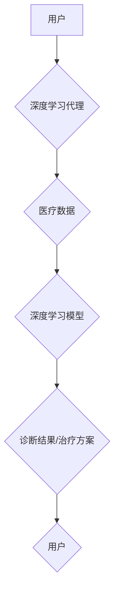

> 深度学习、智能代理、健康医疗、机器学习、算法、应用策略

## 1. 背景介绍

随着人工智能技术的飞速发展，深度学习算法在各个领域取得了显著的成果，尤其是在医疗健康领域，深度学习展现出巨大的潜力，为疾病诊断、治疗方案制定、药物研发等方面提供了新的思路和方法。智能深度学习代理作为一种新型的AI技术，能够自主学习和决策，在医疗健康领域具有广泛的应用前景。

传统的医疗诊断和治疗方案制定往往依赖于医生的经验和判断，存在着主观性、局限性和效率问题。而深度学习算法能够从海量医疗数据中学习模式和规律，提高诊断准确率，并为个性化治疗方案提供支持。智能深度学习代理则可以将深度学习算法与决策机制相结合，实现自动化诊断、治疗方案推荐等功能，提高医疗效率和服务质量。

## 2. 核心概念与联系

**2.1 深度学习**

深度学习是一种机器学习的子领域，它利用多层神经网络来模拟人类大脑的学习过程。深度学习算法能够从复杂的数据中提取特征，并进行高级的模式识别和决策。

**2.2 智能代理**

智能代理是一种能够自主学习、决策和执行任务的软件系统。智能代理通常具有以下特征：

* **自主性:** 智能代理能够根据自身的目标和环境信息自主做出决策。
* **学习能力:** 智能代理能够从经验中学习，不断改进自己的决策策略。
* **适应性:** 智能代理能够适应不断变化的环境，调整自己的行为策略。

**2.3 深度学习代理**

深度学习代理将深度学习算法与智能代理相结合，构建了一种能够自主学习、决策和执行任务的智能系统。深度学习代理能够利用深度学习算法从医疗数据中学习知识，并根据学习到的知识进行诊断、治疗方案推荐等任务。

**2.4  架构图**



## 3. 核心算法原理 & 具体操作步骤

### 3.1  算法原理概述

智能深度学习代理在医疗健康领域应用的核心算法主要包括：

* **卷积神经网络 (CNN):** 用于图像识别和分析，例如医学影像诊断。
* **循环神经网络 (RNN):** 用于处理序列数据，例如患者病历记录分析。
* **强化学习 (RL):** 用于训练智能代理，使其能够自主学习最佳的决策策略。

### 3.2  算法步骤详解

**3.2.1 数据收集和预处理:**

首先，需要收集大量的医疗数据，例如患者病历、影像数据、基因数据等。然后对数据进行预处理，例如清洗、格式化、特征提取等。

**3.2.2 模型训练:**

选择合适的深度学习算法，并根据训练数据进行模型训练。训练过程包括调整模型参数，使模型能够准确地预测目标变量。

**3.2.3 模型评估:**

使用测试数据对模型进行评估，评估模型的准确率、召回率、F1-score等指标。

**3.2.4 模型部署:**

将训练好的模型部署到实际应用环境中，例如医院信息系统、移动医疗平台等。

### 3.3  算法优缺点

**优点:**

* 能够从海量数据中学习复杂模式，提高诊断准确率。
* 能够提供个性化治疗方案，提高治疗效果。
* 能够自动化完成一些医疗任务，提高医疗效率。

**缺点:**

* 需要大量的训练数据，数据质量对模型性能影响较大。
* 模型训练过程复杂，需要专业的技术人员。
* 模型解释性较差，难以理解模型的决策过程。

### 3.4  算法应用领域

* **疾病诊断:** 辅助医生诊断各种疾病，例如癌症、心血管疾病、神经系统疾病等。
* **治疗方案制定:** 根据患者的病情和个人特征，推荐个性化的治疗方案。
* **药物研发:** 预测药物的疗效和安全性，加速药物研发过程。
* **医疗影像分析:** 分析医学影像数据，例如X光片、CT扫描、MRI等，辅助医生诊断和治疗。

## 4. 数学模型和公式 & 详细讲解 & 举例说明

### 4.1  数学模型构建

深度学习模型通常采用多层神经网络结构，每个神经元接收多个输入信号，并通过激活函数进行处理，输出一个信号。神经网络的训练过程就是通过调整神经元的权重和偏置，使模型的输出与实际目标值之间的误差最小化。

**4.1.1  感知机模型:**

感知机模型是最简单的深度学习模型，它只有一个隐层，每个隐层神经元接收多个输入信号，并通过激活函数进行处理，输出一个信号。感知机的输出信号可以表示为：

$$
y = f(w^T x + b)
$$

其中：

* $y$ 是感知机的输出信号
* $x$ 是输入信号向量
* $w$ 是权重向量
* $b$ 是偏置项
* $f$ 是激活函数

**4.1.2  多层感知机模型:**

多层感知机模型是感知机模型的扩展，它有多个隐层，每个隐层神经元接收多个输入信号，并通过激活函数进行处理，输出一个信号。多层感知机的输出信号可以表示为：

$$
y = f_L(f_{L-1}(...f_1(w^T_1 x + b_1)...))
$$

其中：

* $y$ 是多层感知机的输出信号
* $x$ 是输入信号向量
* $w_i$ 是第 $i$ 层的权重向量
* $b_i$ 是第 $i$ 层的偏置项
* $f_i$ 是第 $i$ 层的激活函数

### 4.2  公式推导过程

深度学习模型的训练过程是通过优化模型参数，使模型的输出与实际目标值之间的误差最小化。常用的优化算法包括梯度下降法、动量法、Adam算法等。

**4.2.1  梯度下降法:**

梯度下降法是一种迭代优化算法，它通过计算模型参数的梯度，沿着梯度负方向更新模型参数，直到达到最小值。梯度下降法的更新公式为：

$$
\theta = \theta - \alpha \nabla J(\theta)
$$

其中：

* $\theta$ 是模型参数
* $\alpha$ 是学习率
* $\nabla J(\theta)$ 是损失函数 $J(\theta)$ 的梯度

**4.2.2  动量法:**

动量法是一种改进的梯度下降法，它引入了动量项，可以加速模型的收敛速度。动量法的更新公式为：

$$
v_t = \beta v_{t-1} + \alpha \nabla J(\theta)
$$

$$
\theta = \theta - v_t
$$

其中：

* $v_t$ 是动量项
* $\beta$ 是动量系数

### 4.3  案例分析与讲解

**4.3.1  图像分类:**

使用CNN模型进行图像分类，例如识别医学影像中的肿瘤。训练数据包括大量标注的医学影像数据，模型通过学习图像特征，能够识别出肿瘤的特征，并进行分类。

**4.3.2  自然语言处理:**

使用RNN模型进行自然语言处理，例如分析患者病历记录，识别患者的症状和病情。训练数据包括大量患者病历记录，模型通过学习语言模式，能够理解患者的描述，并提取出关键信息。

## 5. 项目实践：代码实例和详细解释说明

### 5.1  开发环境搭建

* **操作系统:** Ubuntu 18.04
* **编程语言:** Python 3.6
* **深度学习框架:** TensorFlow 2.0
* **其他工具:** Jupyter Notebook, Git

### 5.2  源代码详细实现

```python
import tensorflow as tf

# 定义模型结构
model = tf.keras.models.Sequential([
    tf.keras.layers.Conv2D(32, (3, 3), activation='relu', input_shape=(224, 224, 3)),
    tf.keras.layers.MaxPooling2D((2, 2)),
    tf.keras.layers.Conv2D(64, (3, 3), activation='relu'),
    tf.keras.layers.MaxPooling2D((2, 2)),
    tf.keras.layers.Flatten(),
    tf.keras.layers.Dense(10, activation='softmax')
])

# 编译模型
model.compile(optimizer='adam',
              loss='sparse_categorical_crossentropy',
              metrics=['accuracy'])

# 训练模型
model.fit(x_train, y_train, epochs=10)

# 评估模型
loss, accuracy = model.evaluate(x_test, y_test)
print('Test loss:', loss)
print('Test accuracy:', accuracy)
```

### 5.3  代码解读与分析

* **模型结构:** 代码定义了一个简单的CNN模型，包含两个卷积层、两个最大池化层、一个全连接层和一个输出层。
* **模型编译:** 使用Adam优化器、交叉熵损失函数和准确率作为评估指标编译模型。
* **模型训练:** 使用训练数据训练模型，训练10个 epochs。
* **模型评估:** 使用测试数据评估模型的性能，打印测试损失和准确率。

### 5.4  运行结果展示

训练完成后，可以将模型保存下来，并在实际应用中使用。

## 6. 实际应用场景

### 6.1  疾病诊断

智能深度学习代理可以辅助医生诊断各种疾病，例如癌症、心血管疾病、神经系统疾病等。例如，可以利用深度学习模型分析医学影像数据，识别肿瘤、心血管病变等异常情况。

### 6.2  治疗方案制定

智能深度学习代理可以根据患者的病情和个人特征，推荐个性化的治疗方案。例如，可以利用深度学习模型分析患者的病历记录、基因数据等信息，预测患者对不同治疗方案的反应，并推荐最合适的治疗方案。

### 6.3  药物研发

智能深度学习代理可以加速药物研发过程。例如，可以利用深度学习模型预测药物的疗效和安全性，筛选出潜在的候选药物，缩短药物研发周期。

### 6.4  未来应用展望

随着人工智能技术的不断发展，智能深度学习代理在医疗健康领域的应用前景更加广阔。未来，智能深度学习代理可能在以下方面发挥更大的作用：

* **远程医疗:** 智能深度学习代理可以帮助医生进行远程诊断和治疗，提高医疗服务的覆盖范围。
* **个性化医疗:** 智能深度学习代理可以根据患者的个体差异，提供个性化的医疗服务，提高医疗效果。
* **医疗数据分析:** 智能深度学习代理可以分析海量医疗数据，发现疾病的潜在规律，为疾病预防和控制提供支持。

## 7. 工具和资源推荐

### 7.1  学习资源推荐

* **书籍:**
    * 深度学习
    * 人工智能：一种现代方法
* **在线课程:**
    * Coursera: 深度学习
    * Udacity: 深度学习工程师
* **博客和网站:**
    * TensorFlow 官方博客
    * PyTorch 官方博客
    * 机器学习 Mastery

### 7.2  开发工具推荐

* **深度学习框架:** TensorFlow, PyTorch, Keras
* **编程语言:** Python
* **数据处理工具:** Pandas, NumPy
* **可视化工具:** Matplotlib, Seaborn

### 7.3  相关论文推荐

* **AlexNet: ImageNet Classification with Deep Convolutional Neural Networks**
* **Deep Residual Learning for Image Recognition**
* **Attention Is All You Need**

## 8. 总结：未来发展趋势与挑战

### 