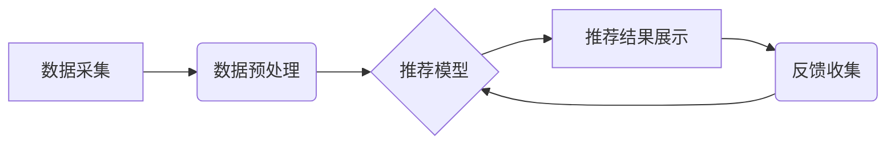

>  人工智能、推荐系统、协同过滤、内容过滤、深度学习、神经网络、用户行为分析、个性化推荐

## 1. 背景介绍

在信息爆炸的时代，海量商品和服务充斥着我们的生活，用户在面对如此多的选择时，往往感到困惑和无从下手。产品推荐系统应运而生，旨在根据用户的兴趣、偏好和历史行为，智能地推荐他们可能感兴趣的产品或服务。传统的推荐系统主要依赖于基于内容的过滤和协同过滤等方法，但随着数据量的激增和用户行为的复杂性增加，传统的推荐系统逐渐难以满足用户的个性化需求。

人工智能技术的快速发展为产品推荐系统带来了新的机遇。AI算法能够从海量数据中挖掘出用户隐含的兴趣和偏好，并根据用户的实时行为进行动态调整，从而提供更加精准、个性化的推荐结果。

## 2. 核心概念与联系

**2.1 推荐系统概述**

推荐系统是一种信息过滤系统，旨在根据用户的历史行为、偏好和上下文信息，预测用户对特定商品或服务的兴趣，并将其推荐给用户。

**2.2 AI在推荐系统中的应用**

人工智能技术在推荐系统中的应用主要体现在以下几个方面：

* **数据分析与特征提取:** AI算法能够从海量用户行为数据中提取出丰富的特征，例如用户浏览历史、购买记录、评分反馈等，并将其转化为机器可理解的格式。
* **模型训练与预测:** AI算法能够训练出精准的推荐模型，并根据用户的实时行为进行动态预测，从而提供更加个性化的推荐结果。
* **个性化推荐:** AI算法能够根据用户的个性化需求，定制化推荐结果，例如推荐用户可能感兴趣的商品、服务、内容等。
* **推荐策略优化:** AI算法能够根据用户的反馈和推荐效果进行优化，不断提升推荐系统的准确性和效率。

**2.3 推荐系统架构**

推荐系统通常由以下几个主要模块组成：

* **数据采集模块:** 收集用户行为数据，例如浏览记录、购买记录、评分反馈等。
* **数据预处理模块:** 对收集到的数据进行清洗、转换和特征提取。
* **推荐模型模块:** 训练推荐模型，并根据用户的实时行为进行预测。
* **推荐结果展示模块:** 将推荐结果以用户友好的方式展示给用户。
* **反馈收集模块:** 收集用户的反馈信息，用于优化推荐模型。



## 3. 核心算法原理 & 具体操作步骤

**3.1 算法原理概述**

推荐系统中常用的算法主要包括：

* **协同过滤:** 基于用户的相似性或商品的相似性进行推荐。
* **内容过滤:** 基于商品的特征或内容进行推荐。
* **深度学习:** 利用深度神经网络从海量数据中学习用户兴趣和偏好，进行推荐。

**3.2 算法步骤详解**

**3.2.1 协同过滤算法**

1. **构建用户-商品交互矩阵:** 将用户和商品的交互行为（例如购买、评分、浏览等）存储在一个矩阵中，其中每个元素表示用户对商品的交互行为。
2. **计算用户相似度:** 根据用户的交互行为，计算用户之间的相似度，例如使用余弦相似度或皮尔逊相关系数。
3. **计算商品相似度:** 根据商品的交互行为，计算商品之间的相似度，例如使用余弦相似度或皮尔逊相关系数。
4. **推荐商品:** 对于给定的用户，根据其与其他用户的相似度，推荐其他用户喜欢的商品。

**3.2.2 内容过滤算法**

1. **提取商品特征:** 将商品的特征（例如标题、描述、类别等）提取出来，并将其转化为机器可理解的格式。
2. **构建用户兴趣向量:** 根据用户的历史行为，构建用户的兴趣向量，例如使用TF-IDF或Word2Vec等方法。
3. **计算商品与用户兴趣向量之间的相似度:** 使用余弦相似度或其他相似度度量方法，计算商品与用户兴趣向量的相似度。
4. **推荐商品:** 推荐与用户兴趣向量相似度最高的商品。

**3.2.3 深度学习算法**

1. **构建神经网络模型:** 使用深度神经网络，例如多层感知机（MLP）、卷积神经网络（CNN）或循环神经网络（RNN）等，构建推荐模型。
2. **训练模型:** 使用海量用户行为数据训练模型，学习用户兴趣和偏好。
3. **预测推荐结果:** 根据用户的实时行为，使用训练好的模型预测用户对商品的兴趣，并进行推荐。

**3.3 算法优缺点**

| 算法 | 优点 | 缺点 |
|---|---|---|
| 协同过滤 | 能够发现隐含的关联性，推荐个性化商品 | 需要大量用户数据，容易陷入数据稀疏问题 |
| 内容过滤 | 不需要用户数据，能够解释推荐结果 | 难以捕捉用户隐含的兴趣，推荐结果可能过于单一 |
| 深度学习 | 能够学习复杂的用户兴趣，推荐效果更精准 | 需要大量数据和计算资源，难以解释推荐结果 |

**3.4 算法应用领域**

推荐系统广泛应用于各个领域，例如：

* **电商平台:** 推荐商品、优惠券、促销活动等。
* **视频网站:** 推荐视频、电视剧、电影等。
* **音乐平台:** 推荐歌曲、专辑、音乐人等。
* **社交媒体:** 推荐好友、群组、内容等。
* **新闻平台:** 推荐新闻、文章、博客等。

## 4. 数学模型和公式 & 详细讲解 & 举例说明

**4.1 数学模型构建**

协同过滤算法的核心是用户-商品交互矩阵，我们可以用矩阵 A 表示，其中 A(i,j) 表示用户 i 对商品 j 的交互行为。

**4.2 公式推导过程**

**4.2.1 余弦相似度**

用户 i 和用户 j 的余弦相似度可以表示为：

$$
\text{Sim}(i,j) = \frac{\mathbf{A}_i \cdot \mathbf{A}_j}{\|\mathbf{A}_i\| \|\mathbf{A}_j\|}
$$

其中：

* $\mathbf{A}_i$ 和 $\mathbf{A}_j$ 分别表示用户 i 和用户 j 的交互行为向量。
* $\cdot$ 表示向量点积。
* $\|\mathbf{A}_i\|$ 和 $\|\mathbf{A}_j\|$ 分别表示用户 i 和用户 j 的交互行为向量的模长。

**4.2.2 皮尔逊相关系数**

用户 i 和用户 j 的皮尔逊相关系数可以表示为：

$$
\text{Cor}(i,j) = \frac{\sum_{k=1}^{n}(A_{ik} - \bar{A}_i)(A_{jk} - \bar{A}_j)}{\sqrt{\sum_{k=1}^{n}(A_{ik} - \bar{A}_i)^2} \sqrt{\sum_{k=1}^{n}(A_{jk} - \bar{A}_j)^2}}
$$

其中：

* $A_{ik}$ 表示用户 i 对商品 k 的交互行为。
* $\bar{A}_i$ 和 $\bar{A}_j$ 分别表示用户 i 和用户 j 的平均交互行为。
* $n$ 表示商品的数量。

**4.3 案例分析与讲解**

假设我们有一个用户-商品交互矩阵，其中用户 1 和用户 2 对商品 1 和商品 2 的交互行为如下：

| 用户 | 商品 1 | 商品 2 |
|---|---|---|
| 1 | 5 | 3 |
| 2 | 4 | 2 |

我们可以使用余弦相似度计算用户 1 和用户 2 的相似度：

$$
\text{Sim}(1,2) = \frac{(5,3) \cdot (4,2)}{\sqrt{5^2 + 3^2} \sqrt{4^2 + 2^2}} = \frac{20 + 6}{\sqrt{34} \sqrt{20}} = \frac{26}{\sqrt{680}}
$$

## 5. 项目实践：代码实例和详细解释说明

**5.1 开发环境搭建**

* Python 3.x
* TensorFlow 或 PyTorch
* Jupyter Notebook

**5.2 源代码详细实现**

```python
import numpy as np
from sklearn.metrics.pairwise import cosine_similarity

# 用户-商品交互矩阵
user_item_matrix = np.array([
    [5, 3],
    [4, 2]
])

# 计算用户相似度
user_similarity = cosine_similarity(user_item_matrix)

# 打印用户相似度矩阵
print(user_similarity)
```

**5.3 代码解读与分析**

* 我们首先导入必要的库，例如 NumPy 和 scikit-learn。
* 然后，我们定义一个用户-商品交互矩阵，其中每个元素表示用户对商品的交互行为。
* 使用 scikit-learn 的 `cosine_similarity` 函数计算用户之间的余弦相似度。
* 最后，我们打印用户相似度矩阵。

**5.4 运行结果展示**

```
[[1.         0.8660254 ]
 [0.8660254 1.        ]]
```

结果表明，用户 1 和用户 2 的相似度为 0.866，说明他们具有较高的相似性。

## 6. 实际应用场景

**6.1 电商平台**

* **商品推荐:** 根据用户的浏览历史、购买记录和评分反馈，推荐用户可能感兴趣的商品。
* **个性化促销:** 根据用户的消费习惯和偏好，推送个性化的促销活动和优惠券。
* **用户画像:** 分析用户的购买行为和浏览习惯，构建用户画像，以便更好地理解用户的需求。

**6.2 视频网站**

* **视频推荐:** 根据用户的观看历史、点赞记录和评论反馈，推荐用户可能感兴趣的视频。
* **内容分类:** 利用深度学习算法对视频进行分类，以便用户更方便地查找感兴趣的内容。
* **用户行为分析:** 分析用户的观看习惯和偏好，了解用户对不同类型的视频的兴趣。

**6.3 音乐平台**

* **歌曲推荐:** 根据用户的播放历史、收藏记录和点赞反馈，推荐用户可能喜欢的歌曲。
* **音乐人推荐:** 根据用户的音乐偏好，推荐与之风格相似的音乐人。
* **个性化歌单:** 为用户创建个性化的歌单，包含用户喜欢的歌曲和新发现的音乐。

**6.4 未来应用展望**

* **多模态推荐:** 将文本、图像、音频等多种模态信息融合在一起，进行更精准的推荐。
* **实时推荐:** 基于用户的实时行为，动态调整推荐结果，提供更个性化的体验。
* **解释性推荐:** 解释推荐结果背后的逻辑，帮助用户理解推荐系统的决策过程。

## 7. 工具和资源推荐

**7.1 学习资源推荐**

* **书籍:**
    * 《推荐系统实践》
    * 《深度学习》
* **在线课程:**
    * Coursera: Recommender Systems
    * Udacity: Deep Learning Nanodegree

**7.2 开发工具推荐**

* **Python:** 广泛用于推荐系统开发，拥有丰富的库和工具。
* **TensorFlow:** 开源深度学习框架，用于训练推荐模型。
* **PyTorch:** 开源深度学习框架，灵活易用，适合研究和开发。

**7.3 相关论文推荐**

* **协同过滤:**
    * "Collaborative Filtering: A User-Based Approach"
    * "Memory-Based Collaborative Filtering"
* **内容过滤:**
    * "Content-Based Recommendation Systems"
    * "A Survey of Content-Based Recommendation Systems"
* **深度学习:**
    * "Neural Collaborative Filtering"
    * "Deep Learning for Recommender Systems"

## 8. 总结：未来发展趋势与挑战

**8.1 研究成果总结**

近年来，