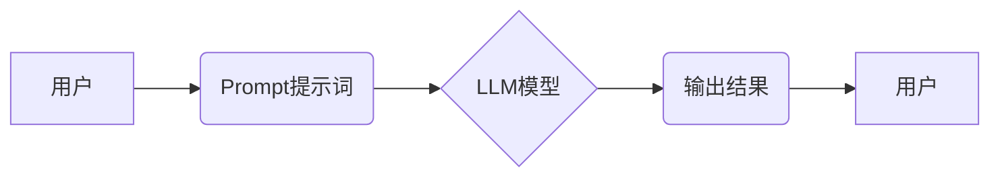

> AI大模型,Prompt提示词,最佳实践,自然语言处理,文本生成,机器学习,深度学习,案例分析

## 1. 背景介绍

近年来，大规模语言模型（LLM）的快速发展，如GPT-3、LaMDA、BERT等，为自然语言处理（NLP）领域带来了革命性的变革。这些模型展现出惊人的文本生成、翻译、问答和代码生成能力，为我们提供了强大的工具，帮助我们更好地理解和交互与语言。

然而，LLM的性能很大程度上取决于输入的Prompt提示词。一个精心设计的Prompt可以引导模型生成更准确、更相关的输出，而一个模糊或不完整的Prompt则可能导致模型产生错误或不相关的结果。因此，学习如何编写高质量的Prompt提示词，对于充分利用LLM的潜力至关重要。

## 2. 核心概念与联系

**2.1 Prompt提示词**

Prompt提示词是指用户向LLM输入的文本指令或问题，它引导模型理解用户的意图并生成相应的输出。

**2.2  LLM模型架构**

LLM通常基于Transformer网络架构，利用自注意力机制学习语言的上下文关系。

**2.3  Prompt工程**

Prompt工程是指设计、优化和评估Prompt提示词的过程，以提高LLM的性能和准确性。

**2.4  关系图**



## 3. 核心算法原理 & 具体操作步骤

**3.1  算法原理概述**

LLM的训练过程本质上是一个概率预测的过程。模型通过学习大量的文本数据，建立了语言模式和语法规则的概率分布。当用户输入一个Prompt提示词时，模型会根据输入的词语序列，预测下一个词语的概率分布，并根据概率分布选择最可能的词语作为输出。

**3.2  算法步骤详解**

1. **数据预处理:** 将文本数据进行清洗、分词、标记等预处理操作，使其适合模型训练。
2. **模型训练:** 使用大量的文本数据训练LLM模型，通过反向传播算法不断调整模型参数，使其能够准确预测下一个词语。
3. **Prompt输入:** 用户输入一个Prompt提示词，模型将将其转换为词语序列。
4. **概率预测:** 模型根据输入的词语序列，预测下一个词语的概率分布。
5. **输出生成:** 模型根据概率分布选择最可能的词语作为输出，并依次预测后续词语，最终生成完整的文本输出。

**3.3  算法优缺点**

**优点:**

* 能够生成流畅、自然的文本。
* 可以处理多种语言和文本类型。
* 具有强大的文本理解和生成能力。

**缺点:**

* 训练成本高，需要大量的计算资源和数据。
* 模型容易受到输入Prompt提示词的影响，如果Prompt提示词不清晰或不完整，模型可能会生成错误或不相关的输出。
* 模型缺乏常识和世界知识，可能会生成不符合逻辑或现实的文本。

**3.4  算法应用领域**

* 文本生成：小说、诗歌、剧本、新闻报道等。
* 机器翻译：将一种语言翻译成另一种语言。
* 问答系统：回答用户提出的问题。
* 代码生成：自动生成代码。
* 聊天机器人：与用户进行自然语言对话。

## 4. 数学模型和公式 & 详细讲解 & 举例说明

**4.1  数学模型构建**

LLM通常使用Transformer网络架构，其核心是自注意力机制。自注意力机制允许模型关注输入序列中不同位置的词语之间的关系，从而更好地理解上下文信息。

**4.2  公式推导过程**

自注意力机制的计算过程可以概括为以下公式：

$$
Attention(Q, K, V) = softmax(\frac{QK^T}{\sqrt{d_k}})V
$$

其中：

* $Q$：查询矩阵
* $K$：键矩阵
* $V$：值矩阵
* $d_k$：键向量的维度
* $softmax$：softmax函数，用于将注意力权重归一化

**4.3  案例分析与讲解**

假设我们有一个句子“我爱吃苹果”，我们想要计算“吃”这个词语与其他词语之间的注意力权重。

1. 将句子转换为词向量表示。
2. 计算查询矩阵 $Q$、键矩阵 $K$ 和值矩阵 $V$。
3. 计算注意力权重矩阵，即 $softmax(\frac{QK^T}{\sqrt{d_k}})$。
4. 将注意力权重矩阵与值矩阵相乘，得到最终的注意力输出。

通过分析注意力权重矩阵，我们可以发现“吃”这个词语与“我”和“苹果”这两个词语之间的注意力权重较高，说明这些词语与“吃”这个词语在语义上更加相关。

## 5. 项目实践：代码实例和详细解释说明

**5.1  开发环境搭建**

* Python 3.7+
* PyTorch 或 TensorFlow
* CUDA 和 cuDNN

**5.2  源代码详细实现**

```python
import torch
import torch.nn as nn

class Transformer(nn.Module):
    def __init__(self, vocab_size, embedding_dim, num_heads, num_layers):
        super(Transformer, self).__init__()
        self.embedding = nn.Embedding(vocab_size, embedding_dim)
        self.transformer_layers = nn.ModuleList([
            nn.TransformerEncoderLayer(embedding_dim, num_heads)
            for _ in range(num_layers)
        ])
        self.linear = nn.Linear(embedding_dim, vocab_size)

    def forward(self, x):
        x = self.embedding(x)
        for layer in self.transformer_layers:
            x = layer(x)
        x = self.linear(x)
        return x
```

**5.3  代码解读与分析**

* `Transformer`类定义了一个Transformer模型，包含嵌入层、Transformer编码器层和线性输出层。
* `embedding`层将词语转换为词向量表示。
* `transformer_layers`是一个模块列表，包含多个Transformer编码器层。
* `linear`层将编码后的输出转换为预测概率分布。

**5.4  运行结果展示**

训练好的模型可以用于文本生成、机器翻译等任务。

## 6. 实际应用场景

**6.1  文本生成**

* 自动生成小说、诗歌、剧本等创意文本。
* 生成新闻报道、产品描述、广告文案等商业文本。

**6.2  机器翻译**

* 将一种语言翻译成另一种语言，例如英语翻译成中文。

**6.3  问答系统**

* 回答用户提出的问题，例如搜索引擎、聊天机器人等。

**6.4  代码生成**

* 自动生成代码，例如根据用户需求生成代码片段。

**6.5  未来应用展望**

* 更智能、更个性化的聊天机器人。
* 更准确、更流畅的机器翻译。
* 更强大的文本生成工具，例如自动创作小说、剧本等。
* 更智能的教育系统，例如个性化学习辅导。

## 7. 工具和资源推荐

**7.1  学习资源推荐**

* **书籍:**
    * 《深度学习》
    * 《自然语言处理》
    * 《Transformer网络》
* **在线课程:**
    * Coursera: 深度学习
    * Udacity: 自然语言处理
    * fast.ai: 深度学习

**7.2  开发工具推荐**

* **框架:**
    * PyTorch
    * TensorFlow
* **库:**
    * HuggingFace Transformers
    * Gensim
* **平台:**
    * Google Colab
    * Paperspace Gradient

**7.3  相关论文推荐**

* 《Attention Is All You Need》
* 《BERT: Pre-training of Deep Bidirectional Transformers for Language Understanding》
* 《GPT-3: Language Models are Few-Shot Learners》

## 8. 总结：未来发展趋势与挑战

**8.1  研究成果总结**

近年来，LLM取得了显著的进展，在文本生成、机器翻译、问答系统等领域展现出强大的能力。

**8.2  未来发展趋势**

* 模型规模进一步扩大，性能进一步提升。
* 模型更加安全、可靠、可解释。
* 模型应用场景更加广泛，例如医疗、教育、法律等领域。

**8.3  面临的挑战**

* 训练成本高，需要大量的计算资源和数据。
* 模型容易受到输入Prompt提示词的影响，需要改进Prompt工程技术。
* 模型缺乏常识和世界知识，需要探索新的训练方法。

**8.4  研究展望**

* 研究更有效的训练方法，降低训练成本。
* 研究更强大的Prompt工程技术，提高模型的鲁棒性和泛化能力。
* 研究如何赋予模型常识和世界知识，使其能够更好地理解和交互与人类。

## 9. 附录：常见问题与解答

**9.1  如何编写高质量的Prompt提示词？**

* 明确你的意图，并用简洁、准确的语言表达。
* 提供足够的上下文信息，帮助模型理解你的需求。
* 使用具体的例子和示例，引导模型生成更相关的输出。
* 避免使用歧义或模糊的语言。

**9.2  如何评估Prompt提示词的质量？**

* 观察模型生成的输出是否符合你的预期。
* 评估输出的准确性、流畅性和相关性。
* 使用指标，例如BLEU、ROUGE等，量化评估输出的质量。

**9.3  如何改进Prompt提示词？**

* 分析模型生成的输出，找出问题所在。
* 尝试修改Prompt提示词，例如添加上下文信息、使用更具体的例子等。
* 迭代改进Prompt提示词，直到达到预期的效果。


作者：禅与计算机程序设计艺术 / Zen and the Art of Computer Programming 
<end_of_turn>