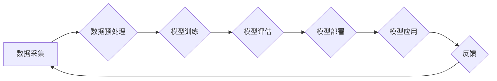

> AI大模型，创业，技术挑战，深度学习，自然语言处理，计算机视觉，模型部署，伦理问题

## 1. 背景介绍

人工智能（AI）技术近年来发展迅速，特别是深度学习的突破，使得AI大模型的规模和能力不断提升。这些强大的AI模型在自然语言处理、计算机视觉、语音识别等领域展现出令人惊叹的性能，为各行各业带来了前所未有的机遇。

然而，AI大模型的创业也面临着诸多挑战。从技术层面，模型训练成本高昂、模型部署复杂、模型解释性差等问题都需要解决。从商业层面，如何构建可持续的商业模式、如何应对数据隐私和安全问题、如何应对潜在的伦理风险等挑战都需要认真思考。

## 2. 核心概念与联系

**2.1 AI大模型概述**

AI大模型是指参数量巨大、训练数据海量、计算资源消耗巨大的深度学习模型。这些模型通常拥有数十亿甚至数千亿个参数，能够学习复杂的模式和关系，从而实现更强大的泛化能力和应用场景。

**2.2 核心技术**

* **深度学习:** 深度学习是AI大模型的核心技术，通过多层神经网络学习数据特征，实现对复杂数据的理解和处理。
* **Transformer:** Transformer是一种新型的深度学习架构，能够有效处理序列数据，例如文本和语音，在自然语言处理领域取得了突破性进展。
* **大规模数据:** AI大模型的训练需要海量数据，这些数据可以来自互联网、传感器、数据库等各种来源。
* **高性能计算:** AI大模型的训练需要强大的计算能力，通常需要使用GPU或TPU等专用硬件加速。

**2.3 核心架构**



## 3. 核心算法原理 & 具体操作步骤

**3.1 算法原理概述**

深度学习算法的核心是神经网络，它由多个层级的神经元组成，每个神经元接收输入信号，进行计算并输出信号。通过调整神经元的连接权重，深度学习模型可以学习数据中的模式和关系。

**3.2 算法步骤详解**

1. **数据预处理:** 将原始数据转换为模型可以理解的格式，例如文本数据需要进行词嵌入，图像数据需要进行尺寸调整和归一化。
2. **模型构建:** 根据任务需求选择合适的深度学习架构，例如CNN、RNN、Transformer等。
3. **模型训练:** 使用训练数据训练模型，通过反向传播算法调整神经元的连接权重，使模型的预测结果越来越准确。
4. **模型评估:** 使用测试数据评估模型的性能，例如准确率、召回率、F1-score等指标。
5. **模型部署:** 将训练好的模型部署到实际应用环境中，例如云服务器、边缘设备等。

**3.3 算法优缺点**

* **优点:** 
    * 强大的泛化能力，能够处理复杂的数据模式。
    * 自动特征提取，无需人工特征工程。
    * 可持续学习，可以通过不断更新数据来提升模型性能。
* **缺点:** 
    * 训练成本高昂，需要大量数据和计算资源。
    * 模型解释性差，难以理解模型的决策过程。
    * 容易受到数据偏差的影响，可能导致模型产生偏见。

**3.4 算法应用领域**

* **自然语言处理:** 文本分类、情感分析、机器翻译、对话系统等。
* **计算机视觉:** 图像识别、物体检测、图像分割、视频分析等。
* **语音识别:** 语音转文本、语音助手、语音搜索等。
* **推荐系统:** 商品推荐、内容推荐、用户画像等。
* **医疗诊断:** 病情预测、疾病诊断、药物研发等。

## 4. 数学模型和公式 & 详细讲解 & 举例说明

**4.1 数学模型构建**

深度学习模型的核心是神经网络，它可以看作是一个复杂的数学函数。每个神经元接收多个输入信号，经过加权求和和激活函数处理后输出信号。

**4.2 公式推导过程**

* **加权求和:**  
$$z = \sum_{i=1}^{n} w_i x_i + b$$
其中，$z$ 是神经元的输出，$w_i$ 是连接权重，$x_i$ 是输入信号，$b$ 是偏置项。

* **激活函数:**  
$$a = f(z)$$
其中，$a$ 是神经元的激活输出，$f(z)$ 是激活函数，例如ReLU、Sigmoid、Tanh等。

* **反向传播算法:**  
反向传播算法用于调整神经元的连接权重，使其能够更好地拟合训练数据。其核心思想是通过计算误差梯度，逐步更新权重，使模型的预测结果越来越准确。

**4.3 案例分析与讲解**

例如，在图像分类任务中，深度学习模型可以将图像像素作为输入，经过多个卷积层和全连接层处理后，输出每个类别的概率。

## 5. 项目实践：代码实例和详细解释说明

**5.1 开发环境搭建**

* **操作系统:** Linux或macOS
* **编程语言:** Python
* **深度学习框架:** TensorFlow、PyTorch等
* **硬件:** GPU或TPU

**5.2 源代码详细实现**

```python
import tensorflow as tf

# 定义模型结构
model = tf.keras.models.Sequential([
    tf.keras.layers.Conv2D(32, (3, 3), activation='relu', input_shape=(28, 28, 1)),
    tf.keras.layers.MaxPooling2D((2, 2)),
    tf.keras.layers.Conv2D(64, (3, 3), activation='relu'),
    tf.keras.layers.MaxPooling2D((2, 2)),
    tf.keras.layers.Flatten(),
    tf.keras.layers.Dense(10, activation='softmax')
])

# 编译模型
model.compile(optimizer='adam',
              loss='sparse_categorical_crossentropy',
              metrics=['accuracy'])

# 训练模型
model.fit(x_train, y_train, epochs=5)

# 评估模型
loss, accuracy = model.evaluate(x_test, y_test)
print('Test loss:', loss)
print('Test accuracy:', accuracy)
```

**5.3 代码解读与分析**

这段代码定义了一个简单的卷积神经网络模型，用于手写数字识别任务。

* **Conv2D:** 卷积层，用于提取图像特征。
* **MaxPooling2D:** 最大池化层，用于降维和提高模型鲁棒性。
* **Flatten:** 将多维数据转换为一维数据。
* **Dense:** 全连接层，用于分类。
* **adam:** 优化算法，用于更新模型参数。
* **sparse_categorical_crossentropy:** 损失函数，用于计算模型预测结果与真实标签之间的差异。
* **accuracy:** 评估指标，用于衡量模型的准确率。

**5.4 运行结果展示**

训练完成后，模型可以用于预测新的手写数字图像。

## 6. 实际应用场景

**6.1 自然语言处理**

* **机器翻译:** 将文本从一种语言翻译成另一种语言。
* **文本摘要:** 自动生成文本的简短摘要。
* **情感分析:** 分析文本的情感倾向，例如正面、负面或中性。

**6.2 计算机视觉**

* **图像识别:** 将图像分类到不同的类别。
* **物体检测:** 在图像中检测到特定物体的位置和大小。
* **图像分割:** 将图像分割成不同的区域。

**6.3 语音识别**

* **语音转文本:** 将语音转换为文本。
* **语音助手:** 通过语音与用户进行交互。
* **语音搜索:** 通过语音进行搜索。

**6.4 其他应用场景**

* **推荐系统:** 根据用户的历史行为推荐商品或内容。
* **医疗诊断:** 辅助医生进行疾病诊断。
* **金融风险管理:** 识别和评估金融风险。

**6.5 未来应用展望**

AI大模型的应用场景还在不断扩展，未来将应用于更多领域，例如自动驾驶、机器人、个性化教育等。

## 7. 工具和资源推荐

**7.1 学习资源推荐**

* **书籍:**
    * 深度学习
    * 构建深度学习模型
    * 自然语言处理
* **在线课程:**
    * Coursera
    * edX
    * Udacity

**7.2 开发工具推荐**

* **深度学习框架:** TensorFlow、PyTorch、Keras
* **数据处理工具:** Pandas、NumPy
* **可视化工具:** Matplotlib、Seaborn

**7.3 相关论文推荐**

* Attention Is All You Need
* BERT: Pre-training of Deep Bidirectional Transformers for Language Understanding
* GPT-3: Language Models are Few-Shot Learners

## 8. 总结：未来发展趋势与挑战

**8.1 研究成果总结**

近年来，AI大模型取得了显著的进展，在多个领域展现出强大的应用潜力。

**8.2 未来发展趋势**

* **模型规模继续扩大:** 模型参数量将继续增加，从而提升模型的性能和泛化能力。
* **模型效率提升:** 研究人员将致力于开发更有效的训练和推理算法，降低模型的计算成本。
* **多模态学习:** AI模型将能够处理多种数据类型，例如文本、图像、音频等，从而实现更全面的理解和应用。
* **可解释性增强:** 研究人员将致力于开发更可解释的AI模型，使其决策过程更加透明和可理解。

**8.3 面临的挑战**

* **数据获取和隐私问题:** AI大模型的训练需要海量数据，如何获取高质量数据并保护用户隐私是一个重要挑战。
* **模型安全性与鲁棒性:** AI模型可能受到攻击或恶意操纵，需要提高模型的安全性与鲁棒性。
* **伦理问题:** AI模型的应用可能带来伦理风险，例如算法偏见、就业替代等，需要认真思考和解决。

**8.4 研究展望**

未来，AI大模型的研究将继续深入，推动人工智能技术的发展和应用，为人类社会带来更多福祉。

## 9. 附录：常见问题与解答

**9.1 如何选择合适的AI大模型？**

选择合适的AI大模型需要根据具体的应用场景和需求进行考虑，例如模型规模、性能、训练成本等因素。

**9.2 如何训练自己的AI大模型？**

训练自己的AI大模型需要具备一定的深度学习知识和经验，以及强大的计算资源。

**9.3 如何部署AI大模型？**

AI大模型的部署方式多种多样，例如云服务器、边缘设备等，需要根据实际应用场景选择合适的部署方式。


作者：禅与计算机程序设计艺术 / Zen and the Art of Computer Programming 
<end_of_turn>