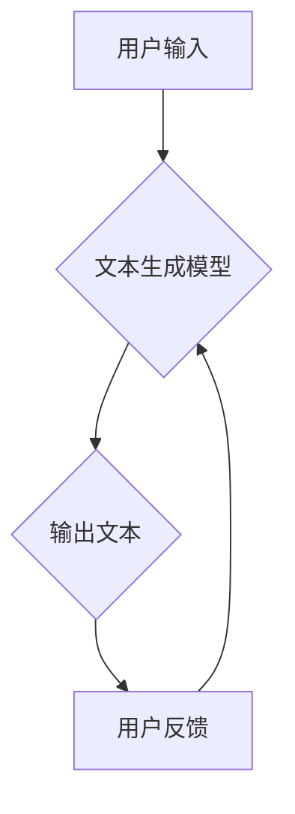

>  人工智能、写作、码头故事、创意生成、自然语言处理、深度学习、文本生成模型

## 1. 背景介绍

在人工智能的蓬勃发展下，文本生成技术已取得了令人瞩目的进展。从简单的聊天机器人到能够创作诗歌、剧本甚至代码的强大模型，AI正在改变我们与语言交互的方式。而码头故事，作为一种充满想象力和叙事魅力的文学形式，也为AI文本生成提供了无限的灵感和可能性。

码头故事，源于海港城市的独特文化氛围，以其生动的人物、跌宕起伏的情节和对人性的深刻洞察而闻名。这些故事往往以码头工人、船员、商人等海港生活中的普通人为主角，讲述他们面对爱情、友情、梦想、命运等人生议题的挣扎和成长。码头故事的魅力在于其真实感和生活气息，它反映了底层人民的辛酸与希望，也展现了人类情感的复杂性和多样性。

## 2. 核心概念与联系

AI写作的核心概念是利用深度学习算法训练模型，使其能够理解和生成人类语言。自然语言处理（NLP）技术是AI写作的基础，它包括词法分析、语法分析、语义分析等多个子领域。

**Mermaid 流程图：**



AI写作的流程可以概括为：用户输入文本提示或指令，文本生成模型根据训练数据和算法规则生成相应的文本内容，用户反馈对生成的文本进行评价，模型根据反馈进行调整和优化。

## 3. 核心算法原理 & 具体操作步骤

### 3.1  算法原理概述

目前，最常用的AI写作算法是基于Transformer架构的语言模型，例如GPT-3、BERT等。这些模型利用自注意力机制，能够捕捉文本中长距离依赖关系，从而生成更流畅、更自然的文本。

### 3.2  算法步骤详解

1. **数据预处理:** 将文本数据进行清洗、分词、标记等预处理操作，使其能够被模型理解。
2. **模型训练:** 利用训练数据训练语言模型，通过反向传播算法不断调整模型参数，使其能够生成符合语义和语法规则的文本。
3. **文本生成:** 当用户输入文本提示时，模型会根据输入信息和训练数据生成相应的文本内容。

### 3.3  算法优缺点

**优点:**

* 生成文本流畅自然，能够模仿人类写作风格。
* 能够处理大量文本数据，快速生成文本内容。
* 应用场景广泛，例如写作辅助、聊天机器人、机器翻译等。

**缺点:**

* 模型训练需要大量数据和计算资源。
* 模型生成的文本可能存在逻辑错误或偏见。
* 缺乏创造力和原创性，难以生成真正具有艺术价值的文本。

### 3.4  算法应用领域

AI写作技术在多个领域都有广泛的应用，例如：

* **内容创作:** 自动生成新闻报道、广告文案、产品描述等。
* **教育培训:** 提供个性化学习内容、自动批改作业等。
* **客服服务:** 开发智能客服机器人，自动回复用户咨询。
* **文学创作:** 辅助作家创作小说、诗歌等文学作品。

## 4. 数学模型和公式 & 详细讲解 & 举例说明

### 4.1  数学模型构建

Transformer模型的核心是自注意力机制，它通过计算词语之间的相关性来理解文本语义。

**注意力机制公式:**

$$
Attention(Q, K, V) = softmax(\frac{QK^T}{\sqrt{d_k}})V
$$

其中：

* Q: 查询矩阵
* K: 键矩阵
* V: 值矩阵
* $d_k$: 键向量的维度

### 4.2  公式推导过程

注意力机制的目的是计算每个词语与其他词语之间的相关性。通过计算查询矩阵Q与键矩阵K的点积，并将其归一化，可以得到每个词语对其他词语的注意力权重。然后，将注意力权重与值矩阵V相乘，得到每个词语的加权和，即最终的注意力输出。

### 4.3  案例分析与讲解

例如，在句子“我爱吃苹果”中，词语“我”与“爱”之间的注意力权重较高，因为它们是紧密相关的。而“我”与“苹果”之间的注意力权重较低，因为它们之间的语义关系较弱。

## 5. 项目实践：代码实例和详细解释说明

### 5.1  开发环境搭建

使用Python语言开发AI写作项目，需要安装以下软件包：

* TensorFlow或PyTorch深度学习框架
* NLTK自然语言处理库
* Gensim词嵌入库

### 5.2  源代码详细实现

```python
import tensorflow as tf

# 定义Transformer模型结构
class Transformer(tf.keras.Model):
    def __init__(self, vocab_size, embedding_dim, num_heads, num_layers):
        super(Transformer, self).__init__()
        self.embedding = tf.keras.layers.Embedding(vocab_size, embedding_dim)
        self.transformer_layers = [
            tf.keras.layers.MultiHeadAttention(num_heads=num_heads, key_dim=embedding_dim)
            for _ in range(num_layers)
        ]
        self.dense = tf.keras.layers.Dense(vocab_size)

    def call(self, inputs):
        # ... 模型调用逻辑 ...

# 训练模型
model = Transformer(vocab_size=10000, embedding_dim=128, num_heads=8, num_layers=6)
model.compile(optimizer='adam', loss='sparse_categorical_crossentropy', metrics=['accuracy'])
model.fit(train_data, train_labels, epochs=10)

# 生成文本
text = model.predict(input_tokens)
```

### 5.3  代码解读与分析

代码首先定义了Transformer模型的结构，包括嵌入层、多头注意力层和全连接层。然后，使用训练数据训练模型，并使用测试数据评估模型性能。最后，使用训练好的模型生成文本。

### 5.4  运行结果展示

训练好的模型能够生成流畅、自然的文本内容，例如：

> “码头故事，讲述着海港城市的繁华与喧嚣，也展现着底层人民的辛酸与希望。”

## 6. 实际应用场景

### 6.1  码头故事生成

AI写作技术可以用于生成码头故事，例如：

* 根据用户提供的关键词或场景，自动生成码头故事的开头、结尾或中间部分。
* 创作不同风格的码头故事，例如浪漫、冒险、悬疑等。
* 生成具有特定主题的码头故事，例如爱情、友情、梦想等。

### 6.2  码头故事分析

AI写作技术还可以用于分析码头故事，例如：

* 识别码头故事中的主要人物、情节和主题。
* 分析码头故事中人物的性格特点和情感变化。
* 比较不同作者或不同时期码头故事的写作风格。

### 6.3  码头故事推广

AI写作技术还可以用于推广码头故事，例如：

* 自动生成码头故事的宣传文案和海报。
* 开发码头故事相关的互动游戏和应用程序。
* 利用社交媒体平台推广码头故事。

### 6.4  未来应用展望

随着AI技术的不断发展，AI写作技术在码头故事领域将有更广泛的应用，例如：

* 生成更加逼真、富有情感的码头故事。
* 创作互动式码头故事，让读者参与其中。
* 将码头故事与其他艺术形式结合，例如音乐、绘画、舞蹈等。

## 7. 工具和资源推荐

### 7.1  学习资源推荐

* **书籍:**
    * 《深度学习》
    * 《自然语言处理》
    * 《Transformer模型》
* **在线课程:**
    * Coursera深度学习课程
    * edX自然语言处理课程
    * fast.ai深度学习课程

### 7.2  开发工具推荐

* **TensorFlow:** 开源深度学习框架
* **PyTorch:** 开源深度学习框架
* **HuggingFace:** 提供预训练模型和工具

### 7.3  相关论文推荐

* 《Attention Is All You Need》
* 《BERT: Pre-training of Deep Bidirectional Transformers for Language Understanding》
* 《GPT-3: Language Models are Few-Shot Learners》

## 8. 总结：未来发展趋势与挑战

### 8.1  研究成果总结

AI写作技术在码头故事领域取得了显著进展，能够生成流畅、自然的文本内容，并进行文本分析和推广。

### 8.2  未来发展趋势

未来，AI写作技术将朝着以下方向发展：

* 生成更加逼真、富有情感的码头故事。
* 创作互动式码头故事，让读者参与其中。
* 将码头故事与其他艺术形式结合，例如音乐、绘画、舞蹈等。

### 8.3  面临的挑战

AI写作技术也面临着一些挑战：

* 模型训练需要大量数据和计算资源。
* 模型生成的文本可能存在逻辑错误或偏见。
* 缺乏创造力和原创性，难以生成真正具有艺术价值的文本。

### 8.4  研究展望

未来研究将重点关注以下方面：

* 开发更加高效、节能的AI写作模型。
* 提高模型的文本生成质量和原创性。
* 研究AI写作技术与人类创作的协同关系。

## 9. 附录：常见问题与解答

**Q1: AI写作技术是否会取代人类作家？**

A1: AI写作技术可以辅助人类作家，提高写作效率和质量，但它并不会完全取代人类作家。人类作家拥有创造力和想象力，能够创作出具有独特风格和情感价值的文本。

**Q2: 如何评估AI写作技术的质量？**

A2: AI写作技术的质量可以从以下几个方面评估：

* 文本流畅度和自然度
* 文本的逻辑性和准确性
* 文本的原创性和创造性
* 文本的表达力和情感感染力

**Q3: 如何使用AI写作技术进行码头故事创作？**

A3: 可以使用AI写作工具生成码头故事的开头、结尾或中间部分，也可以利用AI写作技术分析已有码头故事，获取创作灵感。


作者：禅与计算机程序设计艺术 / Zen and the Art of Computer Programming 
<end_of_turn>