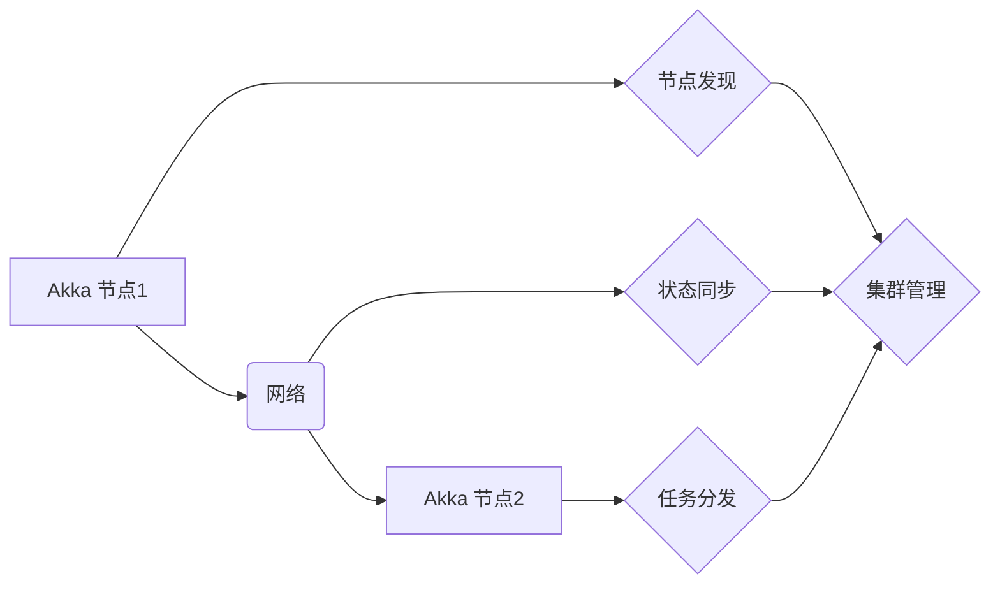

> Akka, 集群, 并发, 分布式, akka cluster, akka remote, actor, message passing

## 1. 背景介绍

在现代软件开发中，构建高性能、可扩展、容错的分布式系统越来越重要。传统的单机架构难以满足这些需求，分布式架构则提供了更灵活、更强大的解决方案。Akka 是一个基于 Actor 模型的分布式编程框架，它为构建高并发、高可靠的分布式系统提供了强大的工具和机制。

Akka 集群是 Akka 的一个重要模块，它允许开发者将多个 Akka 节点连接起来，形成一个分布式系统。通过 Akka 集群，开发者可以轻松地实现数据共享、任务分发、故障转移等功能，从而构建更复杂的、更强大的分布式应用程序。

## 2. 核心概念与联系

### 2.1 Actor 模型

Akka 基于 Actor 模型，它将系统分解成一系列独立的单元，称为 Actor。每个 Actor 都有自己的状态和行为，可以通过发送消息与其他 Actor 进行通信。Actor 模型具有以下特点：

* **并发性:** 每个 Actor 都是独立的线程，可以并发执行。
* **消息传递:** Actor 之间通信通过发送消息实现，消息传递是异步的，不会阻塞发送方。
* **状态隔离:** 每个 Actor 都有自己的状态，不会与其他 Actor 的状态相互影响。
* **容错性:** Actor 模型具有良好的容错性，如果一个 Actor 发生故障，其他 Actor 不会受到影响。

### 2.2 Akka 集群

Akka 集群是一个分布式系统，它由多个 Akka 节点组成。每个节点都是一个独立的 Akka 实例，它们通过网络通信相互连接。Akka 集群提供了以下功能：

* **节点发现:** 集群中的节点可以自动发现彼此，并建立连接。
* **状态同步:** 集群中的节点可以同步状态，确保所有节点都拥有最新的数据。
* **任务分发:** 集群中的节点可以将任务分发给其他节点，实现负载均衡。
* **故障转移:** 如果一个节点发生故障，集群可以自动将该节点的任务转移到其他节点。

### 2.3 架构图



## 3. 核心算法原理 & 具体操作步骤

### 3.1 算法原理概述

Akka 集群的核心算法是基于分布式 consensus 的，它确保所有节点都拥有最新的状态信息，并能够协调一致地执行任务。常见的分布式 consensus 算法包括 Paxos 和 Raft。

### 3.2 算法步骤详解

**Paxos 算法:**

1. **提案阶段:** 一个节点提出一个提案，并将其广播到集群中的所有节点。
2. **承诺阶段:** 节点收到提案后，会向提案者发送承诺消息，表示它接受了该提案。
3. **接受阶段:** 当大多数节点都发送了承诺消息后，提案者会将提案发送到集群中的所有节点，并要求它们接受该提案。
4. **达成一致:** 当大多数节点都接受了该提案后，集群就达成一致，并执行该提案。

**Raft 算法:**

1. **选举阶段:** 当集群中的领导节点发生故障时，集群会启动选举过程，选择新的领导节点。
2. **日志复制阶段:** 领导节点将所有操作记录到日志中，并将其复制到集群中的所有节点。
3. **执行阶段:** 节点收到日志复制后，会执行相应的操作。

### 3.3 算法优缺点

**Paxos:**

* **优点:** 理论上可以保证一致性，即使节点发生故障。
* **缺点:** 实现复杂，性能较低。

**Raft:**

* **优点:** 实现相对简单，性能较高。
* **缺点:** 理论上不能保证一致性，如果节点发生故障，可能会导致数据丢失。

### 3.4 算法应用领域

分布式 consensus 算法广泛应用于分布式数据库、分布式缓存、分布式文件系统等领域。

## 4. 数学模型和公式 & 详细讲解 & 举例说明

### 4.1 数学模型构建

Akka 集群的数学模型可以抽象为一个图结构，其中节点代表 Akka 节点，边代表节点之间的通信连接。

### 4.2 公式推导过程

**节点发现算法:**

假设集群中存在 N 个节点，每个节点都拥有一个唯一的 ID。节点发现算法可以利用哈希函数将节点 ID 映射到一个范围内的整数，然后将该整数作为节点的地址。

**状态同步算法:**

状态同步算法可以利用 Paxos 或 Raft 算法，确保所有节点都拥有最新的状态信息。

### 4.3 案例分析与讲解

**节点发现案例:**

假设集群中存在 3 个节点，它们的 ID 分别为 1、2 和 3。我们可以使用以下哈希函数将节点 ID 映射到地址：

```
address = hash(id) % N
```

其中 N 为集群中节点的数量。

如果 N = 3，则节点 1、2 和 3 的地址分别为：

* 节点 1: hash(1) % 3
* 节点 2: hash(2) % 3
* 节点 3: hash(3) % 3

**状态同步案例:**

假设集群中存在 3 个节点，它们需要同步一个状态变量 x。可以使用 Paxos 算法来实现状态同步。

## 5. 项目实践：代码实例和详细解释说明

### 5.1 开发环境搭建

Akka 集群可以使用 Scala 或 Java 语言开发。需要安装 JDK、Scala 或 Java 开发环境，以及 Akka 集群依赖库。

### 5.2 源代码详细实现

```scala
import akka.actor.{Actor, ActorSystem, Props}
import akka.cluster.Cluster
import akka.cluster.ClusterEvent.{MemberUp, UnreachableMember}

object ClusterExample extends App {

  val system = ActorSystem("ClusterSystem")
  val cluster = Cluster(system)

  // 定义一个 Actor
  class WorkerActor extends Actor {
    override def receive: Receive = {
      case message: String => println(s"Worker received: $message")
    }
  }

  // 创建一个 WorkerActor 实例
  val workerActor = system.actorOf(Props[WorkerActor], "worker")

  // 监听集群事件
  cluster.subscribe(system.actorOf(Props[ClusterListener], "clusterListener"),
    classOf[MemberUp], classOf[UnreachableMember])

  // 发送消息到 WorkerActor
  workerActor ! "Hello from Akka Cluster!"

}

// 定义一个监听集群事件的 Actor
class ClusterListener extends Actor {
  override def receive: Receive = {
    case MemberUp(member) => println(s"Member ${member.address} joined the cluster")
    case UnreachableMember(member) => println(s"Member ${member.address} unreachable")
  }
}
```

### 5.3 代码解读与分析

* **ActorSystem:** 创建一个 Akka 应用程序的上下文。
* **Cluster:** 获取 Akka 集群的管理对象。
* **WorkerActor:** 定义一个简单的 Actor，用于接收和处理消息。
* **Props:** 创建 Actor 的配置对象。
* **actorOf:** 创建一个 Actor 实例。
* **subscribe:** 订阅集群事件。
* **MemberUp:** 集群中一个节点加入集群的事件。
* **UnreachableMember:** 集群中一个节点不可达的事件。

### 5.4 运行结果展示

运行上述代码，可以观察到以下结果：

* 每个节点都会打印出 "Member [address] joined the cluster" 的日志，表示节点加入集群。
* 每个节点都会打印出 "Worker received: Hello from Akka Cluster!" 的日志，表示消息被成功发送和接收。

## 6. 实际应用场景

Akka 集群可以应用于各种分布式系统，例如：

* **微服务架构:** Akka 集群可以用于构建微服务架构，实现服务发现、负载均衡、故障转移等功能。
* **大数据处理:** Akka 集群可以用于构建大数据处理系统，实现数据分发、并行处理、结果聚合等功能。
* **实时数据分析:** Akka 集群可以用于构建实时数据分析系统，实现数据流处理、实时计算、可视化展示等功能。

### 6.4 未来应用展望

随着分布式技术的不断发展，Akka 集群的应用场景将会更加广泛。未来，Akka 集群可能会应用于以下领域：

* **边缘计算:** Akka 集群可以用于构建边缘计算系统，实现数据本地处理、智能决策等功能。
* **物联网:** Akka 集群可以用于构建物联网系统，实现设备连接、数据采集、远程控制等功能。
* **区块链:** Akka 集群可以用于构建区块链系统，实现节点同步、交易验证、共识机制等功能。

## 7. 工具和资源推荐

### 7.1 学习资源推荐

* **Akka 官方文档:** https://akka.io/docs/akka/current/
* **Akka 集群官方文档:** https://akka.io/docs/akka/current/cluster.html
* **Akka 中文文档:** https://akka.io/docs/akka/current/zh-cn/

### 7.2 开发工具推荐

* **IntelliJ IDEA:** https://www.jetbrains.com/idea/
* **Eclipse:** https://www.eclipse.org/

### 7.3 相关论文推荐

* **Akka Cluster: A Distributed Actor Framework for Building Scalable and Fault-Tolerant Systems:** https://dl.acm.org/doi/10.1145/3178876.3186109

## 8. 总结：未来发展趋势与挑战

### 8.1 研究成果总结

Akka 集群是一个成熟的分布式编程框架，它为构建高性能、高可靠的分布式系统提供了强大的工具和机制。

### 8.2 未来发展趋势

未来，Akka 集群可能会朝着以下方向发展：

* **更强大的分布式 consensus 算法:** 研究更高效、更可靠的分布式 consensus 算法，提高集群的性能和容错性。
* **更完善的资源管理机制:** 研究更智能的资源管理机制，实现资源的动态分配和回收，提高集群的资源利用率。
* **更丰富的应用场景:** 将 Akka 集群应用于更多新的领域，例如边缘计算、物联网、区块链等。

### 8.3 面临的挑战

Akka 集群也面临一些挑战：

* **复杂性:** Akka 集群的实现比较复杂，需要开发者具备一定的分布式系统开发经验。
* **性能:** 虽然 Akka 集群的性能已经比较高，但随着集群规模的扩大，性能可能会成为瓶颈。
* **生态系统:** Akka 集群的生态系统相对较小，缺少一些成熟的第三方工具和库。

### 8.4 研究展望

未来，我们需要继续研究和改进 Akka 集群，使其更加高效、可靠、易用，从而更好地服务于分布式系统开发。

## 9. 附录：常见问题与解答

### 9.1 如何部署 Akka 集群？

Akka 集群的部署方式取决于具体的应用场景和环境。一般来说，可以使用 Docker、Kubernetes 等容器化技术来部署 Akka 集群。

### 9.2 如何监控 Akka 集群？

可以使用 Akka 集群提供的监控工具，例如 Akka Cluster UI，来监控集群的运行状态。

### 9.3 如何解决 Akka 集群中的故障？

Akka 集群具有良好的容错性，可以自动处理节点故障。如果节点发生故障，集群会自动将该节点的任务转移到其他节点。

### 9.4 如何扩展 Akka 集群？

Akka 集群可以轻松地扩展，只需要添加新的节点即可。

### 9.5 如何学习 Akka 集群？

可以参考 Akka 官方文档、中文文档、博客文章、