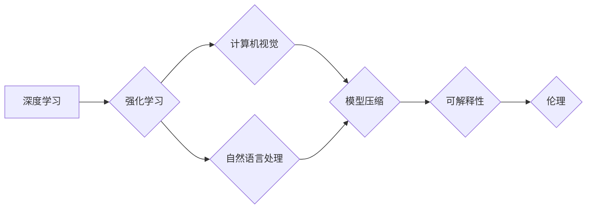

> 人工智能，深度学习，强化学习，计算机视觉，自然语言处理，模型压缩，可解释性，伦理

## 1. 背景介绍

人工智能（AI）正以惊人的速度发展，从自动驾驶到医疗诊断，AI技术正在改变着我们生活的方方面面。作为AI领域的领军人物，Andrej Karpathy在过去几年中做出了许多重要的贡献，他的研究和观点对AI的未来发展具有重要的指导意义。

本文将探讨Andrej Karpathy对AI未来发展策略的见解，并分析其背后的核心概念、算法原理、数学模型以及实际应用场景。

## 2. 核心概念与联系

Karpathy认为，AI的未来发展将围绕以下几个核心概念展开：

* **深度学习:** 深度学习是目前AI领域最成功的技术之一，它能够从海量数据中学习复杂的模式和特征。
* **强化学习:** 强化学习是一种基于奖励机制的学习方法，它能够使AI系统在与环境交互的过程中不断学习和改进。
* **计算机视觉:** 计算机视觉是让计算机“看”世界的一种技术，它能够识别、理解和解释图像和视频。
* **自然语言处理:** 自然语言处理是让计算机“理解”和“生成”人类语言的技术，它能够处理文本和语音信息。
* **模型压缩:** 模型压缩是指将大型AI模型压缩成更小的尺寸，以便于部署和使用。
* **可解释性:** 可解释性是指使AI模型的决策过程更加透明和可理解。
* **伦理:** 伦理是AI发展的关键问题之一，它涉及到AI技术的应用和影响。

这些核心概念相互关联，共同推动着AI的发展。

**Mermaid 流程图:**



## 3. 核心算法原理 & 具体操作步骤

### 3.1  算法原理概述

深度学习算法的核心是多层神经网络，它能够学习数据中的复杂模式和特征。

**具体来说，深度学习算法的工作原理如下：**

1. **输入层:** 将数据输入到神经网络的第一层。
2. **隐藏层:** 数据在隐藏层中经过一系列的计算和转换，学习数据中的特征。
3. **输出层:** 将隐藏层的输出结果作为最终的预测结果。

**深度学习算法的训练过程是通过调整神经网络的权重来最小化预测误差的。**

### 3.2  算法步骤详解

**深度学习算法的训练步骤如下：**

1. **初始化权重:** 为神经网络的权重赋予随机值。
2. **前向传播:** 将数据输入到神经网络，并计算输出结果。
3. **反向传播:** 计算输出结果与真实值的误差，并根据误差调整神经网络的权重。
4. **更新权重:** 使用梯度下降算法等优化算法更新神经网络的权重。
5. **重复步骤2-4:** 重复前向传播和反向传播的过程，直到误差达到最小值。

### 3.3  算法优缺点

**深度学习算法的优点:**

* 能够学习复杂的数据模式。
* 性能优异，在许多任务中都取得了突破性的进展。

**深度学习算法的缺点:**

* 需要大量的训练数据。
* 训练过程耗时且耗能。
* 模型的可解释性较差。

### 3.4  算法应用领域

深度学习算法在许多领域都有广泛的应用，例如：

* **计算机视觉:** 图像识别、物体检测、图像分割、人脸识别等。
* **自然语言处理:** 文本分类、情感分析、机器翻译、对话系统等。
* **语音识别:** 语音转文本、语音助手等。
* **医疗诊断:** 病理图像分析、疾病预测等。
* **金融分析:** 欺诈检测、风险评估等。

## 4. 数学模型和公式 & 详细讲解 & 举例说明

### 4.1  数学模型构建

深度学习算法的核心是神经网络，它可以看作是一个复杂的数学模型。

**神经网络的数学模型可以表示为：**

$$
y = f(W x + b)
$$

其中：

* $y$ 是输出结果。
* $x$ 是输入数据。
* $W$ 是权重矩阵。
* $b$ 是偏置向量。
* $f$ 是激活函数。

### 4.2  公式推导过程

**损失函数:**

深度学习算法的目标是最小化预测结果与真实值的误差，可以使用损失函数来衡量误差。常见的损失函数包括均方误差（MSE）和交叉熵损失（Cross-Entropy Loss）。

**梯度下降算法:**

梯度下降算法是一种优化算法，它用于调整神经网络的权重，以最小化损失函数。

**梯度下降算法的更新公式为：**

$$
W = W - \alpha \frac{\partial L}{\partial W}
$$

其中：

* $\alpha$ 是学习率。
* $\frac{\partial L}{\partial W}$ 是损失函数对权重矩阵的梯度。

### 4.3  案例分析与讲解

**举例说明:**

假设我们有一个简单的线性回归问题，目标是预测房价。

**输入数据:** 房屋面积。

**输出结果:** 房价。

**模型:**

$$
y = W x + b
$$

**损失函数:** 均方误差

$$
L = \frac{1}{n} \sum_{i=1}^{n} (y_i - \hat{y}_i)^2
$$

**梯度下降算法:**

使用梯度下降算法更新权重和偏置，直到损失函数达到最小值。

## 5. 项目实践：代码实例和详细解释说明

### 5.1  开发环境搭建

**开发环境:**

* Python 3.x
* TensorFlow 或 PyTorch

**安装依赖:**

```bash
pip install tensorflow
```

### 5.2  源代码详细实现

**代码示例 (使用 TensorFlow):**

```python
import tensorflow as tf

# 定义模型
model = tf.keras.models.Sequential([
    tf.keras.layers.Dense(units=1, input_shape=[1])
])

# 编译模型
model.compile(optimizer='sgd', loss='mean_squared_error')

# 训练模型
model.fit(x_train, y_train, epochs=100)

# 预测
predictions = model.predict(x_test)
```

### 5.3  代码解读与分析

**代码解读:**

* 首先，我们定义了一个简单的线性回归模型，它只有一个隐藏层和一个输出节点。
* 然后，我们使用随机梯度下降（SGD）算法编译模型，并使用均方误差作为损失函数。
* 接着，我们使用训练数据训练模型，训练过程持续100个epochs。
* 最后，我们使用测试数据预测房价。

### 5.4  运行结果展示

**运行结果:**

* 训练完成后，我们可以查看模型的损失函数值，以及预测结果与真实值的误差。
* 我们可以使用图表或其他方式来展示模型的性能。

## 6. 实际应用场景

### 6.1  自动驾驶

深度学习算法在自动驾驶领域发挥着重要作用，例如：

* **目标检测:** 识别道路上的车辆、行人、交通信号灯等。
* **路径规划:** 规划车辆行驶的路径。
* **决策控制:** 控制车辆的加速、减速、转向等。

### 6.2  医疗诊断

深度学习算法可以辅助医生进行医疗诊断，例如：

* **病理图像分析:** 识别肿瘤、骨折等病变。
* **疾病预测:** 根据患者的症状和病史预测疾病风险。
* **药物研发:** 发现新的药物和治疗方法。

### 6.3  金融分析

深度学习算法可以用于金融分析，例如：

* **欺诈检测:** 识别信用卡欺诈交易。
* **风险评估:** 评估投资风险。
* **股票预测:** 预测股票价格走势。

### 6.4  未来应用展望

未来，深度学习算法将在更多领域得到应用，例如：

* **个性化教育:** 根据学生的学习情况提供个性化的学习方案。
* **智能家居:** 控制家电设备，提供更舒适的生活体验。
* **机器人技术:** 开发更智能、更灵活的机器人。

## 7. 工具和资源推荐

### 7.1  学习资源推荐

* **书籍:**
    * Deep Learning by Ian Goodfellow, Yoshua Bengio, and Aaron Courville
    * Hands-On Machine Learning with Scikit-Learn, Keras & TensorFlow by Aurélien Géron
* **在线课程:**
    * TensorFlow Tutorials: https://www.tensorflow.org/tutorials
    * PyTorch Tutorials: https://pytorch.org/tutorials/

### 7.2  开发工具推荐

* **TensorFlow:** https://www.tensorflow.org/
* **PyTorch:** https://pytorch.org/
* **Keras:** https://keras.io/

### 7.3  相关论文推荐

* **ImageNet Classification with Deep Convolutional Neural Networks** by Alex Krizhevsky, Ilya Sutskever, and Geoffrey E. Hinton
* **Attention Is All You Need** by Ashish Vaswani, Noam Shazeer, Niki Parmar, Jakob Uszkoreit, Llion Jones, Aidan N. Gomez, Łukasz Kaiser, and Illia Polosukhin

## 8. 总结：未来发展趋势与挑战

### 8.1  研究成果总结

近年来，深度学习算法取得了令人瞩目的进展，在许多领域都取得了突破性的成果。

### 8.2  未来发展趋势

未来，AI的发展将朝着以下几个方向发展：

* **模型规模和能力的提升:** 训练更大、更复杂的模型，以提高模型的性能和泛化能力。
* **模型可解释性和透明度:** 开发更可解释的AI模型，使AI决策过程更加透明和可理解。
* **模型效率和鲁棒性:** 提高模型的训练效率和推理速度，并增强模型的鲁棒性，使其能够应对各种挑战。
* **跨模态学习:** 训练能够处理多种模态数据（例如文本、图像、音频）的AI模型。

### 8.3  面临的挑战

AI的发展也面临着一些挑战，例如：

* **数据获取和隐私问题:** 训练深度学习模型需要大量的训练数据，而数据获取和隐私保护是一个重要的伦理问题。
* **算法偏见和公平性:** AI算法可能存在偏见，导致不公平的结果。
* **安全性和可控性:** 确保AI系统的安全性和可控性，防止其被恶意利用。

### 8.4  研究展望

未来，我们需要继续加强对AI技术的研发和应用，并积极应对AI发展带来的挑战，以确保AI技术能够造福人类社会。

## 9. 附录：常见问题与解答

**常见问题:**

* **什么是深度学习？**

深度学习是一种机器学习的子领域，它使用多层神经网络来学习数据中的复杂模式和特征。

* **深度学习算法有哪些？**

常见的深度学习算法包括卷积神经网络（CNN）、循环神经网络（RNN）和变分自编码器（VAE）。

* **如何训练深度学习模型？**

训练深度学习模型需要使用大量的训练数据和强大的计算资源。

* **深度学习算法有哪些应用场景？**

深度学习算法在许多领域都有广泛的应用，例如计算机视觉、自然语言处理、语音识别等。

**作者：禅与计算机程序设计艺术 / Zen and the Art of Computer Programming**<end_of_turn>

<end_of_turn>