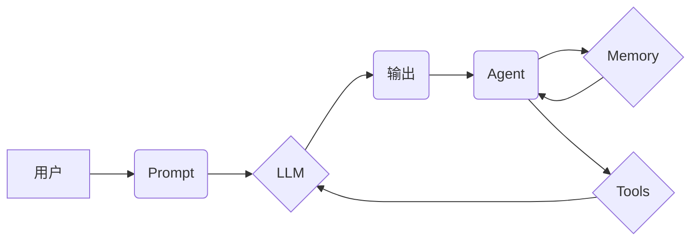

> Auto-GPT, Prompt 设计, 语言模型, AI 应用, 算法原理, 代码实现, 应用场景

## 1. 背景介绍

近年来，随着大语言模型（LLM）的快速发展，人工智能（AI）技术取得了令人瞩目的进展。Auto-GPT 作为一种基于 LLM 的自主代理，能够根据用户提供的目标自动生成、执行和优化一系列任务，展现出强大的智能化能力。然而，Auto-GPT 的性能和效果很大程度上取决于其所接收的 Prompt 设计。

一个精心设计的 Prompt 可以引导 Auto-GPT 准确理解用户意图，并生成高质量的输出。反之，一个模糊不清或不完整的 Prompt 则可能导致 Auto-GPT 产生错误的结果，甚至陷入无限循环。因此，掌握 Auto-GPT Prompt 设计的技巧对于充分发挥其潜力至关重要。

## 2. 核心概念与联系

Auto-GPT 的工作原理基于一个循环反馈机制，它不断地接收用户提供的 Prompt，生成相应的输出，并根据输出的结果进行调整和优化。

**核心概念：**

* **Prompt:** 用户向 Auto-GPT 提供的文本指令，明确了任务目标和期望结果。
* **LLM:** 大语言模型，例如 GPT-3.5 或 GPT-4，负责理解 Prompt 并生成文本输出。
* **Agent:** Auto-GPT 的核心组件，负责规划、执行和评估任务。
* **Memory:** Auto-GPT 的记忆模块，存储了之前对话的历史信息，帮助其保持上下文一致性。
* **Tools:** Auto-GPT 可以调用外部工具，例如搜索引擎、数据库或 API，以获取更多信息或完成特定任务。

**架构图：**

## 3. 核心算法原理 & 具体操作步骤

### 3.1  算法原理概述

Auto-GPT 的核心算法基于强化学习（RL）原理，通过奖励机制引导其学习最优的行动策略。

* **奖励函数:** 定义了 Auto-GPT 完成任务的程度，例如任务成功率、输出质量等。
* **策略网络:** 学习将输入状态映射到最优行动，例如生成下一个 Prompt 或调用特定工具。
* **训练过程:** Auto-GPT 通过与环境交互，不断收集奖励信号，并更新策略网络，使其能够在未来做出更优的决策。

### 3.2  算法步骤详解

1. **接收 Prompt:** Auto-GPT 从用户接收初始 Prompt。
2. **生成行动:** 根据当前状态和策略网络，Auto-GPT 生成一个行动，例如生成下一个 Prompt 或调用工具。
3. **执行行动:** Auto-GPT 执行生成的行动，并获取相应的输出。
4. **评估奖励:** 根据输出结果和奖励函数，计算 Auto-GPT 完成任务的程度。
5. **更新策略网络:** 使用奖励信号更新策略网络，使其能够在未来做出更优的决策。
6. **重复步骤 2-5:** Auto-GPT 持续循环执行上述步骤，直到完成任务或达到终止条件。

### 3.3  算法优缺点

**优点:**

* **自主性强:** Auto-GPT 可以自主规划和执行任务，无需人工干预。
* **适应性强:** Auto-GPT 可以根据环境变化调整策略，适应不同的任务需求。
* **效率高:** Auto-GPT 可以并行执行多个任务，提高工作效率。

**缺点:**

* **训练成本高:** Auto-GPT 的训练需要大量的计算资源和数据。
* **可解释性差:** Auto-GPT 的决策过程较为复杂，难以解释其背后的逻辑。
* **安全风险:** Auto-GPT 可能被用于恶意目的，例如生成虚假信息或攻击系统。

### 3.4  算法应用领域

Auto-GPT 的应用领域非常广泛，包括：

* **文本生成:** 自动撰写文章、故事、诗歌等。
* **代码生成:** 自动生成代码片段、函数、类等。
* **数据分析:** 自动分析数据、发现模式、生成报告。
* **客户服务:** 自动回复客户咨询、解决问题。
* **游戏开发:** 自动生成游戏关卡、NPC对话等。

## 4. 数学模型和公式 & 详细讲解 & 举例说明

### 4.1  数学模型构建

Auto-GPT 的核心算法基于强化学习，其数学模型可以概括为以下几个方面：

* **状态空间:** Auto-GPT 的当前状态，包括任务目标、已完成的任务、可用资源等。
* **动作空间:** Auto-GPT 可以执行的动作，例如生成 Prompt、调用工具、存储信息等。
* **奖励函数:**  $R(s, a)$，表示 Auto-GPT 在状态 $s$ 执行动作 $a$ 后获得的奖励。
* **价值函数:** $V(s)$，表示 Auto-GPT 在状态 $s$ 的长期奖励期望。
* **策略函数:** $\pi(s)$，表示 Auto-GPT 在状态 $s$ 下选择动作的概率分布。

### 4.2  公式推导过程

强化学习的目标是找到一个最优的策略函数 $\pi^*$，使得 Auto-GPT 在长期内获得最大的奖励总和。常用的算法，例如 Q-学习和 Deep Q-Network (DQN)，通过迭代更新价值函数和策略函数来实现这一目标。

* **Q-学习:**

$$
Q(s, a) = Q(s, a) + \alpha [r + \gamma \max_{a'} Q(s', a') - Q(s, a)]
$$

其中：

* $Q(s, a)$ 是状态 $s$ 下执行动作 $a$ 的 Q 值。
* $\alpha$ 是学习率。
* $r$ 是当前状态下获得的奖励。
* $\gamma$ 是折扣因子。
* $s'$ 是执行动作 $a$ 后进入的下一个状态。

* **DQN:**

DQN 使用深度神经网络来逼近价值函数 $Q(s, a)$，并通过经验回放和目标网络来稳定训练过程。

### 4.3  案例分析与讲解

假设 Auto-GPT 需要完成一个任务：写一篇关于“人工智能”的文章。

* **状态空间:** 包括任务目标（写一篇关于人工智能的文章）、已完成的任务（生成文章标题、引言等）、可用资源（网络搜索引擎、人工智能相关文档等）。
* **动作空间:** 包括生成文章段落、搜索相关信息、调用工具等。
* **奖励函数:** 可以根据文章的长度、质量、准确性等因素进行设计。

通过不断地接收 Prompt、执行动作、评估奖励，Auto-GPT 可以逐步生成一篇完整的文章。

## 5. 项目实践：代码实例和详细解释说明

### 5.1  开发环境搭建

Auto-GPT 的开发环境需要包含以下软件：

* Python 3.8 或更高版本
* PyTorch 或 TensorFlow 深度学习框架
* OpenAI API 访问权限

### 5.2  源代码详细实现

Auto-GPT 的源代码主要包含以下几个模块：

* **Agent:** 负责规划、执行和评估任务。
* **Memory:** 存储对话历史信息。
* **Tools:** 提供外部工具的接口。
* **Prompt Generator:** 生成高质量的 Prompt。

具体代码实现可以参考 Auto-GPT 的官方 GitHub 仓库。

### 5.3  代码解读与分析

Auto-GPT 的代码实现较为复杂，涉及到深度学习、自然语言处理、算法设计等多个领域。

* **Agent 模块:** 使用强化学习算法，例如 Q-learning 或 DQN，学习最优的行动策略。
* **Memory 模块:** 使用字典或列表存储对话历史信息，并提供访问和更新的方法。
* **Tools 模块:** 提供调用外部工具的接口，例如搜索引擎、数据库或 API。
* **Prompt Generator 模块:** 使用模板或预训练模型生成高质量的 Prompt。

### 5.4  运行结果展示

Auto-GPT 的运行结果可以根据任务目标和输入 Prompt 不同而有所差异。

* **文本生成:** Auto-GPT 可以生成高质量的文本，例如文章、故事、诗歌等。
* **代码生成:** Auto-GPT 可以生成代码片段、函数、类等。
* **数据分析:** Auto-GPT 可以分析数据、发现模式、生成报告。

## 6. 实际应用场景

### 6.1  内容创作

Auto-GPT 可以帮助作家、记者、营销人员等创作高质量的内容，例如撰写文章、生成创意文案、编写剧本等。

### 6.2  代码开发

Auto-GPT 可以帮助程序员自动生成代码片段、函数、类等，提高开发效率，减少代码编写错误。

### 6.3  客户服务

Auto-GPT 可以作为智能客服，自动回复客户咨询，解决常见问题，提高客户服务效率。

### 6.4  未来应用展望

随着 Auto-GPT 技术的不断发展，其应用场景将更加广泛，例如：

* **个性化教育:** 根据学生的学习进度和需求，自动生成个性化的学习内容。
* **医疗诊断:** 分析患者的症状和病史，辅助医生进行诊断。
* **科学研究:** 自动进行数据分析、实验设计和结果解读。

## 7. 工具和资源推荐

### 7.1  学习资源推荐

* **Auto-GPT 官方文档:** https://github.com/Significant-Gravitas/Auto-GPT
* **OpenAI API 文档:** https://platform.openai.com/docs/api-reference
* **强化学习教程:** https://www.coursera.org/learn/reinforcement-learning

### 7.2  开发工具推荐

* **Python:** https://www.python.org/
* **PyTorch:** https://pytorch.org/
* **TensorFlow:** https://www.tensorflow.org/

### 7.3  相关论文推荐

* **Auto-GPT: An Open-Source Framework for Autonomous Agents:** https://arxiv.org/abs/2303.14447
* **Deep Reinforcement Learning: An Overview:** https://arxiv.org/abs/1606.02933

## 8. 总结：未来发展趋势与挑战

### 8.1  研究成果总结

Auto-GPT 的出现标志着人工智能技术迈向一个新的阶段，它展现出强大的自主学习和执行能力，为解决复杂问题提供了新的思路。

### 8.2  未来发展趋势

未来，Auto-GPT 的发展趋势包括：

* **更强大的模型:** 使用更大型的语言模型和更先进的算法，提高 Auto-GPT 的性能和智能化水平。
* **更丰富的工具集:** 提供更多类型的工具和接口，使 Auto-GPT 能够完成更广泛的任务。
* **更安全的架构:** 加强 Auto-GPT 的安全性和可靠性，防止其被用于恶意目的。

### 8.3  面临的挑战

Auto-GPT 还面临着一些挑战，例如：

* **可解释性问题:** Auto-GPT 的决策过程较为复杂，难以解释其背后的逻辑，这可能会导致用户对其结果缺乏信任。
* **数据偏见问题:** Auto-GPT 的训练数据可能存在偏见，导致其生成的结果也存在偏见。
* **伦理问题:** Auto-GPT 的强大能力可能被用于违反伦理的行为，例如生成虚假信息、操纵舆论等。

### 8.4  研究展望

未来，研究者需要继续探索 Auto-GPT 的潜力，解决其面临的挑战，并将其应用于更多领域，为人类社会带来更多福祉。

## 9. 附录：常见问题与解答

**Q1: Auto-GPT 和 ChatGPT 的区别是什么？**

**A1:** Auto-GPT 是一个自主代理，能够根据目标自动规划和执行任务，而 ChatGPT 只是一个聊天机器人，只能根据用户输入生成文本。

**Q2: 如何训练 Auto-GPT？**

**A2:** Auto-GPT 的训练需要大量的计算资源和数据，可以使用强化学习算法，例如 Q-learning 或 DQN，来训练其策略网络。

**Q3: Auto-GPT 是否可以访问互联网？**

**A3:** Auto-GPT 可以通过调用工具接口访问互联网，