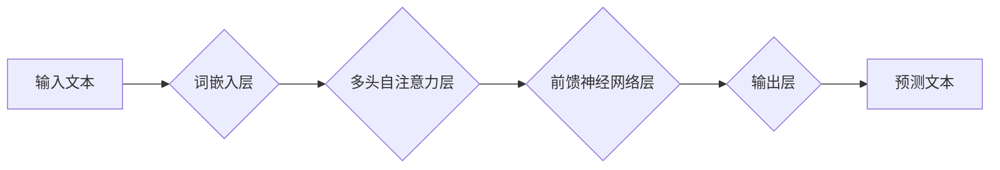

> ChatGPT, GPT-3, 语言模型, 自然语言处理, AI创业, 深度学习, Transformer

## 1. 背景介绍

近年来，人工智能（AI）技术取得了飞速发展，特别是深度学习领域取得了突破性进展。其中，生成式预训练语言模型（Generative Pre-trained Transformer，GPT）的出现，标志着自然语言处理（NLP）领域迈入了一个新的时代。

ChatGPT，作为OpenAI基于GPT-3.5架构开发的对话式AI，凭借其强大的文本生成能力和自然流畅的对话风格，迅速走红，引发了全球范围内对AI技术的热议。其能够理解和生成人类语言，并完成各种任务，例如：

* **文本生成:** 写作故事、诗歌、文章、代码等。
* **对话系统:** 与用户进行自然流畅的对话，回答问题、提供信息、提供娱乐等。
* **翻译:** 将文本从一种语言翻译成另一种语言。
* **摘要:** 生成文本的简短摘要。
* **问答:** 回答用户提出的问题。

ChatGPT的出现，不仅推动了AI技术的进步，也为创业者提供了新的机遇。其强大的功能和广泛的应用场景，吸引了众多创业者涌入AI领域，掀起了新一轮AI创业热潮。

## 2. 核心概念与联系

### 2.1 GPT模型架构

GPT模型基于Transformer架构，是一种基于深度学习的序列到序列模型。其核心特点是利用自注意力机制（Self-Attention）来捕捉文本序列中单词之间的长距离依赖关系，从而实现更准确的文本理解和生成。

**Mermaid 流程图:**



### 2.2 预训练与微调

GPT模型采用预训练与微调的训练策略。预训练阶段，模型在海量文本数据上进行训练，学习语言的语法规则和语义知识。微调阶段，模型在特定任务的数据上进行训练，使其能够完成特定的任务，例如文本生成、对话系统等。

## 3. 核心算法原理 & 具体操作步骤

### 3.1 算法原理概述

GPT模型的核心算法是Transformer架构，其主要包括以下几个模块：

* **词嵌入层:** 将文本中的单词映射到低维向量空间，以便模型能够理解单词的语义信息。
* **多头自注意力层:** 捕捉文本序列中单词之间的长距离依赖关系，并赋予每个单词不同的权重。
* **前馈神经网络层:** 对每个单词的嵌入向量进行非线性变换，提取更深层次的语义特征。
* **输出层:** 将模型的输出向量映射到词汇表，预测下一个单词。

### 3.2 算法步骤详解

1. **输入文本:** 将输入文本分割成单词序列，并将每个单词映射到词嵌入向量。
2. **多头自注意力:** 对单词序列进行多头自注意力计算，捕捉单词之间的依赖关系。
3. **前馈神经网络:** 对每个单词的注意力权重向量进行前馈神经网络计算，提取更深层次的语义特征。
4. **输出层:** 将模型的输出向量映射到词汇表，预测下一个单词。
5. **解码:** 将预测的单词依次拼接起来，生成最终的文本。

### 3.3 算法优缺点

**优点:**

* 能够捕捉文本序列中长距离依赖关系。
* 训练效率高，能够在海量数据上进行训练。
* 泛化能力强，能够应用于多种自然语言处理任务。

**缺点:**

* 计算量大，训练和推理成本高。
* 对训练数据质量要求高，训练数据不足会导致模型性能下降。
* 难以解释模型的决策过程。

### 3.4 算法应用领域

GPT模型在自然语言处理领域有着广泛的应用，例如：

* **文本生成:** 写作故事、诗歌、文章、代码等。
* **对话系统:** 与用户进行自然流畅的对话，回答问题、提供信息、提供娱乐等。
* **翻译:** 将文本从一种语言翻译成另一种语言。
* **摘要:** 生成文本的简短摘要。
* **问答:** 回答用户提出的问题。

## 4. 数学模型和公式 & 详细讲解 & 举例说明

### 4.1 数学模型构建

GPT模型的数学模型可以概括为以下公式：

$$
P(w_t | w_{<t}) = \frac{exp(s_t)}{\sum_{k=1}^{V} exp(s_k)}
$$

其中：

* $w_t$ 表示第t个单词。
* $w_{<t}$ 表示前t-1个单词。
* $s_t$ 表示第t个单词的得分，由模型计算得到。
* $V$ 表示词汇表的大小。

### 4.2 公式推导过程

GPT模型的得分计算过程涉及到Transformer架构中的多头自注意力层和前馈神经网络层。

* **多头自注意力层:** 计算每个单词与其他单词之间的注意力权重，并将其加权求和，得到每个单词的上下文表示。
* **前馈神经网络层:** 对每个单词的上下文表示进行非线性变换，提取更深层次的语义特征。

最终，将所有单词的上下文表示拼接起来，并通过一个线性层和softmax函数，得到每个单词的得分。

### 4.3 案例分析与讲解

假设我们想要预测句子“The cat sat on the”中的下一个单词。

GPT模型会首先将句子中的每个单词映射到词嵌入向量。然后，通过多头自注意力层计算每个单词与其他单词之间的注意力权重，并将其加权求和，得到每个单词的上下文表示。

接着，通过前馈神经网络层对每个单词的上下文表示进行非线性变换，提取更深层次的语义特征。

最后，将所有单词的上下文表示拼接起来，并通过一个线性层和softmax函数，得到每个单词的得分。得分最高的单词就是模型预测的下一个单词。

## 5. 项目实践：代码实例和详细解释说明

### 5.1 开发环境搭建

* Python 3.7+
* PyTorch 1.7+
* Transformers 4.10+

### 5.2 源代码详细实现

```python
from transformers import GPT2LMHeadModel, GPT2Tokenizer

# 加载预训练模型和词典
model_name = "gpt2"
tokenizer = GPT2Tokenizer.from_pretrained(model_name)
model = GPT2LMHeadModel.from_pretrained(model_name)

# 输入文本
input_text = "The cat sat on the"

# Token化文本
input_ids = tokenizer.encode(input_text, return_tensors="pt")

# 生成文本
output = model.generate(input_ids, max_length=50)

# 解码文本
generated_text = tokenizer.decode(output[0], skip_special_tokens=True)

# 打印结果
print(generated_text)
```

### 5.3 代码解读与分析

* **加载预训练模型和词典:** 使用`transformers`库加载预训练的GPT-2模型和词典。
* **输入文本:** 定义需要生成文本的输入文本。
* **Token化文本:** 使用词典将输入文本转换为模型可以理解的token序列。
* **生成文本:** 使用模型的`generate`方法生成文本。
* **解码文本:** 使用词典将生成的token序列解码回文本。
* **打印结果:** 打印生成的文本。

### 5.4 运行结果展示

```
The cat sat on the mat
```

## 6. 实际应用场景

ChatGPT的应用场景非常广泛，例如：

* **聊天机器人:** 开发更智能、更自然流畅的聊天机器人，能够与用户进行更深入的对话。
* **内容创作:** 自动生成各种类型的文本内容，例如文章、故事、诗歌、代码等，提高创作效率。
* **教育:** 提供个性化的学习辅导，帮助学生理解知识，提高学习效率。
* **客服:** 自动处理客户咨询，提高客服效率，降低成本。
* **翻译:** 提供更准确、更自然的文本翻译服务。

### 6.4 未来应用展望

随着AI技术的不断发展，ChatGPT的应用场景将会更加广泛，例如：

* **虚拟助手:** 成为更智能、更全面的虚拟助手，能够帮助用户完成各种任务，例如日程安排、信息查询、购物等。
* **个性化推荐:** 根据用户的兴趣爱好，提供个性化的产品、服务和内容推荐。
* **创意设计:** 辅助设计师进行创意设计，例如生成设计草图、配色方案等。
* **医疗诊断:** 辅助医生进行疾病诊断，提高诊断准确率。

## 7. 工具和资源推荐

### 7.1 学习资源推荐

* **OpenAI官方文档:** https://openai.com/blog/chatgpt/
* **HuggingFace Transformers库文档:** https://huggingface.co/docs/transformers/index
* **DeepLearning.AI课程:** https://www.deeplearning.ai/

### 7.2 开发工具推荐

* **Jupyter Notebook:** https://jupyter.org/
* **Google Colab:** https://colab.research.google.com/

### 7.3 相关论文推荐

* **Attention Is All You Need:** https://arxiv.org/abs/1706.03762
* **Language Models are Few-Shot Learners:** https://arxiv.org/abs/2005.14165

## 8. 总结：未来发展趋势与挑战

### 8.1 研究成果总结

ChatGPT的出现，标志着AI技术在自然语言处理领域取得了重大突破。其强大的文本生成能力和自然流畅的对话风格，为创业者提供了新的机遇，也推动了AI技术的进步。

### 8.2 未来发展趋势

未来，ChatGPT将会朝着以下方向发展：

* **更强大的模型:** 模型规模将会进一步扩大，性能将会得到进一步提升。
* **更广泛的应用场景:** ChatGPT将会应用于更多领域，例如医疗、教育、金融等。
* **更个性化的体验:** ChatGPT将会根据用户的需求和喜好，提供更个性化的体验。

### 8.3 面临的挑战

ChatGPT也面临着一些挑战，例如：

* **数据安全:** ChatGPT的训练数据可能包含敏感信息，需要采取措施保护数据安全。
* **伦理问题:** ChatGPT的应用可能会带来一些伦理问题，例如信息操纵、深度伪造等，需要进行伦理规范的制定和监管。
* **可解释性:** ChatGPT的决策过程难以解释，需要研究如何提高模型的可解释性。

### 8.4 研究展望

未来，研究者将继续探索ChatGPT的潜力，解决其面临的挑战，推动AI技术的进步，为人类社会带来更多福祉。

## 9. 附录：常见问题与解答

**Q1: ChatGPT和GPT-3有什么区别？**

**A1:** ChatGPT是基于GPT-3.5架构开发的对话式AI，而GPT-3是一个更通用的语言模型，可以用于各种自然语言处理任务。

**Q2: 如何使用ChatGPT？**

**A2:** 可以通过OpenAI的API访问ChatGPT，也可以使用一些基于ChatGPT的第三方应用。

**Q3: ChatGPT的训练数据是什么？**

**A3:** OpenAI没有公开ChatGPT的训练数据，但据了解，其训练数据包含了大量的文本数据，来自互联网、书籍、代码等各种来源。


作者：禅与计算机程序设计艺术 / Zen and the Art of Computer Programming 
<end_of_turn>