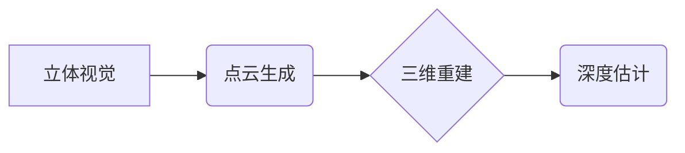

> 3D Computer Vision, 深度学习, 计算机视觉, 立体视觉, 点云处理, 3D Reconstruction, OpenCV, PyTorch

## 1. 背景介绍

随着计算机视觉技术的飞速发展，3D Computer Vision（三维计算机视觉）作为其重要分支，在自动驾驶、机器人、增强现实、虚拟现实等领域展现出巨大的应用潜力。3D Computer Vision旨在从二维图像或视频序列中重建三维场景，并对三维场景进行理解和分析。

传统的3D Computer Vision方法主要依赖于结构光、激光雷达等传感器获取三维信息，但这些方法成本高、精度有限。近年来，深度学习技术的兴起为3D Computer Vision带来了新的突破。深度学习模型能够从大量图像数据中学习到复杂的特征，并用于重建三维场景、识别物体、估计深度等任务。

## 2. 核心概念与联系

3D Computer Vision的核心概念包括：

* **立体视觉:** 利用两幅或多幅从不同视角拍摄的图像，通过计算图像中对应点之间的视差，推断出三维场景深度信息。
* **点云:** 点云是一种三维数据表示形式，由空间中一系列点组成，每个点包含其三维坐标信息。
* **三维重建:** 从二维图像或视频序列中重建三维场景，包括点云生成、三角网生成、三维模型生成等。
* **深度估计:** 从图像中估计每个像素点的深度值，从而构建三维场景深度图。

**核心概念架构图:**



## 3. 核心算法原理 & 具体操作步骤

### 3.1  算法原理概述

立体视觉算法是3D Computer Vision的核心算法之一，其原理是利用两幅或多幅从不同视角拍摄的图像，通过计算图像中对应点之间的视差，推断出三维场景深度信息。

### 3.2  算法步骤详解

1. **特征提取:** 从两幅图像中提取特征点，常用的特征点检测算法包括SIFT、SURF、ORB等。
2. **特征匹配:** 将两幅图像中的特征点进行匹配，找到对应关系。
3. **视差计算:** 计算匹配特征点之间的视差，视差值与深度信息成反比。
4. **深度估计:** 根据视差值和相机参数，计算出三维场景的深度信息。

### 3.3  算法优缺点

**优点:**

* 能够直接获取三维场景深度信息。
* 算法原理相对简单，易于理解和实现。

**缺点:**

* 依赖于两幅或多幅图像，需要保证图像的重叠度和视角差异。
* 视差计算精度受图像质量和相机参数的影响。

### 3.4  算法应用领域

立体视觉算法广泛应用于以下领域:

* **自动驾驶:** 用于感知周围环境、估计车距和障碍物距离。
* **机器人:** 用于导航、抓取和避障。
* **三维重建:** 用于重建建筑物、文物和场景等。

## 4. 数学模型和公式 & 详细讲解 & 举例说明

### 4.1  数学模型构建

立体视觉的数学模型主要基于三角几何原理。假设相机模型为针孔模型，则图像中的点和三维空间中的点之间存在以下关系:

$$
\mathbf{x} = \mathbf{P} \mathbf{X}
$$

其中:

* $\mathbf{x}$ 是图像平面上的点坐标。
* $\mathbf{X}$ 是三维空间中的点坐标。
* $\mathbf{P}$ 是相机投影矩阵。

### 4.2  公式推导过程

根据立体视觉原理，我们可以推导出视差和深度之间的关系:

$$
d = \frac{f \cdot B}{x}
$$

其中:

* $d$ 是深度值。
* $f$ 是相机的焦距。
* $B$ 是两相机之间的基线距离。
* $x$ 是视差值。

### 4.3  案例分析与讲解

假设两相机之间的基线距离为 $B = 0.5$ 米，焦距为 $f = 50$ 毫米，图像中某点的视差值为 $x = 10$ 像素，则该点的深度值为:

$$
d = \frac{0.05 \cdot 0.5}{10} = 0.0025 \text{ 米}
$$

## 5. 项目实践：代码实例和详细解释说明

### 5.1  开发环境搭建

本项目使用Python语言和OpenCV库进行开发。

* 安装Python环境
* 安装OpenCV库: `pip install opencv-python`

### 5.2  源代码详细实现

```python
import cv2

# 读取两幅立体图像
left_image = cv2.imread('left.jpg')
right_image = cv2.imread('right.jpg')

# 匹配特征点
sift = cv2.SIFT_create()
keypoints_left, descriptors_left = sift.detectAndCompute(left_image, None)
keypoints_right, descriptors_right = sift.detectAndCompute(right_image, None)
bf = cv2.BFMatcher()
matches = bf.match(descriptors_left, descriptors_right)

# 绘制匹配特征点
matched_points = []
for match in matches:
    matched_points.append((match.queryIdx, match.trainIdx))
matched_points = np.array(matched_points)
left_image = cv2.drawMatches(left_image, keypoints_left, right_image, keypoints_right, matched_points, None)

# 计算视差图
# ...

# 显示结果
cv2.imshow('Matched Points', left_image)
cv2.waitKey(0)
```

### 5.3  代码解读与分析

* 使用SIFT算法提取特征点并计算描述子。
* 使用BFMatcher算法匹配特征点。
* 绘制匹配特征点。
* 计算视差图。

### 5.4  运行结果展示

运行代码后，将显示两幅图像中匹配的特征点，以及计算出的视差图。

## 6. 实际应用场景

### 6.1  自动驾驶

3D Computer Vision在自动驾驶中用于感知周围环境、识别道路标志、检测行人、车辆和障碍物等。

### 6.2  机器人

3D Computer Vision在机器人领域用于导航、抓取和避障。

### 6.3  增强现实

3D Computer Vision在增强现实中用于将虚拟物体叠加到现实世界中，提供更沉浸式的体验。

### 6.4  未来应用展望

3D Computer Vision在未来将有更广泛的应用，例如：

* **医疗领域:** 用于医学图像分析、手术辅助和虚拟手术模拟。
* **工业领域:** 用于缺陷检测、质量控制和机器人协作。
* **文化遗产保护:** 用于三维重建和虚拟展示。

## 7. 工具和资源推荐

### 7.1  学习资源推荐

* **书籍:**
    * "Multiple View Geometry in Computer Vision" by Richard Hartley and Andrew Zisserman
    * "3D Computer Vision: A Modern Approach" by David Forsyth and Jean Ponce
* **在线课程:**
    * Coursera: "3D Vision" by Stanford University
    * Udacity: "Self-Driving Car Engineer Nanodegree"

### 7.2  开发工具推荐

* **OpenCV:** 一个开源的计算机视觉库。
* **PyTorch:** 一个开源的深度学习框架。
* **PCL:** 一个开源的点云处理库。

### 7.3  相关论文推荐

* "Deep Learning for 3D Object Detection" by Liu et al.
* "Monocular Depth Estimation with Deep Convolutional Neural Networks" by Eigen et al.
* "Learning to Reconstruct 3D Scenes from a Single Image" by Kendall et al.

## 8. 总结：未来发展趋势与挑战

### 8.1  研究成果总结

近年来，3D Computer Vision取得了显著进展，深度学习技术为该领域带来了新的突破。

### 8.2  未来发展趋势

* **单目3D重建:** 利用单幅图像进行三维重建，降低成本和复杂度。
* **多传感器融合:** 将不同传感器的数据融合，提高三维重建的精度和鲁棒性。
* **实时3D感知:** 实现实时三维场景感知，满足自动驾驶等应用的需求。

### 8.3  面临的挑战

* **数据标注:** 3D Computer Vision需要大量的标注数据，标注成本高。
* **算法复杂度:** 一些3D Computer Vision算法计算复杂度高，难以实现实时处理。
* **硬件限制:** 高精度3D重建需要强大的计算能力和存储空间。

### 8.4  研究展望

未来，3D Computer Vision将继续朝着更准确、更鲁棒、更实时、更低成本的方向发展。


## 9. 附录：常见问题与解答

### 9.1  Q1: 如何选择合适的特征点检测算法？

**A1:** 选择特征点检测算法需要根据具体应用场景和图像特点进行选择。

* **SIFT:** 鲁棒性强，但计算复杂度高。
* **SURF:** 计算复杂度较低，但鲁棒性不如SIFT。
* **ORB:** 计算复杂度最低，但鲁棒性相对较弱。

### 9.2  Q2: 如何提高视差图的精度？

**A2:** 提高视差图精度的方法包括:

* 使用更高分辨率的图像。
* 减少相机之间的基线距离。
* 使用更精确的相机参数。
* 使用更先进的视差计算算法。


作者：禅与计算机程序设计艺术 / Zen and the Art of Computer Programming 
<end_of_turn>