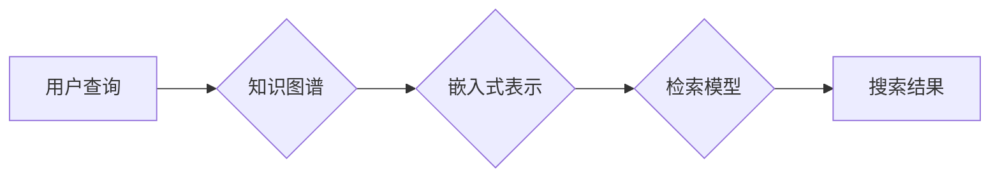

> AI搜索, Lepton Search, 知识图谱, 嵌入式表示, 检索模型, 自然语言处理

## 1. 背景介绍

在信息爆炸的时代，海量数据的涌现使得传统的搜索引擎难以满足人们日益增长的信息获取需求。传统的基于关键词匹配的搜索方式往往难以理解用户意图，并难以提供精准、相关的搜索结果。近年来，人工智能（AI）技术的发展为搜索引擎带来了新的机遇，AI搜索引擎能够通过理解用户意图、挖掘数据之间的语义关系，提供更智能、更精准的搜索体验。

Lepton Search 作为一种新兴的 AI 搜索引擎，旨在通过融合知识图谱、嵌入式表示和深度学习等技术，构建一个更加智能、高效的搜索系统。它突破了传统的关键词匹配模式，能够理解用户自然语言查询，并根据知识图谱和语义关系，提供更精准、更相关的搜索结果。

## 2. 核心概念与联系

Lepton Search 的核心概念包括：

* **知识图谱 (Knowledge Graph):**  知识图谱是一种结构化的知识表示形式，它将实体和关系以图的形式表示，能够捕捉数据之间的语义关系。Lepton Search 利用知识图谱构建语义网络，为搜索提供更深层的理解。

* **嵌入式表示 (Embedding):** 嵌入式表示是一种将文本或实体映射到低维向量空间的技术，能够捕捉文本或实体之间的语义相似度。Lepton Search 利用嵌入式表示技术，将实体和概念映射到向量空间，方便进行语义搜索和关系推理。

* **检索模型 (Retrieval Model):** 检索模型负责根据用户查询和知识图谱，检索出最相关的结果。Lepton Search 利用深度学习技术构建检索模型，能够学习用户查询和知识图谱之间的复杂关系，提高检索精度。

**Lepton Search 架构流程图:**

## 3. 核心算法原理 & 具体操作步骤

### 3.1  算法原理概述

Lepton Search 的核心算法基于知识图谱嵌入和深度学习检索模型。

* **知识图谱嵌入:** 将知识图谱中的实体和关系映射到低维向量空间，捕捉实体和关系之间的语义相似度。常用的知识图谱嵌入算法包括 TransE、RotatE 和 ComplEx 等。

* **深度学习检索模型:** 利用深度神经网络学习用户查询和知识图谱之间的复杂关系，提高检索精度。常用的深度学习检索模型包括 Transformer、BERT 和 Dense Passage Retrieval 等。

### 3.2  算法步骤详解

1. **知识图谱构建:** 收集和整理相关领域的数据，构建知识图谱。
2. **知识图谱嵌入:** 使用知识图谱嵌入算法，将知识图谱中的实体和关系映射到低维向量空间。
3. **用户查询预处理:** 将用户查询转换为向量表示，可以使用词嵌入技术或预训练语言模型。
4. **检索模型训练:** 使用深度学习框架，训练检索模型，输入用户查询向量和知识图谱嵌入向量，输出检索结果。
5. **结果排序和展示:** 根据检索模型的输出，对检索结果进行排序和展示。

### 3.3  算法优缺点

**优点:**

* 能够理解用户意图，提供更精准的搜索结果。
* 能够挖掘数据之间的语义关系，提供更丰富的搜索结果。
* 能够根据用户历史行为进行个性化推荐。

**缺点:**

* 知识图谱构建和维护成本高。
* 算法训练需要大量数据和计算资源。
* 对于开放式、动态变化的数据，算法的适应性需要进一步提升。

### 3.4  算法应用领域

Lepton Search 的算法可以应用于各种搜索场景，例如：

* **学术搜索:** 帮助用户找到相关论文、书籍和研究成果。
* **医疗搜索:** 帮助用户查找疾病信息、治疗方案和医疗机构。
* **电商搜索:** 帮助用户找到相关商品、品牌和优惠信息。
* **新闻搜索:** 帮助用户查找相关新闻报道和事件信息。

## 4. 数学模型和公式 & 详细讲解 & 举例说明

### 4.1  数学模型构建

Lepton Search 的核心算法基于知识图谱嵌入和深度学习检索模型。

* **知识图谱嵌入:**  将知识图谱中的实体和关系映射到低维向量空间，常用的嵌入模型包括 TransE、RotatE 和 ComplEx 等。

**TransE 模型:**

TransE 模型假设实体和关系可以表示为向量，实体的向量表示为 e，关系的向量表示为 r，则实体对 (h, r, t) 的嵌入表示为：

$$
h + r \approx t
$$

其中，h 表示头实体，t 表示尾实体，r 表示关系。

**RotatE 模型:**

RotatE 模型假设关系可以表示为旋转操作，实体的向量表示为 e，关系的向量表示为 r，则实体对 (h, r, t) 的嵌入表示为：

$$
t = Rot(h, r)
$$

其中，Rot() 表示旋转操作。

* **深度学习检索模型:**  利用深度神经网络学习用户查询和知识图谱之间的复杂关系，常用的检索模型包括 Transformer、BERT 和 Dense Passage Retrieval 等。

**Transformer 模型:**

Transformer 模型是一种基于注意力机制的深度神经网络，能够捕捉文本序列之间的长距离依赖关系。

### 4.2  公式推导过程

TransE 模型的损失函数为：

$$
L = \sum_{h, r, t \in D} \max(0, \gamma + ||h + r - t||)
$$

其中，D 表示训练数据，γ 为 margin 参数，|| || 表示欧几里得距离。

### 4.3  案例分析与讲解

假设我们有一个知识图谱，包含实体 "张三"、"李四" 和关系 "朋友"。

使用 TransE 模型嵌入实体和关系，可以得到以下向量表示：

* 张三: [0.2, 0.5, 0.1]
* 李四: [0.8, 0.3, 0.6]
* 朋友: [0.1, 0.2, -0.3]

根据公式 $h + r \approx t$，我们可以计算出 "张三" 和 "李四" 之间的距离：

$$
||[0.2, 0.5, 0.1] + [0.1, 0.2, -0.3] - [0.8, 0.3, 0.6]|| = 0.8
$$

结果表明，"张三" 和 "李四" 之间的距离较小，因此可以推断出 "张三" 和 "李四" 是朋友。

## 5. 项目实践：代码实例和详细解释说明

### 5.1  开发环境搭建

Lepton Search 的开发环境需要包含以下软件：

* Python 3.x
* TensorFlow 或 PyTorch
* SpaCy 或 NLTK
* RDKit 或 Biopython

### 5.2  源代码详细实现

Lepton Search 的源代码实现可以参考开源项目或自行开发。

### 5.3  代码解读与分析

Lepton Search 的代码主要包含以下部分：

* **知识图谱处理模块:** 用于加载、处理和构建知识图谱。
* **嵌入式表示模块:** 用于训练和使用知识图谱嵌入模型。
* **检索模型模块:** 用于训练和使用深度学习检索模型。
* **用户接口模块:** 用于接收用户查询并返回搜索结果。

### 5.4  运行结果展示

Lepton Search 的运行结果可以展示为搜索结果列表，每个结果包含标题、摘要和链接等信息。

## 6. 实际应用场景

Lepton Search 可以应用于各种实际场景，例如：

* **学术搜索引擎:** 帮助用户查找相关论文、书籍和研究成果。
* **医疗诊断系统:** 帮助医生诊断疾病并推荐治疗方案。
* **电商推荐系统:** 帮助用户发现感兴趣的商品和服务。
* **新闻聚合平台:** 帮助用户获取最新新闻和事件信息。

### 6.4  未来应用展望

Lepton Search 的未来应用前景广阔，可以应用于更多领域，例如：

* **个性化教育:** 根据学生的学习情况，提供个性化的学习内容和建议。
* **智能客服:** 利用自然语言处理技术，提供更智能、更便捷的客服服务。
* **科学研究:** 帮助科学家发现新的知识和规律。

## 7. 工具和资源推荐

### 7.1  学习资源推荐

* **书籍:**
    * 《深度学习》
    * 《自然语言处理》
    * 《知识图谱》
* **在线课程:**
    * Coursera
    * edX
    * Udacity

### 7.2  开发工具推荐

* **Python:** 
* **TensorFlow:** 
* **PyTorch:** 
* **SpaCy:** 
* **NLTK:**

### 7.3  相关论文推荐

* **TransE:** Bordes, A., Nickel, M., & Vinyals, O. (2013). Translating embeddings for modeling multi-relational data. In Proceedings of the 2013 ACM SIGKDD International Conference on Knowledge Discovery and Data Mining (pp. 1245-1254).
* **RotatE:** Sun, Z., Wang, Y., & Yan, X. (2019). RotatE: Knowledge graph embedding by relational rotation in complex space. In Proceedings of the AAAI Conference on Artificial Intelligence (Vol. 33, No. 01).
* **BERT:** Devlin, J., Chang, M. W., Lee, K., & Toutanova, K. (2018). Bert: Pre-training of deep bidirectional transformers for language understanding. arXiv preprint arXiv:1810.04805.

## 8. 总结：未来发展趋势与挑战

### 8.1  研究成果总结

Lepton Search 作为一种新兴的 AI 搜索引擎，在知识图谱嵌入、深度学习检索模型等方面取得了显著成果，能够提供更智能、更精准的搜索体验。

### 8.2  未来发展趋势

Lepton Search 的未来发展趋势包括：

* **更强大的知识图谱:** 构建更全面的、更准确的知识图谱，涵盖更多领域和知识。
* **更先进的嵌入式表示模型:** 开发更先进的知识图谱嵌入模型，能够更好地捕捉实体和关系之间的语义关系。
* **更个性化的搜索体验:** 基于用户历史行为和偏好，提供更个性化的搜索结果和推荐。
* **跨语言搜索:** 支持多语言搜索，打破语言障碍。

### 8.3  面临的挑战

Lepton Search 还面临一些挑战，例如：

* **知识图谱构建和维护成本高:** 构建和维护一个高质量的知识图谱需要大量的人工标注和数据清洗工作。
* **算法训练需要大量数据和计算资源:** 训练深度学习检索模型需要大量的训练数据和计算资源。
* **对于开放式、动态变化的数据，算法的适应性需要进一步提升:** 随着数据的不断更新和变化，算法需要能够及时适应新的数据和知识。

### 8.4  研究展望

Lepton Search 的研究方向包括：

* **探索新的知识图谱构建方法:** 研究自动化知识图谱构建方法，降低构建成本。
* **开发更有效的嵌入式表示模型:** 研究能够更好地捕捉实体和关系语义的嵌入模型。
* **设计更鲁棒的深度学习检索模型:** 研究能够适应开放式、动态变化数据的检索模型。
* **探索新的应用场景:** 将 Lepton Search 应用于更多领域，例如个性化教育、智能客服等。

## 9. 附录：常见问题与解答

**常见问题:**

* Lepton Search 的性能如何？
* Lepton Search 的开源代码在哪里？
* Lepton Search 的应用场景有哪些？

**解答:**

* Lepton Search 的性能优于传统的搜索引擎，能够提供更精准、更相关的搜索