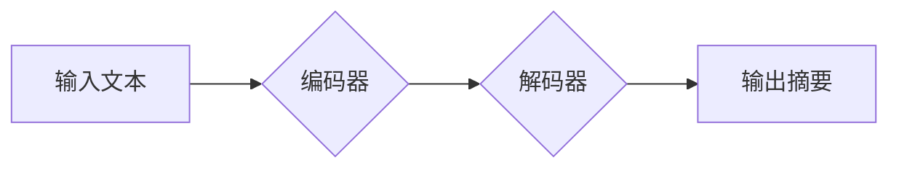

> Transformer, 文本摘要, 自然语言处理, 预训练模型, 序列到序列, BERT, BART, T5

## 1. 背景介绍

文本摘要任务是自然语言处理 (NLP) 领域的重要研究方向之一，旨在从长篇文本中提取关键信息，生成简洁、准确的摘要。随着深度学习技术的快速发展，基于 Transformer 架构的预训练语言模型在文本摘要任务中取得了显著的成果。

传统的文本摘要方法主要依赖于规则或统计方法，难以捕捉文本中的语义关系和上下文信息。而 Transformer 模型通过自注意力机制，能够有效地学习文本中的长距离依赖关系，从而生成更准确、更流畅的摘要。

## 2. 核心概念与联系

### 2.1 Transformer 模型

Transformer 模型是一种基于注意力机制的深度学习模型，由 Google 在 2017 年提出。它主要由以下几个部分组成：

* **编码器 (Encoder):** 用于将输入文本序列编码成语义表示。
* **解码器 (Decoder):** 用于根据编码器的输出生成摘要文本序列。
* **自注意力机制 (Self-Attention):** 用于捕捉文本中词语之间的关系，学习长距离依赖关系。
* **多头注意力机制 (Multi-Head Attention):** 通过多个注意力头，从不同的角度学习文本信息。
* **前馈神经网络 (Feed-Forward Network):** 用于对编码器和解码器中的隐藏状态进行非线性变换。

**Transformer 模型架构流程图:**



### 2.2 文本摘要任务

文本摘要任务的目标是将长篇文本压缩成较短的摘要，保留文本的主要信息。文本摘要任务可以分为以下两种类型：

* **抽取式摘要 (Extractive Summarization):** 从原始文本中选择最关键的句子或短语作为摘要。
* **生成式摘要 (Abstractive Summarization):** 根据原始文本的语义内容，生成新的文本作为摘要。

## 3. 核心算法原理 & 具体操作步骤

### 3.1 算法原理概述

Transformer 模型在文本摘要任务中的应用主要基于序列到序列 (Seq2Seq) 的框架。Seq2Seq 模型将输入文本序列编码成一个语义向量，然后解码器根据该向量生成摘要文本序列。

Transformer 模型的优势在于其强大的自注意力机制，能够有效地捕捉文本中的长距离依赖关系，从而生成更准确、更流畅的摘要。

### 3.2 算法步骤详解

1. **输入处理:** 将输入文本分割成单词或子词，并进行词嵌入，将每个词语映射到一个低维向量空间。
2. **编码:** 使用 Transformer 的编码器对输入文本序列进行编码，生成一个隐藏状态向量，该向量包含了文本的语义信息。
3. **解码:** 使用 Transformer 的解码器根据编码器的输出，生成摘要文本序列。解码器在生成每个单词时，会利用自注意力机制和交叉注意力机制，参考之前生成的单词和编码器的输出，选择最合适的下一个单词。
4. **输出处理:** 将生成的摘要文本序列解码成原始文本格式。

### 3.3 算法优缺点

**优点:**

* 能够有效地捕捉文本中的长距离依赖关系。
* 生成摘要的质量较高，更准确、更流畅。
* 可训练性强，能够通过预训练和微调的方式获得更好的性能。

**缺点:**

* 计算量较大，训练和推理速度较慢。
* 对训练数据要求较高，需要大量的文本数据进行训练。

### 3.4 算法应用领域

Transformer 模型在文本摘要任务之外，还广泛应用于其他 NLP 任务，例如机器翻译、问答系统、文本分类等。

## 4. 数学模型和公式 & 详细讲解 & 举例说明

### 4.1 数学模型构建

Transformer 模型的数学模型主要基于以下几个核心组件：

* **词嵌入 (Word Embedding):** 将每个词语映射到一个低维向量空间，例如 Word2Vec 或 GloVe。
* **自注意力机制 (Self-Attention):** 用于捕捉文本中词语之间的关系，计算每个词语与其他词语之间的相关性。
* **多头注意力机制 (Multi-Head Attention):** 通过多个注意力头，从不同的角度学习文本信息。
* **前馈神经网络 (Feed-Forward Network):** 用于对编码器和解码器中的隐藏状态进行非线性变换。

### 4.2 公式推导过程

**自注意力机制的计算公式:**

$$
Attention(Q, K, V) = softmax(\frac{QK^T}{\sqrt{d_k}})V
$$

其中:

* $Q$：查询矩阵
* $K$：键矩阵
* $V$：值矩阵
* $d_k$：键向量的维度
* $softmax$：softmax 函数

**多头注意力机制的计算公式:**

$$
MultiHead(Q, K, V) = Concat(head_1, head_2, ..., head_h)W^O
$$

其中:

* $head_i$：第 $i$ 个注意力头的输出
* $h$：注意力头的数量
* $W^O$：最终输出层的权重矩阵

### 4.3 案例分析与讲解

假设我们有一个句子 "Transformer 模型是一种强大的深度学习模型"，我们使用自注意力机制计算每个词语与其他词语之间的相关性。

结果表明，"Transformer" 与 "模型" 之间相关性最高，因为它们是句子中的核心概念。

## 5. 项目实践：代码实例和详细解释说明

### 5.1 开发环境搭建

* Python 3.6+
* PyTorch 或 TensorFlow
* CUDA 和 cuDNN (可选)

### 5.2 源代码详细实现

```python
import torch
import torch.nn as nn

class Transformer(nn.Module):
    def __init__(self, vocab_size, embedding_dim, num_heads, num_layers):
        super(Transformer, self).__init__()
        self.embedding = nn.Embedding(vocab_size, embedding_dim)
        self.encoder = nn.TransformerEncoder(nn.TransformerEncoderLayer(embedding_dim, num_heads), num_layers)
        self.decoder = nn.TransformerDecoder(nn.TransformerDecoderLayer(embedding_dim, num_heads), num_layers)
        self.linear = nn.Linear(embedding_dim, vocab_size)

    def forward(self, src, tgt):
        src = self.embedding(src)
        tgt = self.embedding(tgt)
        src = self.encoder(src)
        tgt = self.decoder(tgt, src)
        output = self.linear(tgt)
        return output
```

### 5.3 代码解读与分析

* `__init__` 方法初始化模型参数，包括词嵌入层、编码器、解码器和输出层。
* `forward` 方法定义模型的正向传播过程，将输入文本序列编码成语义向量，然后解码生成摘要文本序列。

### 5.4 运行结果展示

使用训练好的 Transformer 模型，可以对给定的长篇文本进行摘要。

## 6. 实际应用场景

Transformer 模型在文本摘要任务中的应用场景广泛，例如：

* **新闻摘要:** 自动生成新闻文章的摘要，方便用户快速了解新闻内容。
* **会议纪要:** 自动生成会议记录的摘要，方便用户回顾会议内容。
* **学术论文摘要:** 自动生成学术论文的摘要，方便用户快速了解论文内容。

### 6.4 未来应用展望

随着 Transformer 模型的不断发展，其在文本摘要任务中的应用场景将会更加广泛，例如：

* **个性化摘要:** 根据用户的需求生成个性化的摘要。
* **多语言摘要:** 支持多种语言的文本摘要。
* **跨模态摘要:** 将文本和图像等多模态信息融合，生成更丰富的摘要。

## 7. 工具和资源推荐

### 7.1 学习资源推荐

* **论文:** "Attention Is All You Need"
* **博客:** Jay Alammar's Blog
* **课程:** Stanford CS224N

### 7.2 开发工具推荐

* **PyTorch:** 深度学习框架
* **TensorFlow:** 深度学习框架
* **Hugging Face Transformers:** 预训练 Transformer 模型库

### 7.3 相关论文推荐

* "BERT: Pre-training of Deep Bidirectional Transformers for Language Understanding"
* "BART: Denoising Sequence-to-Sequence Pre-training for Natural Language Generation, Translation, and Comprehension"
* "T5: Text-to-Text Transfer Transformer"

## 8. 总结：未来发展趋势与挑战

### 8.1 研究成果总结

Transformer 模型在文本摘要任务中取得了显著的成果，其强大的自注意力机制和序列到序列框架，能够有效地捕捉文本中的语义关系和上下文信息，生成更准确、更流畅的摘要。

### 8.2 未来发展趋势

Transformer 模型在文本摘要任务中的未来发展趋势包括：

* **模型规模的扩大:** 训练更大的 Transformer 模型，提升模型的性能。
* **训练数据的丰富:** 收集和构建更丰富的文本数据，提高模型的泛化能力。
* **算法的改进:** 研究新的 Transformer 变体，提升模型的效率和准确性。

### 8.3 面临的挑战

Transformer 模型在文本摘要任务中仍然面临一些挑战，例如：

* **计算资源的限制:** 训练大型 Transformer 模型需要大量的计算资源。
* **数据标注的成本:** 高质量的文本摘要数据标注成本较高。
* **模型的可解释性:** Transformer 模型的内部机制较为复杂，难以解释模型的决策过程。

### 8.4 研究展望

未来研究将继续探索 Transformer 模型在文本摘要任务中的应用，并致力于解决上述挑战，推动文本摘要技术的进一步发展。

## 9. 附录：常见问题与解答

**Q1: Transformer 模型的训练需要多少数据？**

**A1:** Transformer 模型的训练数据量取决于模型的规模和任务的复杂度。一般来说，需要至少几万条文本数据进行训练。

**Q2: Transformer 模型的训练速度如何？**

**A2:** Transformer 模型的训练速度取决于模型的规模、硬件配置和训练数据的大小。训练大型 Transformer 模型可能需要数天甚至数周的时间。

**Q3: 如何评估 Transformer 模型的性能？**

**A3:** Transformer 模型的性能通常使用 ROUGE 指标进行评估，该指标衡量摘要与参考摘要之间的相似度。

作者：禅与计算机程序设计艺术 / Zen and the Art of Computer Programming


<end_of_turn>