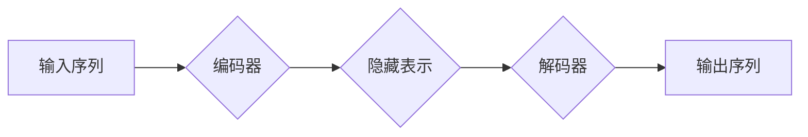

> Transformer, 多头注意力, Multi-Head Attention, 机器翻译, 自然语言处理, 深度学习

## 1. 背景介绍

近年来，深度学习在自然语言处理（NLP）领域取得了显著进展。传统的循环神经网络（RNN）在处理长序列数据时存在效率低下和梯度消失等问题。为了解决这些问题，谷歌于2017年提出了Transformer架构，并将其应用于机器翻译任务，取得了突破性的成果。Transformer的核心创新点在于引入了**自注意力机制（Self-Attention）**，使得模型能够更有效地捕捉序列中的长距离依赖关系。

## 2. 核心概念与联系

**2.1 自注意力机制（Self-Attention）**

自注意力机制是一种机制，它允许模型关注输入序列中不同位置的词，并根据这些词之间的关系计算每个词的权重。

**2.2 多头注意力（Multi-Head Attention）**

多头注意力机制是自注意力机制的扩展，它将自注意力机制应用于多个不同的子空间，并通过将这些子空间的结果进行融合，来获得更丰富的上下文信息。

**2.3 Transformer 架构**

Transformer 架构由编码器（Encoder）和解码器（Decoder）组成。编码器负责将输入序列映射到一个隐藏表示，解码器则根据隐藏表示生成输出序列。

**2.4 Mermaid 流程图**



## 3. 核心算法原理 & 具体操作步骤

**3.1 算法原理概述**

多头注意力机制的核心思想是将输入序列映射到多个不同的子空间，并在每个子空间中计算自注意力，最后将这些子空间的结果进行融合。

**3.2 算法步骤详解**

1. **线性变换:** 将输入序列 X 映射到多个不同的子空间，每个子空间的维度为 d_k。
2. **计算注意力权重:** 在每个子空间中，计算每个词与其他词之间的注意力权重。
3. **加权求和:** 根据注意力权重，对每个词进行加权求和，得到每个子空间的输出。
4. **拼接和线性变换:** 将所有子空间的输出拼接起来，并进行线性变换，得到最终的输出。

**3.3 算法优缺点**

**优点:**

* 能够有效地捕捉序列中的长距离依赖关系。
* 能够并行计算，提高效率。

**缺点:**

* 计算量较大。
* 训练复杂度高。

**3.4 算法应用领域**

多头注意力机制广泛应用于自然语言处理领域，例如：

* 机器翻译
* 文本摘要
* 问答系统
* 情感分析

## 4. 数学模型和公式 & 详细讲解 & 举例说明

**4.1 数学模型构建**

设输入序列为 X = (x_1, x_2, ..., x_n)，其中 x_i 是第 i 个词的嵌入向量。

**4.2 公式推导过程**

1. **线性变换:**

$$
W_q = \begin{bmatrix}
q_1 & q_2 & ... & q_n
\end{bmatrix}
$$

$$
W_k = \begin{bmatrix}
k_1 & k_2 & ... & k_n
\end{bmatrix}
$$

$$
W_v = \begin{bmatrix}
v_1 & v_2 & ... & v_n
\end{bmatrix}
$$

其中，W_q, W_k, W_v 分别是查询矩阵、键矩阵和值矩阵。

2. **计算注意力权重:**

$$
Attention(Q, K, V) = softmax(\frac{Q K^T}{\sqrt{d_k}}) V
$$

其中，softmax 函数将注意力权重归一化到 [0, 1] 之间。

3. **拼接和线性变换:**

$$
MultiHead(X) = Concat(head_1, head_2, ..., head_h) W_o
$$

其中，head_i 是第 i 个子空间的输出，h 是多头数量，W_o 是最终的线性变换矩阵。

**4.3 案例分析与讲解**

假设我们有一个输入序列 X = ("我", "爱", "学习", "编程"), 其中每个词的嵌入向量维度为 128。

1. 我们使用三个不同的线性变换矩阵 W_q, W_k, W_v 将输入序列映射到三个不同的子空间，每个子空间的维度为 64。
2. 在每个子空间中，我们计算每个词与其他词之间的注意力权重。
3. 根据注意力权重，我们对每个词进行加权求和，得到每个子空间的输出。
4. 最后，我们将三个子空间的输出拼接起来，并使用一个线性变换矩阵进行最终的变换，得到最终的输出。

## 5. 项目实践：代码实例和详细解释说明

**5.1 开发环境搭建**

* Python 3.6+
* PyTorch 1.0+
* CUDA 10.0+

**5.2 源代码详细实现**

```python
import torch
import torch.nn as nn

class MultiHeadAttention(nn.Module):
    def __init__(self, embed_dim, num_heads):
        super(MultiHeadAttention, self).__init__()
        self.embed_dim = embed_dim
        self.num_heads = num_heads
        self.head_dim = embed_dim // num_heads

        assert self.head_dim * num_heads == embed_dim, "Embed dim must be divisible by num_heads"

        self.query = nn.Linear(embed_dim, embed_dim)
        self.key = nn.Linear(embed_dim, embed_dim)
        self.value = nn.Linear(embed_dim, embed_dim)
        self.fc_out = nn.Linear(embed_dim, embed_dim)

    def forward(self, query, key, value, mask=None):
        batch_size = query.size(0)

        # Linear transformations
        Q = self.query(query).view(batch_size, -1, self.num_heads, self.head_dim).transpose(1, 2)
        K = self.key(key).view(batch_size, -1, self.num_heads, self.head_dim).transpose(1, 2)
        V = self.value(value).view(batch_size, -1, self.num_heads, self.head_dim).transpose(1, 2)

        # Scaled dot-product attention
        scores = torch.matmul(Q, K.transpose(-2, -1)) / torch.sqrt(torch.tensor(self.head_dim, dtype=torch.float))
        if mask is not None:
            scores = scores.masked_fill(mask == 0, -1e9)
        attention = torch.softmax(scores, dim=-1)

        # Weighted sum of values
        context = torch.matmul(attention, V)

        # Concatenate heads and project
        context = context.transpose(1, 2).contiguous().view(batch_size, -1, self.embed_dim)
        output = self.fc_out(context)

        return output
```

**5.3 代码解读与分析**

* `__init__` 方法初始化模型参数，包括嵌入维度、多头数量、每个子空间的维度等。
* `forward` 方法实现多头注意力的计算过程，包括线性变换、注意力权重计算、加权求和和最终的线性变换。

**5.4 运行结果展示**

运行上述代码，可以得到多头注意力机制的输出结果。

## 6. 实际应用场景

**6.1 机器翻译**

Transformer 架构在机器翻译任务中取得了显著的成果，例如 Google 的 BERT 模型。

**6.2 文本摘要**

Transformer 架构可以用于生成文本摘要，例如 BART 模型。

**6.3 问答系统**

Transformer 架构可以用于构建问答系统，例如 T5 模型。

**6.4 情感分析**

Transformer 架构可以用于情感分析，例如 RoBERTa 模型。

**6.5 未来应用展望**

多头注意力机制在未来将有更广泛的应用，例如：

* 代码生成
* 图像识别
* 语音识别

## 7. 工具和资源推荐

**7.1 学习资源推荐**

* **论文:** "Attention Is All You Need"
* **博客:** Jay Alammar's Blog
* **课程:** Stanford CS224N

**7.2 开发工具推荐**

* **PyTorch:** 深度学习框架
* **TensorFlow:** 深度学习框架

**7.3 相关论文推荐**

* BERT: Pre-training of Deep Bidirectional Transformers for Language Understanding
* BART: Denoising Sequence-to-Sequence Pre-training for Natural Language Generation, Translation, and Comprehension
* T5: Text-to-Text Transfer Transformer

## 8. 总结：未来发展趋势与挑战

**8.1 研究成果总结**

Transformer 架构和多头注意力机制在自然语言处理领域取得了突破性的成果，为深度学习的发展做出了重要贡献。

**8.2 未来发展趋势**

* **效率提升:** 研究更高效的多头注意力机制，降低计算复杂度。
* **模型规模扩大:** 研究更大规模的 Transformer 模型，提升模型能力。
* **跨模态应用:** 将 Transformer 架构应用于跨模态任务，例如图像和文本的联合理解。

**8.3 面临的挑战**

* **训练成本:** 训练大型 Transformer 模型需要大量的计算资源和时间。
* **可解释性:** Transformer 模型的内部机制比较复杂，难以解释模型的决策过程。
* **数据依赖:** Transformer 模型的性能依赖于高质量的训练数据。

**8.4 研究展望**

未来，Transformer 架构和多头注意力机制将继续在自然语言处理领域发挥重要作用，并拓展到更多领域，例如计算机视觉、语音识别等。


## 9. 附录：常见问题与解答

**9.1 Q: 多头注意力机制与自注意力机制有什么区别？**

**A:** 多头注意力机制是自注意力机制的扩展，它将自注意力机制应用于多个不同的子空间，并通过将这些子空间的结果进行融合，来获得更丰富的上下文信息。

**9.2 Q: 多头注意力机制的计算复杂度如何？**

**A:** 多头注意力机制的计算复杂度较高，主要集中在注意力权重计算阶段。

**9.3 Q: 如何选择多头数量？**

**A:** 多头数量的选择需要根据具体任务和模型规模进行调整。一般来说，多头数量越多，模型的表达能力越强，但计算复杂度也会越高。


作者：禅与计算机程序设计艺术 / Zen and the Art of Computer Programming 
<end_of_turn>