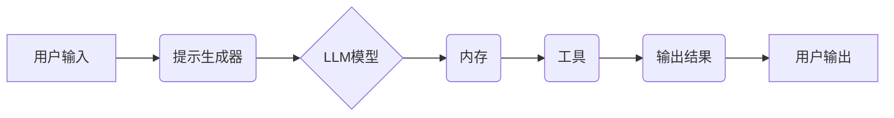

> LangChain, 大语言模型, 应用开发, 编程框架, AI助手, 自然语言处理, 聊天机器人, 代码生成

## 1. 背景介绍

近年来，大语言模型（LLM）的快速发展掀起了人工智能领域的热潮。这些强大的模型能够理解和生成人类语言，展现出令人惊叹的文本生成、翻译、问答和代码编写能力。然而，直接与LLM交互往往需要复杂的代码编写和数据处理，这对于普通开发者来说门槛较高。为了降低开发门槛，并更好地将LLM的强大功能应用于实际场景，LangChain应运而生。

LangChain是一个开源的框架，旨在简化与LLM交互的过程，并提供丰富的工具和组件，帮助开发者构建更复杂的AI应用程序。它提供了一套通用的架构和接口，可以轻松地将不同的LLM模型、数据源和工具组合在一起，从而实现更灵活、更强大的应用场景。

## 2. 核心概念与联系

LangChain的核心概念围绕着“链”这个词展开，它将LLM与其他组件连接起来，形成一个完整的应用流程。

**核心组件：**

* **模型（Model）：** LangChain支持多种主流LLM模型，例如OpenAI的GPT-3、Google的PaLM等。开发者可以根据自己的需求选择合适的模型。
* **提示（Prompt）：** 提示是与LLM交互的关键信息，它包含了开发者想要LLM完成的任务描述和相关上下文。LangChain提供了一系列工具来帮助开发者构建更有效的提示。
* **链（Chain）：** 链是LangChain的核心概念，它将多个组件连接起来，形成一个完整的应用流程。例如，一个简单的聊天机器人链可能包含一个LLM模型、一个提示生成器和一个用户输入处理模块。
* **内存（Memory）：** 内存可以存储与当前对话相关的上下文信息，帮助LLM更好地理解用户意图并提供更准确的回复。LangChain支持多种类型的内存，例如文本内存、向量内存等。
* **工具（Tool）：** 工具可以扩展LLM的功能，例如搜索引擎、数据库、计算器等。LangChain提供了一个工具库，开发者可以从中选择现成的工具，也可以自定义自己的工具。

**架构图：**



## 3. 核心算法原理 & 具体操作步骤

### 3.1  算法原理概述

LangChain的核心算法原理是基于**提示工程**和**链式调用**。

* **提示工程:** 通过精心设计提示，引导LLM模型生成更准确、更符合预期结果的输出。LangChain提供了一系列工具和技巧来帮助开发者构建更有效的提示。
* **链式调用:** 将多个组件连接起来，形成一个完整的应用流程。每个组件负责完成特定的任务，并将结果传递给下一个组件，最终实现整个应用的功能。

### 3.2  算法步骤详解

1. **定义应用场景:** 首先需要明确应用场景，例如聊天机器人、文本摘要、代码生成等。
2. **选择LLM模型:** 根据应用场景选择合适的LLM模型。
3. **设计提示:** 根据应用场景设计有效的提示，引导LLM模型生成预期结果。
4. **构建链:** 将LLM模型、提示生成器、内存、工具等组件连接起来，构建一个完整的应用流程。
5. **测试和优化:** 测试应用效果，并根据实际情况优化提示、链结构和组件配置。

### 3.3  算法优缺点

**优点:**

* **易于使用:** LangChain提供了一个简单的API，开发者可以轻松地与LLM模型交互。
* **灵活可扩展:** LangChain支持多种LLM模型、数据源和工具，开发者可以根据自己的需求灵活组合。
* **可复用性强:** LangChain的组件可以被复用到不同的应用场景中。

**缺点:**

* **依赖LLM模型:** LangChain的性能取决于所使用的LLM模型，如果模型能力不足，应用效果也会受到影响。
* **提示工程难度:** 设计有效的提示仍然是一个需要经验和技巧的环节。
* **资源消耗:** 使用LLM模型会消耗大量的计算资源。

### 3.4  算法应用领域

LangChain的应用领域非常广泛，例如：

* **聊天机器人:** 创建更智能、更自然的聊天机器人。
* **文本摘要:** 自动生成文本摘要，提高阅读效率。
* **代码生成:** 根据自然语言描述生成代码，提高开发效率。
* **问答系统:** 创建更准确、更全面的问答系统。
* **内容创作:** 辅助内容创作，例如生成文章标题、段落内容等。

## 4. 数学模型和公式 & 详细讲解 & 举例说明

LangChain本身并不依赖于特定的数学模型，它主要基于自然语言处理和机器学习的原理。然而，LLM模型的训练和推理过程涉及到复杂的数学公式和算法，例如：

### 4.1  数学模型构建

LLM模型通常采用**Transformer**架构，其核心是**自注意力机制**。自注意力机制允许模型在处理文本序列时，关注不同位置的词语之间的关系，从而更好地理解上下文信息。

### 4.2  公式推导过程

自注意力机制的计算公式如下：

$$
Attention(Q, K, V) = softmax(\frac{QK^T}{\sqrt{d_k}})V
$$

其中：

* $Q$：查询矩阵
* $K$：键矩阵
* $V$：值矩阵
* $d_k$：键向量的维度
* $softmax$：softmax函数

### 4.3  案例分析与讲解

假设我们有一个句子“我爱吃苹果”，要计算“吃”这个词与其他词语之间的注意力权重。

1. 将句子转换为词向量表示。
2. 计算查询矩阵 $Q$、键矩阵 $K$ 和值矩阵 $V$。
3. 计算注意力权重矩阵，并使用softmax函数将其归一化。
4. 将注意力权重矩阵与值矩阵相乘，得到最终的注意力输出。

通过注意力机制，模型可以学习到“吃”这个词与“我”、“爱”和“苹果”之间的关系，从而更好地理解句子的含义。

## 5. 项目实践：代码实例和详细解释说明

### 5.1  开发环境搭建

1. 安装Python 3.7+
2. 安装必要的库，例如：

```bash
pip install langchain openai
```

### 5.2  源代码详细实现

```python
from langchain.llms import OpenAI
from langchain.chains import ConversationChain
from langchain.memory import ConversationBufferMemory

# 初始化OpenAI模型
llm = OpenAI(temperature=0.7)

# 初始化对话内存
memory = ConversationBufferMemory()

# 创建对话链
conversation = ConversationChain(
    llm=llm,
    memory=memory,
    prompt= "你好，我是你的AI助手。请问有什么可以帮你的吗？"
)

# 与模型交互
while True:
    user_input = input("您:")
    response = conversation.run(user_input)
    print("AI:", response)
```

### 5.3  代码解读与分析

* **初始化LLM模型:** 使用`OpenAI`类实例化OpenAI模型，并设置温度参数控制模型的随机性。
* **初始化对话内存:** 使用`ConversationBufferMemory`类实例化对话内存，用于存储对话历史信息。
* **创建对话链:** 使用`ConversationChain`类创建对话链，并将LLM模型和对话内存作为参数传入。
* **与模型交互:** 使用循环结构不断获取用户输入，并通过`conversation.run()`方法与模型交互，获取模型的回复。

### 5.4  运行结果展示

```
您: 你好
AI: 你好，我是你的AI助手。请问有什么可以帮你的吗？
您: 你叫什么名字？
AI: 我没有名字，你可以叫我AI助手。
您: 你能写诗吗？
AI: 当然可以，你想写关于什么的诗？
```

## 6. 实际应用场景

LangChain在实际应用场景中展现出强大的潜力，例如：

### 6.1  聊天机器人

使用LangChain可以构建更智能、更自然的聊天机器人，例如客服机器人、陪伴机器人等。

### 6.2  文本摘要

LangChain可以帮助自动生成文本摘要，提高阅读效率，例如新闻摘要、会议记录摘要等。

### 6.3  代码生成

LangChain可以根据自然语言描述生成代码，提高开发效率，例如生成简单的函数代码、网页代码等。

### 6.4  未来应用展望

随着LLM模型的不断发展，LangChain的应用场景将会更加广泛，例如：

* **个性化教育:** 根据学生的学习情况，提供个性化的学习内容和辅导。
* **医疗诊断:** 辅助医生进行疾病诊断，提高诊断准确率。
* **法律服务:** 帮助律师进行法律研究和案件分析。

## 7. 工具和资源推荐

### 7.1  学习资源推荐

* **LangChain官方文档:** https://python.langchain.com/docs/
* **LangChain GitHub仓库:** https://github.com/langchain-ai/langchain
* **HuggingFace Transformers:** https://huggingface.co/docs/transformers/index

### 7.2  开发工具推荐

* **VS Code:** https://code.visualstudio.com/
* **PyCharm:** https://www.jetbrains.com/pycharm/

### 7.3  相关论文推荐

* **Attention Is All You Need:** https://arxiv.org/abs/1706.03762
* **BERT: Pre-training of Deep Bidirectional Transformers for Language Understanding:** https://arxiv.org/abs/1810.04805

## 8. 总结：未来发展趋势与挑战

### 8.1  研究成果总结

LangChain为开发人员提供了便捷的工具和框架，降低了使用LLM模型的门槛，促进了AI应用的普及。

### 8.2  未来发展趋势

* **更强大的LLM模型:** 未来LLM模型的规模和能力将会进一步提升，为LangChain提供更强大的基础。
* **更丰富的组件库:** LangChain的组件库将会更加丰富，支持更多类型的工具和功能。
* **更智能的链式调用:** LangChain将会支持更智能的链式调用，例如自动生成链结构、动态调整链参数等。

### 8.3  面临的挑战

* **模型可解释性:** LLM模型的决策过程往往难以理解，这可能会导致应用的可靠性问题。
* **数据安全和隐私:** 使用LLM模型需要处理大量的数据，如何保证数据安全和隐私是一个重要的挑战。
* **伦理问题:** LLM模型可能会被用于生成虚假信息、进行恶意攻击等，如何避免这些伦理问题是一个需要认真思考的问题。

### 8.4  研究展望

未来研究方向包括：

* **提高模型可解释性:** 研究更可解释的LLM模型，帮助开发者理解模型的决策过程。
* **开发更安全的应用框架:** 开发更安全的应用框架，防止模型被用于恶意目的。
* **探索新的应用场景:** 探索新的应用场景，将LangChain的强大功能应用到更多领域。

## 9. 附录：常见问题与解答

**Q1: 如何选择合适的LLM模型？**

**A1:** 选择合适的LLM模型取决于具体的应用场景。例如，如果需要生成高质量的文本，可以选择GPT-3等文本生成模型；如果需要进行代码生成，可以选择Codex等代码生成模型。

**Q2: 如何设计有效的提示？**

**A2:** 设计有效的提示需要考虑以下几个因素：

* **明确任务:** 提示应该清晰地描述任务目标。
* **提供上下文信息:** 提示应该提供足够的上下文信息，帮助模型理解任务背景。
* **控制模型输出:** 可以使用提示来控制模型的输出格式、长度等。

**