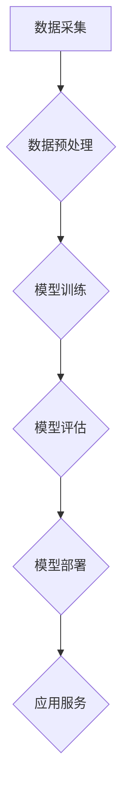

> 人工智能大模型，商业化，应用场景，技术架构，算法原理，开发实践，未来趋势

## 1. 背景介绍

人工智能（AI）技术近年来发展迅速，特别是大模型的涌现，为各行各业带来了前所未有的机遇。大模型是指参数规模庞大、训练数据海量的人工智能模型，具备强大的泛化能力和学习能力，能够在自然语言处理、计算机视觉、语音识别等领域取得突破性进展。

然而，大模型的开发和应用也面临着诸多挑战，例如高昂的训练成本、数据安全和隐私问题、模型解释性和可控性等。为了更好地推动大模型的商业化应用，需要从技术、商业模式、应用场景等多个方面进行深入探索。

## 2. 核心概念与联系

**2.1 大模型的概念**

大模型是指参数规模庞大、训练数据海量的人工智能模型。其参数数量通常在数十亿甚至数千亿级别，训练数据也达到数万亿甚至数千亿条。大模型的规模优势使其能够学习更复杂的模式和关系，从而在各种任务上表现出更强的能力。

**2.2 大模型的类型**

大模型主要分为以下几种类型：

* **自然语言处理（NLP）大模型:** 例如 GPT-3、BERT、LaMDA 等，擅长理解和生成文本，能够进行对话、翻译、写作、总结等任务。
* **计算机视觉（CV）大模型:** 例如 DALL-E 2、Stable Diffusion、Imagen 等，擅长理解和生成图像，能够进行图像识别、生成、编辑等任务。
* **多模态大模型:** 例如 Flamingo、PaLM-E 等，能够处理多种模态数据，例如文本、图像、音频等，能够进行跨模态理解和生成。

**2.3 大模型的架构**

大模型通常基于 Transformer 架构，其特点是能够有效地处理长距离依赖关系，并具有并行计算能力，适合训练大型模型。

**2.4 大模型的训练**

大模型的训练需要大量的计算资源和数据。通常采用自监督学习的方式，利用海量文本或图像数据进行预训练，然后在特定任务上进行微调。

**2.5 大模型的应用**

大模型在各个领域都有广泛的应用，例如：

* **自然语言处理:** 智能客服、机器翻译、文本摘要、写作辅助等。
* **计算机视觉:** 图像识别、物体检测、图像生成、视频分析等。
* **语音识别:** 语音助手、语音搜索、语音转文本等。
* **其他领域:** 药物研发、金融分析、科学研究等。

**2.6 大模型的商业化**

大模型的商业化主要通过以下几种方式：

* **API 服务:** 提供大模型的 API 接口，供开发者调用。
* **平台服务:** 建立大模型平台，提供模型训练、部署、管理等服务。
* **解决方案:** 基于大模型开发针对特定行业的解决方案。

**2.7 大模型的挑战**

大模型的商业化也面临着一些挑战，例如：

* **高昂的训练成本:** 训练大模型需要大量的计算资源和数据，成本较高。
* **数据安全和隐私问题:** 大模型的训练需要大量数据，如何保证数据安全和隐私是一个重要问题。
* **模型解释性和可控性:** 大模型的决策过程复杂，难以解释和控制，这可能会带来伦理和安全风险。

**2.8 Mermaid 流程图**



## 3. 核心算法原理 & 具体操作步骤

**3.1 算法原理概述**

大模型的训练主要基于深度学习算法，特别是 Transformer 架构。Transformer 架构的核心是注意力机制，能够有效地捕捉文本中的长距离依赖关系。

**3.2 算法步骤详解**

1. **数据预处理:** 将原始数据进行清洗、格式化、编码等操作，使其适合模型训练。
2. **模型构建:** 根据 Transformer 架构设计模型结构，包括编码器、解码器、注意力机制等模块。
3. **模型训练:** 使用训练数据训练模型，通过反向传播算法更新模型参数，使模型在训练数据上达到最佳性能。
4. **模型评估:** 使用验证数据评估模型的性能，并根据评估结果调整模型参数或结构。
5. **模型部署:** 将训练好的模型部署到生产环境中，提供应用服务。

**3.3 算法优缺点**

**优点:**

* 强大的泛化能力：能够学习到复杂的模式和关系，在未知数据上表现出色。
* 高的准确率：在许多任务上能够达到人类水平甚至超越人类水平的准确率。
* 可扩展性强：模型参数规模可以不断扩大，从而提升模型性能。

**缺点:**

* 训练成本高昂：需要大量的计算资源和数据。
* 数据依赖性强：模型性能受训练数据质量和数量的影响很大。
* 解释性和可控性差：模型的决策过程复杂，难以解释和控制。

**3.4 算法应用领域**

大模型的应用领域非常广泛，包括：

* 自然语言处理：机器翻译、文本摘要、问答系统、对话系统等。
* 计算机视觉：图像识别、物体检测、图像生成、视频分析等。
* 语音识别：语音助手、语音搜索、语音转文本等。
* 其他领域：药物研发、金融分析、科学研究等。

## 4. 数学模型和公式 & 详细讲解 & 举例说明

**4.1 数学模型构建**

大模型的训练基于深度学习算法，其核心是神经网络模型。神经网络模型由多个层组成，每层包含多个神经元。神经元之间通过权重连接，并使用激活函数进行非线性变换。

**4.2 公式推导过程**

神经网络模型的训练目标是最小化模型预测值与真实值的误差。常用的损失函数包括均方误差（MSE）、交叉熵损失（Cross-Entropy Loss）等。

**4.3 案例分析与讲解**

例如，在机器翻译任务中，可以使用 Transformer 架构的模型进行训练。模型的输入是源语言文本，输出是目标语言文本。训练目标是最小化源语言文本与目标语言文本之间的词语级别的交叉熵损失。

**4.4 Latex 公式示例**

$$
\text{Loss} = -\sum_{i=1}^{N} y_i \log(\hat{y}_i)
$$

其中：

* $\text{Loss}$ 表示损失函数值。
* $N$ 表示样本数量。
* $y_i$ 表示真实标签。
* $\hat{y}_i$ 表示模型预测值。

## 5. 项目实践：代码实例和详细解释说明

**5.1 开发环境搭建**

大模型的开发通常需要使用高性能计算平台和深度学习框架。常用的深度学习框架包括 TensorFlow、PyTorch、JAX 等。

**5.2 源代码详细实现**

```python
import tensorflow as tf

# 定义模型结构
model = tf.keras.Sequential([
    tf.keras.layers.Embedding(input_dim=vocab_size, output_dim=embedding_dim),
    tf.keras.layers.LSTM(units=hidden_size),
    tf.keras.layers.Dense(units=vocab_size, activation='softmax')
])

# 编译模型
model.compile(optimizer='adam', loss='sparse_categorical_crossentropy', metrics=['accuracy'])

# 训练模型
model.fit(x_train, y_train, epochs=num_epochs, batch_size=batch_size)

# 评估模型
loss, accuracy = model.evaluate(x_test, y_test)
print('Loss:', loss)
print('Accuracy:', accuracy)
```

**5.3 代码解读与分析**

这段代码示例展示了使用 TensorFlow 框架训练一个简单的文本生成模型。模型结构包括嵌入层、LSTM 层和全连接层。嵌入层将单词映射到低维向量空间，LSTM 层捕捉文本中的长距离依赖关系，全连接层输出预测的下一个单词。

**5.4 运行结果展示**

训练完成后，可以将模型应用于文本生成任务。例如，可以输入一段文本作为种子，模型会根据训练数据生成后续的文本。

## 6. 实际应用场景

**6.1 智能客服**

大模型可以用于构建智能客服系统，能够理解用户的问题并提供准确的回复。

**6.2 机器翻译**

大模型可以用于机器翻译，能够将文本从一种语言翻译成另一种语言。

**6.3 文本摘要**

大模型可以用于文本摘要，能够自动生成文本的简短摘要。

**6.4 内容创作**

大模型可以用于内容创作，例如生成新闻报道、诗歌、小说等。

**6.5 其他应用场景**

大模型还可以应用于其他领域，例如代码生成、药物研发、金融分析等。

**6.6 未来应用展望**

随着大模型技术的不断发展，其应用场景将会更加广泛，例如：

* **个性化教育:** 根据学生的学习情况提供个性化的学习内容和辅导。
* **医疗诊断:** 辅助医生进行疾病诊断和治疗方案制定。
* **科学研究:** 加速科学研究的进程，例如药物研发、材料科学等。

## 7. 工具和资源推荐

**7.1 学习资源推荐**

* **书籍:**
    * 《深度学习》
    * 《自然语言处理》
    * 《机器学习》
* **在线课程:**
    * Coursera
    * edX
    * Udacity

**7.2 开发工具推荐**

* **深度学习框架:** TensorFlow、PyTorch、JAX
* **云计算平台:** AWS、Azure、Google Cloud

**7.3 相关论文推荐**

* **Attention Is All You Need**
* **BERT: Pre-training of Deep Bidirectional Transformers for Language Understanding**
* **GPT-3: Language Models are Few-Shot Learners**

## 8. 总结：未来发展趋势与挑战

**8.1 研究成果总结**

近年来，大模型技术取得了显著进展，在各种任务上取得了突破性成果。

**8.2 未来发展趋势**

* **模型规模的进一步扩大:** 模型参数规模将继续扩大，从而提升模型性能。
* **多模态大模型的开发:** 将文本、图像、音频等多种模态数据融合在一起，开发更强大的多模态大模型。
* **模型解释性和可控性的提升:** 研究更有效的模型解释和控制方法，提高模型的透明度和安全性。

**8.3 面临的挑战**

* **训练成本:** 训练大模型需要大量的计算资源和数据，成本较高。
* **数据安全和隐私问题:** 大模型的训练需要大量数据，如何保证数据安全和隐私是一个重要问题。
* **模型偏见和公平性:** 大模型可能存在偏见和不公平性，需要进行相应的缓解措施。

**8.4 研究展望**

未来，大模型技术将继续发展，并在更多领域发挥重要作用。需要加强对大模型伦理、安全和公平性的研究，确保大模型技术能够安全、有效地服务于人类社会。

## 9. 附录：常见问题与解答

**9.1 如何选择合适的深度学习框架？**

选择深度学习框架需要根据具体项目需求和个人偏好进行考虑。 TensorFlow 和 PyTorch 是目前最流行的深度学习框架，各有优缺点。

**9.2 如何训练大模型？**

训练大模型需要强大的计算资源和海量数据。可以使用云计算平台或搭建自己的高性能计算集群。

**9.3 如何评估大模型的性能？**

大模型的性能可以通过各种指标进行评估，例如准确率、召回率、F1-score 等。

**9.4 如何解决大模型的过拟合问题？**

过拟合是指模型在训练数据上表现很好，但在测试数据上表现较差。可以使用正则化技术、数据增强、交叉验证等方法来缓解过拟合问题。


作者：禅与计算机程序设计艺术 / Zen and the Art of Computer Programming 
<end_of_turn>