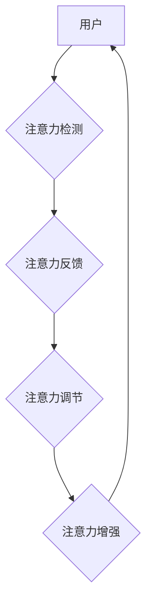

> 人类注意力增强，专注力，注意力，商业应用，人工智能，深度学习，脑机接口，未来趋势

## 1. 背景介绍

在当今信息爆炸的时代，人类面临着前所未有的信息过载挑战。注意力，作为我们处理信息的关键能力，显得尤为重要。然而，随着科技的进步和生活节奏的加快，人们的注意力持续下降，专注力难以持久，这严重影响了工作效率、学习成果和生活质量。

商业领域也深受注意力问题的困扰。消费者在海量广告和信息流中难以集中注意力，企业难以有效地传递信息和提升用户体验。因此，如何提升人类注意力，增强专注力，成为一个亟待解决的难题，也是商业发展的重要趋势。

## 2. 核心概念与联系

**2.1  注意力与专注力的定义**

注意力是指我们对特定信息或刺激的定向选择和集中，是认知过程的基础。专注力则是持续地将注意力集中在某一目标上，并排除干扰的能力。

**2.2  注意力增强技术的原理**

注意力增强技术旨在通过多种方式提升人类的注意力和专注力。主要原理包括：

* **认知训练:** 通过专门的训练程序，锻炼大脑的注意力控制能力。
* **生物反馈:** 利用生物信号反馈，帮助用户了解自身注意力状态，并通过调节生理指标来提升注意力。
* **环境调节:** 通过调整环境因素，例如光线、温度、噪音等，创造有利于集中注意力的环境。
* **技术辅助:** 利用人工智能、虚拟现实等技术，提供个性化的注意力增强体验。

**2.3  注意力增强技术与商业应用的联系**

注意力增强技术在商业领域有着广泛的应用前景，例如：

* **营销推广:** 通过提升消费者注意力，提高广告的有效性。
* **用户体验:** 通过增强用户注意力，提升产品和服务的体验。
* **员工培训:** 通过提升员工注意力，提高培训效果。
* **远程办公:** 通过增强员工注意力，提高远程办公效率。

**2.4  注意力增强技术架构**



## 3. 核心算法原理 & 具体操作步骤

### 3.1  算法原理概述

注意力增强算法通常基于深度学习技术，通过训练神经网络模型来识别和预测用户的注意力状态。常见的算法包括：

* **卷积神经网络 (CNN):** 用于提取图像和视频中的注意力特征。
* **循环神经网络 (RNN):** 用于处理序列数据，例如文本和语音，识别用户的注意力变化趋势。
* **Transformer:** 用于处理长序列数据，能够更好地捕捉注意力之间的长距离依赖关系。

### 3.2  算法步骤详解

1. **数据收集:** 收集用户注意力相关数据，例如眼动追踪数据、脑电波数据、行为数据等。
2. **数据预处理:** 对收集到的数据进行清洗、转换和特征提取。
3. **模型训练:** 使用深度学习算法训练神经网络模型，将注意力数据与用户行为或生理指标进行关联。
4. **模型评估:** 使用测试数据评估模型的性能，例如准确率、召回率等。
5. **模型部署:** 将训练好的模型部署到实际应用场景中，例如智能手机、电脑、VR设备等。

### 3.3  算法优缺点

**优点:**

* 能够准确识别和预测用户的注意力状态。
* 可以根据用户的注意力状态提供个性化的反馈和调节。
* 具有较强的学习能力，能够不断优化模型性能。

**缺点:**

* 需要大量的训练数据，数据收集和标注成本较高。
* 模型训练复杂，需要专业的技术人员进行操作。
* 存在隐私安全问题，需要妥善处理用户数据。

### 3.4  算法应用领域

注意力增强算法在以下领域具有广泛的应用前景:

* **教育:** 帮助学生提高学习效率，增强专注力。
* **医疗:** 辅助医生诊断疾病，监测患者的注意力状态。
* **游戏:** 提供更沉浸式的游戏体验，增强玩家的注意力和参与度。
* **交通安全:** 帮助驾驶员保持注意力，预防交通事故。

## 4. 数学模型和公式 & 详细讲解 & 举例说明

### 4.1  数学模型构建

注意力机制通常使用一个加权机制来分配不同输入的权重，从而突出重要的信息。一个常见的数学模型是注意力得分函数：

$$
\text{Attention}(Q, K, V) = \text{softmax}\left(\frac{Q K^T}{\sqrt{d_k}}\right) V
$$

其中：

* $Q$：查询向量
* $K$：键向量
* $V$：值向量
* $d_k$：键向量的维度
* $\text{softmax}$：softmax函数，用于将注意力得分归一化

### 4.2  公式推导过程

注意力得分函数的推导过程如下：

1. 计算查询向量 $Q$ 和键向量 $K$ 的点积，即 $QK^T$。
2. 将点积结果除以 $\sqrt{d_k}$，以规范化权重。
3. 使用 softmax 函数将点积结果转换为概率分布，即注意力得分。
4. 将注意力得分与值向量 $V$ 进行加权求和，得到最终的输出。

### 4.3  案例分析与讲解

例如，在机器翻译任务中，可以使用注意力机制来关注源语言句子中与目标语言句子相关的重要词语。

## 5. 项目实践：代码实例和详细解释说明

### 5.1  开发环境搭建

* Python 3.x
* TensorFlow 或 PyTorch 深度学习框架
* Jupyter Notebook 或 VS Code 代码编辑器

### 5.2  源代码详细实现

```python
import tensorflow as tf

# 定义注意力得分函数
def attention_score(query, key, value, d_k):
  score = tf.matmul(query, key, transpose_b=True) / tf.math.sqrt(d_k)
  return tf.nn.softmax(score, axis=-1)

# 定义注意力机制
def attention_mechanism(query, key, value, d_k):
  attention_weights = attention_score(query, key, value, d_k)
  context_vector = tf.matmul(attention_weights, value)
  return context_vector

# 示例代码
query = tf.random.normal([1, 512])
key = tf.random.normal([1, 512])
value = tf.random.normal([1, 512])
d_k = 64

context_vector = attention_mechanism(query, key, value, d_k)
print(context_vector)
```

### 5.3  代码解读与分析

* `attention_score` 函数计算注意力得分，使用 softmax 函数将得分归一化。
* `attention_mechanism` 函数使用注意力得分与值向量进行加权求和，得到最终的上下文向量。
* 示例代码演示了如何使用注意力机制计算上下文向量。

### 5.4  运行结果展示

运行代码后，会输出一个形状为 `(1, 512)` 的上下文向量。

## 6. 实际应用场景

### 6.1  商业应用案例

* **广告投放:** 通过分析用户的注意力行为，精准投放广告，提高广告转化率。
* **内容推荐:** 根据用户的注意力偏好，推荐个性化的内容，提升用户粘性。
* **产品设计:** 通过观察用户的注意力分布，优化产品界面和功能设计，提升用户体验。

### 6.2  未来应用展望

* **脑机接口:** 利用脑电波信号，直接读取用户的注意力状态，实现无界面交互。
* **虚拟现实:** 通过增强用户的注意力，创造更沉浸式的虚拟现实体验。
* **人工智能助手:** 利用注意力机制，帮助人工智能助手更好地理解用户的意图，提供更精准的帮助。

## 7. 工具和资源推荐

### 7.1  学习资源推荐

* **书籍:**
    * 《深度学习》
    * 《注意力机制》
* **在线课程:**
    * Coursera: 深度学习
    * Udacity: 自然语言处理
* **开源项目:**
    * TensorFlow
    * PyTorch

### 7.2  开发工具推荐

* **Python:** 
* **Jupyter Notebook:** 
* **VS Code:** 

### 7.3  相关论文推荐

* 《Attention Is All You Need》
* 《BERT: Pre-training of Deep Bidirectional Transformers for Language Understanding》

## 8. 总结：未来发展趋势与挑战

### 8.1  研究成果总结

注意力增强技术取得了显著的进展，在商业应用领域展现出巨大的潜力。

### 8.2  未来发展趋势

* **更精准的注意力检测:** 利用脑机接口等技术，实现更精准的注意力检测。
* **更个性化的注意力增强:** 根据用户的不同需求和特点，提供个性化的注意力增强方案。
* **更广泛的应用场景:** 将注意力增强技术应用到更多领域，例如教育、医疗、交通安全等。

### 8.3  面临的挑战

* **数据隐私安全:** 需要妥善处理用户注意力数据，保障用户隐私安全。
* **算法伦理问题:** 需要关注注意力增强技术的伦理问题，避免被滥用。
* **技术可普及性:** 需要降低注意力增强技术的开发成本，使其更易于普及。

### 8.4  研究展望

未来，注意力增强技术将继续朝着更精准、更个性化、更广泛的方向发展，为商业和社会带来更多价值。

## 9. 附录：常见问题与解答

* **Q: 注意力增强技术是否安全可靠？**

A: 目前注意力增强技术尚处于发展阶段，需要谨慎使用。选择信誉良好的产品和服务，并注意保护个人隐私。

* **Q: 注意力增强技术是否适合所有人？**

A: 注意力增强技术并非适合所有人，例如患有注意力缺陷障碍的人群可能需要谨慎使用。

* **Q: 注意力增强技术会让人变得过度依赖？**

A: 注意力增强技术应该作为辅助工具，而不是替代人类思考和学习的能力。

作者：禅与计算机程序设计艺术 / Zen and the Art of Computer Programming


<end_of_turn>