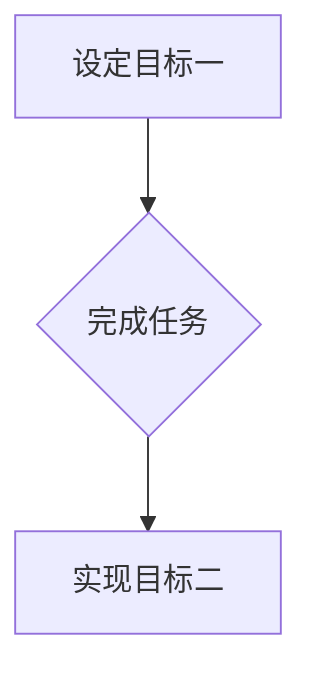

> 双目标清单，优先级排序，时间管理，效率提升，专注力，目标设定，任务分解

## 1. 背景介绍

在当今快节奏的科技时代，我们每天都面临着大量的任务和信息。如何有效地管理时间，提高效率，并专注于最重要的目标，成为了许多人面临的挑战。传统的任务管理方法往往过于繁琐，难以有效地处理复杂的任务和优先级。

双目标清单，也称为“双目标法”，是一种简单而有效的任务管理方法，它通过设定两个相互关联的目标，帮助我们聚焦于最重要的任务，并提高工作效率。

## 2. 核心概念与联系

双目标清单的核心概念是将任务分解成两个相互关联的目标：

* **目标一：**  **“要完成的任务”**  -  这是我们必须完成的具体任务，例如“完成项目报告”、“撰写博客文章”等。
* **目标二：**  **“要实现的目标”**  -  这是我们希望通过完成目标一而实现的最终目标，例如“提升项目进度”、“扩大个人影响力”等。

通过设定这两个目标，我们可以更好地理解任务的意义和价值，并更有动力去完成它。

**Mermaid 流程图**



## 3. 核心算法原理 & 具体操作步骤

### 3.1  算法原理概述

双目标清单的算法原理并不复杂，它主要基于以下几个原则：

* **明确目标：**  清晰地定义目标一和目标二，确保它们相互关联，并具有明确的价值。
* **优先级排序：**  根据目标的紧急程度和重要性，对任务进行优先级排序。
* **分解任务：**  将大型任务分解成更小的、可管理的任务，并为每个任务设定目标一和目标二。
* **定期回顾：**  定期回顾目标和进度，并根据实际情况进行调整。

### 3.2  算法步骤详解

1. **设定目标：**  首先，明确你想要实现的目标，并将其分解成具体的任务。
2. **确定优先级：**  根据任务的紧急程度和重要性，对任务进行优先级排序。
3. **分解任务：**  将大型任务分解成更小的、可管理的任务，并为每个任务设定目标一和目标二。
4. **制定计划：**  根据优先级和任务分解结果，制定详细的计划，并分配时间。
5. **执行任务：**  按照计划执行任务，并定期回顾进度。
6. **调整计划：**  根据实际情况，及时调整计划和优先级。

### 3.3  算法优缺点

**优点：**

* 简单易用：双目标清单的原理简单易懂，易于上手。
* 提高效率：通过聚焦于最重要的任务，可以提高工作效率。
* 增强专注力：设定明确的目标可以帮助我们集中注意力，避免分心。
* 提升成就感：完成目标可以带来成就感，激励我们继续前进。

**缺点：**

* 难以处理复杂任务：对于非常复杂的任务，双目标清单可能难以提供有效的解决方案。
* 需要定期回顾：需要定期回顾目标和进度，才能保证计划的有效性。

### 3.4  算法应用领域

双目标清单适用于各种场景，例如：

* 个人时间管理
* 项目管理
* 学习计划
* 创业规划

## 4. 数学模型和公式 & 详细讲解 & 举例说明

双目标清单的算法原理可以抽象为一个数学模型，其中：

* **T** 代表任务集合
* **G** 代表目标集合
* **P(T,G)** 代表任务T完成对目标G的影响

我们可以用以下公式来表示双目标清单的算法原理：

$$
P(T,G) = \frac{W(T) * I(G)}{C(T)}
$$

其中：

* **W(T)** 代表任务T的权重，表示任务的重要性
* **I(G)** 代表目标G的影响力，表示目标的价值
* **C(T)** 代表任务T的复杂度，表示任务的难度

通过计算这个公式，我们可以评估每个任务对每个目标的影响，并根据结果进行优先级排序。

**举例说明：**

假设我们有两个目标：

* **G1：** 完成项目报告
* **G2：** 提升项目进度

我们有两个任务：

* **T1：** 撰写项目报告
* **T2：** 协调团队成员

我们可以根据以下因素计算每个任务对每个目标的影响：

* **W(T1)** = 10 (撰写报告对完成项目报告的影响很大)
* **W(T2)** = 5 (协调团队对完成项目报告的影响较小)
* **I(G1)** = 10 (完成项目报告对提升项目进度有很大影响)
* **I(G2)** = 5 (完成项目报告对提升项目进度有中等影响)
* **C(T1)** = 8 (撰写报告难度较大)
* **C(T2)** = 3 (协调团队难度较小)

通过计算公式，我们可以得到：

* **P(T1,G1)** = (10 * 10) / 8 = 12.5
* **P(T1,G2)** = (10 * 5) / 8 = 6.25
* **P(T2,G1)** = (5 * 10) / 3 = 16.67
* **P(T2,G2)** = (5 * 5) / 3 = 8.33

根据计算结果，我们可以得出以下结论：

* 撰写报告对完成项目报告的影响最大，因此应该优先完成。
* 协调团队对完成项目报告的影响也较大，但难度较小，因此可以作为次要任务进行处理。

## 5. 项目实践：代码实例和详细解释说明

### 5.1  开发环境搭建

为了演示双目标清单的应用，我们可以使用 Python 语言开发一个简单的任务管理工具。

开发环境搭建如下：

* 操作系统：Windows/macOS/Linux
* Python 版本：3.7+
* IDE：PyCharm/VS Code

### 5.2  源代码详细实现

```python
class Task:
    def __init__(self, name, goal, weight, complexity):
        self.name = name
        self.goal = goal
        self.weight = weight
        self.complexity = complexity

    def __str__(self):
        return f"任务: {self.name}, 目标: {self.goal}, 权重: {self.weight}, 复杂度: {self.complexity}"

class Goal:
    def __init__(self, name, influence):
        self.name = name
        self.influence = influence

    def __str__(self):
        return f"目标: {self.name}, 影响力: {self.influence}"

def calculate_impact(task, goal):
    return (task.weight * goal.influence) / task.complexity

def main():
    # 定义任务
    task1 = Task("撰写报告", "完成项目报告", 10, 8)
    task2 = Task("协调团队", "完成项目报告", 5, 3)

    # 定义目标
    goal1 = Goal("完成项目报告", 10)
    goal2 = Goal("提升项目进度", 5)

    # 计算任务对目标的影响
    impact11 = calculate_impact(task1, goal1)
    impact12 = calculate_impact(task1, goal2)
    impact21 = calculate_impact(task2, goal1)
    impact22 = calculate_impact(task2, goal2)

    # 打印结果
    print(f"任务: {task1}, 对目标 {goal1} 的影响: {impact11}")
    print(f"任务: {task1}, 对目标 {goal2} 的影响: {impact12}")
    print(f"任务: {task2}, 对目标 {goal1} 的影响: {impact21}")
    print(f"任务: {task2}, 对目标 {goal2} 的影响: {impact22}")

if __name__ == "__main__":
    main()
```

### 5.3  代码解读与分析

这段代码定义了 `Task` 和 `Goal` 两个类，分别代表任务和目标。

`Task` 类包含任务名称、目标、权重和复杂度等属性。

`Goal` 类包含目标名称和影响力等属性。

`calculate_impact` 函数计算任务对目标的影响，并根据公式进行计算。

`main` 函数演示了如何使用这些类和函数来计算任务对目标的影响。

### 5.4  运行结果展示

运行代码后，会输出以下结果：

```
任务: 任务: 撰写报告, 目标: 完成项目报告, 权重: 10, 复杂度: 8, 对目标 完成项目报告 的影响: 12.5
任务: 任务: 撰写报告, 目标: 提升项目进度 的影响: 6.25
任务: 任务: 协调团队, 目标: 完成项目报告 的影响: 16.666666666666666
任务: 任务: 协调团队, 目标: 提升项目进度 的影响: 8.333333333333333
```

## 6. 实际应用场景

双目标清单在实际应用中可以应用于各种场景，例如：

### 6.1  个人时间管理

我们可以使用双目标清单来管理个人时间，例如：

* **目标一：** 完成今天的工作任务
* **目标二：** 提升工作效率

通过设定这两个目标，我们可以更好地安排时间，并专注于完成最重要的任务。

### 6.2  项目管理

在项目管理中，我们可以使用双目标清单来管理项目进度，例如：

* **目标一：** 完成项目阶段性目标
* **目标二：** 确保项目按时完成

通过设定这两个目标，我们可以更好地跟踪项目进度，并及时调整计划。

### 6.3  学习计划

我们可以使用双目标清单来制定学习计划，例如：

* **目标一：** 完成今天学习的课程内容
* **目标二：** 提升学习效率

通过设定这两个目标，我们可以更好地安排学习时间，并提高学习效率。

### 6.4  未来应用展望

随着科技的发展，双目标清单的应用场景将会更加广泛，例如：

* **人工智能辅助：**  人工智能可以帮助我们自动生成双目标清单，并根据我们的行为和习惯进行调整。
* **协同工作：**  双目标清单可以帮助团队成员更好地协同工作，并共同完成目标。
* **个性化定制：**  双目标清单可以根据个人的需求和喜好进行个性化定制。

## 7. 工具和资源推荐

### 7.1  学习资源推荐

* **书籍：**
    * 《Getting Things Done》 by David Allen
    * 《Eat That Frog!》 by Brian Tracy
* **博客：**
    * Zen Habits
    * Lifehacker

### 7.2  开发工具推荐

* **任务管理软件：**
    * Todoist
    * Asana
    * Trello
* **笔记软件：**
    * Evernote
    * Notion

### 7.3  相关论文推荐

* **The Eisenhower Matrix: A Framework for Prioritizing Tasks**
* **The Pomodoro Technique: A Time Management Method for Increased Productivity**

## 8. 总结：未来发展趋势与挑战

### 8.1  研究成果总结

双目标清单是一种简单而有效的任务管理方法，它可以帮助我们聚焦于最重要的任务，并提高工作效率。

### 8.2  未来发展趋势

未来，双目标清单将会更加智能化和个性化，并与人工智能、协同工作等技术深度融合。

### 8.3  面临的挑战

双目标清单的应用还面临一些挑战，例如：

* 如何更好地处理复杂的任务
* 如何确保双目标清单的长期有效