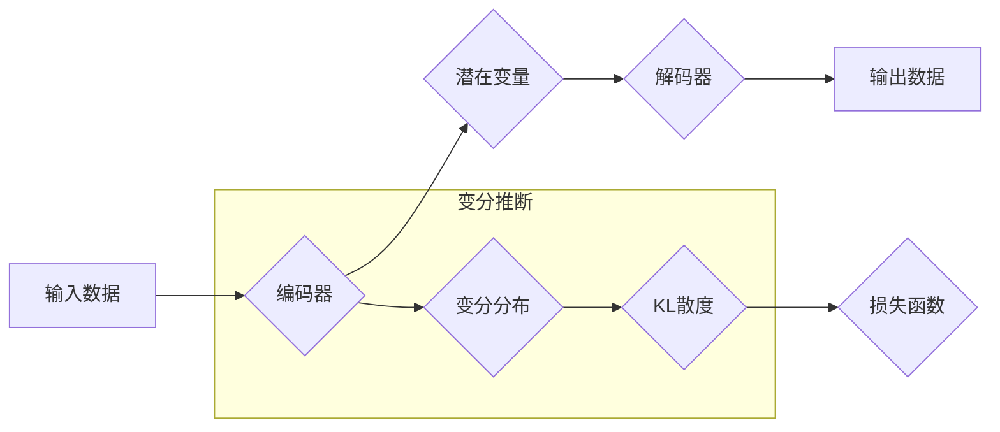

> 变分自编码器(VAE)，生成模型，深度学习，变分推断，概率图模型，神经网络，代码实战

## 1. 背景介绍

在深度学习领域，生成模型一直是研究的热点之一。生成模型的目标是学习数据分布，并能够生成与真实数据相似的样本。传统的生成模型，如玻尔兹曼机和限制玻尔兹曼机，虽然取得了一些成果，但训练过程复杂，难以处理高维数据。近年来，随着深度学习的发展，变分自编码器(VAE)应运而生，它结合了自编码器和变分推断的思想，为生成模型提供了新的思路和方法。

VAE是一种基于概率图模型的生成模型，它通过学习数据的潜在表示来生成新的样本。与传统的自编码器不同，VAE在编码阶段引入了一个概率分布，并通过变分推断来逼近后验分布。这种概率化的编码方式使得VAE能够学习到数据的复杂结构，并生成更逼真的样本。

## 2. 核心概念与联系

### 2.1  自编码器

自编码器是一种无监督学习模型，它通过学习数据的压缩表示来实现数据降维和特征提取。自编码器通常由两个部分组成：编码器和解码器。编码器将输入数据映射到一个低维的潜在空间，解码器则将潜在空间中的表示映射回原始数据空间。

### 2.2  变分推断

变分推断是一种近似计算后验分布的方法。在VAE中，后验分布表示的是给定输入数据时，潜在变量的分布。由于后验分布通常难以直接计算，VAE采用变分推断来逼近后验分布。变分推断通过寻找一个与后验分布相似的分布，并最小化两者之间的KL散度来实现。

### 2.3  概率图模型

概率图模型是一种用于表示概率分布的图形模型。VAE的框架基于概率图模型，它将数据、潜在变量和模型参数的关系用图的形式表示出来。

**Mermaid 流程图**



## 3. 核心算法原理 & 具体操作步骤

### 3.1  算法原理概述

VAE的核心思想是通过学习数据的潜在表示来生成新的样本。它将输入数据编码到一个低维的潜在空间，并通过解码器将潜在空间中的表示映射回原始数据空间。

VAE的训练目标是最小化两个损失函数：

1. **重构损失:** 衡量解码器输出与输入数据的差异。
2. **KL散度损失:** 衡量编码器输出的潜在变量分布与先验分布之间的差异。

通过最小化这两个损失函数，VAE能够学习到数据的复杂结构，并生成更逼真的样本。

### 3.2  算法步骤详解

1. **数据预处理:** 将输入数据进行标准化或归一化处理，使其符合模型的输入要求。
2. **编码器训练:** 使用输入数据训练编码器，使其能够将数据映射到潜在空间。
3. **解码器训练:** 使用编码器输出的潜在变量训练解码器，使其能够将潜在空间中的表示映射回原始数据空间。
4. **变分推断:** 使用变分推断来逼近后验分布，并计算KL散度损失。
5. **损失函数优化:** 使用优化算法，如Adam，最小化重构损失和KL散度损失。
6. **生成新样本:** 使用训练好的编码器和解码器，从潜在空间中采样新的潜在变量，并将其映射回原始数据空间，从而生成新的样本。

### 3.3  算法优缺点

**优点:**

* 能够学习到数据的复杂结构。
* 生成样本质量较高。
* 可以用于多种类型的生成任务，如图像生成、文本生成等。

**缺点:**

* 训练过程相对复杂。
* 训练时间较长。
* 生成样本的质量可能受到潜在空间维度的限制。

### 3.4  算法应用领域

VAE在以下领域具有广泛的应用：

* **图像生成:** 生成逼真的图像，例如人脸、风景等。
* **文本生成:** 生成自然语言文本，例如诗歌、故事等。
* **数据降维:** 将高维数据降维到低维空间，用于数据可视化和特征提取。
* **异常检测:** 识别数据中的异常值。
* **图像修复:** 修复损坏的图像。

## 4. 数学模型和公式 & 详细讲解 & 举例说明

### 4.1  数学模型构建

VAE的数学模型可以表示为一个概率图模型，其中包括以下变量：

* **x:** 输入数据
* **z:** 潜在变量
* **θ:** 编码器和解码器参数

VAE的目标是学习参数θ，使得模型能够生成与真实数据相似的样本。

### 4.2  公式推导过程

VAE的训练目标是最小化以下损失函数：

$$
L(θ) = D_{KL}(q(z|x) || p(z)) + D_{RE}(x, x')
$$

其中：

* $D_{KL}$ 是KL散度，衡量编码器输出的潜在变量分布 $q(z|x)$ 与先验分布 $p(z)$ 之间的差异。
* $D_{RE}$ 是重构损失，衡量解码器输出 $x'$ 与输入数据 $x$ 之间的差异。

### 4.3  案例分析与讲解

假设我们想要使用VAE生成手写数字图像。

1. **数据预处理:** 将手写数字图像数据进行标准化处理，使其像素值在0到1之间。
2. **编码器训练:** 使用编码器将图像数据映射到一个低维的潜在空间，例如10维。
3. **解码器训练:** 使用解码器将潜在空间中的表示映射回原始图像空间，并与输入图像进行比较，计算重构损失。
4. **变分推断:** 使用变分推断来逼近后验分布，并计算KL散度损失。
5. **损失函数优化:** 使用优化算法，如Adam，最小化重构损失和KL散度损失。
6. **生成新样本:** 从潜在空间中采样新的潜在变量，并将其映射回原始图像空间，从而生成新的手写数字图像。

## 5. 项目实践：代码实例和详细解释说明

### 5.1  开发环境搭建

* Python 3.6+
* TensorFlow 2.0+
* PyTorch 1.0+
* NumPy
* Matplotlib

### 5.2  源代码详细实现

```python
import tensorflow as tf

# 定义编码器
class Encoder(tf.keras.Model):
    def __init__(self, latent_dim):
        super(Encoder, self).__init__()
        self.latent_dim = latent_dim
        self.layers = tf.keras.Sequential([
            tf.keras.layers.Input(shape=(28, 28, 1)),
            tf.keras.layers.Conv2D(32, (3, 3), activation='relu'),
            tf.keras.layers.MaxPooling2D((2, 2)),
            tf.keras.layers.Conv2D(64, (3, 3), activation='relu'),
            tf.keras.layers.MaxPooling2D((2, 2)),
            tf.keras.layers.Flatten(),
            tf.keras.layers.Dense(latent_dim * 2)
        ])

    def call(self, x):
        z_mean, z_log_var = tf.split(self.layers(x), num_or_size_splits=2, axis=-1)
        return z_mean, z_log_var

# 定义解码器
class Decoder(tf.keras.Model):
    def __init__(self, latent_dim):
        super(Decoder, self).__init__()
        self.latent_dim = latent_dim
        self.layers = tf.keras.Sequential([
            tf.keras.layers.Input(shape=(latent_dim,)),
            tf.keras.layers.Dense(7 * 7 * 64, activation='relu'),
            tf.keras.layers.Reshape((7, 7, 64)),
            tf.keras.layers.Conv2DTranspose(64, (3, 3), strides=(2, 2), activation='relu'),
            tf.keras.layers.Conv2DTranspose(32, (3, 3), strides=(2, 2), activation='relu'),
            tf.keras.layers.Conv2D(1, (3, 3), activation='sigmoid')
        ])

    def call(self, x):
        return self.layers(x)

# 定义VAE模型
class VAE(tf.keras.Model):
    def __init__(self, latent_dim):
        super(VAE, self).__init__()
        self.encoder = Encoder(latent_dim)
        self.decoder = Decoder(latent_dim)

    def call(self, x):
        z_mean, z_log_var = self.encoder(x)
        z = self.sample_z(z_mean, z_log_var)
        x_recon = self.decoder(z)
        return x_recon, z_mean, z_log_var

    def sample_z(self, z_mean, z_log_var):
        epsilon = tf.random.normal(shape=tf.shape(z_mean))
        return z_mean + tf.exp(0.5 * z_log_var) * epsilon

# 训练VAE模型
# ...

```

### 5.3  代码解读与分析

* **编码器:** 负责将输入数据映射到潜在空间。
* **解码器:** 负责将潜在空间中的表示映射回原始数据空间。
* **VAE模型:** 将编码器和解码器组合在一起，并定义了损失函数和采样过程。
* **训练过程:** 使用优化算法，如Adam，最小化损失函数，从而训练VAE模型。

### 5.4  运行结果展示

训练好的VAE模型能够生成与真实数据相似的样本。

## 6. 实际应用场景

### 6.1  图像生成

VAE可以用于生成逼真的图像，例如人脸、风景、物体等。

### 6.2  文本生成

VAE可以用于生成自然语言文本，例如诗歌、故事、对话等。

### 6.3  数据降维

VAE可以用于将高维数据降维到低维空间，用于数据可视化和特征提取。

### 6.4  未来应用展望

VAE在未来将有更广泛的应用，例如：

* **医疗图像分析:** 生成医学图像，辅助医生诊断。
* **药物研发:** 生成新的药物分子，加速药物研发过程。
* **艺术创作:** 生成新的艺术作品，激发人类的创造力。

## 7. 工具和资源推荐

### 7.1  学习资源推荐

* **书籍:**
    * 《Deep Learning》 by Ian Goodfellow, Yoshua Bengio, and Aaron Courville
    * 《Generative Deep Learning》 by David Foster
* **在线课程:**
    * Coursera: Deep Learning Specialization
    * Udacity: Deep Learning Nanodegree

### 7.2  开发工具推荐

* **TensorFlow:** https://www.tensorflow.org/
* **PyTorch:** https://pytorch.org/
* **Keras:** https://keras.io/

### 7.3  相关论文推荐

* **Auto-Encoding Variational Bayes** by Diederik P. Kingma and Max Welling (2013)
* **Variational Autoencoders for Text Generation**