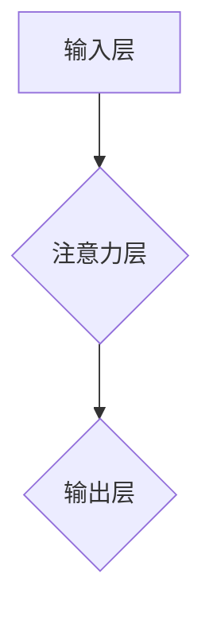

> 图注意力网络，大模型，图神经网络，注意力机制，知识图谱，关系推理

## 1. 背景介绍

近年来，深度学习在计算机视觉、自然语言处理等领域取得了显著成就。然而，传统的深度学习模型主要处理序列数据或结构化数据，难以有效地处理复杂关系和结构化的知识。图注意力网络 (Graph Attention Network, GAT) 作为一种新型的图神经网络 (Graph Neural Network, GNN) 架构，能够有效地学习图结构中的关系和依赖性，在知识图谱补全、关系推理、节点分类等任务中表现出优异的性能。

随着大模型的兴起，其强大的学习能力和泛化能力为图注意力网络的应用提供了新的机遇。大模型通常拥有大量的参数和训练数据，能够更好地学习图结构中的复杂模式和关系。同时，大模型的并行计算能力也使得图注意力网络的训练和推理效率得到提升。

## 2. 核心概念与联系

图注意力网络 (GAT) 是一种基于图结构的深度学习模型，它结合了图神经网络 (GNN) 和注意力机制的优势。

**2.1 图神经网络 (GNN)**

图神经网络 (GNN) 是一种专门用于处理图结构数据的深度学习模型。它通过在图节点上进行信息传播，学习图结构中的关系和依赖性。

**2.2 注意力机制**

注意力机制是一种能够学习数据中重要信息的机制。它通过计算每个数据元素的权重，将注意力集中在重要信息上。

**2.3 图注意力网络 (GAT)**

图注意力网络 (GAT) 将注意力机制应用于图神经网络，通过学习节点之间的注意力权重，更好地捕捉图结构中的关系和依赖性。

**2.4 GAT 架构**



**2.5 GAT 工作原理**

1. **输入层:** 将图结构的节点特征作为输入。
2. **注意力层:** 计算每个节点与其他节点之间的注意力权重，并根据权重进行信息聚合。
3. **输出层:** 将聚合后的信息作为节点的输出特征。

## 3. 核心算法原理 & 具体操作步骤

### 3.1  算法原理概述

图注意力网络 (GAT) 的核心算法原理是利用注意力机制学习节点之间的关系和依赖性。

**3.1.1 注意力权重计算**

GAT 使用一个可学习的权重矩阵来计算每个节点与其他节点之间的注意力权重。

**3.1.2 信息聚合**

GAT 使用注意力权重对邻居节点的信息进行聚合，得到每个节点的更新特征。

**3.1.3 多头注意力**

GAT 通常使用多头注意力机制，可以学习到不同类型的关系和依赖性。

### 3.2  算法步骤详解

1. **初始化:** 初始化节点特征和注意力权重矩阵。
2. **迭代:** 对于每个节点，计算其与其他节点之间的注意力权重，并根据权重进行信息聚合。
3. **更新:** 更新节点特征。
4. **重复:** 重复步骤 2 和 3，直到收敛。

### 3.3  算法优缺点

**优点:**

* 能够有效地学习图结构中的关系和依赖性。
* 能够处理复杂的关系和结构化的知识。
* 能够学习到不同类型的关系和依赖性。

**缺点:**

* 训练时间较长。
* 对于大型图结构，计算复杂度较高。

### 3.4  算法应用领域

* **知识图谱补全:** 预测知识图谱中缺失的实体和关系。
* **关系推理:** 根据知识图谱中的信息，推断出新的关系。
* **节点分类:** 将图中的节点分类到不同的类别。
* **推荐系统:** 基于用户-物品交互图，推荐用户感兴趣的物品。

## 4. 数学模型和公式 & 详细讲解 & 举例说明

### 4.1  数学模型构建

图注意力网络 (GAT) 的数学模型可以表示为以下公式：

$$
\mathbf{h}_i^{(l+1)} = \sigma \left( \sum_{j \in \mathcal{N}(i)} \alpha_{ij}^{(l)} \mathbf{h}_j^{(l)} \mathbf{W}^{(l)} \right)
$$

其中：

* $\mathbf{h}_i^{(l)}$ 表示第 $l$ 层第 $i$ 个节点的特征向量。
* $\mathcal{N}(i)$ 表示第 $i$ 个节点的邻居节点集合。
* $\alpha_{ij}^{(l)}$ 表示第 $l$ 层第 $i$ 个节点对第 $j$ 个节点的注意力权重。
* $\mathbf{W}^{(l)}$ 表示第 $l$ 层的权重矩阵。
* $\sigma$ 表示激活函数。

### 4.2  公式推导过程

注意力权重 $\alpha_{ij}^{(l)}$ 可以通过以下公式计算：

$$
\alpha_{ij}^{(l)} = \frac{\exp \left( \mathbf{a}^{T} [\mathbf{h}_i^{(l)} \Vert \mathbf{h}_j^{(l)}] \right)}{\sum_{k \in \mathcal{N}(i)} \exp \left( \mathbf{a}^{T} [\mathbf{h}_i^{(l)} \Vert \mathbf{h}_k^{(l)}] \right)}
$$

其中：

* $\mathbf{a}$ 表示注意力参数向量。
* $\Vert$ 表示拼接操作。

### 4.3  案例分析与讲解

假设我们有一个简单的图结构，包含三个节点 A、B 和 C，以及它们之间的边。

* 节点 A 的特征向量为 $\mathbf{h}_A = [1, 2]$.
* 节点 B 的特征向量为 $\mathbf{h}_B = [3, 4]$.
* 节点 C 的特征向量为 $\mathbf{h}_C = [5, 6]$.

我们可以使用 GAT 计算节点 A 对节点 B 和 C 的注意力权重。

* $\alpha_{AB} = \frac{\exp \left( \mathbf{a}^{T} [\mathbf{h}_A \Vert \mathbf{h}_B] \right)}{\sum_{k \in \mathcal{N}(A)} \exp \left( \mathbf{a}^{T} [\mathbf{h}_A \Vert \mathbf{h}_k] \right)}$
* $\alpha_{AC} = \frac{\exp \left( \mathbf{a}^{T} [\mathbf{h}_A \Vert \mathbf{h}_C] \right)}{\sum_{k \in \mathcal{N}(A)} \exp \left( \mathbf{a}^{T} [\mathbf{h}_A \Vert \mathbf{h}_k] \right)}$

通过计算上述公式，我们可以得到节点 A 对节点 B 和 C 的注意力权重，并根据权重进行信息聚合，得到节点 A 的更新特征向量。

## 5. 项目实践：代码实例和详细解释说明

### 5.1  开发环境搭建

* Python 3.6+
* PyTorch 1.0+
* CUDA 10.0+ (可选)

### 5.2  源代码详细实现

```python
import torch
import torch.nn as nn

class GATLayer(nn.Module):
    def __init__(self, in_features, out_features, heads):
        super(GATLayer, self).__init__()
        self.heads = heads
        self.in_features = in_features
        self.out_features = out_features
        self.weight = nn.Linear(in_features, out_features * heads)
        self.attention = nn.MultiheadAttention(embed_dim=out_features, num_heads=heads)

    def forward(self, x, adj):
        # Linear transformation
        x = self.weight(x)
        # Reshape for multi-head attention
        x = x.view(x.size(0), -1, self.heads, self.out_features // self.heads)
        # Multi-head attention
        x, _ = self.attention(x, x, x, attn_mask=adj)
        # Concatenate heads
        x = x.view(x.size(0), -1, self.out_features)
        return x

# Example usage
in_features = 32
out_features = 64
heads = 8
adj = torch.tensor([[0, 1, 1], [1, 0, 1], [1, 1, 0]])  # Adjacency matrix

gat_layer = GATLayer(in_features, out_features, heads)
x = torch.randn(3, in_features)  # Input features
x = gat_layer(x, adj)  # Apply GAT layer
print(x.shape)  # Output shape: (3, 64)
```

### 5.3  代码解读与分析

* `GATLayer` 类定义了图注意力网络的单个层。
* `__init__` 方法初始化层参数，包括头数、输入特征维度、输出特征维度和权重矩阵。
* `forward` 方法实现 GAT 层的正向传播过程。
* 首先，对输入特征进行线性变换。
* 然后，将特征向量reshape为多头注意力机制的输入格式。
* 使用 `nn.MultiheadAttention` 模块进行多头注意力计算。
* 最后，将多头注意力输出拼接起来，得到最终的输出特征向量。

### 5.4  运行结果展示

运行上述代码，输出的 `x.shape` 为 `(3, 64)`，表示 GAT 层将输入特征维度从 32 扩展到 64。

## 6. 实际应用场景

### 6.1  知识图谱补全

GAT 可以用于预测知识图谱中缺失的实体和关系。例如，在 Wikidata 中，许多实体之间缺少关系信息。使用 GAT 可以学习实体之间的关系模式，并预测缺失的关系。

### 6.2  关系推理

GAT 可以用于根据知识图谱中的信息，推断出新的关系。例如，如果我们知道 "张三 是 学生" 和 "李四 是 教师"，可以使用 GAT 推断出 "张三 的 教师 是 李四"。

### 6.3  节点分类

GAT 可以用于将图中的节点分类到不同的类别。例如，在社交网络中，可以使用 GAT 将用户分类为不同的兴趣群体。

### 6.4  未来应用展望

随着大模型的不断发展，图注意力网络在更多领域将发挥重要作用。例如，

* **药物研发:** 利用药物-靶点关系图，预测药物的活性。
* **金融风险管理:** 利用金融机构关系图，识别潜在的风险。
* **交通流量预测:** 利用道路交通关系图，预测交通流量。

## 7. 工具和资源推荐

### 7.1  学习资源推荐

* **论文:**

    * Veličković, P., et al. "Graph attention networks." arXiv preprint arXiv:1710.10903 (2017).
    * Zhou, Z., et al. "Graph attention networks for web knowledge graph completion." Proceedings of the 2019 Conference on Empirical Methods in Natural Language Processing (EMNLP) (2019).

* **博客:**

    * https://towardsdatascience.com/graph-attention-networks-gat-explained-with-code-a3949499997c
    * https://blog.paperspace.com/graph-attention-networks-gat/

### 7.2  开发工具推荐

* **PyTorch Geometric:** https://pytorch-geometric.readthedocs.io/en/latest/
* **DGL:** https://dgl.ai/

### 7.3  相关论文推荐

* **Graph Convolutional Networks:** https://arxiv.org/abs/1609.02907
* **GraphSAGE:** https://arxiv.org/abs/1706.02216
* **Transformer:** https://arxiv.org/abs/1706.03762

## 8.