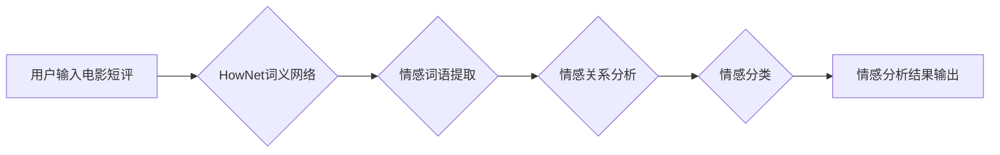

> HowNet, 情感分析, 电影短评, 自然语言处理, 知识图谱

## 1. 背景介绍

随着互联网的快速发展和社交媒体的普及，人们对电影的评价和讨论日益频繁。电影短评作为一种重要的用户生成内容，蕴含着丰富的电影信息和情感表达。对电影短评的情感分析具有重要的理论意义和实际应用价值。它可以帮助电影制片方了解观众的喜好和评价，改进影片制作；帮助影评人快速了解电影的整体评价趋势；帮助用户更便捷地获取电影信息和推荐。

传统的电影短评情感分析方法主要依赖于规则匹配和词袋模型等方法，这些方法存在局限性，例如：

* **缺乏语义理解能力:** 规则匹配方法依赖于人工定义的规则，难以处理复杂的语义关系；词袋模型无法捕捉词语之间的语义关联。
* **容易受到情感词典的限制:** 情感词典的覆盖面有限，无法涵盖所有的情感表达。
* **难以处理多模态信息:** 电影短评往往包含文本、图片、视频等多模态信息，传统的文本分析方法难以处理多模态数据。

近年来，随着深度学习技术的快速发展，基于深度学习的情感分析方法取得了显著的进展。这些方法能够更好地理解文本语义，并有效地捕捉情感表达。

## 2. 核心概念与联系

**2.1 HowNet**

HowNet (HowNet Chinese WordNet) 是一个基于语义网络的中文词典和知识库，它包含了大量的词语、词义和语义关系。HowNet 的核心概念是“词义网络”，它将词语作为节点，并将词语之间的语义关系作为边连接起来。

**2.2 情感分析**

情感分析是指通过计算机技术自动识别、理解和分析文本中的情感倾向的任务。情感分析的目标是确定文本表达的情感类型，例如正面、负面或中性。

**2.3 知识图谱**

知识图谱是一种结构化的知识表示形式，它将知识表示为实体和关系的网络结构。知识图谱可以帮助我们更好地理解和推理知识。

**2.4 核心概念联系**

基于HowNet的情感分析方法将HowNet的词义网络和知识图谱的结构化知识表示相结合，可以更好地理解文本中的情感表达。

**2.4.1 HowNet 的优势**

* **丰富的语义信息:** HowNet包含了大量的词语、词义和语义关系，可以提供丰富的语义信息。
* **结构化的知识表示:** HowNet 的词义网络是一种结构化的知识表示形式，可以帮助我们更好地理解词语之间的语义关联。

**2.4.2 知识图谱的优势**

* **结构化知识表示:** 知识图谱将知识表示为实体和关系的网络结构，可以帮助我们更好地理解和推理知识。
* **跨领域知识融合:** 知识图谱可以融合来自不同领域的知识，可以帮助我们更好地理解文本中的情感表达。

**2.5 Mermaid 流程图**



## 3. 核心算法原理 & 具体操作步骤

### 3.1  算法原理概述

基于HowNet的情感分析方法主要包括以下步骤：

1. **文本预处理:** 对电影短评进行文本预处理，例如去除停用词、标点符号等。
2. **词语切分:** 将预处理后的文本切分成单个词语。
3. **词义提取:** 利用HowNet的词义网络，提取每个词语的词义信息。
4. **情感词语识别:** 根据词义信息，识别出情感词语。
5. **情感关系分析:** 分析情感词语之间的语义关系，例如情感词语的程度、方向等。
6. **情感分类:** 根据情感词语的提取和情感关系分析结果，对电影短评进行情感分类。

### 3.2  算法步骤详解

1. **文本预处理:**

* 去除停用词：停用词是指一些常见的词语，例如“的”、“是”、“在”等，这些词语对情感分析没有贡献，需要进行去除。
* 去除标点符号：标点符号可以影响情感分析结果，需要进行去除。
* 转换词语形态：将词语转换为标准形式，例如将“很好”转换为“好”。

2. **词语切分:**

* 使用中文分词工具将文本切分成单个词语。

3. **词义提取:**

* 利用HowNet的词义网络，根据每个词语的词形，查询HowNet词典，获取词语的词义信息。

4. **情感词语识别:**

* 根据词义信息，识别出情感词语。可以使用情感词典或机器学习模型进行情感词语识别。

5. **情感关系分析:**

* 分析情感词语之间的语义关系，例如情感词语的程度、方向等。可以使用语义角色标注、依存句法分析等方法进行情感关系分析。

6. **情感分类:**

* 根据情感词语的提取和情感关系分析结果，对电影短评进行情感分类。可以使用机器学习模型或规则方法进行情感分类。

### 3.3  算法优缺点

**优点:**

* 能够更好地理解文本语义，捕捉情感表达。
* 能够处理复杂的语义关系。
* 能够融合来自不同领域的知识。

**缺点:**

* 需要大量的语料数据进行训练。
* 计算复杂度较高。
* 如何更好地处理多模态信息仍然是一个挑战。

### 3.4  算法应用领域

* **电影推荐:** 根据用户对电影短评的情感分析结果，推荐用户感兴趣的电影。
* **电影营销:** 分析电影短评的情感趋势，帮助电影制片方制定营销策略。
* **舆情监测:** 监测电影相关的舆情，及时了解观众对电影的评价和反馈。

## 4. 数学模型和公式 & 详细讲解 & 举例说明

### 4.1  数学模型构建

基于HowNet的情感分析方法可以采用深度学习模型进行实现，例如循环神经网络（RNN）或长短期记忆网络（LSTM）。这些模型可以学习文本序列中的情感信息，并进行情感分类。

### 4.2  公式推导过程

深度学习模型的训练过程涉及到梯度下降算法，其核心公式如下：

$$
\theta = \theta - \alpha \nabla L(\theta)
$$

其中：

* $\theta$ 是模型参数。
* $\alpha$ 是学习率。
* $L(\theta)$ 是损失函数，用于衡量模型预测结果与真实结果之间的差异。
* $\nabla L(\theta)$ 是损失函数对模型参数的梯度。

### 4.3  案例分析与讲解

假设我们使用LSTM模型进行电影短评的情感分类，训练数据包含了大量的电影短评和对应的情感标签（例如正面、负面、中性）。

训练过程中，模型会学习到电影短评中情感词语的特征和情感关系，并根据这些特征进行情感分类。

例如，如果一个电影短评包含了“精彩”、“好看”等情感词语，模型会将其分类为“正面”情感。

## 5. 项目实践：代码实例和详细解释说明

### 5.1  开发环境搭建

* Python 3.x
* TensorFlow 或 PyTorch
* NLTK 或 Jieba
* HowNet API

### 5.2  源代码详细实现

```python
import tensorflow as tf
from nltk.tokenize import word_tokenize
from hownet import HowNet

# 加载HowNet词典
hownet = HowNet()

# 定义LSTM模型
model = tf.keras.models.Sequential([
    tf.keras.layers.Embedding(input_dim=vocab_size, output_dim=embedding_dim),
    tf.keras.layers.LSTM(units=128),
    tf.keras.layers.Dense(units=num_classes, activation='softmax')
])

# 编译模型
model.compile(optimizer='adam', loss='sparse_categorical_crossentropy', metrics=['accuracy'])

# 训练模型
model.fit(x_train, y_train, epochs=10)

# 预测结果
predictions = model.predict(x_test)
```

### 5.3  代码解读与分析

* **加载HowNet词典:** 使用HowNet API加载词典，以便获取词语的词义信息。
* **定义LSTM模型:** 使用TensorFlow框架定义LSTM模型，包含嵌入层、LSTM层和全连接层。
* **编译模型:** 使用Adam优化器、交叉熵损失函数和准确率指标编译模型。
* **训练模型:** 使用训练数据训练模型，设置训练轮数为10。
* **预测结果:** 使用测试数据预测模型结果。

### 5.4  运行结果展示

训练完成后，可以评估模型的性能，例如准确率、召回率、F1-score等。

## 6. 实际应用场景

### 6.1  电影推荐

基于HowNet的情感分析方法可以用于电影推荐系统，根据用户的电影短评情感分析结果，推荐用户感兴趣的电影。

### 6.2  电影营销

电影制片方可以使用基于HowNet的情感分析方法分析电影短评的情感趋势，了解观众对电影的评价和反馈，从而制定更有效的营销策略。

### 6.3  舆情监测

电影相关的舆情监测可以使用基于HowNet的情感分析方法，及时了解观众对电影的评价和反馈，帮助电影制片方及时应对负面舆情。

### 6.4  未来应用展望

基于HowNet的情感分析方法在未来可以应用于更多领域，例如：

* **个性化教育:** 根据学生的学习反馈进行个性化教学。
* **医疗诊断:** 分析患者的病历和症状，辅助医生进行诊断。
* **社会科学研究:** 分析社会舆情，了解公众对社会事件的看法。

## 7. 工具和资源推荐

### 7.1  学习资源推荐

* **HowNet官网:** https://www.hownet.cn/
* **深度学习教程:** https://www.tensorflow.org/tutorials
* **自然语言处理教程:** https://www.nltk.org/book/

### 7.2  开发工具推荐

* **TensorFlow:** https://www.tensorflow.org/
* **PyTorch:** https://pytorch.org/
* **NLTK:** https://www.nltk.org/
* **Jieba:** https://pypi.org/project/jieba/

### 7.3  相关论文推荐

* **HowNet: A Chinese WordNet**
* **Sentiment Analysis Using Deep Learning**
* **A Survey of Sentiment Analysis Techniques**

## 8. 总结：未来发展趋势与挑战

### 8.1  研究成果总结

基于HowNet的情感分析方法取得了显著的进展，能够更好地理解文本语义，捕捉情感表达。

### 8.2  未来发展趋势

* **多模态情感分析:** 将文本、图片、视频等多模态信息融合到情感分析模型中，提高情感分析的准确性和鲁棒性。
* **跨语言情感分析:** 将HowNet的知识图谱扩展到其他语言，实现跨语言的情感分析。
* **情感分析应用场景拓展:** 将情感分析应用于更多领域，例如个性化教育、医疗诊断、社会科学研究等。

### 8.3  面临的挑战

* **数据标注:** 情感分析模型需要大量的标注数据进行训练，数据标注成本较高。
* **模型解释性:** 深度学习模型的决策过程难以解释，如何提高模型的解释性是一个挑战。
* **对抗攻击:** 情感分析模型容易受到对抗攻击，如何提高模型的鲁棒性是一个挑战。

### 8.4  研究展望

未来，我们将继续致力于基于HowNet的情感分析方法的研究，探索更有效的模型架构、更丰富的知识表示形式，以及更广泛的应用场景。


## 9