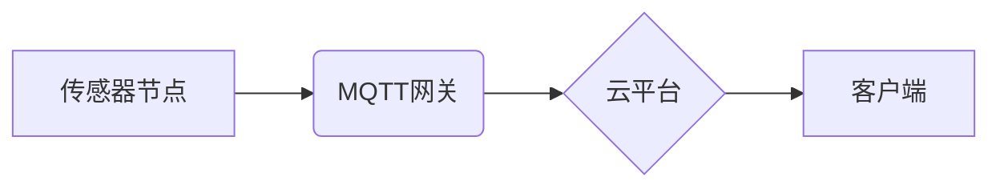

> MQTT, RESTful API, 婴幼儿看护, 智能家居, 物联网, 安全, 可靠性, 远程监控

## 1. 背景介绍

随着物联网技术的快速发展和普及，智能家居已成为现代家庭生活的重要组成部分。婴幼儿看护作为智能家居应用的重要领域之一，近年来备受关注。传统的婴幼儿看护方式存在着诸多局限性，例如：

* **缺乏实时性:**  传统的看护方式依赖于人工观察，无法实时掌握婴幼儿的状况。
* **安全性不足:**  婴幼儿容易受到意外伤害，传统的看护方式难以有效保障其安全。
* **不便性:**  传统的看护方式需要家长时刻陪伴，限制了家长的活动范围。

基于此，本文提出了一种基于MQTT协议和RESTful API的婴幼儿看护智能家居解决方案，旨在通过物联网技术，实现对婴幼儿的实时监控、安全保障和便捷管理。

## 2. 核心概念与联系

### 2.1 MQTT协议

MQTT（Message Queuing Telemetry Transport）是一种轻量级的消息传输协议，专门设计用于物联网应用场景。其特点如下：

* **轻量级:**  MQTT协议本身体积小，占用资源少，适合资源受限的设备。
* **低功耗:**  MQTT协议采用发布/订阅模式，减少数据传输量，降低设备功耗。
* **可靠性:**  MQTT协议提供消息确认机制，确保消息可靠传输。

### 2.2 RESTful API

RESTful API（Representational State Transfer Application Programming Interface）是一种基于HTTP协议的软件架构风格，用于构建Web服务。其特点如下：

* **简单易用:**  RESTful API采用标准的HTTP方法（GET、POST、PUT、DELETE等），易于理解和使用。
* **可扩展性:**  RESTful API支持多种数据格式（JSON、XML等），易于扩展和集成。
* **平台无关性:**  RESTful API基于HTTP协议，平台无关，可跨平台部署和访问。

### 2.3 系统架构

本方案采用MQTT协议和RESTful API构建智能家居系统架构，主要包括以下组件：

* **传感器节点:**  负责采集婴幼儿的各种数据，例如体温、心率、呼吸频率、睡眠状态等。
* **MQTT网关:**  负责将传感器节点采集的数据发布到MQTT主题，并接收来自客户端的指令。
* **云平台:**  负责存储和处理数据，提供远程监控和管理功能。
* **客户端:**  负责接收云平台推送的数据，并向MQTT网关发送指令。

**系统架构流程图:**



## 3. 核心算法原理 & 具体操作步骤

### 3.1  算法原理概述

本方案的核心算法是基于机器学习的异常检测算法，用于识别婴幼儿的异常状态。该算法通过训练模型，学习正常婴幼儿数据特征，并对采集到的数据进行实时分析，识别与正常特征不符的数据，从而判断婴幼儿是否出现异常状态。

### 3.2  算法步骤详解

1. **数据采集:**  传感器节点采集婴幼儿的各种数据，例如体温、心率、呼吸频率、睡眠状态等。
2. **数据预处理:**  对采集到的数据进行清洗、转换和特征提取，例如去除噪声、归一化数据、提取时间特征等。
3. **模型训练:**  利用预处理后的数据训练机器学习模型，例如支持向量机、决策树、神经网络等。
4. **异常检测:**  将采集到的实时数据输入训练好的模型，模型根据训练数据特征判断数据是否异常。
5. **报警处理:**  当模型检测到异常数据时，触发报警机制，向家长发送通知，并根据预设规则采取相应的措施，例如自动拨打紧急电话、开启灯光等。

### 3.3  算法优缺点

**优点:**

* **高准确率:**  机器学习算法能够学习复杂的数据特征，提高异常检测的准确率。
* **实时性强:**  算法能够实时分析数据，及时识别异常状态。
* **可扩展性强:**  算法可以根据需要添加新的数据特征和异常检测规则。

**缺点:**

* **训练数据依赖:**  算法的性能取决于训练数据的质量和数量。
* **模型复杂度:**  一些机器学习模型的复杂度较高，需要较高的计算资源。

### 3.4  算法应用领域

本方案的异常检测算法可以应用于以下领域:

* **婴幼儿看护:**  识别婴幼儿的异常状态，例如体温过高、呼吸困难、睡眠异常等。
* **老人看护:**  识别老人的异常状态，例如跌倒、心率异常、意识模糊等。
* **医疗保健:**  识别患者的异常状态，例如血压过高、血糖过低、心律不齐等。

## 4. 数学模型和公式 & 详细讲解 & 举例说明

### 4.1  数学模型构建

本方案采用基于K-Means聚类算法的异常检测模型。K-Means算法是一种无监督学习算法，用于将数据点划分为K个簇。异常检测模型的基本思想是将正常数据点聚类在一起，并将与正常数据点距离较远的点识别为异常点。

### 4.2  公式推导过程

K-Means算法的迭代过程如下：

1. **初始化:**  随机选择K个数据点作为初始聚类中心。
2. **分配:**  将每个数据点分配到距离其最近的聚类中心所属的簇。
3. **更新:**  计算每个簇的均值，并将均值作为新的聚类中心。
4. **重复:**  重复步骤2和3，直到聚类中心不再变化或达到最大迭代次数。

**距离公式:**

$$
d(x, c) = \sqrt{\sum_{i=1}^{n}(x_i - c_i)^2}
$$

其中：

* $x$ 是数据点
* $c$ 是聚类中心
* $n$ 是数据点的维度

### 4.3  案例分析与讲解

假设我们采集了100个婴幼儿的体温数据，并希望将其聚类为3个簇。

1. **初始化:**  随机选择3个数据点作为初始聚类中心。
2. **分配:**  将每个数据点分配到距离其最近的聚类中心所属的簇。
3. **更新:**  计算每个簇的均值，并将均值作为新的聚类中心。
4. **重复:**  重复步骤2和3，直到聚类中心不再变化。

最终，我们将得到3个聚类中心，分别代表正常体温、低体温和高体温的范围。

## 5. 项目实践：代码实例和详细解释说明

### 5.1  开发环境搭建

本方案的开发环境包括：

* **操作系统:**  Linux或Windows
* **编程语言:**  Python
* **MQTT库:**  paho-mqtt
* **RESTful API框架:**  Flask或Django
* **云平台:**  AWS、Azure或阿里云

### 5.2  源代码详细实现

```python
# MQTT网关代码示例

import paho.mqtt.client as mqtt

# MQTT服务器地址和端口
MQTT_BROKER = "mqtt.example.com"
MQTT_PORT = 1883

# MQTT主题
TOPIC_SENSOR_DATA = "sensor/data"

# 创建MQTT客户端
client = mqtt.Client()

# 连接MQTT服务器
client.connect(MQTT_BROKER, MQTT_PORT)

# 订阅传感器数据主题
client.subscribe(TOPIC_SENSOR_DATA)

# 处理接收到的传感器数据
def on_message(client, userdata, message):
    # 解析传感器数据
    sensor_data = message.payload.decode("utf-8")

    # 处理传感器数据，例如存储到数据库或发送到RESTful API
    print("Received sensor data:", sensor_data)

# 设置消息接收回调函数
client.on_message = on_message

# 启动MQTT客户端
client.loop_forever()
```

### 5.3  代码解读与分析

* **MQTT库:**  使用paho-mqtt库连接MQTT服务器并订阅主题。
* **主题订阅:**  订阅传感器数据主题，接收来自传感器节点的数据。
* **消息处理:**  定义on_message回调函数，处理接收到的传感器数据。
* **数据处理:**  对接收到的传感器数据进行解析和处理，例如存储到数据库或发送到RESTful API。

### 5.4  运行结果展示

当传感器节点采集到数据并发布到MQTT主题时，MQTT网关会接收数据并进行处理。处理结果可以是：

* **存储到数据库:**  将传感器数据存储到数据库中，方便后续分析和查询。
* **发送到RESTful API:**  将传感器数据发送到RESTful API，触发云平台的处理逻辑。
* **触发报警机制:**  当传感器数据异常时，触发报警机制，向家长发送通知。

## 6. 实际应用场景

### 6.1  远程监控

家长可以通过手机APP或网页端远程监控婴幼儿的状况，例如体温、心率、睡眠状态等。

### 6.2  安全保障

系统可以设置安全区域，当婴幼儿离开安全区域时，会触发报警机制，提醒家长注意。

### 6.3  便捷管理

家长可以通过系统管理婴幼儿的日常护理信息，例如喂奶时间、换尿布时间、睡眠时间等。

### 6.4  未来应用展望

* **智能语音交互:**  支持语音指令控制，例如“查看宝宝体温”，“打开宝宝房间灯光”。
* **人脸识别:**  识别婴幼儿的面部特征，实现更精准的监控和管理。
* **环境监测:**  监测婴幼儿周围的环境温度、湿度、空气质量等，提供更全面的健康保障。

## 7. 工具和资源推荐

### 7.1  学习资源推荐

* **MQTT协议:**  https://mqtt.org/
* **RESTful API:**  https://restfulapi.net/
* **机器学习:**  https://www.coursera.org/learn/machine-learning

### 7.2  开发工具推荐

* **Python:**  https://www.python.org/
* **paho-mqtt:**  https://pypi.org/project/paho-mqtt/
* **Flask:**  https://flask.palletsprojects.com/en/2.2.x/
* **AWS:**  https://aws.amazon.com/
* **Azure:**  https://azure.microsoft.com/

### 7.3  相关论文推荐

* **MQTT协议的应用研究**
* **基于机器学习的异常检测算法**
* **智能家居系统架构设计与实现**

## 8. 总结：未来发展趋势与挑战

### 8.1  研究成果总结

本方案提出了一种基于MQTT协议和RESTful API的婴幼儿看护智能家居解决方案，实现了对婴幼儿的实时监控、安全保障和便捷管理。该方案采用机器学习算法进行异常检测，提高了系统的准确性和可靠性。

### 8.2  未来发展趋势

* **人工智能技术:**  将更先进的人工智能技术应用于婴幼儿看护系统，例如深度学习、自然语言处理等，实现更智能的监控和管理。
* **边缘计算:**  将部分计算逻辑部署到边缘设备，降低对云平台的依赖，提高系统的实时性和可靠性。
* **隐私保护:**  加强对婴幼儿数据的隐私保护，确保数据的安全性和合法性。

### 8.3  面临的挑战

* **数据安全:**  婴幼儿数据敏感性高，需要采取有效的措施保障数据的安全和隐私。
* **算法准确性:**  机器学习算法的准确性取决于训练数据的质量和数量，需要不断完善算法模型和训练数据。
* **系统可靠性:**  智能家居系统需要保证高可靠性，避免因设备故障或网络问题导致的监控中断。

### 8.4  研究