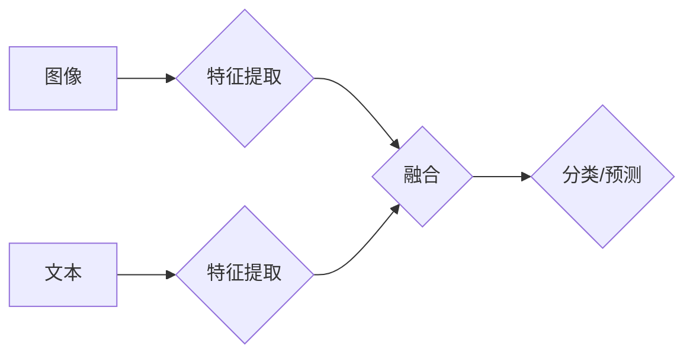

> 多模态学习、深度学习、计算机视觉、自然语言处理、多媒体理解、图像识别、文本理解、跨模态检索、知识融合

## 1. 背景介绍

在过去的几十年里，人工智能（AI）取得了令人瞩目的进展，特别是在计算机视觉和自然语言处理（NLP）领域。然而，这些领域通常是独立发展的，各自处理不同的数据类型，例如图像、文本、音频等。这限制了 AI 的能力，因为它无法充分利用不同模态之间的丰富信息。

多模态学习（Multimodal Learning）应运而生，旨在训练模型能够理解和处理多种模态数据，从而获得更全面、更深入的理解。例如，我们可以训练一个模型来识别图像中的物体并描述其属性，或者理解一段视频并生成相应的文本摘要。

多模态学习在许多领域都有广泛的应用前景，例如：

* **医疗保健：** 分析病历、影像和患者记录，辅助诊断和治疗。
* **教育：** 提供个性化学习体验，理解学生的学习行为和需求。
* **娱乐：** 生成更逼真的游戏场景和虚拟体验，增强用户互动。
* **机器人：** 帮助机器人更好地理解环境和人类指令，提高其自主性。

## 2. 核心概念与联系

多模态学习的核心概念是融合来自不同模态的数据，以获得更丰富的表示和更准确的理解。

**2.1 模态数据类型**

常见的模态数据类型包括：

* **图像：** 静态或动态的视觉信息。
* **文本：** 文字信息，包括自然语言和代码。
* **音频：** 声音信息，包括语音和音乐。
* **视频：** 结合图像和音频的动态信息。
* **传感器数据：** 来自传感器收集的各种物理信息，例如温度、湿度、位置等。

**2.2 多模态融合策略**

多模态融合策略是指将不同模态数据组合在一起的方法。常见的策略包括：

* **早期融合：** 在特征提取阶段将不同模态数据进行融合。
* **晚期融合：** 在决策阶段将不同模态数据进行融合。
* **层次融合：** 将不同模态数据进行多层次融合，例如先进行模态内融合，再进行模态间融合。

**2.3 多模态表示学习**

多模态表示学习是指学习能够有效地表示不同模态数据的向量表示。这些向量表示应该能够捕捉到不同模态之间的关系和语义信息。

**Mermaid 流程图**



## 3. 核心算法原理 & 具体操作步骤

### 3.1  算法原理概述

多模态学习算法通常基于深度学习框架，利用神经网络来学习不同模态数据的表示和融合策略。常见的算法包括：

* **多模态卷积神经网络 (Multimodal Convolutional Neural Networks)：** 结合卷积神经网络 (CNN) 和循环神经网络 (RNN) 来处理图像和文本数据。
* **多模态自编码器 (Multimodal Autoencoders)：** 学习生成不同模态数据的低维表示，并用于数据重建和降噪。
* **多模态生成对抗网络 (Multimodal Generative Adversarial Networks)：** 利用生成对抗网络 (GAN) 的思想，学习生成逼真的多模态数据。

### 3.2  算法步骤详解

以多模态卷积神经网络为例，其训练步骤如下：

1. **数据预处理：** 将图像和文本数据进行预处理，例如裁剪、缩放、词嵌入等。
2. **特征提取：** 使用 CNN 和 RNN 分别提取图像和文本的特征表示。
3. **融合特征：** 将图像和文本的特征表示进行融合，可以使用加法、乘法、拼接等方法。
4. **分类/预测：** 使用全连接层对融合特征进行分类或预测。
5. **损失函数：** 使用交叉熵损失函数或其他损失函数来评估模型的性能。
6. **反向传播：** 使用反向传播算法更新模型参数。

### 3.3  算法优缺点

**优点：**

* 可以利用不同模态数据的互补信息，提高模型的性能。
* 可以处理更复杂和现实世界的任务。

**缺点：**

* 需要大量的多模态数据进行训练。
* 模型训练复杂度较高，需要更强大的计算资源。

### 3.4  算法应用领域

多模态学习算法在以下领域有广泛的应用：

* **图像字幕生成：** 将图像转换为文本描述。
* **视频理解：** 理解视频内容，例如识别动作、场景和人物。
* **跨模态检索：** 根据文本查询图像或视频，反之亦然。
* **情感分析：** 分析文本和图像中的情感信息。

## 4. 数学模型和公式 & 详细讲解 & 举例说明

### 4.1  数学模型构建

多模态学习模型通常可以表示为一个联合概率分布，例如：

$$
P(I, T) = P(I)P(T|I)
$$

其中：

* $I$ 表示图像数据。
* $T$ 表示文本数据。

这个模型假设图像和文本是条件独立的，即给定图像的情况下，文本的分布只依赖于图像。

### 4.2  公式推导过程

为了训练这个模型，我们需要使用最大似然估计 (MLE) 方法，即最大化联合概率分布的似然函数：

$$
\mathcal{L} = \log P(I, T)
$$

通过对似然函数求导，我们可以得到模型参数的更新规则。

### 4.3  案例分析与讲解

例如，在图像字幕生成任务中，我们可以使用多模态自编码器来学习图像和文本的联合表示。

自编码器由编码器和解码器组成。编码器将图像和文本分别编码为低维向量，解码器将这些向量解码回图像和文本。

通过训练自编码器，我们可以学习到图像和文本之间的语义关系，并生成高质量的字幕。

## 5. 项目实践：代码实例和详细解释说明

### 5.1  开发环境搭建

* Python 3.x
* TensorFlow 或 PyTorch
* CUDA 和 cuDNN (可选，用于 GPU 加速)

### 5.2  源代码详细实现

```python
import tensorflow as tf

# 定义图像和文本的嵌入层
image_embedding = tf.keras.layers.Dense(128, activation='relu')
text_embedding = tf.keras.layers.Embedding(vocab_size, 64)

# 定义融合层
fusion_layer = tf.keras.layers.Concatenate()

# 定义分类层
classification_layer = tf.keras.layers.Dense(num_classes, activation='softmax')

# 定义模型
model = tf.keras.Sequential([
    image_embedding,
    text_embedding,
    fusion_layer,
    classification_layer
])

# 编译模型
model.compile(optimizer='adam',
              loss='categorical_crossentropy',
              metrics=['accuracy'])

# 训练模型
model.fit(x_train, y_train, epochs=10)
```

### 5.3  代码解读与分析

* 首先，我们定义了图像和文本的嵌入层，将图像和文本数据转换为低维向量表示。
* 然后，我们定义了一个融合层，将图像和文本的向量表示进行拼接。
* 最后，我们定义了一个分类层，对融合后的特征进行分类。

### 5.4  运行结果展示

训练完成后，我们可以使用模型对测试数据进行预测，并评估模型的性能。

## 6. 实际应用场景

### 6.1  图像字幕生成

多模态学习可以用于生成图像的字幕，例如将一张图片描述为“一只小狗在公园里玩耍”。

### 6.2  视频理解

多模态学习可以用于理解视频内容，例如识别视频中的动作、场景和人物。

### 6.3  跨模态检索

多模态学习可以用于跨模态检索，例如根据文本查询图像或视频，反之亦然。

### 6.4  未来应用展望

多模态学习在未来将有更广泛的应用，例如：

* **虚拟现实 (VR) 和增强现实 (AR)：** 提供更沉浸式的体验，例如在 VR 游戏中识别玩家的动作和情绪。
* **自动驾驶：** 帮助自动驾驶汽车理解周围环境，例如识别交通信号灯和行人。
* **个性化教育：** 提供个性化的学习体验，例如根据学生的学习行为和需求生成个性化的学习内容。

## 7. 工具和资源推荐

### 7.1  学习资源推荐

* **书籍：**
    * Deep Learning with Python by Francois Chollet
    * Multimodal Learning by Richard Socher
* **课程：**
    * Stanford CS231n: Convolutional Neural Networks for Visual Recognition
    * Deep Learning Specialization by Andrew Ng

### 7.2  开发工具推荐

* **TensorFlow:** https://www.tensorflow.org/
* **PyTorch:** https://pytorch.org/
* **OpenCV:** https://opencv.org/

### 7.3  相关论文推荐

* **Show, Attend and Tell: Neural Image Captioning with Visual Attention** by Xu et al. (2015)
* **Deep Visual-Semantic Alignments for Generating Image Descriptions** by Karpathy et al. (2014)
* **Multimodal Deep Learning: A Survey** by Kiela et al. (2018)

## 8. 总结：未来发展趋势与挑战

### 8.1  研究成果总结

多模态学习取得了显著的进展，在图像字幕生成、视频理解、跨模态检索等领域取得了令人瞩目的成果。

### 8.2  未来发展趋势

未来多模态学习的研究将朝着以下方向发展：

* **更强大的模型架构：** 开发更强大的多模态模型架构，例如 Transformer 和 Graph Neural Networks。
* **更丰富的模态数据：** 收集和利用更丰富的模态数据，例如音频、视频、传感器数据等。
* **更有效的融合策略：** 研究更有效的模态融合策略，例如跨模态注意力机制和自监督学习。

### 8.3  面临的挑战

多模态学习仍然面临一些挑战：

* **数据稀缺性：** 多模态数据往往稀缺，难以收集和标注。
* **模态间语义鸿沟：** 不同模态的数据表示方式不同，难以进行有效的融合。
* **计算资源限制：** 训练大型多模态模型需要大量的计算资源。

### 8.4  研究展望

尽管面临挑战，但多模态学习仍然是一个充满希望的领域。随着技术的进步和数据量的增加，多模态学习将为我们带来更多创新和应用。

## 9. 附录：常见问题与解答

### 9.1  Q1：多模态学习和深度学习有什么关系？

**A1：** 深度学习是多模态学习的基础。多模态学习算法通常基于深度学习框架，利用神经网络来学习不同模态数据的表示和融合策略。

### 9.2  Q2：多模态学习有哪些应用场景？

**A2：** 多模态学习的应用场景非常广泛，例如图像字幕生成、视频理解、跨模态检索、情感分析等。

### 9.3  Q3：如何学习多模态学习？

**A3：** 可以阅读相关书籍和论文，参加在线课程，并尝试自己动手实现一些多模态学习算法。

作者：禅与计算机程序设计艺术 / Zen and the Art of Computer Programming


<end_of_turn>