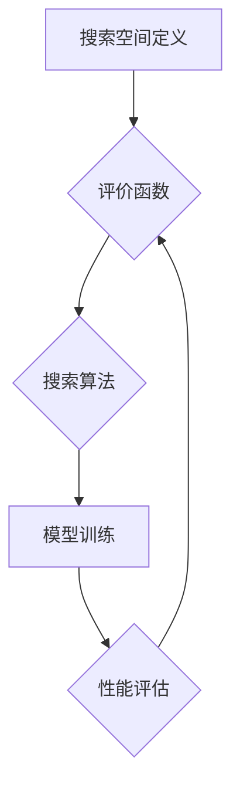

>  神经架构搜索 (NAS)，多目标优化，精度，延迟，能耗，深度学习，自动机器学习

## 1. 背景介绍

深度学习的蓬勃发展推动了人工智能领域的飞速进步。然而，深度学习模型的训练和部署往往面临着精度、延迟和能耗等方面的挑战。为了解决这些问题，神经架构搜索 (NAS) 应运而生。NAS 通过自动搜索最优神经网络架构，旨在提升模型性能的同时降低资源消耗。

传统的NAS方法通常聚焦于单一目标优化，例如最大化模型精度。然而，在实际应用场景中，模型的性能往往需要在多个目标之间进行平衡，例如精度、延迟和能耗。因此，多目标NAS (Multi-Objective NAS) 应运而生，旨在同时优化多个目标，以找到最优的权衡方案。

## 2. 核心概念与联系

多目标NAS的核心概念是将多个目标函数整合到一个统一的优化框架中，并通过特定的算法策略找到 Pareto 最优解。

**2.1 Pareto 最优解**

在多目标优化问题中，Pareto 最优解是指无法通过改进一个目标函数而同时不降低其他目标函数的值的解。换句话说，Pareto 最优解代表了多个目标之间的一种最优平衡。

**2.2 多目标优化算法**

多目标NAS通常采用以下几种算法策略：

* **进化算法 (Evolutionary Algorithms)**：通过模拟自然进化过程，不断迭代优化搜索空间，找到 Pareto 最优解。
* **粒子群算法 (Particle Swarm Optimization)**：通过模拟鸟群觅食行为，利用粒子群的协同作用，搜索最优解。
* **遗传算法 (Genetic Algorithms)**：通过模拟生物遗传机制，利用基因操作和交叉变异等操作，搜索最优解。

**2.3 多目标NAS 架构**

多目标NAS 的架构通常包括以下几个部分：

* **搜索空间定义**: 首先需要定义搜索空间，包括网络结构、层数、激活函数等参数。
* **评价函数**: 定义多个目标函数，例如精度、延迟和能耗，用于评估候选网络的性能。
* **搜索算法**: 选择合适的搜索算法，例如进化算法、粒子群算法等，进行网络架构搜索。
* **模型训练**: 对搜索到的候选网络进行训练，并评估其性能。

**Mermaid 流程图**



## 3. 核心算法原理 & 具体操作步骤

### 3.1 算法原理概述

多目标NAS 的核心算法原理是通过进化算法、粒子群算法或遗传算法等方法，在搜索空间中不断迭代优化网络架构，找到 Pareto 最优解。

### 3.2 算法步骤详解

1. **初始化**: 随机生成初始网络架构集合。
2. **评估**: 对每个网络架构进行训练和评估，计算其精度、延迟和能耗等目标函数值。
3. **选择**: 根据 Pareto 优劣关系，选择部分网络架构作为下一代的父代。
4. **交叉**: 对父代网络架构进行交叉操作，生成新的子代网络架构。
5. **变异**: 对子代网络架构进行变异操作，增加搜索空间的探索性。
6. **重复**: 重复步骤 2-5，直到达到预设的迭代次数或收敛条件。

### 3.3 算法优缺点

**优点**:

* 可以找到 Pareto 最优解，平衡多个目标之间的权衡。
* 能够探索更广阔的搜索空间，发现更优的网络架构。

**缺点**:

* 计算复杂度较高，需要大量的计算资源。
* 算法收敛速度较慢，需要较长的训练时间。

### 3.4 算法应用领域

多目标NAS 广泛应用于以下领域：

* **图像识别**: 寻找精度、延迟和能耗都优化的图像识别模型。
* **自然语言处理**: 寻找精度、延迟和能耗都优化的自然语言处理模型。
* **语音识别**: 寻找精度、延迟和能耗都优化的语音识别模型。

## 4. 数学模型和公式 & 详细讲解 & 举例说明

### 4.1 数学模型构建

多目标NAS 的数学模型通常采用多目标优化问题形式，目标函数为多个目标函数的线性加权组合。

$$
f(x) = w_1 \cdot g_1(x) + w_2 \cdot g_2(x) + ... + w_n \cdot g_n(x)
$$

其中：

* $f(x)$ 为目标函数值。
* $x$ 为网络架构参数。
* $g_i(x)$ 为第 $i$ 个目标函数。
* $w_i$ 为第 $i$ 个目标函数的权重。

### 4.2 公式推导过程

目标函数的权重 $w_i$ 可以根据实际应用场景进行调整。例如，如果精度是首要目标，则 $w_1$ 可以设置较大值，而 $w_2$ 和 $w_3$ 可以设置较小值。

### 4.3 案例分析与讲解

假设我们想要寻找一个图像识别模型，其目标函数为精度、延迟和能耗。我们可以将目标函数定义为：

$$
f(x) = 0.6 \cdot Accuracy(x) + 0.3 \cdot Latency(x) + 0.1 \cdot Energy(x)
$$

其中：

* $Accuracy(x)$ 为模型的精度。
* $Latency(x)$ 为模型的延迟。
* $Energy(x)$ 为模型的能耗。

通过调整权重 $w_i$，我们可以找到不同权衡方案的模型。例如，如果我们更注重精度，则可以将 $w_1$ 设置为 0.8，而 $w_2$ 和 $w_3$ 设置为 0.1。

## 5. 项目实践：代码实例和详细解释说明

### 5.1 开发环境搭建

* Python 3.7+
* TensorFlow 2.0+
* PyTorch 1.0+
* CUDA 10.0+

### 5.2 源代码详细实现

```python
# 导入必要的库
import tensorflow as tf
from tensorflow.keras.models import Sequential
from tensorflow.keras.layers import Conv2D, MaxPooling2D, Flatten, Dense

# 定义搜索空间
search_space = {
    'conv_layers': [1, 2, 3],
    'filters': [32, 64, 128],
    'kernel_size': [(3, 3), (5, 5)],
    'pool_size': [(2, 2), (3, 3)],
}

# 定义评价函数
def evaluate_model(model):
    # 训练模型并评估其精度、延迟和能耗
    # ...

# 定义搜索算法
def search_algorithm(search_space, evaluate_model):
    # 使用进化算法、粒子群算法或遗传算法搜索最优网络架构
    # ...

# 执行搜索
best_model = search_algorithm(search_space, evaluate_model)

# 训练最佳模型
best_model.fit(x_train, y_train)

# 评估最佳模型
loss, accuracy = best_model.evaluate(x_test, y_test)
print(f'Loss: {loss}, Accuracy: {accuracy}')
```

### 5.3 代码解读与分析

* 代码首先定义了搜索空间，包括网络结构、层数、激活函数等参数。
* 然后定义了评价函数，用于评估候选网络的性能。
* 接着定义了搜索算法，例如进化算法、粒子群算法等。
* 最后执行搜索，并训练和评估最佳模型。

### 5.4 运行结果展示

运行结果将显示最佳模型的精度、延迟和能耗等指标。

## 6. 实际应用场景

多目标NAS 在以下实际应用场景中发挥着重要作用：

* **移动设备**: 为了在有限的资源约束下，实现高精度和低延迟的图像识别和语音识别。
* **嵌入式系统**: 为了在低功耗环境下，实现高效的传感器数据处理和控制决策。
* **云计算**: 为了在高性能计算环境下，实现大规模数据分析和机器学习模型训练。

### 6.4 未来应用展望

随着深度学习技术的不断发展，多目标NAS 将在更多领域得到应用，例如：

* **自动驾驶**: 寻找精度、延迟和能耗都优化的自动驾驶模型。
* **医疗诊断**: 寻找精度、延迟和能耗都优化的医疗诊断模型。
* **金融风险管理**: 寻找精度、延迟和能耗都优化的金融风险管理模型。

## 7. 工具和资源推荐

### 7.1 学习资源推荐

* **书籍**:
    * 《Neural Architecture Search: Methods and Applications》
    * 《AutoML: A Comprehensive Guide》
* **论文**:
    * 《Efficient Neural Architecture Search via ProxylessNAS》
    * 《DARTS: Differentiable Architecture Search》
* **在线课程**:
    * Coursera: Machine Learning Specialization
    * Udacity: Deep Learning Nanodegree

### 7.2 开发工具推荐

* **TensorFlow**: 开源深度学习框架，支持多目标NAS。
* **PyTorch**: 开源深度学习框架，支持多目标NAS。
* **AutoML**: 自动机器学习平台，提供多目标NAS功能。

### 7.3 相关论文推荐

* 《Efficient Neural Architecture Search via ProxylessNAS》
* 《DARTS: Differentiable Architecture Search》
* 《ENAS: Efficient Neural Architecture Search via Parameter Sharing》

## 8. 总结：未来发展趋势与挑战

### 8.1 研究成果总结

多目标NAS 已经取得了显著的成果，在多个领域实现了模型性能的提升。

### 8.2 未来发展趋势

* **更有效的搜索算法**: 开发更有效的搜索算法，例如基于强化学习的NAS。
* **更灵活的搜索空间**: 定义更灵活的搜索空间，例如支持混合网络结构。
* **更广泛的应用场景**: 将多目标NAS 应用于更多领域，例如自动驾驶、医疗诊断等。

### 8.3 面临的挑战

* **计算资源**: 多目标NAS 计算复杂度高，需要大量的计算资源。
* **算法效率**: 现有的搜索算法效率较低，需要进一步优化。
* **可解释性**: 多目标NAS 的决策过程难以解释，需要提高模型的可解释性。

### 8.4 研究展望

未来，多目标NAS 将继续朝着更有效、更灵活、更可解释的方向发展，为深度学习的应用提供更强大的支持。

## 9. 附录：常见问题与解答

* **Q1**: 多目标NAS 与单目标NAS 的区别是什么？
* **A1**: 多目标NAS 同时优化多个目标函数，例如精度、延迟和能耗，而单目标NAS 只优化一个目标函数。
* **Q2**: 多目标NAS 的计算复杂度如何？
* **A2**: 多目标NAS 的计算复杂度较高，需要大量的计算资源。
* **Q3**: 多目标NAS 的应用场景有哪些？
* **A3**: 多目标NAS 应用于移动设备、嵌入式系统、云计算等多个领域。


作者：禅与计算机程序设计艺术 / Zen and the Art of Computer Programming 
<end_of_turn>