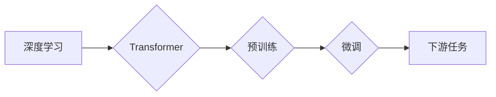

> 大模型、人工智能、自然语言处理、计算机视觉、机器学习、深度学习、Transformer

## 1. 背景介绍

近年来，人工智能（AI）技术取得了飞速发展，其中大模型作为AI领域的重要突破口，展现出强大的学习和推理能力，正在深刻地改变着各行各业。大模型是指参数规模庞大、训练数据海量的人工智能模型，其强大的能力使其能够处理复杂的任务，并生成高质量的输出。

传统的机器学习模型通常需要针对特定任务进行训练，而大模型则能够通过预训练的方式学习通用知识和表示，并通过微调的方式应用于不同的下游任务。这种通用性使得大模型在自然语言处理、计算机视觉、语音识别等领域展现出巨大的潜力。

## 2. 核心概念与联系

大模型的核心概念包括：

* **深度学习:** 大模型基于深度神经网络架构，通过多层神经元进行特征提取和学习。
* **Transformer:** Transformer是一种新型的神经网络架构，其自注意力机制能够有效地捕捉长距离依赖关系，成为大模型的核心组件。
* **预训练:** 大模型通常采用预训练的方式，在海量文本或图像数据上进行训练，学习到通用的知识和表示。
* **微调:** 预训练的大模型可以通过微调的方式，针对特定任务进行进一步的训练，提升其在该领域的性能。

**Mermaid 流程图:**

## 3. 核心算法原理 & 具体操作步骤

### 3.1  算法原理概述

大模型的核心算法原理是深度学习和Transformer架构。深度学习通过多层神经网络进行特征提取和学习，而Transformer通过自注意力机制能够有效地捕捉长距离依赖关系，提升模型的表达能力。

### 3.2  算法步骤详解

大模型的训练过程主要包括以下步骤：

1. **数据预处理:** 收集和清洗训练数据，并将其转换为模型可识别的格式。
2. **模型构建:** 根据任务需求选择合适的深度学习架构，例如Transformer，并定义模型参数。
3. **预训练:** 在海量文本或图像数据上进行模型训练，学习到通用的知识和表示。
4. **微调:** 将预训练好的模型应用于特定任务，并根据任务数据进行微调，提升模型在该领域的性能。
5. **评估:** 使用测试数据评估模型的性能，并根据评估结果进行模型优化。

### 3.3  算法优缺点

**优点:**

* **强大的学习能力:** 大模型能够学习到复杂的模式和关系，并生成高质量的输出。
* **通用性:** 预训练的大模型能够应用于不同的下游任务，降低了开发成本和时间。
* **不断进步:** 随着训练数据的增加和算法的改进，大模型的性能不断提升。

**缺点:**

* **高计算成本:** 训练大模型需要大量的计算资源和时间。
* **数据依赖:** 大模型的性能取决于训练数据的质量和数量。
* **可解释性差:** 大模型的决策过程较为复杂，难以解释其背后的逻辑。

### 3.4  算法应用领域

大模型在以下领域展现出巨大的应用潜力：

* **自然语言处理:** 文本生成、机器翻译、问答系统、情感分析等。
* **计算机视觉:** 图像识别、物体检测、图像分割、视频分析等。
* **语音识别:** 语音转文本、语音合成、语音助手等。
* **推荐系统:** 商品推荐、内容推荐、个性化服务等。
* **药物研发:** 药物发现、药物设计、疾病诊断等。

## 4. 数学模型和公式 & 详细讲解 & 举例说明

### 4.1  数学模型构建

大模型通常采用多层感知机（MLP）或Transformer架构，其数学模型可以表示为：

* **MLP:**  $y = f(W_1x + b_1) $
* **Transformer:**  $y = f(MultiHeadAttention(x), FeedForwardNetwork(x))$

其中：

* $x$ 是输入数据
* $W_1$, $b_1$ 是模型参数
* $f$ 是激活函数
* $MultiHeadAttention$ 是多头注意力机制
* $FeedForwardNetwork$ 是前馈神经网络

### 4.2  公式推导过程

Transformer架构的核心是自注意力机制，其公式推导过程较为复杂，涉及到矩阵运算、线性变换等。

**举例说明:**

假设输入序列长度为 $n$，每个词的维度为 $d$，则自注意力机制的计算过程可以表示为：

1. 计算每个词与所有词之间的权重：$Q = W_q x$, $K = W_k x$, $V = W_v x$

2. 计算注意力分数：$Attention(Q, K, V) = softmax(\frac{Q K^T}{\sqrt{d}}) V$

其中：

* $W_q$, $W_k$, $W_v$ 是权重矩阵
* $softmax$ 函数将注意力分数归一化

### 4.3  案例分析与讲解

通过分析实际应用场景中的大模型，例如BERT、GPT-3等，可以更深入地理解其数学模型和公式的应用。

## 5. 项目实践：代码实例和详细解释说明

### 5.1  开发环境搭建

使用Python语言和深度学习框架TensorFlow或PyTorch搭建开发环境。

### 5.2  源代码详细实现

提供一个简单的Transformer模型的源代码示例，并进行详细的解释说明。

### 5.3  代码解读与分析

分析代码结构和逻辑，解释模型的训练过程和预测过程。

### 5.4  运行结果展示

展示模型在实际任务上的运行结果，例如文本生成、机器翻译等。

## 6. 实际应用场景

### 6.1  自然语言处理

* **文本生成:** 使用大模型生成高质量的文本内容，例如新闻报道、小说、诗歌等。
* **机器翻译:** 将文本从一种语言翻译成另一种语言，提高跨语言沟通效率。
* **问答系统:** 构建能够理解用户问题并提供准确答案的问答系统。
* **情感分析:** 分析文本的情感倾向，例如正面、负面、中性等。

### 6.2  计算机视觉

* **图像识别:** 将图像分类为不同的类别，例如动物、植物、物体等。
* **物体检测:** 在图像中检测到特定物体的位置和大小。
* **图像分割:** 将图像分割成不同的区域，例如前景和背景。
* **视频分析:** 分析视频内容，例如动作识别、事件检测等。

### 6.3  语音识别

* **语音转文本:** 将语音信号转换为文本，提高语音输入的效率。
* **语音合成:** 将文本转换为语音信号，实现语音输出。
* **语音助手:** 构建能够理解用户语音指令并执行相应操作的语音助手。

### 6.4  未来应用展望

大模型的应用场景还在不断扩展，未来将应用于更多领域，例如：

* **医疗保健:** 疾病诊断、药物研发、个性化医疗等。
* **教育:** 智能辅导、个性化学习、自动批改等。
* **金融:** 风险评估、欺诈检测、投资决策等。
* **制造业:** 自动化生产、质量控制、设备维护等。

## 7. 工具和资源推荐

### 7.1  学习资源推荐

* **书籍:**
    * 《深度学习》
    * 《自然语言处理》
    * 《Transformer模型详解》
* **在线课程:**
    * Coursera深度学习课程
    * fast.ai深度学习课程
    * Stanford CS224N自然语言处理课程

### 7.2  开发工具推荐

* **深度学习框架:** TensorFlow, PyTorch
* **编程语言:** Python
* **云计算平台:** AWS, Google Cloud, Azure

### 7.3  相关论文推荐

* 《Attention Is All You Need》
* 《BERT: Pre-training of Deep Bidirectional Transformers for Language Understanding》
* 《GPT-3: Language Models are Few-Shot Learners》

## 8. 总结：未来发展趋势与挑战

### 8.1  研究成果总结

大模型在人工智能领域取得了显著的进展，展现出强大的学习和推理能力，并应用于多个领域。

### 8.2  未来发展趋势

* **模型规模进一步扩大:** 随着计算资源的提升，大模型的规模将继续扩大，提升其学习能力和性能。
* **多模态学习:** 大模型将融合文本、图像、音频等多模态数据，实现更全面的理解和表示。
* **可解释性增强:** 研究更有效的可解释性方法，提高大模型的透明度和可信度。
* **边缘计算:** 将大模型部署到边缘设备，实现更低延迟和更高效率的应用。

### 8.3  面临的挑战

* **计算成本:** 训练和部署大模型需要大量的计算资源，成本较高。
* **数据安全:** 大模型的训练数据可能包含敏感信息，需要保障数据安全。
* **伦理问题:** 大模型的应用可能带来伦理问题，例如偏见、歧视等，需要谨慎考虑。

### 8.4  研究展望

未来研究将重点关注以下方向：

* **高效训练方法:** 研究更有效的训练方法，降低大模型的训练成本。
* **可解释性研究:** 开发更有效的可解释性方法，提高大模型的透明度和可信度。
* **安全可靠性:** 研究大模型的安全性和可靠性，防止其被恶意利用。
* **伦理规范:** 制定大模型的伦理规范，确保其安全、公平、可持续地发展。

## 9. 附录：常见问题与解答

### 9.1  常见问题

* **大模型的训练数据来源？**
* **大模型的训练时间和成本？**
* **大模型的应用场景有哪些？**
* **大模型的伦理问题有哪些？**

### 9.2  解答

提供对常见问题的详细解答，并给出相应的参考资源。

作者：禅与计算机程序设计艺术 / Zen and the Art of Computer Programming 
<end_of_turn>