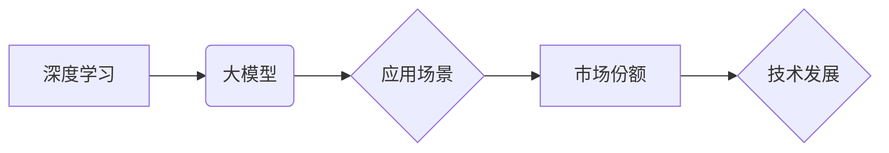

> 大模型，市场份额，技术发展，深度学习，Transformer，应用场景，未来趋势

## 1. 背景介绍

近年来，深度学习技术取得了飞速发展，大模型作为深度学习领域的重要分支，展现出强大的学习能力和应用潜力。大模型是指参数规模庞大、训练数据海量的人工智能模型，其在自然语言处理、计算机视觉、语音识别等领域取得了突破性进展，并逐渐渗透到各个行业，推动着人工智能技术的普及和应用。

然而，大模型的开发和应用也面临着诸多挑战，例如高昂的训练成本、巨大的模型规模、数据安全和隐私保护等问题。同时，大模型的市场份额也呈现出一定的集中趋势，头部企业占据主导地位，中小企业面临着竞争压力。

## 2. 核心概念与联系

**2.1 大模型的概念**

大模型是指参数规模庞大、训练数据海量的人工智能模型。通常，大模型的参数数量超过数十亿甚至数千亿，训练数据也达到数万亿甚至数千亿级别。

**2.2 深度学习与大模型的关系**

深度学习是机器学习的一种重要分支，它利用多层神经网络来模拟人类大脑的学习过程。大模型是深度学习技术的产物，其强大的学习能力源于其庞大的参数规模和海量训练数据。

**2.3 大模型的应用场景**

大模型在各个领域都有广泛的应用场景，例如：

* **自然语言处理:** 文本生成、机器翻译、问答系统、情感分析等。
* **计算机视觉:** 图像识别、物体检测、图像分割、视频分析等。
* **语音识别:** 语音转文本、语音合成、语音助手等。
* **推荐系统:** 商品推荐、内容推荐、个性化服务等。

**2.4 市场份额与技术发展的关系**

大模型的市场份额与技术发展密切相关。技术进步推动了大模型的规模和性能提升，从而吸引了更多的投资和应用，最终促进了市场份额的增长。

**2.5 Mermaid 流程图**



## 3. 核心算法原理 & 具体操作步骤

**3.1 算法原理概述**

大模型的训练主要基于深度学习算法，其中Transformer模型是近年来发展迅速的代表性算法。Transformer模型的核心思想是利用注意力机制来捕捉文本序列中的长距离依赖关系，从而实现更准确的文本理解和生成。

**3.2 算法步骤详解**

1. **数据预处理:** 将原始文本数据进行清洗、分词、词向量化等预处理操作，以便模型能够理解和处理文本信息。
2. **模型构建:** 根据Transformer模型的架构，构建包含多层编码器和解码器的深度神经网络模型。
3. **模型训练:** 使用海量训练数据，通过反向传播算法，调整模型参数，使模型能够准确地预测目标文本。
4. **模型评估:** 使用测试数据评估模型的性能，例如准确率、困惑度等指标。
5. **模型部署:** 将训练好的模型部署到实际应用场景中，例如文本生成、机器翻译等。

**3.3 算法优缺点**

**优点:**

* 能够捕捉长距离依赖关系，提高文本理解和生成能力。
* 训练效率高，能够在海量数据上进行高效训练。
* 可迁移性强，可以应用于多种自然语言处理任务。

**缺点:**

* 模型规模庞大，训练成本高昂。
* 对训练数据质量要求高，数据偏差会影响模型性能。
* 缺乏对文本语义理解的全局感知能力。

**3.4 算法应用领域**

Transformer模型在自然语言处理领域有着广泛的应用，例如：

* **机器翻译:** Google Translate、DeepL等机器翻译系统都采用了Transformer模型。
* **文本生成:** GPT-3、LaMDA等文本生成模型都基于Transformer架构。
* **问答系统:** BERT、XLNet等问答系统也采用了Transformer模型。

## 4. 数学模型和公式 & 详细讲解 & 举例说明

**4.1 数学模型构建**

Transformer模型的核心是注意力机制，其数学模型可以表示为：

$$
Attention(Q, K, V) = softmax(\frac{QK^T}{\sqrt{d_k}})V
$$

其中：

* $Q$：查询矩阵
* $K$：键矩阵
* $V$：值矩阵
* $d_k$：键向量的维度
* $softmax$：softmax函数

**4.2 公式推导过程**

注意力机制的目的是计算查询向量与键向量的相关性，并根据相关性对值向量进行加权求和。

1. 计算查询向量与键向量的点积，并进行归一化处理。
2. 使用softmax函数将点积结果转换为概率分布。
3. 将概率分布与值向量进行加权求和，得到最终的注意力输出。

**4.3 案例分析与讲解**

假设我们有一个句子“我爱学习编程”，我们需要计算“学习”这个词与整个句子的相关性。

1. 将句子中的每个词都转换为词向量，作为查询向量、键向量和值向量。
2. 计算“学习”词向量与其他词向量的点积，并进行归一化处理。
3. 使用softmax函数将点积结果转换为概率分布，表示“学习”词与其他词的相关性。
4. 将概率分布与所有词向量的加权求和，得到“学习”词与整个句子的相关性表示。

## 5. 项目实践：代码实例和详细解释说明

**5.1 开发环境搭建**

* Python 3.7+
* PyTorch 1.7+
* CUDA 10.2+

**5.2 源代码详细实现**

```python
import torch
import torch.nn as nn

class Transformer(nn.Module):
    def __init__(self, vocab_size, embedding_dim, num_heads, num_layers):
        super(Transformer, self).__init__()
        self.embedding = nn.Embedding(vocab_size, embedding_dim)
        self.transformer_layers = nn.ModuleList([
            nn.TransformerEncoderLayer(embedding_dim, num_heads)
            for _ in range(num_layers)
        ])
        self.linear = nn.Linear(embedding_dim, vocab_size)

    def forward(self, x):
        x = self.embedding(x)
        for layer in self.transformer_layers:
            x = layer(x)
        x = self.linear(x)
        return x
```

**5.3 代码解读与分析**

* `__init__` 方法初始化模型参数，包括词嵌入层、Transformer编码器层和线性输出层。
* `forward` 方法定义模型的正向传播过程，将输入序列经过词嵌入层、Transformer编码器层和线性输出层，最终得到输出序列。

**5.4 运行结果展示**

训练好的Transformer模型可以用于各种自然语言处理任务，例如机器翻译、文本生成等。

## 6. 实际应用场景

**6.1 自然语言处理**

* **机器翻译:** 使用Transformer模型可以实现高质量的机器翻译，例如Google Translate、DeepL等。
* **文本生成:** GPT-3、LaMDA等文本生成模型可以生成流畅、自然的文本，例如文章、故事、对话等。
* **问答系统:** BERT、XLNet等问答系统可以理解用户的问题，并从知识库中找到准确的答案。

**6.2 计算机视觉**

* **图像识别:** 使用Transformer模型可以实现图像识别，例如识别物体、场景、人物等。
* **图像分割:** 使用Transformer模型可以实现图像分割，例如将图像分割成不同的区域。

**6.3 语音识别**

* **语音转文本:** 使用Transformer模型可以实现语音转文本，例如将语音转换为文字。
* **语音合成:** 使用Transformer模型可以实现语音合成，例如将文字转换为语音。

**6.4 未来应用展望**

大模型的应用场景还在不断扩展，未来可能会应用于更多领域，例如：

* **医疗保健:** 辅助医生诊断疾病、预测患者风险。
* **教育:** 个性化学习、智能辅导。
* **金融:** 风险评估、欺诈检测。

## 7. 工具和资源推荐

**7.1 学习资源推荐**

* **书籍:**
    * 《深度学习》
    * 《Transformer模型详解》
* **在线课程:**
    * Coursera: 深度学习
    * Udacity: 自然语言处理
* **博客:**
    * The Gradient
    * Towards Data Science

**7.2 开发工具推荐**

* **PyTorch:** 深度学习框架
* **TensorFlow:** 深度学习框架
* **Hugging Face:** 大模型库

**7.3 相关论文推荐**

* 《Attention Is All You Need》
* 《BERT: Pre-training of Deep Bidirectional Transformers for Language Understanding》
* 《GPT-3: Language Models are Few-Shot Learners》

## 8. 总结：未来发展趋势与挑战

**8.1 研究成果总结**

近年来，大模型在自然语言处理、计算机视觉等领域取得了显著进展，其强大的学习能力和应用潜力推动了人工智能技术的快速发展。

**8.2 未来发展趋势**

* **模型规模进一步扩大:** 随着计算能力的提升，大模型的规模将继续扩大，模型性能将进一步提升。
* **多模态学习:** 大模型将融合文本、图像、音频等多模态数据，实现更全面的信息理解和生成。
* **可解释性增强:** 研究人员将致力于提高大模型的可解释性，使模型的决策过程更加透明和可理解。

**8.3 面临的挑战**

* **训练成本高昂:** 大模型的训练需要消耗大量的计算资源和时间，成本很高。
* **数据安全和隐私保护:** 大模型的训练需要海量数据，如何保证数据安全和隐私保护是一个重要挑战。
* **模型偏见和公平性:** 大模型可能存在模型偏见和公平性问题，需要进行相应的缓解措施。

**8.4 研究展望**

未来，大模型研究将继续朝着更强大、更安全、更可解释的方向发展，为人类社会带来更多福祉。

## 9. 附录：常见问题与解答

**9.1 如何选择合适的模型架构？**

选择合适的模型架构取决于具体的应用场景和数据特点。例如，对于文本生成任务，GPT模型是一个不错的选择；对于机器翻译任务，Transformer模型是一个更优的选择。

**9.2 如何解决模型过拟合问题？**

模型过拟合是指模型在训练数据上表现很好，但在测试数据上表现较差。解决模型过拟合问题的方法包括：

* 增加训练数据量
* 使用正则化技术
* 使用Dropout技术
* 使用早停策略

**9.3 如何评估模型性能？**

模型性能的评估指标取决于具体的应用场景。常见的评估指标包括：

* **准确率:** 预测正确的样本比例
* **困惑度:** 模型预测文本的概率分布与真实分布的差异
* **BLEU分数:** 机器翻译模型的评估指标

作者：禅与计算机程序设计艺术 / Zen and the Art of Computer Programming


<end_of_turn>