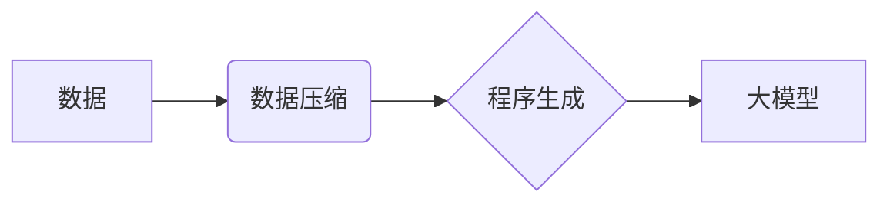

> 大模型、数据压缩、程序生成、规律提取、深度学习、Transformer、模型压缩

## 1. 背景介绍

近年来，深度学习模型的规模不断扩大，涌现出许多参数量巨大的“大模型”。这些大模型在自然语言处理、计算机视觉、语音识别等领域取得了令人瞩目的成就。然而，大模型的训练和部署也面临着巨大的挑战，例如训练成本高、计算资源消耗大、模型推理速度慢等。

从本质上看，大模型的训练过程可以看作是一个数据压缩的过程。我们通过大量的训练数据，学习到一个更短的程序，这个程序能够生成与训练数据相似的输出。这个“程序”就是模型的权重参数，而训练的过程就是寻找最优参数的过程。

## 2. 核心概念与联系

### 2.1  数据压缩

数据压缩是指将数据以更小的空间存储或传输，同时保持数据完整性的技术。常见的压缩算法包括Huffman编码、Lempel-Ziv算法、Run-Length编码等。

### 2.2  程序生成

程序生成是指通过某种算法自动生成计算机程序的过程。程序生成技术广泛应用于代码自动完成、软件测试、代码优化等领域。

### 2.3  大模型与数据压缩

大模型的训练过程本质上就是一种特殊的程序生成过程。我们通过大量的训练数据，学习到一个能够生成与训练数据相似的程序，这个程序就是模型的权重参数。

**核心概念与联系流程图:**



## 3. 核心算法原理 & 具体操作步骤

### 3.1  算法原理概述

大模型训练的核心算法是深度学习，其中最常用的架构是Transformer。Transformer模型通过自注意力机制和多头注意力机制，学习到数据之间的复杂关系，并生成能够生成与训练数据相似的输出的权重参数。

### 3.2  算法步骤详解

1. **数据预处理:** 将原始数据转换为模型可以理解的格式，例如文本数据需要进行分词、词嵌入等处理。
2. **模型构建:** 根据任务需求选择合适的Transformer模型架构，并初始化模型参数。
3. **模型训练:** 使用训练数据训练模型，通过反向传播算法更新模型参数，使模型输出与真实标签尽可能接近。
4. **模型评估:** 使用验证集评估模型性能，并根据评估结果调整模型参数或训练策略。
5. **模型部署:** 将训练好的模型部署到实际应用场景中，用于生成预测结果。

### 3.3  算法优缺点

**优点:**

* 能够学习到数据之间的复杂关系，生成高质量的输出。
* 具有良好的泛化能力，能够应用于多种任务。

**缺点:**

* 训练成本高，需要大量的计算资源和时间。
* 模型参数量大，部署成本高。
* 对训练数据质量要求高，容易受到噪声数据的影响。

### 3.4  算法应用领域

大模型的应用领域非常广泛，包括：

* 自然语言处理：机器翻译、文本摘要、问答系统、对话系统等。
* 计算机视觉：图像识别、目标检测、图像分割、视频分析等。
* 语音识别：语音转文本、语音合成、语音助手等。
* 其他领域：药物研发、金融预测、科学研究等。

## 4. 数学模型和公式 & 详细讲解 & 举例说明

### 4.1  数学模型构建

大模型的训练过程可以看作是一个优化问题，目标是找到一个能够最小化损失函数的参数集。损失函数通常定义为模型输出与真实标签之间的差异。

### 4.2  公式推导过程

反向传播算法是深度学习模型训练的核心算法，它通过计算梯度来更新模型参数。梯度的计算公式如下：

$$
\frac{\partial L}{\partial w} = \frac{\partial L}{\partial y} \cdot \frac{\partial y}{\partial w}
$$

其中：

* $L$ 是损失函数
* $w$ 是模型参数
* $y$ 是模型输出

### 4.3  案例分析与讲解

假设我们训练一个简单的线性回归模型，目标是预测房价。模型的输出公式为：

$$
y = w_0 + w_1 x
$$

其中：

* $y$ 是预测的房价
* $w_0$ 和 $w_1$ 是模型参数
* $x$ 是房屋面积

损失函数可以定义为均方误差：

$$
L = \frac{1}{n} \sum_{i=1}^{n} (y_i - \hat{y}_i)^2
$$

其中：

* $n$ 是样本数量
* $y_i$ 是真实房价
* $\hat{y}_i$ 是模型预测的房价

通过反向传播算法，我们可以计算出 $w_0$ 和 $w_1$ 的梯度，并根据梯度更新模型参数。

## 5. 项目实践：代码实例和详细解释说明

### 5.1  开发环境搭建

* Python 3.7+
* TensorFlow 2.0+
* PyTorch 1.0+

### 5.2  源代码详细实现

```python
import tensorflow as tf

# 定义模型
model = tf.keras.Sequential([
    tf.keras.layers.Dense(64, activation='relu', input_shape=(10,)),
    tf.keras.layers.Dense(1)
])

# 定义损失函数和优化器
loss_fn = tf.keras.losses.MeanSquaredError()
optimizer = tf.keras.optimizers.Adam(learning_rate=0.001)

# 训练模型
for epoch in range(10):
    for batch in dataset:
        with tf.GradientTape() as tape:
            predictions = model(batch)
            loss = loss_fn(batch, predictions)
        gradients = tape.gradient(loss, model.trainable_variables)
        optimizer.apply_gradients(zip(gradients, model.trainable_variables))

# 评估模型
loss = loss_fn(test_dataset, model(test_dataset))
print('Test Loss:', loss)
```

### 5.3  代码解读与分析

* 代码首先定义了一个简单的线性回归模型，包含两个全连接层。
* 然后定义了损失函数和优化器，用于训练模型。
* 训练过程使用迭代的方式，每次迭代一个批次的训练数据。
* 在每个迭代中，计算模型的预测结果和损失值，并使用反向传播算法更新模型参数。
* 最后评估模型在测试数据集上的性能。

### 5.4  运行结果展示

运行代码后，会输出测试集上的损失值。损失值越小，模型的性能越好。

## 6. 实际应用场景

大模型在各个领域都有着广泛的应用场景，例如：

### 6.1  自然语言处理

* **机器翻译:** 使用大模型可以实现更高质量的机器翻译，例如Google Translate。
* **文本摘要:** 大模型可以自动生成文本摘要，例如新闻文章的摘要。
* **问答系统:** 大模型可以构建更智能的问答系统，例如ChatGPT。

### 6.2  计算机视觉

* **图像识别:** 大模型可以识别图像中的物体，例如人脸识别、物体检测。
* **图像分割:** 大模型可以将图像分割成不同的区域，例如医学图像分割。
* **视频分析:** 大模型可以分析视频内容，例如动作识别、事件检测。

### 6.3  语音识别

* **语音转文本:** 大模型可以将语音转换为文本，例如语音助手。
* **语音合成:** 大模型可以将文本转换为语音，例如语音播报。

### 6.4  未来应用展望

随着大模型技术的不断发展，未来将有更多新的应用场景出现，例如：

* **个性化教育:** 根据学生的学习情况，提供个性化的学习内容和辅导。
* **医疗诊断:** 利用大模型辅助医生进行疾病诊断。
* **科学研究:** 加速科学研究的进程，例如药物研发、材料科学。

## 7. 工具和资源推荐

### 7.1  学习资源推荐

* **书籍:**
    * Deep Learning by Ian Goodfellow, Yoshua Bengio, and Aaron Courville
    * Hands-On Machine Learning with Scikit-Learn, Keras & TensorFlow by Aurélien Géron
* **在线课程:**
    * Deep Learning Specialization by Andrew Ng (Coursera)
    * Fast.ai Practical Deep Learning for Coders

### 7.2  开发工具推荐

* **TensorFlow:** 开源深度学习框架，提供丰富的模型构建和训练工具。
* **PyTorch:** 开源深度学习框架，以其灵活性和易用性而闻名。
* **JAX:** 高性能自动微分库，支持GPU和TPU加速。

### 7.3  相关论文推荐

* Attention Is All You Need (Vaswani et al., 2017)
* BERT: Pre-training of Deep Bidirectional Transformers for Language Understanding (Devlin et al., 2018)
* GPT-3: Language Models are Few-Shot Learners (Brown et al., 2020)

## 8. 总结：未来发展趋势与挑战

### 8.1  研究成果总结

大模型的训练和应用取得了显著的进展，在自然语言处理、计算机视觉等领域取得了突破性成果。

### 8.2  未来发展趋势

* **模型规模继续扩大:** 随着计算资源的不断提升，大模型的规模将继续扩大，模型能力将进一步提升。
* **模型效率提升:** 研究人员将致力于开发更有效的训练和推理算法，降低大模型的训练和部署成本。
* **模型可解释性增强:** 研究人员将致力于提高大模型的可解释性，使模型的决策过程更加透明。
* **多模态大模型:** 将融合文本、图像、音频等多种模态数据，构建更强大的多模态大模型。

### 8.3  面临的挑战

* **数据获取和标注:** 大模型的训练需要大量的训练数据，数据获取和标注成本高昂。
* **计算资源消耗:** 大模型的训练需要大量的计算资源，成本高昂。
* **模型安全性和可靠性:** 大模型的输出可能存在偏差和错误，需要保证模型的安全性和可靠性。
* **伦理问题:** 大模型的应用可能引发一些伦理问题，例如隐私泄露、信息操纵等。

### 8.4  研究展望

未来，大模型研究将继续朝着更强大、更安全、更可解释的方向发展，并将对人工智能的未来发展产生深远的影响。

## 9. 附录：常见问题与解答

### 9.1  Q1: 大模型的训练需要多少数据？

**A1:** 大模型的训练需要大量的训练数据，通常需要百万甚至数十亿个样本。

### 9.2  Q2: 大模型的训练需要多少计算资源？

**A2:** 大模型的训练需要大量的计算资源，通常需要数百甚至数千个GPU。

### 9.3  Q3: 如何评估大模型的性能？

**A3:** 大模型的性能可以通过多种指标评估，例如准确率、召回率、F1-score等。

### 9.4  Q4: 大模型的应用有哪些？

**A4:** 大模型的应用非常广泛，包括自然语言处理、计算机视觉、语音识别等领域。

### 9.5  Q5: 大模型的未来发展趋势是什么？

**A5:** 大模型的未来发展趋势包括模型规模扩大、模型效率提升、模型可解释性增强、多模态大模型等。


作者：禅与计算机程序设计艺术 / Zen and the Art of Computer Programming 
<end_of_turn>