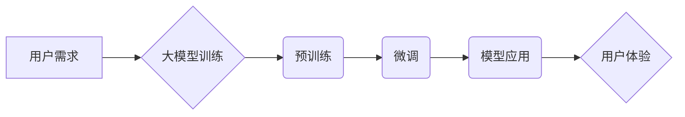

> 大模型、用户需求、市场潜力、应用场景、发展趋势、挑战

## 1. 背景介绍

近年来，人工智能（AI）技术取得了飞速发展，其中大模型（Large Language Model，LLM）作为人工智能领域的重要突破，展现出强大的学习和推理能力，在自然语言处理、计算机视觉、代码生成等领域取得了令人瞩目的成果。大模型的出现，不仅推动了人工智能技术的进步，也为用户带来了全新的体验和可能性。

大模型的定义通常是指参数量超过数十亿甚至千亿的深度学习模型，通过海量数据训练，能够学习到复杂的语言模式和知识结构。与传统的小型模型相比，大模型拥有更强的泛化能力和表达能力，能够处理更复杂的任务，并生成更自然、更流畅的文本。

一些代表性的例子包括：

* **GPT-3 (Generative Pre-trained Transformer 3)**：由OpenAI开发，参数量达1750亿，能够进行文本生成、翻译、摘要、问答等多种任务。
* **BERT (Bidirectional Encoder Representations from Transformers)**：由Google开发，参数量达3.4亿，擅长理解上下文关系，在自然语言理解任务中表现出色。
* **LaMDA (Language Model for Dialogue Applications)**：由Google开发，专注于对话生成，能够进行自然、流畅的对话。

## 2. 核心概念与联系

大模型的训练和应用涉及到多个核心概念和技术，包括：

* **深度学习**: 大模型基于深度神经网络架构，通过多层神经元进行特征提取和学习。
* **Transformer**: Transformer是一种新型的神经网络架构，能够有效处理序列数据，是构建大模型的基础。
* **预训练**: 大模型通常采用预训练的方式，在海量文本数据上进行训练，学习到语言的通用知识和模式。
* **微调**: 预训练的模型可以根据特定任务进行微调，提高其在特定领域的性能。

**Mermaid 流程图**



## 3. 核心算法原理 & 具体操作步骤

### 3.1  算法原理概述

大模型的训练主要基于深度学习算法，其中Transformer架构是其核心。Transformer通过自注意力机制（Self-Attention）和多头注意力机制（Multi-Head Attention）来捕捉序列数据中的长距离依赖关系，从而实现更准确的文本理解和生成。

### 3.2  算法步骤详解

1. **数据预处理**: 将文本数据进行清洗、分词、标记等预处理操作，使其能够被模型理解。
2. **模型构建**: 根据Transformer架构构建深度神经网络模型，并设置模型参数。
3. **预训练**: 使用海量文本数据对模型进行预训练，学习语言的通用知识和模式。
4. **微调**: 根据特定任务对预训练模型进行微调，使其能够在特定领域表现出色。
5. **模型评估**: 使用测试数据评估模型的性能，并根据评估结果进行模型优化。

### 3.3  算法优缺点

**优点**:

* 强大的泛化能力和表达能力
* 能够处理更复杂的任务
* 生成更自然、更流畅的文本

**缺点**:

* 训练成本高
* 训练时间长
* 容易受到数据偏差的影响

### 3.4  算法应用领域

大模型在多个领域都有广泛的应用，包括：

* **自然语言处理**: 文本生成、翻译、摘要、问答、情感分析等
* **计算机视觉**: 图像识别、物体检测、图像生成等
* **代码生成**: 代码自动完成、代码翻译、代码修复等
* **语音识别**: 语音转文本、语音合成等

## 4. 数学模型和公式 & 详细讲解 & 举例说明

### 4.1  数学模型构建

大模型的训练基于深度学习算法，其数学模型主要包括：

* **神经网络**: 由多个神经元组成的网络结构，用于学习数据特征。
* **激活函数**: 用于引入非线性，使模型能够学习更复杂的模式。
* **损失函数**: 用于衡量模型预测结果与真实值的差异，指导模型训练。
* **优化算法**: 用于更新模型参数，使模型性能不断提升。

### 4.2  公式推导过程

Transformer架构的核心是自注意力机制，其计算公式如下：

$$
Attention(Q, K, V) = softmax(\frac{QK^T}{\sqrt{d_k}})V
$$

其中：

* $Q$：查询矩阵
* $K$：键矩阵
* $V$：值矩阵
* $d_k$：键向量的维度
* $softmax$：softmax函数，用于归一化注意力权重

### 4.3  案例分析与讲解

假设我们有一个句子“我爱学习编程”，将其转换为词向量表示，并将其作为查询矩阵 $Q$。

然后，我们使用词向量表示的词作为键矩阵 $K$ 和值矩阵 $V$。

通过计算注意力权重，我们可以得到每个词对句子的重要程度，并根据这些权重对词向量进行加权求和，得到句子表示。

## 5. 项目实践：代码实例和详细解释说明

### 5.1  开发环境搭建

* Python 3.7+
* TensorFlow 或 PyTorch 深度学习框架
* CUDA 和 cuDNN (可选，用于GPU加速)

### 5.2  源代码详细实现

```python
import tensorflow as tf

# 定义Transformer模型
class Transformer(tf.keras.Model):
    def __init__(self, vocab_size, embedding_dim, num_heads, num_layers):
        super(Transformer, self).__init__()
        self.embedding = tf.keras.layers.Embedding(vocab_size, embedding_dim)
        self.transformer_layers = [
            tf.keras.layers.MultiHeadAttention(num_heads=num_heads, key_dim=embedding_dim)
            for _ in range(num_layers)
        ]
        self.dense = tf.keras.layers.Dense(vocab_size)

    def call(self, inputs):
        # ... (代码实现Transformer模型的forward pass)

# 实例化模型
model = Transformer(vocab_size=10000, embedding_dim=512, num_heads=8, num_layers=6)

# 训练模型
model.compile(optimizer='adam', loss='sparse_categorical_crossentropy', metrics=['accuracy'])
model.fit(train_data, train_labels, epochs=10)
```

### 5.3  代码解读与分析

* **模型定义**: Transformer模型由嵌入层、多头注意力层和全连接层组成。
* **嵌入层**: 将词向量表示为稠密的向量。
* **多头注意力层**: 用于捕捉序列数据中的长距离依赖关系。
* **全连接层**: 用于将注意力输出映射到输出词汇表。
* **训练过程**: 使用Adam优化器、交叉熵损失函数和准确率指标训练模型。

### 5.4  运行结果展示

训练完成后，可以使用测试数据评估模型的性能，并可视化模型的训练过程和预测结果。

## 6. 实际应用场景

### 6.1  聊天机器人

大模型可以用于构建更智能、更自然的聊天机器人，能够理解用户的意图，并提供更准确、更相关的回复。

### 6.2  文本生成

大模型可以用于生成各种类型的文本，例如文章、故事、诗歌、代码等，可以帮助人们提高写作效率，激发创作灵感。

### 6.3  机器翻译

大模型可以用于机器翻译，能够实现更准确、更流畅的语言翻译，打破语言障碍，促进跨文化交流。

### 6.4  未来应用展望

大模型的应用场景还在不断扩展，未来可能在以下领域发挥更大的作用：

* **个性化教育**: 根据学生的学习情况提供个性化的学习内容和辅导。
* **医疗诊断**: 辅助医生进行疾病诊断，提高诊断准确率。
* **科学研究**: 加速科学研究进程，帮助科学家发现新的知识。

## 7. 工具和资源推荐

### 7.1  学习资源推荐

* **课程**: Coursera、edX、Udacity 等平台提供深度学习和自然语言处理相关的课程。
* **书籍**: 《深度学习》、《自然语言处理》等书籍可以帮助读者深入了解相关知识。
* **博客**: HuggingFace、OpenAI 等机构的博客经常发布大模型相关的最新研究成果和应用案例。

### 7.2  开发工具推荐

* **TensorFlow**: Google开发的开源深度学习框架。
* **PyTorch**: Facebook开发的开源深度学习框架。
* **HuggingFace Transformers**: 提供预训练大模型和训练工具的开源库。

### 7.3  相关论文推荐

* **Attention Is All You Need**: Transformer模型的原始论文。
* **BERT: Pre-training of Deep Bidirectional Transformers for Language Understanding**: BERT模型的论文。
* **GPT-3: Language Models are Few-Shot Learners**: GPT-3模型的论文。

## 8. 总结：未来发展趋势与挑战

### 8.1  研究成果总结

近年来，大模型在人工智能领域取得了显著的进展，展现出强大的学习和推理能力，为用户带来了全新的体验和可能性。

### 8.2  未来发展趋势

* **模型规模**: 大模型的规模将继续扩大，参数量将达到万亿甚至千亿级别。
* **模型效率**: 研究人员将致力于提高大模型的训练效率和推理效率。
* **模型安全**: 大模型的安全性和可解释性将成为研究的重点。
* **多模态学习**: 大模型将扩展到多模态数据，例如文本、图像、音频等。

### 8.3  面临的挑战

* **数据获取**: 大模型的训练需要海量数据，数据获取和清洗是一个挑战。
* **计算资源**: 大模型的训练需要大量的计算资源，成本较高。
* **伦理问题**: 大模型的应用可能带来伦理问题，例如偏见、虚假信息等。

### 8.4  研究展望

未来，大模型的研究将继续深入，探索更强大的模型架构、更有效的训练方法和更广泛的应用场景，为人工智能的发展做出更大的贡献。

## 9. 附录：常见问题与解答

* **什么是大模型？**

大模型是指参数量超过数十亿甚至千亿的深度学习模型，通过海量数据训练，能够学习到复杂的语言模式和知识结构。

* **大模型的优势是什么？**

大模型拥有强大的泛化能力和表达能力，能够处理更复杂的任务，并生成更自然、更流畅的文本。

* **大模型的应用场景有哪些？**

大模型在自然语言处理、计算机视觉、代码生成等多个领域都有广泛的应用。

* **如何训练大模型？**

训练大模型需要海量数据、强大的计算资源和有效的训练方法。

* **大模型有哪些伦理问题？**

大模型的应用可能带来偏见、虚假信息等伦理问题，需要引起重视和解决。


作者：禅与计算机程序设计艺术 / Zen and the Art of Computer Programming 
<end_of_turn>