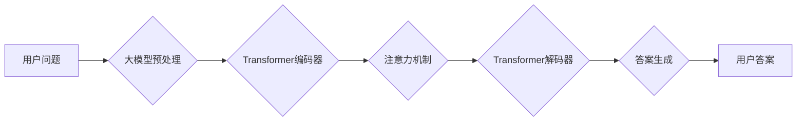

> 大模型、问答机器人、上下文相关性、Transformer、BERT、GPT、检索式、生成式

## 1. 背景介绍

近年来，大模型在自然语言处理领域取得了显著的进展，为问答机器人的发展提供了强大的技术支撑。问答机器人旨在通过理解用户的问题并从知识库或文本语料中获取相关信息，以自然语言形式回答用户的问题。上下文相关性是问答机器人能否准确理解用户意图和提供相关答案的关键因素。

传统的问答系统主要依赖于关键词匹配或规则匹配，缺乏对上下文语义的理解能力。随着大模型的兴起，基于大模型的问答机器人能够更好地捕捉文本中的上下文信息，从而提高问答的准确性和自然度。

## 2. 核心概念与联系

### 2.1  上下文相关性

上下文相关性是指一个词或短语与其周围词语之间的语义关联程度。在问答机器人中，上下文相关性是指用户问题与知识库或文本语料中的答案之间的语义关联程度。

### 2.2  大模型

大模型是指参数量庞大、训练数据海量的人工智能模型。大模型能够学习到复杂的语言模式和语义关系，从而在各种自然语言处理任务中表现出色。

### 2.3  Transformer

Transformer是一种基于注意力机制的神经网络架构，在自然语言处理领域取得了突破性的进展。Transformer能够有效地捕捉文本中的长距离依赖关系，从而提高了上下文相关性的理解能力。

### 2.4  BERT、GPT

BERT（Bidirectional Encoder Representations from Transformers）和GPT（Generative Pre-trained Transformer）是基于Transformer架构的大模型，分别在文本理解和文本生成方面取得了领先地位。BERT能够捕捉文本中的双向上下文信息，而GPT能够生成流畅自然的文本。

**Mermaid 流程图**



## 3. 核心算法原理 & 具体操作步骤

### 3.1  算法原理概述

大模型问答机器人的上下文相关性主要依赖于Transformer架构和注意力机制。Transformer能够有效地捕捉文本中的长距离依赖关系，而注意力机制能够突出用户问题与答案之间相关的重要信息。

### 3.2  算法步骤详解

1. **用户问题预处理:** 将用户问题转换为模型可理解的格式，例如分词、词嵌入等。
2. **Transformer编码器:** 将预处理后的用户问题输入Transformer编码器，编码器会将问题转换为一个固定长度的向量表示，该向量包含了问题中的上下文信息。
3. **注意力机制:** 使用注意力机制计算用户问题向量与知识库或文本语料中每个候选答案之间的相关性得分。
4. **Transformer解码器:** 将注意力机制计算出的相关性得分作为输入，输入Transformer解码器，解码器会根据相关性得分生成最相关的答案。
5. **答案生成:** 解码器输出的答案向量经过解码器，转换为自然语言形式的答案。

### 3.3  算法优缺点

**优点:**

* 能够捕捉文本中的长距离依赖关系，提高上下文相关性的理解能力。
* 能够学习到复杂的语言模式和语义关系，提高问答的准确性和自然度。

**缺点:**

* 训练成本高，需要海量数据和计算资源。
* 模型参数量大，部署成本高。

### 3.4  算法应用领域

* 智能客服
* 搜索引擎
* 教育领域
* 医疗领域

## 4. 数学模型和公式 & 详细讲解 & 举例说明

### 4.1  数学模型构建

大模型问答机器人的上下文相关性通常使用以下数学模型进行建模：

* **词嵌入:** 将每个词转换为一个低维向量表示，例如Word2Vec、GloVe等。
* **注意力机制:** 使用注意力机制计算用户问题向量与候选答案向量之间的相关性得分。

### 4.2  公式推导过程

**注意力机制公式:**

$$
\text{Attention}(Q, K, V) = \text{softmax}\left(\frac{Q K^T}{\sqrt{d_k}}\right) V
$$

其中:

* $Q$：用户问题向量
* $K$：候选答案向量
* $V$：候选答案的词嵌入向量
* $d_k$：词嵌入向量的维度
* $\text{softmax}$：softmax函数，用于归一化注意力得分

### 4.3  案例分析与讲解

假设用户问题为“今天的天气怎么样？”，候选答案为“今天天气晴朗”。

1. 将用户问题和候选答案分别转换为词嵌入向量。
2. 计算用户问题向量与候选答案向量的注意力得分。
3. 使用softmax函数归一化注意力得分，得到每个词的注意力权重。
4. 将注意力权重与候选答案的词嵌入向量进行加权求和，得到最终的上下文相关性得分。

## 5. 项目实践：代码实例和详细解释说明

### 5.1  开发环境搭建

* Python 3.7+
* TensorFlow 2.0+
* PyTorch 1.0+
* CUDA 10.0+

### 5.2  源代码详细实现

```python
import tensorflow as tf

# 定义Transformer编码器
class TransformerEncoder(tf.keras.layers.Layer):
    def __init__(self, d_model, num_heads, ff_dim):
        super(TransformerEncoder, self).__init__()
        self.mha = tf.keras.layers.MultiHeadAttention(num_heads=num_heads, key_dim=d_model)
        self.ffn = tf.keras.layers.Dense(ff_dim, activation='relu')
        self.layernorm1 = tf.keras.layers.LayerNormalization(epsilon=1e-6)
        self.layernorm2 = tf.keras.layers.LayerNormalization(epsilon=1e-6)

    def call(self, inputs, training):
        attn_output = self.mha(inputs, inputs, inputs)
        attn_output = self.layernorm1(inputs + attn_output)
        ffn_output = self.ffn(attn_output)
        ffn_output = self.layernorm2(attn_output + ffn_output)
        return ffn_output

# 定义Transformer解码器
class TransformerDecoder(tf.keras.layers.Layer):
    def __init__(self, d_model, num_heads, ff_dim):
        super(TransformerDecoder, self).__init__()
        self.mha = tf.keras.layers.MultiHeadAttention(num_heads=num_heads, key_dim=d_model)
        self.ffn = tf.keras.layers.Dense(ff_dim, activation='relu')
        self.layernorm1 = tf.keras.layers.LayerNormalization(epsilon=1e-6)
        self.layernorm2 = tf.keras.layers.LayerNormalization(epsilon=1e-6)

    def call(self, inputs, encoder_outputs, training):
        attn_output = self.mha(inputs, encoder_outputs, inputs)
        attn_output = self.layernorm1(inputs + attn_output)
        ffn_output = self.ffn(attn_output)
        ffn_output = self.layernorm2(attn_output + ffn_output)
        return ffn_output

# 定义问答模型
class QuestionAnsweringModel(tf.keras.Model):
    def __init__(self, d_model, num_heads, ff_dim, vocab_size):
        super(QuestionAnsweringModel, self).__init__()
        self.encoder = TransformerEncoder(d_model, num_heads, ff_dim)
        self.decoder = TransformerDecoder(d_model, num_heads, ff_dim)
        self.linear = tf.keras.layers.Dense(vocab_size, activation='softmax')

    def call(self, inputs, training):
        encoder_outputs = self.encoder(inputs, training)
        decoder_outputs = self.decoder(inputs, encoder_outputs, training)
        outputs = self.linear(decoder_outputs)
        return outputs

```

### 5.3  代码解读与分析

* **TransformerEncoder:** 定义了Transformer编码器，包含多头注意力机制和前馈神经网络。
* **TransformerDecoder:** 定义了Transformer解码器，包含多头注意力机制和前馈神经网络。
* **QuestionAnsweringModel:** 定义了问答模型，包含编码器、解码器和线性输出层。

### 5.4  运行结果展示

训练完成后，可以将用户问题输入模型，模型会输出最相关的答案。

## 6. 实际应用场景

### 6.1  智能客服

大模型问答机器人可以用于构建智能客服系统，自动回答用户常见问题，提高客服效率。

### 6.2  搜索引擎

大模型问答机器人可以用于搜索引擎，根据用户查询关键词，从海量文本语料中找到最相关的答案。

### 6.3  教育领域

大模型问答机器人可以用于教育领域，帮助学生解答学习问题，提供个性化的学习辅导。

### 6.4  未来应用展望

大模型问答机器人将在未来应用领域更加广泛，例如医疗诊断、法律咨询、金融分析等。

## 7. 工具和资源推荐

### 7.1  学习资源推荐

* **Transformer论文:** https://arxiv.org/abs/1706.03762
* **BERT论文:** https://arxiv.org/abs/1810.04805
* **GPT论文:** https://openai.com/blog/language-models-are-few-shot-learners/

### 7.2  开发工具推荐

* **TensorFlow:** https://www.tensorflow.org/
* **PyTorch:** https://pytorch.org/

### 7.3  相关论文推荐

* **XLNet:** https://arxiv.org/abs/1906.08237
* **T5:** https://arxiv.org/abs/1910.10683

## 8. 总结：未来发展趋势与挑战

### 8.1  研究成果总结

大模型问答机器人的发展取得了显著进展，能够更好地理解上下文信息，提高问答的准确性和自然度。

### 8.2  未来发展趋势

* **模型规模更大:** 训练更大规模的模型，提高模型的表达能力和泛化能力。
* **多模态理解:** 将文本、图像、音频等多模态信息融合到问答模型中，提高模型的理解能力。
* **个性化问答:** 根据用户的个性化需求，提供定制化的问答服务。

### 8.3  面临的挑战

* **训练成本高:** 训练大模型需要海量数据和计算资源，成本较高。
* **模型解释性差:** 大模型的决策过程难以解释，缺乏透明度。
* **数据安全问题:** 大模型训练需要使用大量用户数据，数据安全问题需要得到重视。

### 8.4  研究展望

未来，大模型问答机器人的研究将继续朝着更智能、更安全、更可解释的方向发展。


## 9. 附录：常见问题与解答

### 9.1  问答：大模型问答机器人与传统问答系统的区别是什么？

### 9.2  答：

传统问答系统主要依赖于关键词匹配或规则匹配，缺乏对上下文语义的理解能力。而大模型问答机器人能够更好地捕捉文本中的上下文信息，从而提高问答的准确性和自然度。

### 9.3  问答：大模型问答机器人的训练数据有哪些？

### 9.4  答：

大模型问答机器人的训练数据通常包括大量的文本语料，例如书籍、文章、网页等。

### 9.5  问答：大模型问