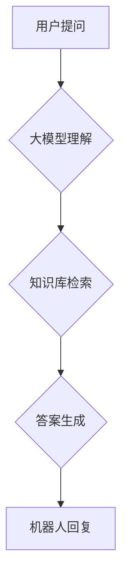

> 大模型、问答机器人、智能化交互、自然语言处理、深度学习

## 1. 背景介绍

近年来，人工智能技术取得了飞速发展，特别是深度学习的突破，使得大模型问答机器人技术取得了显著进展。大模型问答机器人能够理解人类自然语言，并生成流畅、准确的文本回复，在客服、教育、娱乐等领域展现出巨大的应用潜力。

传统的问答系统主要依赖于规则引擎和知识库，难以应对复杂、开放式的问答场景。而大模型问答机器人则通过训练海量文本数据，学习语言的语义和结构，能够理解更复杂的语义关系，并生成更自然、更符合语境的回复。

## 2. 核心概念与联系

### 2.1 大模型

大模型是指参数量巨大、训练数据海量的人工智能模型。这些模型通常拥有数十亿甚至数千亿个参数，能够学习到更丰富的语言知识和模式。

### 2.2 问答机器人

问答机器人是一种能够与人类进行自然语言交互的智能系统。它能够理解用户的提问，并根据其知识库和理解能力生成相应的答案。

### 2.3 智能化交互

智能化交互是指系统能够理解用户的意图和需求，并提供个性化、人性化的服务。

**核心概念与联系流程图:**



## 3. 核心算法原理 & 具体操作步骤

### 3.1 算法原理概述

大模型问答机器人的核心算法主要包括：

* **自然语言处理 (NLP)**：用于理解和处理人类语言，包括词法分析、语法分析、语义分析等。
* **深度学习 (DL)**：用于训练大模型，学习语言的语义和结构。
* **检索机制**：用于从知识库中检索相关信息。
* **文本生成**：用于生成流畅、准确的文本回复。

### 3.2 算法步骤详解

1. **用户提问输入**: 用户向问答机器人提出问题。
2. **预处理**: 对用户提问进行预处理，例如分词、词性标注、去除停用词等。
3. **语义理解**: 利用NLP算法对预处理后的提问进行语义分析，提取关键信息和用户意图。
4. **知识库检索**: 根据语义理解结果，从知识库中检索相关信息。
5. **答案生成**: 利用深度学习模型生成符合语境的答案。
6. **答案输出**: 将生成的答案输出给用户。

### 3.3 算法优缺点

**优点**:

* 能够理解更复杂的语义关系。
* 生成更自然、更符合语境的回复。
* 能够不断学习和改进。

**缺点**:

* 训练成本高，需要海量数据和计算资源。
* 容易受到训练数据的影响，可能存在偏差或错误。
* 对未知问题的处理能力有限。

### 3.4 算法应用领域

* **客服机器人**: 自动回答用户常见问题，提高服务效率。
* **教育机器人**: 为学生提供个性化学习辅导。
* **娱乐机器人**: 与用户进行对话娱乐，例如聊天、游戏等。
* **搜索引擎**: 理解用户搜索意图，提供更精准的搜索结果。

## 4. 数学模型和公式 & 详细讲解 & 举例说明

### 4.1 数学模型构建

大模型问答机器人的数学模型通常基于 Transformer 架构，其核心是注意力机制。注意力机制能够学习到文本中不同词语之间的关系，从而更好地理解语义。

### 4.2 公式推导过程

Transformer 的注意力机制使用以下公式计算每个词语对其他词语的注意力权重：

$$
Attention(Q, K, V) = softmax(\frac{QK^T}{\sqrt{d_k}})V
$$

其中：

* $Q$：查询矩阵
* $K$：键矩阵
* $V$：值矩阵
* $d_k$：键向量的维度
* $softmax$：softmax 函数

### 4.3 案例分析与讲解

假设我们有一个句子 "我爱吃苹果"，我们要计算 "我" 对其他词语的注意力权重。

* $Q$：表示 "我" 的查询向量
* $K$：表示 "爱"、"吃"、"苹果" 的键向量
* $V$：表示 "爱"、"吃"、"苹果" 的值向量

通过计算 $QK^T$，我们可以得到一个注意力分数矩阵。然后使用 softmax 函数将分数归一化，得到每个词语对 "我" 的注意力权重。

## 5. 项目实践：代码实例和详细解释说明

### 5.1 开发环境搭建

* Python 3.7+
* TensorFlow 或 PyTorch
* CUDA 和 cuDNN (可选，用于 GPU 加速)

### 5.2 源代码详细实现

```python
# 导入必要的库
import tensorflow as tf

# 定义 Transformer 模型
class Transformer(tf.keras.Model):
    def __init__(self, vocab_size, embedding_dim, num_heads, num_layers):
        super(Transformer, self).__init__()
        self.embedding = tf.keras.layers.Embedding(vocab_size, embedding_dim)
        self.transformer_layers = tf.keras.layers.StackedRNNCells([
            tf.keras.layers.MultiHeadAttention(num_heads=num_heads, key_dim=embedding_dim)
            for _ in range(num_layers)
        ])

    def call(self, inputs):
        # 将输入转换为嵌入向量
        embedded_inputs = self.embedding(inputs)
        # 通过 Transformer 层进行编码
        encoded_outputs = self.transformer_layers(embedded_inputs)
        return encoded_outputs

# 实例化 Transformer 模型
model = Transformer(vocab_size=10000, embedding_dim=128, num_heads=8, num_layers=6)

# 训练模型
# ...

# 使用模型进行预测
predictions = model.predict(inputs)
```

### 5.3 代码解读与分析

* `Transformer` 类定义了 Transformer 模型的结构。
* `embedding` 层将输入词语转换为嵌入向量。
* `transformer_layers` 层是一个堆叠的 RNN 细胞，每个细胞包含一个多头注意力机制。
* `call` 方法定义了模型的输入和输出。

### 5.4 运行结果展示

训练完成后，可以使用模型对新的输入进行预测，例如生成对用户提问的答案。

## 6. 实际应用场景

### 6.1 客服机器人

大模型问答机器人可以用于构建客服机器人，自动回答用户常见问题，例如订单查询、退换货流程等。

### 6.2 教育机器人

大模型问答机器人可以用于构建教育机器人，为学生提供个性化学习辅导，例如解答数学题、解释历史事件等。

### 6.3 娱乐机器人

大模型问答机器人可以用于构建娱乐机器人，与用户进行对话娱乐，例如聊天、游戏等。

### 6.4 未来应用展望

大模型问答机器人将在未来更多领域得到应用，例如：

* **医疗诊断**: 辅助医生诊断疾病。
* **法律咨询**: 提供法律咨询服务。
* **金融理财**: 提供个性化理财建议。

## 7. 工具和资源推荐

### 7.1 学习资源推荐

* **书籍**:
    * 《深度学习》
    * 《自然语言处理》
* **在线课程**:
    * Coursera: 自然语言处理
    * Udacity: 深度学习

### 7.2 开发工具推荐

* **TensorFlow**: 开源深度学习框架
* **PyTorch**: 开源深度学习框架
* **Hugging Face**: 提供预训练大模型和工具

### 7.3 相关论文推荐

* **Attention Is All You Need**: 提出 Transformer 架构
* **BERT**: 预训练语言模型

## 8. 总结：未来发展趋势与挑战

### 8.1 研究成果总结

大模型问答机器人技术取得了显著进展，能够理解更复杂的语义关系，生成更自然、更符合语境的回复。

### 8.2 未来发展趋势

* **模型规模更大**: 训练更大规模的模型，学习更丰富的语言知识。
* **多模态交互**: 支持文本、图像、音频等多模态交互。
* **个性化定制**: 根据用户的需求和偏好进行个性化定制。

### 8.3 面临的挑战

* **训练成本高**: 训练大模型需要大量的计算资源和时间。
* **数据偏差**: 训练数据可能存在偏差，导致模型生成不准确或有偏见的回复。
* **可解释性**: 大模型的决策过程难以解释，难以理解模型是如何生成回复的。

### 8.4 研究展望

未来研究将重点关注降低训练成本、解决数据偏差问题、提高模型可解释性等方面。


## 9. 附录：常见问题与解答

### 9.1 问：大模型问答机器人与传统问答系统的区别是什么？

答：传统问答系统主要依赖于规则引擎和知识库，难以应对复杂、开放式的问答场景。而大模型问答机器人则通过训练海量文本数据，学习语言的语义和结构，能够理解更复杂的语义关系，并生成更自然、更符合语境的回复。

### 9.2 问：大模型问答机器人的训练成本很高吗？

答：是的，训练大模型需要大量的计算资源和时间。

### 9.3 问：大模型问答机器人的数据偏差问题如何解决？

答：数据偏差问题可以通过使用更丰富、更均衡的数据集进行训练，以及通过数据增强和模型正则化等技术进行缓解。


作者：禅与计算机程序设计艺术 / Zen and the Art of Computer Programming 
<end_of_turn>