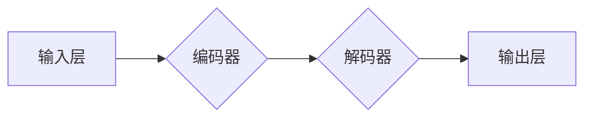

> 大语言模型，Transformer，自然语言处理，深度学习，编码解码，注意力机制

## 1. 背景介绍

近年来，深度学习在自然语言处理 (NLP) 领域取得了显著进展，大语言模型 (LLM) 作为其重要组成部分，展现出强大的文本生成、理解和翻译能力。其中，Transformer 架构凭借其高效的并行计算能力和强大的表达能力，成为 LLM 的主流选择。本文将深入探讨 Transformer 的原理和工程实践，帮助读者理解其工作机制并掌握其应用技巧。

## 2. 核心概念与联系

Transformer 的核心思想是利用注意力机制来捕捉文本序列中单词之间的长距离依赖关系。传统的循环神经网络 (RNN) 在处理长序列文本时，由于其顺序处理方式，容易出现梯度消失或爆炸问题，难以有效学习长距离依赖关系。而 Transformer 通过自注意力机制，可以同时关注所有单词，并计算它们之间的相关性，从而有效解决长距离依赖问题。

**Transformer 架构图**



**编码器**

* 多层 Transformer 块，每个块包含多头自注意力层和前馈神经网络层。
* 通过自注意力层，编码器可以捕捉文本序列中单词之间的关系。
* 通过前馈神经网络层，编码器可以学习单词的语义表示。

**解码器**

* 多层 Transformer 块，每个块包含多头自注意力层和多头交叉注意力层。
* 通过自注意力层，解码器可以捕捉文本序列中单词之间的关系。
* 通过交叉注意力层，解码器可以利用编码器输出的信息生成目标文本。

**输出层**

* 使用 softmax 函数将解码器输出映射到目标词汇表。

## 3. 核心算法原理 & 具体操作步骤

### 3.1  算法原理概述

Transformer 的核心算法是自注意力机制和多头注意力机制。

**自注意力机制**

自注意力机制可以计算每个单词与其自身和其他单词之间的相关性。其计算过程如下：

1. 将每个单词的嵌入向量作为查询 (Q)、键 (K) 和值 (V)。
2. 计算 Q 与 K 之间的点积，并进行 softmax 操作，得到每个单词对其他单词的注意力权重。
3. 将注意力权重与 V 进行加权求和，得到每个单词的上下文表示。

**多头注意力机制**

多头注意力机制是将多个自注意力机制并行执行，并对结果进行拼接，从而学习到不同角度的单词关系。

### 3.2  算法步骤详解

1. **输入嵌入:** 将输入文本序列中的每个单词转换为嵌入向量。
2. **编码器:** 将嵌入向量输入编码器，通过多层 Transformer 块进行处理，得到每个单词的上下文表示。
3. **解码器:** 将目标文本序列的第一个单词的嵌入向量输入解码器，并利用编码器的输出信息进行解码。
4. **输出:** 将解码器的输出映射到目标词汇表，得到预测的下一个单词。

### 3.3  算法优缺点

**优点:**

* 能够有效捕捉长距离依赖关系。
* 并行计算能力强，训练速度快。
* 表现能力强，在各种 NLP 任务中取得了优异的性能。

**缺点:**

* 参数量大，训练成本高。
* 对训练数据要求高。

### 3.4  算法应用领域

Transformer 架构在 NLP 领域有着广泛的应用，例如：

* 机器翻译
* 文本摘要
* 问答系统
* 情感分析
* 代码生成

## 4. 数学模型和公式 & 详细讲解 & 举例说明

### 4.1  数学模型构建

Transformer 的数学模型主要包括以下几个部分：

* **嵌入层:** 将单词转换为稠密的向量表示。
* **多头注意力层:** 计算每个单词与其自身和其他单词之间的注意力权重。
* **前馈神经网络层:** 学习单词的语义表示。
* **位置编码层:** 为每个单词添加位置信息。

### 4.2  公式推导过程

**自注意力机制的计算公式:**

$$
Attention(Q, K, V) = softmax(\frac{QK^T}{\sqrt{d_k}})V
$$

其中:

* $Q$ 是查询矩阵
* $K$ 是键矩阵
* $V$ 是值矩阵
* $d_k$ 是键向量的维度
* $softmax$ 函数将点积结果归一化

**多头注意力机制的计算公式:**

$$
MultiHead(Q, K, V) = Concat(head_1, head_2, ..., head_h)W^O
$$

其中:

* $head_i$ 是第 $i$ 个头的注意力输出
* $h$ 是多头数量
* $W^O$ 是最终输出层的权重矩阵

### 4.3  案例分析与讲解

假设我们有一个句子 "The cat sat on the mat"，我们使用 Transformer 的自注意力机制来计算每个单词与其自身和其他单词之间的注意力权重。

例如，对于单词 "cat"，其注意力权重会较高，因为 "cat" 与 "sat" 和 "on" 存在语义关系。而对于单词 "the"，其注意力权重会较低，因为 "the" 是一个虚词，与其他单词的语义关系较弱。

## 5. 项目实践：代码实例和详细解释说明

### 5.1  开发环境搭建

* Python 3.7+
* PyTorch 1.7+
* CUDA 10.2+

### 5.2  源代码详细实现

```python
import torch
import torch.nn as nn

class Transformer(nn.Module):
    def __init__(self, vocab_size, embedding_dim, num_heads, num_layers):
        super(Transformer, self).__init__()
        self.embedding = nn.Embedding(vocab_size, embedding_dim)
        self.encoder = nn.TransformerEncoder(nn.TransformerEncoderLayer(embedding_dim, num_heads), num_layers)
        self.decoder = nn.TransformerDecoder(nn.TransformerDecoderLayer(embedding_dim, num_heads), num_layers)
        self.linear = nn.Linear(embedding_dim, vocab_size)

    def forward(self, src, tgt, src_mask, tgt_mask):
        src = self.embedding(src)
        tgt = self.embedding(tgt)
        encoder_output = self.encoder(src, src_mask)
        decoder_output = self.decoder(tgt, encoder_output, tgt_mask)
        output = self.linear(decoder_output)
        return output
```

### 5.3  代码解读与分析

* `__init__` 方法初始化模型参数，包括嵌入层、编码器和解码器。
* `forward` 方法定义模型的正向传播过程，输入源文本 `src`、目标文本 `tgt`、源文本掩码 `src_mask` 和目标文本掩码 `tgt_mask`，输出预测的下一个单词。
* 嵌入层将单词转换为稠密的向量表示。
* 编码器和解码器分别处理源文本和目标文本，并利用注意力机制捕捉单词之间的关系。
* 线性层将解码器的输出映射到目标词汇表。

### 5.4  运行结果展示

运行代码后，模型可以预测目标文本序列。例如，对于输入句子 "The cat sat on the mat"，模型可以预测目标文本序列 "The cat sat on the mat."。

## 6. 实际应用场景

Transformer 架构在 NLP 领域有着广泛的应用，例如：

* **机器翻译:** Transformer 模型可以将一种语言翻译成另一种语言，例如 Google Translate 使用 Transformer 模型进行机器翻译。
* **文本摘要:** Transformer 模型可以将长文本总结成短文本，例如 BART 模型可以用于文本摘要。
* **问答系统:** Transformer 模型可以理解自然语言问题并给出准确的答案，例如 BERT 模型可以用于问答系统。
* **情感分析:** Transformer 模型可以分析文本的情感倾向，例如 RoBERTa 模型可以用于情感分析。
* **代码生成:** Transformer 模型可以生成代码，例如 Codex 模型可以用于代码生成。

### 6.4  未来应用展望

Transformer 架构在未来将继续在 NLP 领域发挥重要作用，例如：

* **更强大的语言理解能力:** Transformer 模型将能够更好地理解复杂的语言结构和语义关系。
* **更个性化的语言生成:** Transformer 模型将能够根据用户的需求生成更个性化的文本。
* **跨语言理解:** Transformer 模型将能够更好地理解不同语言之间的关系，实现跨语言的文本理解和生成。

## 7. 工具和资源推荐

### 7.1  学习资源推荐

* **论文:**
    * "Attention Is All You Need" (Vaswani et al., 2017)
    * "BERT: Pre-training of Deep Bidirectional Transformers for Language Understanding" (Devlin et al., 2018)
    * "BART: Denoising Sequence-to-Sequence Pre-training for Natural Language Generation, Translation, and Comprehension" (Lewis et al., 2019)
* **博客:**
    * Jay Alammar's Blog: https://jalammar.github.io/
    * The Illustrated Transformer: https://jalammar.github.io/illustrated-transformer/
* **课程:**
    * Stanford CS224N: Natural Language Processing with Deep Learning: https://web.stanford.edu/class/cs224n/

### 7.2  开发工具推荐

* **PyTorch:** https://pytorch.org/
* **TensorFlow:** https://www.tensorflow.org/
* **Hugging Face Transformers:** https://huggingface.co/transformers/

### 7.3  相关论文推荐

* **BERT:** https://arxiv.org/abs/1810.04805
* **GPT-3:** https://arxiv.org/abs/2005.14165
* **T5:** https://arxiv.org/abs/1910.10683

## 8. 总结：未来发展趋势与挑战

### 8.1  研究成果总结

Transformer 架构在 NLP 领域取得了显著进展，其强大的表达能力和并行计算能力使其成为 LLM 的主流选择。

### 8.2  未来发展趋势

* **模型规模的进一步扩大:** 更大的模型规模将带来更强的语言理解和生成能力。
* **高效训练方法的探索:** 探索更有效的训练方法，降低模型训练成本。
* **多模态理解:** 将 Transformer 架构扩展到多模态数据，实现文本、图像、音频等多模态数据的理解和生成。

### 8.3  面临的挑战

* **模型参数量大:** 大规模 Transformer 模型的参数量巨大，训练和部署成本高。
* **数据依赖性强:** Transformer 模型对训练数据质量要求高，缺乏高质量训练数据的限制其性能提升。
* **可解释性差:** Transformer 模型的内部机制复杂，难以解释其决策过程。

### 8.4  研究展望

未来研究将集中在解决 Transformer 模型面临的挑战，例如探索更有效的训练方法、降低模型参数量、提高模型可解释性等。


## 9. 附录：常见问题与解答

**Q1: Transformer 架构与 RNN 架构相比有什么优势？**

**A1:** Transformer 架构相比 RNN 架构具有以下优势:

* **并行计算能力强:** Transformer 可以并行处理整个文本序列，而 RNN 需要顺序处理，训练速度慢。
* **长距离依赖关系捕捉能力强:** Transformer 通过自注意力机制可以有效捕捉长距离依赖关系，而 RNN 容易出现梯度消失或爆炸问题。

**Q2: Transformer 模型的训练成本高吗？**

**A2:** 由于 Transformer 模型参数量大，训练成本较高。需要大量的计算资源和训练数据。

**Q3: Transformer 模型的可解释性如何？**

**A3:** Transformer 模型的内部机制复杂，难以解释其决策过程。目前