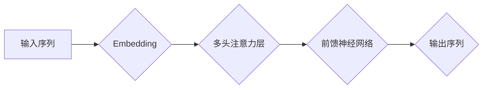

> 大语言模型、Transformer、自然语言处理、深度学习、文本生成、机器学习、预训练

## 1. 背景介绍

近年来，人工智能领域取得了令人瞩目的进展，其中大语言模型（Large Language Models，LLMs）作为一种重要的代表，展现出强大的文本理解和生成能力，引发了广泛的关注和研究。从早期基于循环神经网络（RNN）的语言模型，到如今基于Transformer架构的巨型模型，LLMs不断突破技术边界，在自然语言处理（NLP）领域取得了突破性进展。

大语言模型的出现，标志着人工智能迈向更智能、更人性化的方向。它们能够理解和生成人类语言，具备广泛的应用场景，例如机器翻译、文本摘要、对话系统、代码生成等。然而，LLMs也面临着诸多挑战，例如训练成本高、数据偏见、可解释性差等。

## 2. 核心概念与联系

大语言模型的核心概念是**深度学习**和**Transformer架构**。

**深度学习**是一种机器学习方法，它利用多层神经网络来学习数据中的复杂模式。

**Transformer架构**是一种新型的神经网络结构，它通过**自注意力机制**（Self-Attention）和**多头注意力机制**（Multi-Head Attention）来捕捉文本序列中的长距离依赖关系，从而提高了语言模型的性能。


**Mermaid 流程图：**



## 3. 核心算法原理 & 具体操作步骤

### 3.1  算法原理概述

大语言模型的核心算法是**Transformer架构**，它通过多层编码器-解码器结构来实现文本的理解和生成。

* **编码器**：负责将输入文本序列编码成一个固定长度的向量表示。
* **解码器**：负责根据编码后的向量表示生成输出文本序列。

### 3.2  算法步骤详解

1. **词嵌入**: 将输入文本中的每个词转换为一个低维向量表示。
2. **编码器**: 将词嵌入向量输入到多层编码器中，每个编码器层包含多头注意力机制和前馈神经网络。
3. **解码器**: 将编码器的输出向量输入到多层解码器中，每个解码器层也包含多头注意力机制和前馈神经网络。
4. **输出**: 解码器的输出是一个概率分布，表示每个词在输出序列中的可能性。

### 3.3  算法优缺点

**优点**:

* 能够捕捉文本序列中的长距离依赖关系。
* 训练效率高，能够处理大量数据。
* 在各种NLP任务中表现出色。

**缺点**:

* 训练成本高，需要大量的计算资源和数据。
* 模型参数量大，部署成本高。
* 可解释性差，难以理解模型的决策过程。

### 3.4  算法应用领域

* 机器翻译
* 文本摘要
* 问答系统
* 对话系统
* 代码生成
* 文本分类
* 情感分析

## 4. 数学模型和公式 & 详细讲解 & 举例说明

### 4.1  数学模型构建

大语言模型的数学模型主要基于**概率论**和**统计学**。

* **概率分布**: 用于表示每个词在输出序列中的可能性。
* **损失函数**: 用于衡量模型预测结果与真实结果之间的差异。
* **优化算法**: 用于更新模型参数，使损失函数最小化。

### 4.2  公式推导过程

**交叉熵损失函数**:

$$
H(p, q) = - \sum_{i=1}^{n} p(i) \log q(i)
$$

其中：

* $p(i)$ 是真实标签的概率分布。
* $q(i)$ 是模型预测的概率分布。

**梯度下降算法**:

$$
\theta = \theta - \alpha \nabla H(p, q)
$$

其中：

* $\theta$ 是模型参数。
* $\alpha$ 是学习率。
* $\nabla H(p, q)$ 是损失函数的梯度。

### 4.3  案例分析与讲解

假设我们有一个训练语料库，包含以下句子：

* "The cat sat on the mat."

我们可以使用大语言模型来预测下一个词。

模型会将句子中的每个词嵌入到一个向量空间中，然后通过编码器和解码器来生成下一个词的概率分布。

例如，模型可能会预测下一个词是 "dog"，"chair" 或 "table"。

## 5. 项目实践：代码实例和详细解释说明

### 5.1  开发环境搭建

* Python 3.7+
* TensorFlow 或 PyTorch
* CUDA 和 cuDNN

### 5.2  源代码详细实现

```python
import tensorflow as tf

# 定义模型架构
class Transformer(tf.keras.Model):
    def __init__(self, vocab_size, embedding_dim, num_heads, num_layers):
        super(Transformer, self).__init__()
        self.embedding = tf.keras.layers.Embedding(vocab_size, embedding_dim)
        self.encoder = tf.keras.layers.StackedRNNLayers(num_layers, embedding_dim)
        self.decoder = tf.keras.layers.StackedRNNLayers(num_layers, embedding_dim)
        self.output = tf.keras.layers.Dense(vocab_size)

    def call(self, inputs):
        # ...
        return outputs

# 训练模型
model = Transformer(vocab_size=10000, embedding_dim=128, num_heads=8, num_layers=6)
model.compile(optimizer='adam', loss='sparse_categorical_crossentropy', metrics=['accuracy'])
model.fit(train_data, train_labels, epochs=10)

```

### 5.3  代码解读与分析

* **模型架构**: Transformer模型由嵌入层、编码器、解码器和输出层组成。
* **嵌入层**: 将词转换为向量表示。
* **编码器**: 将输入文本序列编码成一个固定长度的向量表示。
* **解码器**: 根据编码后的向量表示生成输出文本序列。
* **输出层**: 将解码器的输出转换为概率分布，表示每个词在输出序列中的可能性。

### 5.4  运行结果展示

训练完成后，我们可以使用模型来预测新的文本序列。

例如，我们可以输入句子 "The cat sat on the"，模型会预测下一个词是 "mat"。

## 6. 实际应用场景

### 6.1  机器翻译

大语言模型可以用于机器翻译，将一种语言的文本翻译成另一种语言。

例如，Google Translate 使用大语言模型来实现机器翻译功能。

### 6.2  文本摘要

大语言模型可以用于文本摘要，将长篇文本压缩成短篇摘要。

例如，新闻网站可以使用大语言模型来生成新闻文章的摘要。

### 6.3  对话系统

大语言模型可以用于构建对话系统，与用户进行自然语言交互。

例如，ChatGPT 是一个基于大语言模型的对话系统。

### 6.4  未来应用展望

大语言模型在未来将有更广泛的应用场景，例如：

* 自动写作
* 代码生成
* 教育辅助
* 医疗诊断

## 7. 工具和资源推荐

### 7.1  学习资源推荐

* **书籍**:
    * 《深度学习》
    * 《自然语言处理》
* **在线课程**:
    * Coursera
    * edX
* **博客**:
    * The Gradient
    * Towards Data Science

### 7.2  开发工具推荐

* **TensorFlow**: 开源深度学习框架
* **PyTorch**: 开源深度学习框架
* **Hugging Face**: 提供预训练大语言模型和工具

### 7.3  相关论文推荐

* **Attention Is All You Need**: 提出Transformer架构的论文
* **BERT**: 预训练语言模型
* **GPT-3**: 大型文本生成模型

## 8. 总结：未来发展趋势与挑战

### 8.1  研究成果总结

大语言模型在自然语言处理领域取得了显著进展，展现出强大的文本理解和生成能力。

### 8.2  未来发展趋势

* 模型规模更大，参数量更多
* 模型架构更加复杂，功能更加强大
* 应用场景更加广泛，覆盖更多领域

### 8.3  面临的挑战

* 训练成本高，需要大量的计算资源和数据
* 模型参数量大，部署成本高
* 可解释性差，难以理解模型的决策过程
* 数据偏见问题，模型可能输出带有偏见的文本

### 8.4  研究展望

未来研究方向包括：

* 降低训练成本，提高训练效率
* 提高模型的可解释性，使模型决策更加透明
* 解决数据偏见问题，训练更加公平公正的模型
* 探索新的应用场景，将大语言模型应用到更多领域

## 9. 附录：常见问题与解答

### 9.1  什么是预训练模型？

预训练模型是指在大量数据上进行预训练的模型，它已经学习了语言的语法和语义知识。

### 9.2  如何使用预训练模型？

可以使用预训练模型作为基础模型，在特定任务上进行微调。

### 9.3  大语言模型有哪些伦理问题？

大语言模型可能存在以下伦理问题：

* 偏见和歧视
* 虚假信息生成
* 隐私泄露

作者：禅与计算机程序设计艺术 / Zen and the Art of Computer Programming


<end_of_turn>