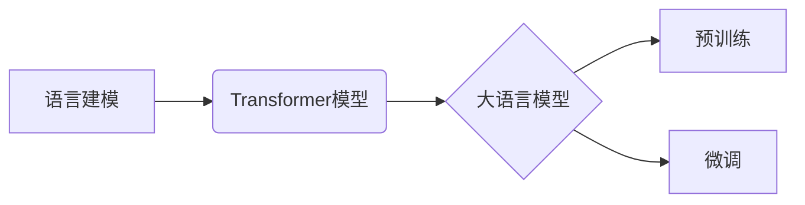

> 大语言模型、Transformer、语言建模、自然语言处理、深度学习、预训练、微调

## 1. 背景介绍

近年来，深度学习技术取得了飞速发展，特别是Transformer模型的出现，为自然语言处理（NLP）领域带来了革命性的变革。大语言模型（LLM）作为Transformer模型的升级版，拥有强大的文本理解和生成能力，在文本分类、机器翻译、问答系统、代码生成等领域展现出巨大的应用潜力。

然而，LLM的训练和应用也面临着诸多挑战，例如：

* **海量数据需求:** LLM的训练需要大量的文本数据，这对于数据获取和存储提出了巨大的挑战。
* **高计算成本:** LLM的训练过程需要消耗大量的计算资源，这对于硬件设施和能源消耗提出了挑战。
* **模型可解释性:** LLM的决策过程往往是复杂的，难以理解模型的内部机制，这对于模型的信任度和安全性提出了挑战。
* **伦理问题:** LLM可能被用于生成虚假信息、传播偏见等，这对于模型的伦理使用提出了挑战。

## 2. 核心概念与联系

**2.1 语言建模**

语言建模是自然语言处理的核心任务之一，旨在学习语言的统计规律，并根据这些规律预测下一个词或句子。传统的语言建模方法主要基于统计模型，例如n-gram模型。

**2.2 Transformer模型**

Transformer模型是一种基于深度学习的序列到序列模型，它引入了注意力机制，能够有效地捕捉文本中的长距离依赖关系。Transformer模型的结构主要包括编码器和解码器，编码器用于将输入序列编码为上下文向量，解码器则根据上下文向量生成输出序列。

**2.3 大语言模型**

大语言模型是指参数量巨大、训练数据海量、具备强大文本理解和生成能力的Transformer模型。LLM通常通过预训练和微调的方式进行训练。预训练阶段，LLM在大量的文本数据上进行无监督学习，学习语言的通用知识和表示；微调阶段，LLM在特定任务的数据上进行有监督学习，使其能够完成特定的任务。

**2.4 核心概念关系图**



## 3. 核心算法原理 & 具体操作步骤

### 3.1 算法原理概述

Transformer模型的核心是注意力机制，它能够学习文本中词语之间的关系，并根据这些关系对词语进行加权求和，从而获得上下文向量。

注意力机制的计算过程可以分为以下几个步骤：

1. 计算词语之间的查询（Query）、键（Key）和值（Value）向量。
2. 计算查询向量与键向量的相似度，得到注意力权重。
3. 将注意力权重与值向量进行加权求和，得到上下文向量。

### 3.2 算法步骤详解

1. **输入处理:** 将输入文本序列转换为词嵌入向量。
2. **编码器:** 将词嵌入向量输入到编码器中，编码器由多个Transformer层组成，每个Transformer层包含多头注意力机制和前馈神经网络。
3. **解码器:** 将编码器的输出作为输入，解码器也由多个Transformer层组成，每个Transformer层包含多头注意力机制和前馈神经网络。
4. **输出生成:** 解码器的输出经过softmax函数，得到每个词的概率分布，选择概率最高的词作为输出。

### 3.3 算法优缺点

**优点:**

* 能够有效地捕捉文本中的长距离依赖关系。
* 训练效率高，能够在较短的时间内训练出高质量的模型。
* 泛化能力强，能够应用于多种自然语言处理任务。

**缺点:**

* 参数量巨大，需要大量的计算资源进行训练。
* 模型的训练过程难以解释，难以理解模型的决策机制。

### 3.4 算法应用领域

* 文本分类
* 机器翻译
* 问答系统
* 代码生成
* 文本摘要
* 对话系统

## 4. 数学模型和公式 & 详细讲解 & 举例说明

### 4.1 数学模型构建

Transformer模型的数学模型主要基于线性变换、矩阵乘法和激活函数。

**4.1.1 词嵌入:** 将每个词语映射到一个低维向量空间中，例如Word2Vec或GloVe。

**4.1.2 多头注意力机制:** 计算词语之间的注意力权重，并根据这些权重对词语进行加权求和。

**4.1.3 前馈神经网络:** 对每个词语的上下文向量进行非线性变换，提取更深层的语义信息。

### 4.2 公式推导过程

**4.2.1 注意力权重计算:**

$$
\text{Attention}(Q, K, V) = \text{softmax}\left(\frac{Q K^T}{\sqrt{d_k}}\right) V
$$

其中，Q、K、V分别为查询向量、键向量和值向量，$d_k$为键向量的维度。

**4.2.2 多头注意力机制:**

$$
\text{MultiHeadAttention}(Q, K, V) = \text{Concat}(head_1, head_2, ..., head_h) W^O
$$

其中，$head_i$为第i个注意力头的输出，h为多头数量，$W^O$为最终输出层的权重矩阵。

### 4.3 案例分析与讲解

假设我们有一个句子“The cat sat on the mat”，我们使用多头注意力机制来计算每个词语与其他词语之间的注意力权重。

例如，对于词语“cat”，它的注意力权重会比较高，因为“cat”与“sat”和“on”之间存在语义关系。

## 5. 项目实践：代码实例和详细解释说明

### 5.1 开发环境搭建

* Python 3.7+
* PyTorch 1.7+
* CUDA 10.2+

### 5.2 源代码详细实现

```python
import torch
import torch.nn as nn

class Transformer(nn.Module):
    def __init__(self, vocab_size, embedding_dim, num_heads, num_layers):
        super(Transformer, self).__init__()
        self.embedding = nn.Embedding(vocab_size, embedding_dim)
        self.transformer_layers = nn.ModuleList([
            nn.TransformerEncoderLayer(embedding_dim, num_heads)
            for _ in range(num_layers)
        ])
        self.linear = nn.Linear(embedding_dim, vocab_size)

    def forward(self, x):
        x = self.embedding(x)
        for layer in self.transformer_layers:
            x = layer(x)
        x = self.linear(x)
        return x
```

### 5.3 代码解读与分析

* `__init__`方法初始化模型参数，包括词嵌入层、Transformer层和输出层。
* `forward`方法定义模型的正向传播过程，将输入序列转换为词嵌入向量，然后通过Transformer层进行编码，最后通过输出层生成预测结果。

### 5.4 运行结果展示

使用训练好的模型对测试数据进行预测，并评估模型的性能，例如准确率、困惑度等。

## 6. 实际应用场景

### 6.1 文本分类

LLM可以用于分类文本，例如情感分析、主题分类、垃圾邮件过滤等。

### 6.2 机器翻译

LLM可以用于机器翻译，例如将英文翻译成中文、法语翻译成西班牙语等。

### 6.3 问答系统

LLM可以用于构建问答系统，例如根据给定的问题回答问题、提供相关信息等。

### 6.4 代码生成

LLM可以用于生成代码，例如根据自然语言描述生成代码、自动完成代码补全等。

### 6.5 未来应用展望

LLM在未来将有更广泛的应用场景，例如：

* 个性化教育
* 智能客服
* 内容创作
* 科学研究

## 7. 工具和资源推荐

### 7.1 学习资源推荐

* **书籍:**
    * 《深度学习》
    * 《自然语言处理》
    * 《Transformer模型》
* **在线课程:**
    * Coursera
    * edX
    * fast.ai

### 7.2 开发工具推荐

* **PyTorch:** 深度学习框架
* **TensorFlow:** 深度学习框架
* **HuggingFace:** 预训练模型库

### 7.3 相关论文推荐

* 《Attention Is All You Need》
* 《BERT: Pre-training of Deep Bidirectional Transformers for Language Understanding》
* 《GPT-3: Language Models are Few-Shot Learners》

## 8. 总结：未来发展趋势与挑战

### 8.1 研究成果总结

近年来，LLM取得了显著的进展，在文本理解和生成方面展现出强大的能力。

### 8.2 未来发展趋势

* 模型规模进一步扩大
* 训练效率提升
* 模型可解释性增强
* 跨模态理解

### 8.3 面临的挑战

* 数据获取和隐私保护
* 计算资源消耗
* 模型偏见和伦理问题

### 8.4 研究展望

未来，LLM的研究将继续朝着更强大、更安全、更可解释的方向发展。

## 9. 附录：常见问题与解答

* **什么是预训练？**

预训练是指在大量无标注数据上训练模型，学习语言的通用知识和表示。

* **什么是微调？**

微调是指在特定任务的数据上对预训练模型进行进一步训练，使其能够完成特定的任务。

* **如何评估LLM的性能？**

常用的评估指标包括准确率、困惑度、BLEU分数等。

作者：禅与计算机程序设计艺术 / Zen and the Art of Computer Programming


<end_of_turn>